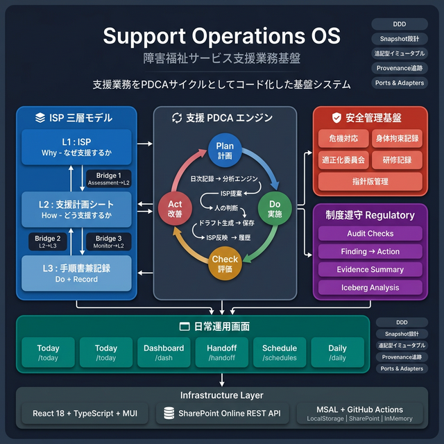
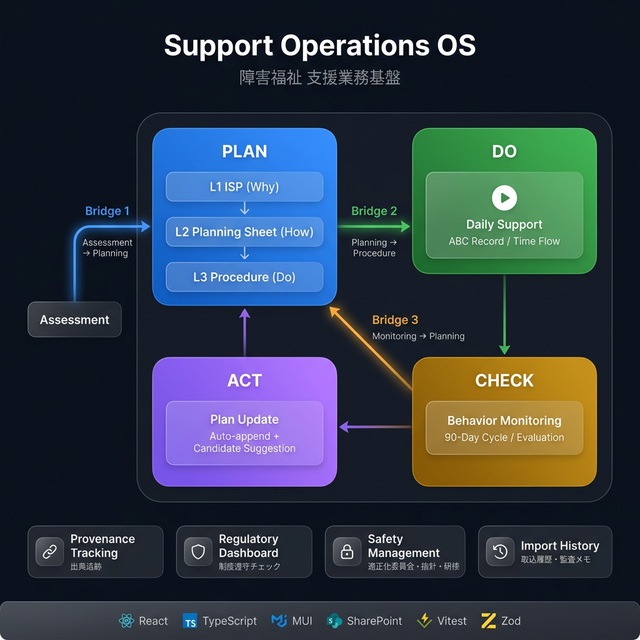

# 磯子区障害者地域活動ホーム (React + SharePoint SPA)

### Support Operations OS — 支援業務をPDCAサイクルとしてコード化した基盤システム

<p align="center">
  
</p>

> **This system is not just a support record app.**
> **It is a Support Operations OS that codifies the PDCA cycle of welfare services.**

---

#### ✨ アーキテクチャ

本システムは **ISP 三層モデル**（L1 ISP / L2 支援計画シート / L3 手順書兼記録）を基盤に、
層をつなぐ **4 本の Bridge** で構成されています。

Assessment → Planning → Procedure/Record → Monitoring の循環を
単なる画面遷移ではなく、**責務分離されたデータ変換パイプライン**として扱うのが特徴です。

詳細な全体像、各層の責務、Bridge の意味、SSOT の所在、ループ閉鎖の考え方は
**[docs/architecture.md](docs/architecture.md)** を参照してください。

規範的な設計原則は **[ADR-005](docs/adr/ADR-005-isp-three-layer-separation.md)** を canonical source とします。

---

#### 🚀 Quick Start

```bash
git clone https://github.com/yasutakesougo/audit-management-system-mvp.git
cd audit-management-system-mvp
npm install
npm run dev
```

Open **http://localhost:5173** → デモモードで全機能を試せます。

---

#### 🔑 Key Features

| Feature | Description |
|---|---|
| **🔵 Bridge 1: Assessment → Planning** | ICF分類・特性アンケートから支援計画シートへ自動マッピング。出典追跡付き |
| **🟢 Bridge 2: Planning → Procedure** | 支援方針・具体的対応・環境調整を手順ステップに変換。重複排除 |
| **🟠 Bridge 3: Monitoring → Planning** | 行動モニタリング結果を自動追記 + 候補提示で支援計画を更新 |
| **📋 ISP 三層モデル** | L1 (ISP) / L2 (支援計画シート) / L3 (手順書兼記録) の明確な分離 |
| **🔍 Provenance Tracking** | 全フィールドに出典情報を記録。いつ・どこから・なぜ転記されたか追跡可能 |
| **📅 Monitoring Schedule** | `supportStartDate` 起点の 90 日サイクル。期限超過アラート付き |
| **🛡️ Regulatory Dashboard** | 制度遵守チェック + 根拠サマリーの横断表示 |
| **🔒 Safety Management** | 適正化委員会・指針版管理・研修記録・身体拘束記録の統合管理 |

---

---

#### 📜 Product Principles

Support Operations OS is built on **10 design principles** that ensure human-in-the-loop decision support:

- 🎯 **Situation-first UI** — Field workflows are the main stage, not analytics
- ✏️ **Minimal input burden** — Never increase recording effort for analysis
- 💡 **Proposals as candidates** — AI suggests, never commands
- 📊 **Evidence-based** — Every proposal carries provenance: period, records, comparison, rules, sources
- 🧑‍⚕️ **Human decides** — AI proposes → Human approves → System records → History preserved

> 📖 詳細: **[設計原則 10 箇条](docs/product/principles.md)** ｜ [UI 設計規約](docs/product/ui-conventions.md) ｜ [プロダクトロードマップ](docs/product/roadmap.md) ｜ **[OS Architecture](docs/product/support-operations-os-architecture.md)** ｜ [ISP-Driven Model](docs/model/isp-driven-operations-model.md) ｜ [ADR Index](docs/adr/README.md)
>
> 🧑‍💻 開発者: [Developer Onboarding](docs/dev/onboarding.md) ｜ [モジュール硬化テンプレート](docs/guides/module-hardening-template.md)

---

#### 🛠️ Welfare OS Development Framework (新機能の開発・量産)

新機能（モジュール）をプロジェクトに追加する際は、都度ゼロから設計せず、完全に標準化された以下の「3点セット」を使用してください。

- 📖 **設計原則・標準構造を確認したい (憲法)** → [`welfare-os-development-framework.md`](docs/architecture/welfare-os-development-framework.md)
- ✅ **新機能を始める前・完了前 (点検)** → [`module-starter-checklist.md`](docs/checklists/module-starter-checklist.md)
- 🧭 **UI 改修時の品質運用 (a11y/usability)** → [`a11y-usability-rollout-checklist.md`](docs/checklists/a11y-usability-rollout-checklist.md)
- 📊 **UI品質カバレッジ（適用状況）** → [`a11y-usability-gate-coverage-2026-03-28.md`](docs/qa/a11y-usability-gate-coverage-2026-03-28.md)
- 🪄 **AI に初期実装を作らせる (生成)** → [`sharepoint-module-generator.md`](docs/prompts/sharepoint-module-generator.md)

---

<details>
<summary>📐 プレゼン用アーキテクチャ図（クリックで展開）</summary>

<p align="center">
  
</p>

</details>

> 📌 ドキュメント案内:
> **[Architecture](docs/architecture.md)** ｜ [Setup / Env Reference](docs/env-reference.md) ｜ [Testing](docs/architecture/contract-guards.md) ｜ [Operations / Runbook](docs/ops/monitoring-hub-v1-runbook.md) ｜ [SharePoint Provisioning](docs/provisioning.md) ｜ [Feature Catalog](docs/feature-catalog.md) ｜ [ADR Index](docs/adr/README.md)

<!-- Badges -->


<!-- markdownlint-disable MD040 -->

> Quality Gate: Lines >= 44% / Functions >= 38% / Statements >= 43% / Branches >= 37% (vitest.config.ts thresholds)
> CI note: docs-only PRs (e.g., README/docs) skip Playwright smoke + LHCI; workflow/config changes trigger them for safety.

## レポートリンク

### CI ダッシュボード

- カバレッジ: (GitHub 変数 `COVERAGE_URL`)
- Lighthouse: (GitHub 変数 `LIGHTHOUSE_URL`)
- Sentry: (GitHub 変数 `SENTRY_URL`)

> 注記: これらの URL はリポジトリ変数 (`COVERAGE_URL`, `LIGHTHOUSE_URL`, `SENTRY_URL`) と同一です。
> Actions の "Report Links" ワークフローは、PR コメントとジョブ Summary に同じリンクを自動掲示します。

本プロジェクトは、React, TypeScript, Vite, MUI を使用し、SharePoint Online をバックエンドとする SPA アプリケーションの MVP 実装です。

## 開発時のよくある落とし穴

- 設定値の参照は `src/lib/env.ts` のヘルパー経由を推奨します。`import.meta.env.DEV` のような dev-only ガードは許容されますが、設定値を直接読むと runtime override や test isolation をバイパスします
- VS Code の Problems が急増したときは `src/lib/env.ts` や `.env` 差分をまず確認すると、型/エラーの原因を素早く特定できる
- **React 18 開発モード (StrictMode)**: `useEffect` と認証フローが意図的に二重実行されます。MSAL の重複ログインを防ぐため、`useAuth.signIn()` はモジュールレベルの singleflight ガード (`signInInFlight`) で保護されています。この動作は正常で、本番環境（StrictMode なし）には影響しません。

## ⚠ Production Safety Notes

**本番環境での事故防止メカニズム**

このアプリケーションは以下の3段階のガードで本番運用での事故を防ぎます：

1. **tokenReady gate** (`ProtectedRoute.tsx`)
   - SharePoint token 取得完了まで子コンポーネントを実行しない
   - MSAL popup の自動起動を防止

2. **List existence check** (`src/lib/sp/spListSchema.ts` via `spClient.ts`)
   - アプリ起動時に `DailyOpsSignals` リストの存在確認
   - 404 または permissions error の場合、ユーザーに即座に通知
   - sessionStorage にキャッシュして同一セッション内での再チェックを回避
   - **セッションキャッシュ戦略**: list check は同一ブラウザセッション内で1回のみ実行されます。リストを再作成した場合は再ログインが必要です

3. **Clear error messaging**
   - リストが見つからない場合: 「スケジュール用の SharePoint リストが見つかりません。管理者に連絡してください。」
   - 現場職員が対処方法を明確に認識できる

**これで防げる本番事故**
- ✅ 初回アクセスで突然サインイン画面
- ✅ SharePoint リスト削除後に画面が壊れる
- ✅ 環境設定ミス（welfare vs app-test）での 404 地獄
- ✅ 無限 API リトライ
- ✅ 現場職員の混乱

**E2E テスト戦略**

ゲートの回帰を防ぐため、以下の複数プロジェクトで段階的にテストしています：

- **chromium** (通常 E2E)
  - 環境: `VITE_SKIP_SHAREPOINT=1`, `VITE_DEMO_MODE=1` (外部 API なし)
  - テスト: 正常系（ゲートがブロックしないこと）のみ
  - 頻度: CI での全テスト実行毎
  - 目的: ゲート実装の回帰検知

- **chromium-sp-integration** (オプション, 週1 nightly 推奨)
  - 環境: `VITE_SKIP_SHAREPOINT=0`, 全 SharePoint API をroute.respond() でモック
  - テスト: 404 エラーハンドリング（ゲートが確実にエラー表示すること）を含む
  - 頻度: 定期メンテナンス・デプロイ前
  - 目的: 実際のエラーパスの正確性を事前検証

**Production Deployment**

Production deploy is allowed only from main and must be executed via `npm run deploy:cf` (guarded).

The deploy guard (`scripts/deploy-guard.sh`) enforces three critical checks:
- ✅ Working tree is clean (no uncommitted changes)
- ✅ Current branch is main
- ✅ HEAD matches origin/main

This ensures all production deployments are traceable to a specific main commit and eliminates "mystery deploys".

## Tech Stack

- React 18 + TypeScript + Vite
- MSAL (@azure/msal-browser, @azure/msal-react)
- SharePoint Online REST API
- LocalStorage (temporary audit log persistence)

## Key Features

- Azure AD (Entra ID) login and token acquisition
- SharePoint list access via a custom hook (`useSP`)
- Record listing & creation against a SharePoint list
- Local audit trail with CSV export
- Environment validation & helpful error messages for misconfiguration
- Schema-driven provisioning supports Text/Choice/DateTime/Number/Note/User/Lookup (additive choice policy, safe type migration)
- Manual MSAL sign-in/out control surfaced in the app header
- Users master smoke UI for create / rename / delete sanity checks

### Bridge: アセスメント → 支援計画 → 手順書 接続

アセスメント（ICF 分類・特性アンケート）の情報を、支援計画シートと手順書兼記録へ安全に取り込み、その根拠・出典・履歴まで追跡できるブリッジ機能です。

- **自動取込（冪等）** — 追記マージで既存データを壊さず、再取込で重複しない
- **根拠表示（provenance）** — なぜこの値が入ったかを変換理由・出典ラベルで記録
- **インライン表示** — 入力欄のそばにバッジ、手順行に `[📋 計画]` マーク
- **取込履歴** — いつ・誰が・何を取り込んだかを時系列で追跡

> 📖 詳細: [概要図](docs/guides/bridge-overview.md) ｜ [デモシナリオ](docs/guides/bridge-demo-scenario.md) ｜ [運用ガイド](docs/guides/bridge-operations-guide.md) ｜ [モジュール硬化テンプレート](docs/guides/module-hardening-template.md)

## Local Operation Mode

> ローカル運用モードは将来の拡張として検討中です。現在運用ドキュメントはありません。

Ops フィードバックはこちら → [docs/ops-feedback.md](docs/ops-feedback.md)

## Users Master Smoke Test

> 目的: SharePoint `Users_Master` リストとの CRUD 経路（hook → API → Audit ログ書き込み）を手動で検証するミニフローです。

1. `npm run dev` でアプリを起動し、MSAL サインインを完了させます。
2. 上部ナビの「利用者」タブ (`/users`) を開くと、`useUsers` が即時フェッチを行い `status` が `success` になるまで待機します。
3. フォームに `UserID` と `FullName` を入力し **Create** を押すとリストへ登録され、テーブルに即時反映されます。
4. 任意の行で `Rename*` を押すと `FullName` の末尾に `*` を追加する更新が行われます（更新 API 経路の動作確認）。
5. **Delete** を押し確認ダイアログで `OK` すると SharePoint 側から削除され、テーブルとローカル状態から消えます。
6. ハッピーケース後は監査ログ (`/audit`) で該当アクションが記録されているかを確認し、必要なら CSV をエクスポートします。

補足:

- 上部の `status:` 表示は `useUsers` の内部状態のまま (`loading`/`success`/`error`) です。
- `Refresh` ボタンは競合試験や多端末検証の際に手動で再フェッチできます。
- 失敗時は `ErrorState` コンポーネントが SharePoint エラー本文をメッセージ化して表示します。

## Project Structure (excerpt)

```
src/
  auth/              MSAL config & hook
  lib/               Core helpers (SharePoint client, audit log)
  features/
    records/         Record list UI & migration from legacy API
    compliance-checklist/
    audit/           Audit panel with CSV export
  app/               Shell, routing, theming
  ui/components/     Reusable UI pieces
```

## Environment Variables (.env)

### Quick Setup

1. Copy example: `cp .env.example .env`
1. Choose either of the following configuration styles:

- **Simple**: set both `VITE_SP_RESOURCE` and `VITE_SP_SITE_RELATIVE`
- **Full URL**: set `VITE_SP_SITE_URL` (auto-derives the values above)

1. Edit the placeholders:
   - `<yourtenant>` → SharePoint tenant host (no protocol changes)
   - `<SiteName>` → Target site path segment(s)
   - `VITE_SP_SCOPE_DEFAULT` → e.g. `https://<yourtenant>.sharepoint.com/AllSites.Read`

1. Provision MSAL SPA credentials: `VITE_MSAL_CLIENT_ID`, `VITE_MSAL_TENANT_ID`, optionally `VITE_MSAL_REDIRECT_URI` / `VITE_MSAL_AUTHORITY` / `VITE_MSAL_SCOPES` / `VITE_LOGIN_SCOPES` / `VITE_MSAL_LOGIN_SCOPES`.
   - Backward-compat: if `VITE_MSAL_*` is empty, `VITE_AAD_CLIENT_ID` / `VITE_AAD_TENANT_ID` will be used.

1. Restart dev server (`npm run dev`).

### Firestore Emulator (PDCA persistence)

- Start Firestore + Auth emulators: `npm run firestore:emu`
- Start app with emulator connection: `npm run dev:firestore`
- Optional persisted emulator data: `npm run firestore:emu:export`

Environment flags used by the app:

- `VITE_FIRESTORE_USE_EMULATOR=1`
- `VITE_FIRESTORE_EMULATOR_HOST=127.0.0.1`
- `VITE_FIRESTORE_EMULATOR_PORT=8080`
- `VITE_FIREBASE_AUTH_USE_EMULATOR=1` (Auth emulator)
- `VITE_FIREBASE_AUTH_EMULATOR_URL=http://localhost:9099` (Auth emulator URL)
- `VITE_FIREBASE_AUTH_MODE=anonymous|customToken` (default: anonymous)
- `VITE_FIREBASE_TOKEN_EXCHANGE_URL=https://...` (required for customToken mode)
- `VITE_FIREBASE_AUTH_ALLOW_ANON_FALLBACK=1|0` (optional; defaults to `0` when omitted)

Note: Both Firestore and Auth emulators are started together with `npm run firestore:emu` (Firebase CLI defaults). App will automatically route to emulator if flags are set.

Custom token mode flow:

1. Acquire MSAL access token (existing silent acquire path)
2. POST exchange endpoint with `Authorization: Bearer <msalAccessToken>`
3. Receive `firebaseCustomToken`
4. Sign in via Firebase `signInWithCustomToken`

If custom token mode is enabled but exchange fails, auth falls back to anonymous only when fallback is enabled.

### Firebase custom token exchange endpoint (Cloudflare Workers)

The app expects a POST endpoint at `/api/firebase/exchange` (or any URL set in `VITE_FIREBASE_TOKEN_EXCHANGE_URL`).

- Request: `Authorization: Bearer <msalAccessToken>`
- Response 200: `{ firebaseCustomToken, orgId, actor, expiresInSec }`
- Errors: `401` (invalid/missing token), `403` (tenant/org denied), `500` (server error)

Required Worker secrets/vars:

- `ALLOWED_TENANT_ID` (comma-separated allowed tenant IDs)
- `ORG_ID_OVERRIDE` (optional fixed orgId)
- `GOOGLE_SERVICE_ACCOUNT_JSON` (preferred single JSON secret)
  - or split secrets: `FIREBASE_PROJECT_ID`, `FIREBASE_SERVICE_ACCOUNT_EMAIL`, `FIREBASE_SERVICE_ACCOUNT_PRIVATE_KEY`

Example setup:

```bash
wrangler secret put GOOGLE_SERVICE_ACCOUNT_JSON
wrangler secret put FIREBASE_SERVICE_ACCOUNT_PRIVATE_KEY
wrangler secret put FIREBASE_SERVICE_ACCOUNT_EMAIL
wrangler secret put FIREBASE_PROJECT_ID
wrangler secret put ALLOWED_TENANT_ID
```

Frontend `.env` example:

```bash
VITE_FIREBASE_AUTH_MODE=customToken
VITE_FIREBASE_TOKEN_EXCHANGE_URL=https://<your-worker-domain>/api/firebase/exchange
VITE_FIREBASE_AUTH_ALLOW_ANON_FALLBACK=0
```


> Override precedence: values passed directly to `ensureConfig` (e.g. in tests) always win. `VITE_SP_RESOURCE` / `VITE_SP_SITE_RELATIVE` from the env override `VITE_SP_SITE_URL`, and the full URL fallback is only used when both override values are omitted.

### Runtime overrides (production)

- `src/main.tsx` now hydrates `window.__ENV__` **before** the app mounts, merging runtime data with `import.meta.env` fallbacks.
- Provide runtime values via either of the following (executed before `main.tsx` runs):
  - Inline script: `<script>window.__ENV__ = { VITE_MSAL_CLIENT_ID: '...' };</script>`
  - JSON file: host `/env.runtime.json` (or set `window.__ENV__.RUNTIME_ENV_PATH` / `VITE_RUNTIME_ENV_PATH` to point elsewhere). Example:

```json
{
  "VITE_MSAL_CLIENT_ID": "00000000-0000-0000-0000-000000000000",
  "VITE_MSAL_TENANT_ID": "11111111-2222-3333-4444-555555555555",
  "VITE_SP_RESOURCE": "https://tenant.sharepoint.com",
  "VITE_SP_SITE_RELATIVE": "/sites/Example",
  "VITE_SP_SCOPE_DEFAULT": "https://tenant.sharepoint.com/AllSites.Read"
}
```

- Keys supplied at runtime override build-time placeholders; missing keys fall back to the compiled `.env` values. Fetch failures are non-fatal (logged only in dev).

#### Testing with overrides

- Call config helpers with an override object instead of mutating `import.meta.env`.

```text
VITE_MSAL_CLIENT_ID=<YOUR_APP_CLIENT_ID>
VITE_MSAL_TENANT_ID=<YOUR_TENANT_ID>
VITE_AAD_CLIENT_ID=<YOUR_APP_CLIENT_ID> # optional fallback
VITE_AAD_TENANT_ID=<YOUR_TENANT_ID>     # optional fallback
VITE_SP_RESOURCE=https://<yourtenant>.sharepoint.com
VITE_SP_SITE_RELATIVE=/sites/<SiteName>
VITE_SP_SCOPE_DEFAULT=https://<yourtenant>.sharepoint.com/AllSites.Read
```

## Azure AD / MSAL configuration

This app prefers `VITE_MSAL_CLIENT_ID` / `VITE_MSAL_TENANT_ID` for MSAL. If these are empty, `VITE_AAD_CLIENT_ID` / `VITE_AAD_TENANT_ID` are used as a fallback so older env files keep working.

Recommended `.env.local` fragment:

```text
# Primary (preferred)
VITE_MSAL_CLIENT_ID=<your app registration client id>
VITE_MSAL_TENANT_ID=<your tenant id>

# Backward-compatible aliases (optional)
VITE_AAD_CLIENT_ID=<same as VITE_MSAL_CLIENT_ID>
VITE_AAD_TENANT_ID=<same as VITE_MSAL_TENANT_ID>
```

### Demo / Test Convenience Flags

- `VITE_FORCE_DEMO=1` — 強制的に in-memory のデモデータ (`usersStoreDemo.ts`) を利用し、SharePoint 接続なしで UI を確認できます。
- `VITE_SKIP_LOGIN=1` — MSAL のサインインをスキップして即座にアプリシェルへ遷移します。`VITE_FORCE_DEMO` と組み合わせるとデモ操作が 3 タップ以内に収まります。本番環境では **必ず未設定** のまま運用してください。
- `VITE_SCHEDULES_DEBUG=1` — スケジュール系の詳細ログを有効化します。Week V2 の検証などで必要なときだけオンにし、デフォルトはオフのままにしてください。

```bash
VITE_FORCE_DEMO=1 \
VITE_SKIP_LOGIN=1 \
npm run dev
```

> これらのフラグはローカル開発／デモ専用です。本番検証や SharePoint 実データを扱う際は必ず無効化してください。
>
> Note: 一部の Playwright / Vitest シナリオは `VITE_FORCE_DEMO` / `VITE_SKIP_LOGIN` を前提にしています。フラグ名や評価ロジックを変更する場合は、`src/lib/env.ts` と関連テストヘルパー (`tests/e2e/_helpers/boot*.ts` など) も併せて更新してください。

### Reading environment config

- **App/runtime code:** read configuration via `getAppConfig()` (exported from `src/lib/env.ts`).
  - 新しい環境変数を追加するときは、以下の順序で反映します。
    1. `src/lib/env.ts` の `AppConfig` 型と `getAppConfig()` のデフォルト値を更新する
    2. 補助リーダーが必要なら同ファイルに `read*` 系ヘルパーを追加する
    3. `.env.example` と README の表にプレースホルダー/説明を追記する
- **Config layer / adapters only:** low-level reads belong in `src/config/**` and should use the helpers exported from `env.ts`.
- **Prefer** `getAppConfig()` / `readViteEnv()` over direct `import.meta.env` access in feature code. `import.meta.env.DEV` guards for dev-only logging are acceptable; reading config values directly bypasses runtime override and test isolation layers.

> **MSAL defaults:** The example `.env` ships wired to the “Audit SPA” registration
> (`clientId=619be9a1-ccc4-46b5-878b-ea921b4ce0ae`, tenant `650ea331-3451-4bd8-8b5d-b88cc49e6144`).
> Override these values if you point the app at a different Azure AD tenant or application.

### Rules / Validation Logic

<!-- markdownlint-disable MD060 -->
| Key                                     | Requirement                                    | Auto-Normalization                                       | Error If                                 |
| --------------------------------------- | ---------------------------------------------- | -------------------------------------------------------- | ---------------------------------------- |
| VITE_SP_RESOURCE                        | `https://*.sharepoint.com` / no trailing slash | Trailing slash trimmed                                   | Not matching regex / placeholder present |
| VITE_SP_SITE_RELATIVE                   | Starts with `/`, no trailing slash             | Adds leading `/`, trims trailing slashes                 | Placeholder present / empty              |
| VITE_SP_SITE_URL (optional)             | Full site URL                                  | Splits into RESOURCE + SITE_RELATIVE                     | Missing scheme/host/path                 |
| VITE_SP_SITE (optional)                 | Full site URL alias                            | Splits into RESOURCE + SITE_RELATIVE                     | Missing scheme/host/path                 |
| VITE_SP_LIST_SCHEDULES (optional)       | Schedules list title override                  | Whitespace trimmed                                       | Placeholder present / empty              |
| VITE_SP_LIST_USERS (optional)           | Users list title override                      | Whitespace trimmed                                       | Placeholder present / empty              |
| VITE_SP_LIST_STAFF (optional)           | Staff list title override                      | Whitespace trimmed                                       | Placeholder present / empty              |
| VITE_SP_LIST_STAFF_GUID (optional)      | Staff list GUID override                       | Lower-case/brace trimming                                | Invalid GUID format                      |
| VITE_SP_LIST_ACTIVITY_DIARY (optional)  | Activity diary list title                      | Whitespace trimmed                                       | Placeholder present / empty              |
| VITE_SP_LIST_DAILY (optional)           | Daily record list title                        | Whitespace trimmed                                       | Placeholder present / empty              |
| VITE_SP_LIST_PLAN_GOAL (optional)       | Plan goal list title                           | Whitespace trimmed                                       | Placeholder present / empty              |
| VITE_MSAL_CLIENT_ID                     | Azure AD app (SPA) client ID                   | —                                                        | Placeholder / empty                      |
| VITE_MSAL_TENANT_ID                     | Azure AD tenant ID (GUID)                      | —                                                        | Placeholder / empty                      |
| VITE_MSAL_REDIRECT_URI (optional)       | Redirect URI for SPA                           | Defaults to `window.location.origin`                     | Invalid URI                              |
| VITE_MSAL_AUTHORITY (optional)          | Authority URL                                  | Defaults to `https://login.microsoftonline.com/<tenant>` | Non-HTTPS / mismatched tenant            |
| VITE_MSAL_SCOPES (optional)             | Token scopes list (space/comma separated)      | Defaults to `${VITE_SP_RESOURCE}/.default`               | Empty / unsupported scope                |
| VITE_LOGIN_SCOPES (optional)            | Identity scopes (openid/profile)               | Filters to allowed identity scopes                      | Empty / unsupported scope                |
| VITE_MSAL_LOGIN_SCOPES (optional)       | Identity scopes alias                          | Filters to allowed identity scopes                      | Empty / unsupported scope                |
| VITE_SP_SCOPE_DEFAULT (optional)        | SharePoint default scope                       | Derives from resource / MSAL scopes                     | Missing scope and no derivation          |
| VITE_GRAPH_SCOPES (optional)            | Graph delegated scopes                         | —                                                        | useSP must support Graph path            |
<!-- markdownlint-enable MD060 -->

Placeholders recognized as invalid: `<yourtenant>`, `<SiteName>`, `__FILL_ME__`.

## スケジュール機能のフラグ

| 変数                           | 例           | 意味                                                             |
| ------------------------------ | ------------ | ---------------------------------------------------------------- |
| `VITE_FEATURE_SCHEDULES`       | `1`          | `/schedule` ルートとナビゲーションを有効化                       |
| `VITE_FEATURE_SCHEDULES_GRAPH` | `1`          | スケジュールのデータ取得を **Demo** → **Microsoft Graph** に切替 |
| `VITE_SCHEDULES_TZ`            | `Asia/Tokyo` | Graph から取得したイベントの表示タイムゾーン（任意）             |
| `VITE_SCHEDULES_WEEK_START`    | `1`          | 週の起点（0=Sun ... 6=Sat、規定は月曜=1）                        |

> 実行時は `src/config/featureFlags.ts` と `env.ts` の `getAppConfig()` 経由で評価されます。

### ローカルでの有効化例

```bash
VITE_FEATURE_SCHEDULES=1 \
VITE_FEATURE_SCHEDULES_GRAPH=1 \
npm run dev
```

### Playwright での強制有効化（CI/E2E）

E2E は `localStorage["feature:schedules"]="1"` を事前注入してルートを開通します（環境変数未設定でも OK）。

### Debugging Misconfiguration

If misconfigured, `ensureConfig` (in `src/lib/spClient.ts`) throws with a multi-line guidance message and the error boundary (`ConfigErrorBoundary`) renders a remediation panel.

To confirm loaded values during development:

```ts
if (import.meta.env.DEV) {
  console.log(
    "[ENV]",
    import.meta.env.VITE_SP_RESOURCE,
    import.meta.env.VITE_SP_SITE_RELATIVE
  );
}
```

### Common Pitfalls & Fixes

<!-- markdownlint-disable MD060 -->
| Symptom                             | Cause                                                | Fix                                                             |
| ----------------------------------- | ---------------------------------------------------- | --------------------------------------------------------------- |
| "SharePoint 接続設定が未完了です"   | Placeholders still present                           | Replace `<yourtenant>` / `<SiteName>` with real values          |
| 401 after sign-in                   | Permissions not admin-consented                      | Grant admin consent to SharePoint delegated permissions         |
| 404 `_api/web`                      | Wrong site relative path                             | Double-check `/sites/<SiteName>` casing & existence             |
| `VITE_SP_RESOURCE の形式が不正`     | Added trailing slash or missing host                 | Remove trailing `/`, ensure `https://tenant.sharepoint.com`     |
| `VITE_SP_SITE_URL の形式が不正`     | Missing path or non-SharePoint host                  | Use full URL like `https://tenant.sharepoint.com/sites/Example` |
| SharePoint list missing override   | One of `VITE_SP_LIST_*` pointed to an absent list    | Correct the list title or remove the override                   |
| `AcquireTokenSilent` scope warnings | Graph scopes configured but useSP still targets REST | Remove `VITE_GRAPH_SCOPES` or update implementation             |
<!-- markdownlint-enable MD060 -->

### Schedules をローカルで動かすための `.env.local` 最小例

```dotenv
# ===== SharePoint リスト名 =====
VITE_SP_LIST_COMPLIANCE=guid:576f882f-446f-4f7e-8444-d15ba746c681
VITE_SP_LIST_USERS=Users_Master
VITE_SP_LIST_STAFF=Staff_Master
VITE_SP_LIST_OFFICES=Offices
VITE_SP_LIST_SCHEDULES=ScheduleEvents
VITE_SP_LIST_DAILY=SupportRecord_Daily
VITE_SP_LIST_ATTENDANCE=Daily_Attendance

# ===== 機能フラグ =====
VITE_FEATURE_SCHEDULES=1
VITE_FEATURE_SCHEDULES_SP=1
VITE_SKIP_ENSURE_SCHEDULE=1
VITE_WRITE_ENABLED=1

# ▼ ローカル UI 確認用（ログインスキップ＋SharePoint 強制オフ）
VITE_FORCE_SHAREPOINT=0
VITE_SKIP_LOGIN=1
VITE_DEMO_MODE=0

# ===== Azure AD / MSAL =====
VITE_AAD_CLIENT_ID=0d704aa1-d263-4e76-afac-f96d92dce620
VITE_AAD_TENANT_ID=650ea331-3451-4bd8-8b5d-b88cc49e6144
VITE_MSAL_CLIENT_ID=0d704aa1-d263-4e76-afac-f96d92dce620
VITE_MSAL_TENANT_ID=650ea331-3451-4bd8-8b5d-b88cc49e6144
VITE_MSAL_REDIRECT_URI=http://localhost:3000/auth/callback

# 初回ログインで要求する OIDC + SharePoint 委任スコープ
VITE_LOGIN_SCOPES=openid profile
VITE_MSAL_SCOPES=https://isogokatudouhome.sharepoint.com/AllSites.Read
VITE_SP_SCOPE_DEFAULT=https://isogokatudouhome.sharepoint.com/AllSites.Read

# ===== SharePoint サイト =====
VITE_SP_RESOURCE=https://isogokatudouhome.sharepoint.com
VITE_SP_SITE_RELATIVE=/sites/welfare
VITE_SP_BASE_URL=https://isogokatudouhome.sharepoint.com/sites/welfare
```

フラグの意味（要点）

- `VITE_FEATURE_SCHEDULES` / `VITE_FEATURE_SCHEDULES_SP`: スケジュール機能と SharePoint ポートを有効化。
- `VITE_FORCE_SHAREPOINT`: `0` なら接続失敗時はモックにフォールバック、`1` なら接続失敗をエラー扱い。
- `VITE_SKIP_LOGIN`: `1` で MSAL ログインをスキップして UI だけ確認、`0` で本番同等の認証を要求。
- `VITE_DEMO_MODE`: `1` でデモポート（完全モック）、`0` で SharePoint 設定を使用。

おすすめモード

- **UI だけ先に確認（ログインなし）**: `VITE_FORCE_SHAREPOINT=0`, `VITE_SKIP_LOGIN=1`, `VITE_DEMO_MODE=0` で `npm run dev -- --port 5175` → `/schedules/week` へアクセス。
- **本番に近い動作**: `VITE_FORCE_SHAREPOINT=1`, `VITE_SKIP_LOGIN=0`, `VITE_DEMO_MODE=0` にし、Azure Portal で SPA Redirect URI を登録し、SharePoint Delegated (`AllSites.Read` など) に管理者同意後にサインイン。

ショートカット（推奨）

```bash
npm run dev:schedules
```

`VITE_SKIP_LOGIN=1` / `VITE_FORCE_SHAREPOINT=0` 前提でポート 5175 で起動し、`/schedules/week` をすぐ確認できます。

その他の開発ショートカット

- `npm run dev:attendance` … 5176 `/daily/attendance`
- `npm run dev:daily` … 5177 `/daily/support`
- `npm run dev:users` … 5178 `/users`（利用者マスタ UI）
- `npm run dev:nurse` … 5179 `/nurse`（バイタル・投薬 UI）

### Retry Tuning Knobs

- `VITE_SP_RETRY_MAX` — Max 429/503/504 retry attempts (default 4).
- `VITE_SP_RETRY_BASE_MS` — Base delay for exponential backoff (default 400 ms).
- `VITE_SP_RETRY_MAX_DELAY_MS` — Cap delay for backoff (default 5000 ms).

These knobs are shared by GET and `$batch` flows.

## タイムゾーン方針（Schedules）

**原則:** `YYYY-MM-DD` の文字列を基軸に「壁時計（ローカル 00:00 / 23:59:59.999）」を IANA タイムゾーンで UTC Instant へ確定させます。フローは **日付文字列 → 壁時計 in TZ → UTC** の順に統一しています。

**禁止事項:** `Date#setHours` など、ローカルタイムゾーンに依存する丸めは使用しません。DST・地域差で破綻するため、常に文字列 → `zonedTimeToUtc`（`date-fns-tz` では `fromZonedTime`）の経路を用いて確定します。

### 設定

- `VITE_SCHEDULES_TZ` — 表示タイムゾーン。未設定または不正な場合は `Intl.DateTimeFormat().resolvedOptions().timeZone`、それも不可なら `Asia/Tokyo` へフォールバックします（警告ログ付き）。
- `VITE_SCHEDULES_WEEK_START` — 週の開始曜日（0=日曜〜6=土曜）。デフォルトは 1（=月曜）。

**テスト:** `tests/unit/schedule` 配下で JST / DST 地域の月末・年末・閏日・夏時間切替をカバーし、CI preflight で常時実行されます。

テストでタイムゾーンを固定する場合は `tests/unit/schedule/helpers/loadDateutils.ts` の `loadDateutilsWithTz()` を利用し、返される `restore()` を各テスト後に呼び出して `Intl.DateTimeFormat` / `import.meta.env` の差し替え状態を元に戻してください。

### Optional Flags

```
# Verbose debug for audit & SharePoint client
VITE_AUDIT_DEBUG=1

# Retry tuning (keep defaults unless diagnosing throttling)
VITE_SP_RETRY_MAX=4
VITE_SP_RETRY_BASE_MS=400
VITE_SP_RETRY_MAX_DELAY_MS=5000
```

### Dev Tips

- After changing auth settings (MSAL config or scopes), clear site cookies once to flush stale MSAL state.

### HTTPS Development Environment (Issue #344)

**Purpose:** Reproduce production-like HTTPS behavior locally for MSAL, cookies, CSP, and mixed content testing.

**Setup:**

1. Install [mkcert](https://github.com/FiloSottile/mkcert):
   ```bash
   # macOS
   brew install mkcert nss

   # Windows (Chocolatey)
   choco install mkcert

   # Linux
   apt install libnss3-tools
   wget -O mkcert https://dl.filippo.io/mkcert/latest?for=linux/amd64
   chmod +x mkcert && sudo mv mkcert /usr/local/bin/
   ```

2. Generate localhost certificates:
   ```bash
   npm run certs:mkcert
   ```
   This creates `.certs/localhost.pem` and `.certs/localhost-key.pem` (already in `.gitignore`).

3. Start HTTPS dev server:
   ```bash
   npm run dev:https
   ```
   Access at `https://localhost:5173` (certificate will be trusted automatically).

**MSAL Configuration:**

- `redirectUri` uses `window.location.origin` (auto-detects HTTP/HTTPS)
- Register **both** URIs in Azure Portal → Authentication → SPA:
  - `http://localhost:5173`
  - `https://localhost:5173`

**Troubleshooting:**

※ After switching to HTTPS, if login becomes unstable, clear browser cookies for `localhost` once to reset MSAL state.

**CI/E2E Note:** Tests continue using HTTP (`npm run dev`) — HTTPS is opt-in for local development only.

> Security: Never put client secrets in `.env` (frontend). Only `VITE_` prefixed public config belongs here.

## Audit Metrics (Testing Contract)

`AuditPanel` exposes a stable, test-focused metrics container after executing a batch sync.

Selector:

```
[data-testid="audit-metrics"]
```

Exposed data attributes (stringified numbers):
<!-- markdownlint-disable MD060 -->
| Attribute | Meaning |
|-----------|---------|
| `data-new` | Newly inserted items (success - duplicates) |
| `data-duplicates` | Duplicate (409) item count (idempotent successes) |
| `data-failed` | Failed (non-2xx except 409) items remaining after last attempt |
| `data-success` | Successful count including duplicates |
| `data-total` | Total items attempted in last batch |
<!-- markdownlint-enable MD060 -->

Each pill also has `data-metric` = `new` / `duplicates` / `failed` in stable order for ordering assertions.

### Example (Playwright)

```ts
const metrics = page.getByTestId("audit-metrics");
await expect(metrics).toHaveAttribute("data-total", "6");
await expect(metrics).toHaveAttribute("data-success", "5");
await expect(metrics).toHaveAttribute("data-duplicates", "2");
await expect(metrics).toHaveAttribute("data-new", "3");
await expect(metrics).toHaveAttribute("data-failed", "1");
const order = await metrics
  .locator("[data-metric]")
  .evaluateAll((ns) => ns.map((n) => n.getAttribute("data-metric")));
expect(order).toEqual(["new", "duplicates", "failed"]);
```

Rationale: Avoid brittle regex on localized labels (新規/重複/失敗) and ensure i18n or stylistic changes don't break tests.

> i18n Note: Metric pill labels are centralized in `src/features/audit/labels.ts` for future localization. Only data-\* attributes are used by tests, so translating the labels will not break assertions.

### Helper Utility (Optional)

`tests/e2e/utils/metrics.ts` provides `readAuditMetrics(page)` and `expectConsistent(snapshot)`:

```ts
import { readAuditMetrics, expectConsistent } from "../utils/metrics";

test("batch metrics math", async ({ page }) => {
  await page.goto("/audit");
  // ... seed logs & trigger batch ...
  const snap = await readAuditMetrics(page);
  expectConsistent(snap); // validates newItems === success - duplicates
  expect(snap.order).toEqual(["new", "duplicates", "failed"]);
});
```

## Authentication Flow

1. MSAL instance configured in `src/auth/msalConfig.ts`
2. `src/lib/msal.ts` boots a shared `PublicClientApplication` instance and initialization
3. App root is wrapped by `MsalProvider` in `src/main.tsx`, and the header shows a `Sign in` / `Sign out` control (`src/ui/components/SignInButton.tsx`)
4. `useAuth()` hook exposes `acquireToken()` which obtains an access token for SharePoint using configured scopes (defaults to `${VITE_SP_RESOURCE}/.default`).
5. Token stored transiently (sessionStorage) to bridge legacy calls during migration.

> ヒント: 自動ログインが無い環境では、右上の「サインイン」ボタンから `loginPopup` を実行できます。Session restoration is handled through the standard MSAL redirect flow (`handleRedirectPromise`) and cached account state. `ssoSilent` is not currently implemented.

## SharePoint Access: `useSP`

Located in `src/lib/spClient.ts`.

### Responsibilities

- Validate environment & normalize base SharePoint URL
- Provide `spFetch` (authenticated REST calls with retry on 401)
- Provide convenience helpers:
  - `getListItemsByTitle(title, odataQuery?)`
  - `addListItemByTitle(title, payload)`

### Usage Example

```tsx
import { useSP } from "../lib/spClient";

function Example() {
  const { getListItemsByTitle, addListItemByTitle } = useSP();

  useEffect(() => {
    getListItemsByTitle("Records").then((items) => console.log(items));
  }, []);

  const add = () => addListItemByTitle("Records", { Title: "New Item" });

  return <button onClick={add}>Add</button>;
}
```

### Error Handling

- Misconfigured env throws early, describing what to fix.
- 401 responses trigger a silent re-acquire of token (once) before failing.
- Errors bubble with contextual JSON snippet (truncated) for easier debugging.

### 運用メモ（Choice フィールドの変更ポリシー）

- `choicesPolicy` は 既定 `additive`：不足選択肢のみ追加し、既存は削除しません。
  - Summary 出力例: `+ Add choices ...`, `! Keep existing (not removing) ...`
- `replace` は将来拡張用で、現バージョンでは警告ログを出し `additive` と同じ動作です。
- 選択肢削除が必要な場合は、ユーザー影響とデータ整合性を精査し、移行計画（新列 \*\_v2 作成など）を検討してください。

## Migration Notes

Legacy helper `spRequest` and old `records/api.ts` have been removed / deprecated.
Use `useSP()` directly in components or create thin feature-specific wrappers if needed.

## Development

Install dependencies and start dev server (port 3000):

```
npm install
npm run dev
```

### Type Safety

We maintain strict TypeScript coverage with two-tier validation:

- **`npm run typecheck`** - Production code only (CI main check)
- **`npm run typecheck:full`** - Includes stories and tests (nightly monitoring)

The nightly health workflow runs comprehensive type checking to surface any issues in development utilities and documentation code. View results at: [Actions > Nightly Health](https://github.com/yasutakesougo/audit-management-system-mvp/actions/workflows/nightly-health.yml)

#### Promote comprehensive checking to CI (when nightly is consistently clean)

1. Add `npm run typecheck:full` to `scripts/preflight.sh`
1. This ensures stories, tests, and utilities maintain type safety in CI

### Test & Coverage

#### Continuous Integration

This project employs a multi‑layered CI pipeline to balance fast feedback on pull requests with thorough regression and integration testing. Every PR runs basic static analysis and smoke tests, while heavier E2E and performance suites are reserved for main‑branch pushes, nightly schedules or manual triggers. Docs‑only changes automatically skip the heavy tests thanks to path filtering.

- **Fast feedback:** Smoke tests run lint, typecheck, unit tests and a minimal set of E2E checks on every PR.
- **Deep and regression tests:** Comprehensive E2E suites are executed on the main branch, on nightly schedules or manually.
- **Provisioning & integration:** Separate workflows handle SharePoint list provisioning and daily integration scenarios.
- **Nightly and monthly health checks:** Scheduled jobs exercise the application end‑to‑end and audit security dependencies.

> For a complete list of workflows, their triggers and behaviour, see **[`docs/ci-workflows.md`](docs/ci-workflows.md)** (to be created).

#### CI/CD Test Strategy

**📚 New Documentation (February 2026):**
- [CI Test Stability Strategy](docs/CI_TEST_STABILITY_STRATEGY.md) - Comprehensive test categorization and environment setup
- [Flaky Test Runbook](docs/FLAKY_TEST_RUNBOOK.md) - Step-by-step guide for handling unstable tests
- [CI Quick Reference](docs/CI_QUICK_REFERENCE.md) - Quick commands and troubleshooting
- [CI Workflow Updates](docs/CI_WORKFLOW_UPDATES.md) - Migration guide and changelog

**Test Types:**
- **Smoke Tests** (`*.smoke.spec.ts`): Fast validation on every PR (~20 min, 29 tests)
- **Deep Tests** (other E2E): Comprehensive testing on main + nightly (~45 min, 83 tests)

**CI Workflows:**
- `.github/workflows/smoke.yml` - Fast feedback on PRs
- `.github/workflows/e2e-deep.yml` - Thorough testing with flaky test detection

**Local Testing:**

#### Strategy

- **Unit (厚め)**: 同期ロジック、リトライ、バッチパーサ、CSV 生成などの純粋ロジックは **Vitest** で網羅。UI 断面も **React Testing Library (jsdom)** でコンポーネント単位を検証。
- **E2E (最小)**: **Playwright** は「失敗のみ再送」「429/503 リトライ」など **重要シナリオの最小数** に絞り、ページ全体のフレーク回避と実行時間を抑制。
- **カバレッジ・ゲート**: Vitest 4 暫定（Lines **44%** / Functions **38%** / Branches **37%** / Statements **43%**）。
  ロジックの追加時はユニットテストを先に整備して緑化→E2E 追加は必要最小に留めます。
- Vitest suites that touch `ensureConfig` reset `import.meta.env` per test to avoid leaking real tenant URLs into assertions; keep this pattern when adding new cases.

### Schedule Week E2E

新しいスケジュール週表示 (Week V2) の E2E スモークは次でまとめて実行できます:

```bash
npm run test:schedule-week
```

Playwright + `VITE_FEATURE_SCHEDULES_WEEK_V2=1` 環境で `schedule-week.*.spec.ts` をまとめて実行するワンライナーです。

現在の暫定品質ゲート (Vitest 4 移行後):

```text
Lines >= 44%, Functions >= 38%, Branches >= 37%, Statements >= 43%
```

`vitest.config.ts` の `thresholds` を将来引き上げる際は、CI 3 連続グリーン後に 5–10pt 程度ずつ。急激な引き上げは避けてください。

### Coverage Roadmap (Historical / Plan)

現在: Phase 3 (安定運用ベースライン達成)

<!-- markdownlint-disable MD060 -->
| Phase | 目標 (Lines/Fn/Stmts \| Branches) | 達成基準 | 主なアクション | 想定タイミング |
|-------|------------------------------------|-----------|----------------|----------------|
| 0 | 20/20/20 \| 10 (導入) | スモーク + 主要ユーティリティ | 初期テスト整備 | 達成済 ✅ |
| 1 | 40/40/40 \| 20 (現状) | 回帰テスト安定 (直近失敗なし) | バッチパーサ / リトライ / UUID フォールバック | 達成済 ✅ |
| 2 | 60/60/60 \| 40 | クリティカルパス (認証, spClient, 監査同期) Happy/エラー系網羅 | useSP リトライ分岐 / 409 重複成功扱い / 部分失敗再送 | 次期 |
| 3 | 44/38/37 \| 43 (暫定 — Vitest 4 移行後) | UI ロジック分離・Hooks 単体化 | `useAuditSyncBatch` 分岐別テスト | 達成済 ✅ |
| 4 | 80/80/80 \| 65 | 主要分岐ほぼ網羅 (表示のみ除外) | jsdom コンポーネントテスト導入 (ピンポイント) | 中期 |
| 5 | 85+/85+/85+ \| 70+ | コスト/リターン再評価 | Snapshot 最適化 / Flaky 監視 | 後期 |
<!-- markdownlint-enable MD060 -->

運用ポリシー (固定化後):

- 閾値は Phase 3 値を維持。新規機能は同等以上のカバレッジを伴って追加。
- Flaky 発生時は引き上げ計画を一旦停止し要因除去 (jitter/タイマー/ランダム化の deterministic 化)。

ローカル詳細メトリクス確認:

```
npm run test:coverage -- --reporter=text
```

CI では text / lcov / json-summary を生成。将来的にバッジ or PR コメント自動化を計画。

### Utility: `safeRandomUUID`

依存注入オプション付き UUID 生成ヘルパ。優先順: (1) 注入実装 (2) `crypto.randomUUID` (3) `crypto.getRandomValues` v4 生成 (4) `Math.random` フォールバック。

```ts
import { safeRandomUUID } from '@/lib/uuid';

// 通常利用
const id = safeRandomUUID();

// テストや特殊用途で固定値を注入
const predictable = safeRandomUUID({ randomUUID: () => 'fixed-uuid-1234' });
````

> 注入によりグローバル `crypto` を差し替えずテストを安定化。

```

### Quality Gates (Local)
以下をローカルで実行することで、CI と同じ早期フィードバックを得られます:
```

npm run typecheck # 型不整合の検出
npm run lint # コードスタイル/潜在バグ検出 (ESLint + @typescript-eslint)
npm run test # ユニットテスト (最小)
npm run test:coverage # カバレッジ付き

```
推奨フロー: 変更後すぐ `typecheck` / `lint`、安定したら `test:coverage`。PR 前にすべて PASS を確認してください。

### Mini Runbook (運用即参照)
| 項目 | チェック | メモ |
|------|---------|------|
| Entra App 権限 | Sites.Selected or Sites.ReadWrite.All 同意済 | `API permissions` 画面で Admin consent granted 状態 |
| Redirect URI | `http://localhost:3000` / 本番 URL | SPA (Single-page application) で追加 |
| .env 置換 | `<yourtenant>` / `<SiteName>` が実値化 | `ensureConfig` が placeholder を検出すると起動失敗 |
| SharePoint Lists | `provision-sharepoint.yml` WhatIf → Apply | WhatIf 差分を必ず PR でレビュー |
| Provision schema | `provision/schema.xml` | WhatIf/Apply の両ワークフローが共通参照。古い `schema.json` は使用しません |
| Top Navigation (手動 Apply) | `addTopNavigation` チェックボックス | デフォルト OFF。手動実行で ON にすると Quick/Nav 両方へリンク追加 |
| `changes.json` telemetry | `summary.total` / `summary.byKind[]` | Apply/WhatIf 共通で生成。監査証跡として保存・添付 |
| インデックス | `Audit_Events(entry_hash)` / `Audit_Events(ts)` | 大量化前に作成 (5k item threshold 回避) |
| Backfill entry_hash | 既存行に空がない | PowerShell スクリプト或いは アクション backfill=true |
| Token エラー | 401/403 時 MSAL Silent Refresh 成功 | 発生頻度 > 数/日なら権限再確認 |
| Batch Fallback | parserFallbackCount が 0 | >0 継続ならレスポンス破損調査 |

### 迅速トリアージ手順
1. 500 / 503 増加 → サーバ側ヘルス (SPO 側障害) を MS サービス正常性で確認
2. 429 増加 → バッチサイズ・ユーザー同時操作確認、必要なら `VITE_SP_RETRY_BASE_MS` 引き上げ
3. 409 増加傾向 → 重複 (期待挙動) なので異常ではないが、新規率低下をモニタリング
4. parserFallbackCount > 0 → ネットワーク系 (途中切断) や O365 側一時的フォーマット崩れを疑う

## CI / Workflow Policy

このリポジトリでは、全 PR で CI が自動実行されます（ラベル駆動ではありません）。

docs-only PR (README/docs のみの変更) では Playwright smoke と LHCI がスキップされます。workflow/config 変更を含む PR ではすべてのチェックが実行されます。

### ✅ `ready-for-review` ラベル

- PR説明、DoD、セルフチェックが整ったら付けてください
- Projects Board では Review 列に自動移動します

### Why?

- 「Action required 洪水」や承認待ちで Actions 一覧が埋まるのを防ぎます
- 重要なタイミングでのみ重いCIを回し、開発を止めません

### 詳細

詳しくは以下を参照：
- **ラベル辞書**: [docs/LABELS.md](docs/LABELS.md)
- **Board 設計**: [docs/PROJECT_BOARD.md](docs/PROJECT_BOARD.md)
- **マージ前チェックリスト**: [docs/MERGE_CHECKLIST.md](docs/MERGE_CHECKLIST.md)（マージ手順・マージ後指標・次の一手）
- **PR テンプレート**: [.github/pull_request_template.md](.github/pull_request_template.md)

### E2E Tests (Playwright)
初期スモークとして Playwright を導入しています。
```

npm run test:e2e

```
ダッシュボード / Agenda 動線の詳細なカバレッジと `bootAgenda` ヘルパーの使い方は [`docs/testing/agenda-e2e.md`](docs/testing/agenda-e2e.md) を参照してください。

`tests/e2e/audit-basic.spec.ts` がアプリシェルと監査ログ表示の最低限を確認します。拡張する場合は同ディレクトリに追加してください。

### 監査ログフィルタ (Action)
`監査ログ` パネル上部に Action ドロップダウンを追加。`ALL` / 個別アクションでテーブルが絞り込み表示されます。

### デバッグログ制御
`.env` に `VITE_AUDIT_DEBUG=1` を設定すると、バッチ同期内部の以下情報が出力されます。
- リトライ試行 (`[audit:retry]`)
- SharePoint リトライ (`[sp:retry]`): attempt / status / reason / delay （トークンや URL パラメータは出力されません）
- チャンク解析結果 (`[audit:chunk]`)
- フェータルエラー (`[audit:fatal]`)
OFF 時は `debug` レベルのみ抑制し、warn/error は常に出力されます。

### 部分失敗 / 再送フロー
1回の同期（バッチ）で insert した結果を Content-ID 単位で判定し、失敗したアイテムだけローカルバッファに残します。

UI 指標例:
```

New: 10 Duplicate: 3 Failed: 2 Duration: 420ms
Categories: { throttle:1, server:1 }

```

- New: 新規 201
- Duplicate: 409 （entry_hash の一意制約衝突だが成功扱い）
- Failed: リトライ後も成功しなかったアイテム数
- Duration: バッチ要求～解析完了までの経過時間
- Categories: 失敗を HTTP ステータスグループで集計（server/auth/throttle/bad_request/not_found/other）

再送ボタン（「失敗のみ再送」）は UI に存在しますが、現状は残存する localStorage 全体を再同期します。`retainAuditWhere()` による選択的保持は定義済みですが同期フローへの接続は未完了です。

### E2E 部分失敗シナリオ
`tests/e2e/audit-partial-failure.spec.ts` で $batch をモックし、部分成功 + duplicate + 再送成功パターンを検証しています。

### トークン Soft Refresh
MSAL のキャッシュされたアクセストークン有効期限が閾値（`VITE_MSAL_TOKEN_REFRESH_MIN` 秒、既定 300）未満になると `forceRefresh: true` で再取得します。

メトリクス (debug 有効時 `window.__TOKEN_METRICS__`):
```

{
acquireCount: <acquireTokenSilent 総呼出回数>,
refreshCount: <soft refresh 実行回数>,
lastRefreshEpoch: <最後の refresh UNIX 秒>
}

```
`VITE_AUDIT_DEBUG=1` のとき `spClient` 側で snapshot を `[spClient] token metrics snapshot` として出力します。

### entry_hash Backfill (既存データ補完)
目的: 過去に挿入済みの `Audit_Events` アイテムで `entry_hash` が空のものへ後付与し、以降の重複判定を完全化。

手順 (GitHub Actions 連携後):
1. ワークフロー `Provision SharePoint Lists` を手動実行時に `backfillEntryHash=true` を指定
2. `whatIf=true` でドライラン可（更新件数は 0 / Needed 件数のみ表示）
3. 成功後、今後の同期で 409 重複が“成功扱い”に収束し取りこぼしゼロへ

ローカル / 手動実行例 (接続後):

```

pwsh -File ./scripts/backfill-entry-hash.ps1 -SiteUrl <https://contoso.sharepoint.com/sites/Audit> -WhatIfMode
pwsh -File ./scripts/backfill-entry-hash.ps1 -SiteUrl <https://contoso.sharepoint.com/sites/Audit>

```

オプション:
- `-BatchSize`: まとめて更新する件数 (既定 50)
- `-WhatIfMode`: 書き込み抑止

内部ロジック:
- フロントエンドと同じ canonical JSON (Title, Action, User, Timestamp, Details) を SHA-256
- 空または未設定の行のみ対象

### スロットリング / 再試行 (429/503/504)
SharePoint から 429 (Throttle) / 503 / 504 が返った場合は指数バックオフ + full jitter で自動再試行します。`Retry-After` ヘッダが存在する場合はそれを最優先で待機します。

環境変数 (既定値):

<!-- markdownlint-disable MD031 -->
```

VITE_SP_RETRY_MAX=4 # 最大試行回数 (初回+再試行含む)
VITE_SP_RETRY_BASE_MS=400 # バックオフ基準 ms (指数 2^(attempt-1))
VITE_SP_RETRY_MAX_DELAY_MS=5000 # 1 回あたり待機時間上限

```
<!-- markdownlint-enable MD031 -->

アルゴリズム:
1. 応答が 429/503/504 → attempt < max なら待機
2. 待機時間: Retry-After (秒 or 日付) 優先 / 無ければ `rand(0..min(cap, base*2^(attempt-1)))`
3. 401/403 は別経路 (トークン再取得) を先に実施
4. すべて失敗で最終レスポンス内容を含むエラー throw

デバッグ例 (`VITE_AUDIT_DEBUG=1`):

<!-- markdownlint-disable MD031 -->
```
[spClient] retrying { status: 429, attempt: 2, waitMs: 317 }
```
<!-- markdownlint-enable MD031 -->

## CSV Export (Audit Panel)
Found in `src/features/audit/AuditPanel.tsx` – quoting & escaping ensures RFC4180-compatible output for Excel.

## Audit Log $batch 同期 & Idempotency (部分成功集計 / 重複防止対応)

大量（数百件以上）の監査ログを逐次 REST POST すると往復回数が増え遅延します。`src/features/audit/useAuditSyncBatch.ts` は SharePoint REST の `$batch` を用いて **最大100件/チャンク（既定）** で一括挿入する実験的フックです。

環境変数 `VITE_AUDIT_BATCH_SIZE` を設定すると 1〜500 の範囲でチャンクサイズを調整できます（範囲外はクランプ・不正値は既定 100）。

### 使い方
- 監査ログパネルに「SPOへ一括同期($batch)」ボタンが追加されています。
- 同期後は `一括同期完了: 成功件数/総件数` を表示します。部分失敗がある場合、失敗件数は UI メッセージ（将来拡張）かコンソールのデバッグログで確認できます。

### 制限 / 今後の改善予定
| 項目 | 現状 | 改善案 |
|------|------|--------|
| 部分失敗解析 | 対応（Content-ID 単位で success/failed 集計） | エラー詳細の UI 表示 / リトライ対象抽出 |
| リトライ | なし | 429/503/一時エラーで指数バックオフ |
| チャンクサイズ調整 | 固定 100 | `.env` (`VITE_AUDIT_BATCH_SIZE`) で可変化 |
| ローカルログ削除 | `clearAudit()` / `retainAuditWhere()` ユーティリティ定義済み | 同期フローへの接続は未完了（将来: 全件成功時に自動クリア / 失敗分のみ保持）|

### 実装概要
1. ローカル監査ログを DTO に変換
2. 100件単位に分割
3. `multipart/mixed` ($batch + changeset) 形式の本文を生成（各リクエストに `Content-ID` 付与）
4. `POST https://{tenant}.sharepoint.com/sites/.../_api/$batch`
5. レスポンス multipart を解析し、`Content-ID` ごとの HTTP ステータスから成功/失敗件数算出（`clearAudit()` による自動クリアは定義済みだが同期フローへの接続は未完了）

現在は最小限パーサ（HTTP/1.1 行 + Content-ID 抽出）で成功/失敗をカウント。レスポンス JSON の個別本文まではまだマッピングしていません（必要になれば拡張可能）。

> 注意: `$batch` は 1 リクエストあたりの総ペイロードサイズ上限（~数 MB）や changeset 内の操作件数制限に留意してください。現状 100件は保守的な値です。

### Idempotency (重複防止) 実装済み: `entry_hash`

監査イベントの再送 / リトライ / 二重操作などによる重複挿入を防ぐため、`Audit_Events` リストに **一意制約付き Text 列 `entry_hash`** を追加し、同期時に計算しています。

実装ポイント:
1. ハッシュ入力要素 (冪等性サーフェス): `ts, actor, action, entity, entity_id, after_json` を canonical JSON 化
2. `src/lib/hashUtil.ts` で: key ソート + cycle safe + SHA-256 → 64 hex をそのまま利用（列長 128 を確保）
3. 逐次同期 (`useAuditSync`) とバッチ同期 (`useAuditSyncBatch`) の両方で DTO に `entry_hash` 付与
4. SharePoint で一意制約違反（重複）を検出した場合は **成功扱い**（既に登録済み）としてカウントするロジックを実装（逐次同期で例外文言を判定 / バッチは現状 HTTP ステータス単位集計。将来的に 409 パターンを個別 success 扱いへ拡張予定）
5. 全件 (真の成功 + 重複成功) の合計が送信総数と一致した場合にローカル監査ログをクリア

メリット:
- 再送やネットワーク再試行時に二重行生成を抑止
- ローカルログのクリア条件が「DB に非重複で存在している」で安定

留意点:
- ハッシュ衝突は極低確率 (SHA-256) のため実用上問題なしと判断
- `before_json` は冪等性キーに含めていない（差分表示用であり、後続更新による変動要素になる可能性があるため）。要件で必要なら basis に追加してください。
- 今後、バッチレスポンスの個別本文解析を拡張し、重複を success に再分類する改善余地あり。

移行（既存データへ後付け）が必要になった場合は、PowerShell / CSOM スクリプトで空の `entry_hash` を順次計算埋め込みすることも可能です（まだスクリプトは同梱していません）。

### バッチ同期のリトライ & 重複/部分失敗ハンドリング

スモールスケール（利用者 ~30 名 / 職員 ~15 名）を想定し、シンプルかつ安全な実装ポリシー:

| 項目 | 実装 | 備考 |
|------|------|------|
| トランジェントリトライ | 429 / 503 / 504 / ネットワーク例外を指数バックオフ (最大3回) | バックオフ: 200ms * 2^n + jitter |
| リトライ設定可変 | `VITE_AUDIT_RETRY_MAX`, `VITE_AUDIT_RETRY_BASE` | 最大回数(<=5), 基本ms (既定 3 / 200ms) |
| 失敗のみ再送 | UI ボタン "失敗のみ再送" | 部分失敗後に残存した失敗行だけ再送 |
| エラー分類表示 | auth / throttle / server / bad_request / not_found / other | バッチ結果下に簡易内訳表示 |
| 所要時間計測 | durationMs | 処理 ms をメトリクス & メッセージに表示 |
| 重複 (409) | 成功扱い (duplicates カウント) | Idempotent なので再送不要 |
| 部分失敗保持 | `retainAuditWhere()` ユーティリティ定義済み（同期フックへの接続は未完了）| Content-ID から元インデックスを逆引きし正確に失敗行のみ保持 |
| ログクリア | `clearAudit()` ユーティリティ定義済み（同期フックへの接続は未完了）| 全件 (成功+重複) カバー時のみ完全クリア |
| UI 表示 | `成功/総数 (重複 X 失敗 Y)` 形式 | 重複増加を可視化 |

将来拡張余地:
- 失敗の中からトランジェント以外 (400系) を明示ラベル化
- Content-ID とローカルインデックスの追跡で “本当に失敗した行” のみ精密保持
- リトライ回数/バックオフポリシーを `.env` で可変化
- 解析カテゴリ (auth / throttle / server) 別の件数を UI 表示

### 開発用メトリクス
`window.__AUDIT_BATCH_METRICS__` (DEV) に以下をエクスポート:
```jsonc
{
  "total": 42,
  "success": 40,
  "duplicates": 5,
  "newItems": 35,
  "failed": 2,
  "retryMax": 3,
  "timestamp": "2025-09-23T09:00:00.000Z",
  "categories": { "bad_request": 1, "server": 1 }
}
````

### 失敗のみ再送の動作

1. 部分失敗時、Content-ID から元インデックスを特定し失敗行のみローカル保持。
2. 「失敗のみ再送」ボタンで残存分を再バッチ送信。
3. 全件成功（重複含む）でローカル監査ログをクリア。

## 受け入れ基準確認

- [x] `npm run dev` 起動 → サインインできる。
- [x] 「日次記録」で SharePoint から一覧取得できる。
- [x] Title を入力して「追加」→ 正常終了後、一覧に追加される（read-back による整合性確保）。
- [x] ヘッダーの履歴アイコンから監査ログを開き、「CREATE_SUCCESS」ログが記録されていることを確認できる。
- [x] 主要ボタンが 44px 以上あり、Tab 移動でフォーカス可視。
- [x] プロジェクトが指定ディレクトリ構成で生成されている。

---

## SharePoint リストの自動プロビジョニング

本プロジェクトは **GitHub Actions + PnP.PowerShell** を用いて、PnP Provisioning Template (`provision/schema.xml`) から SharePoint リストをプロビジョニングします。
**WhatIf（ドライラン）**に対応し、**Job Summary** に差分と現況スナップショットを出力します。JSON スキーマはレガシー互換用としてのみ残しています。

### 仕組みの概要

- ワークフロー: `.github/workflows/provision-sharepoint.yml`
- スクリプト: `scripts/provision-spo.ps1`
- スキーマ: `provision/schema.xml`（PnP Provisioning Template）

> 認証は **アプリケーション権限**（Entra ID アプリ＋証明書 or クライアントシークレット）を想定。
> SharePoint の **Sites.FullControl.All** 等、必要権限に管理者同意が必要です。

---

### GitHub Secrets（必須）

| Secret 名           | 説明例                                         |
| ------------------- | ---------------------------------------------- |
| `AAD_TENANT_ID`     | `650ea331-3451-4bd8-8b5d-b88cc49e6144`         |
| `AAD_APP_ID`        | `0d704aa1-d263-4e76-afac-f96d92dce620`         |
| `SPO_RESOURCE`      | `https://<tenant>.sharepoint.com`              |
| `SPO_CERT_BASE64`   | （証明書認証を使う場合）PFX の Base64 文字列   |
| `SPO_CERT_PASSWORD` | （証明書認証を使う場合）PFX パスワード         |
| `SPO_CLIENT_SECRET` | （クライアントシークレット認証を使う場合のみ） |

> 証明書とクライアントシークレットは **どちらか一方**を設定。

---

### ワークフロー入力

Actions →「Provision SharePoint Lists」→ **Run workflow** で以下を指定します。

| 入力名              | 既定値                 | 説明                                                                                |
| ------------------- | ---------------------- | ----------------------------------------------------------------------------------- |
| `siteRelativeUrl`   | `/sites/welfare`       | 対象サイトの相対パス                                                                |
| `schemaPath`        | `provision/schema.xml` | スキーマのパス（省略時は XML。`.json` も互換サポート）                              |
| `whatIf`            | `true`                 | **ドライラン**（計画のみ、変更は加えない）                                          |
| `applyFieldUpdates` | `true`                 | 型が一致している既存列に対して **表示名/説明/選択肢/必須/一意/最大長** を安全に更新 |
| `forceTypeReplace`  | `false`                | 型不一致時に `*_v2` 列を新規作成し、**値をコピーして移行**（旧列は残す）            |
| `recreateExisting`  | `false`                | 既存リストを **削除 → 再作成**（破壊的。データ消失に注意）                          |

---

### スキーマ（`provision/schema.xml`）の概要

- PnP Provisioning Template 形式でサイト構造とリストを定義します。
- JSON ベースのスキーマはレガシー互換用途として `provision/schema.json` に残していますが、最新の適用は XML を利用してください。
- 詳細なフィールド定義や移行ポリシーは [`docs/provisioning.md`](docs/provisioning.md) を参照。

```xml
<pnp:Provisioning xmlns:pnp="http://schemas.dev.office.com/PnP/2024/05/ProvisioningSchema">
  <pnp:Templates>
    <pnp:ProvisioningTemplate ID="AuditMvpSchema">
      <pnp:Lists>
        <pnp:ListInstance Title="SupportRecord_Daily" TemplateType="100" EnableVersioning="true">
          <pnp:Fields>
            <Field Type="DateTime" DisplayName="記録日" InternalName="cr013_recorddate" />
            <Field Type="Note" DisplayName="特記事項" InternalName="cr013_specialnote" />
          </pnp:Fields>
        </pnp:ListInstance>
        <!-- ... -->
      </pnp:Lists>
    </pnp:ProvisioningTemplate>
  </pnp:Templates>
</pnp:Provisioning>
```

> 補足: JSON スキーマを指定した場合もスクリプトは後方互換で処理しますが、XML と同等のメンテを行っていないため今後の更新は XML 前提でレビューしてください。

---

### WhatIf（ドライラン）と Job Summary

- `whatIf: true` で 計画のみを出力（変更なし）
- Summary 例（抜粋）:

```
List exists: SupportRecord_Daily
  - Add field: cr013_recorddate (DateTime)
  - Add field: cr013_specialnote (Note)
List exists: Audit_Events
  - Type mismatch: entity existing=Note desired=Text
    - Skipped type change (forceTypeReplace=false)
Existing fields snapshot: Audit_Events
  - Title (Type=Text, Req=False, Unique=False, Title='Title')
```

本実行（`whatIf: false`）では Created / Updated / Migration done などが出力されます。

---

### FAQ

| 質問                     | 回答                                                                                     |
| ------------------------ | ---------------------------------------------------------------------------------------- |
| 既存リストを壊したくない | 既定 `recreateExisting=false`, `forceTypeReplace=false`, `applyFieldUpdates=true` を維持 |
| 型が違っていた           | まず `whatIf: true` で確認 → 問題なければ `forceTypeReplace: true` で \*\_v2 移行        |
| 一意制約を付けたい       | 重複データがあると失敗。事前に重複を排除                                                 |
| 大量アイテム移行が遅い   | 今後バッチ最適化予定。現状は逐次更新                                                     |

---

### 依存・前提

| 項目       | 内容                                                   |
| ---------- | ------------------------------------------------------ |
| ランナー   | ubuntu-latest                                          |
| モジュール | PnP.PowerShell                                         |
| 権限       | Entra アプリ (Sites.FullControl.All など) + 管理者同意 |

---

より詳細なガイドは `docs/provisioning.md` を参照してください。

## Troubleshooting

| Symptom                         | Likely Cause                  | Fix                                                                         |
| ------------------------------- | ----------------------------- | --------------------------------------------------------------------------- |
| URL parse / 400 errors          | Placeholder env values        | Update `.env` with real tenant/site values                                  |
| 401 from SharePoint             | Token expired / missing scope | Ensure `acquireToken` runs, user signed in, correct API permissions granted |
| Module not found '@/\*'         | Path alias not applied        | Check `tsconfig.json` and `vite.config.ts` alignment                        |
| Type errors for 'path' or 'url' | Missing node types            | Ensure `"types": ["vite/client", "node"]` in `tsconfig.json`                |

> ローカルで PWA/Service Worker を試したことがある場合は、DevTools → Application → Service Workers で **Unregister** すると TLS エラーが消えるケースがあります。

## ローカル Vite HTTPS: ERR_SSL_VERSION_OR_CIPHER_MISMATCH 完全解決ガイド

TL;DR（最短復旧フロー）

1. [https://localhost:3000](https://localhost:3000) / [https://127.0.0.1:3000](https://127.0.0.1:3000) で開く
1. Chrome の HSTS を削除：[chrome://net-internals/#hsts](chrome://net-internals/#hsts) → Delete domain localhost → Delete → **ブラウザを完全終了（⌘Q）**（再読み込みでは復旧しない）
1. Service Worker とキャッシュ：DevTools → Network → “Disable cache”、Application → Service Workers → Unregister
1. プロキシ/セキュリティ製品をバイパス（localhost,127.0.0.1 を除外）
1. 証明書を mkcert で作成（プロジェクト直下）

macOS (Homebrew):

```bash
brew install mkcert nss && mkcert -install
```

Windows (PowerShell / Chocolatey):

```powershell
choco install mkcert -y
mkcert -install
```

> Windows で一時的に `npm run dev` を動かす際は、PowerShell で `$env:HTTPS = 1` を設定してから実行すると HTTPS が強制されます。

```bash
mkdir -p .certs
mkcert -key-file ./.certs/localhost-key.pem -cert-file ./.certs/localhost.pem localhost 127.0.0.1 ::1
```

1. Vite を HTTPS (127.0.0.1) で起動

```ts
// vite.config.ts
import { defineConfig } from "vite";
import react from "@vitejs/plugin-react";
import fs from "fs";

export default defineConfig({
  plugins: [react()],
  server: {
    host: "127.0.0.1",
    port: 3000,
    https: {
      cert: fs.readFileSync(".certs/localhost.pem"),
      key: fs.readFileSync(".certs/localhost-key.pem"),
      ALPNProtocols: ["http/1.1"],
    },
    hmr: {
      protocol: "wss",
      host: "127.0.0.1",
      port: 3000,
    },
  },
});
```

```bash
# 例: package.json に登録済み
npm run certs:mkcert
npm run dev:https
```

> ポート 3000 が塞がっている場合、Vite が自動で 3001 へフォールバックすることがあります。ブラウザも `https://127.0.0.1:3001/` に切り替えて再読み込みしてください。
>


1. ポートの競合を掃除

```bash
lsof -tiTCP:3000 -sTCP:LISTEN | xargs -r kill -TERM
lsof -tiTCP:5173 -sTCP:LISTEN | xargs -r kill -TERM
```

### 1 分スモークテスト

```bash
lsof -tiTCP:3000 -sTCP:LISTEN | xargs -r kill -TERM
npm run certs:mkcert
npm run dev:https
# 別シェルで:
curl -I https://127.0.0.1:3000/  # HTTP/2 200 と TLSv1.3 を確認
```

なぜ起きる？（要因別の対処）

- ブラウザ状態（主犯）：HSTS・Service Worker・HTTP/HTTPS 取り違え
- 環境の妨害：企業プロキシ/セキュリティソフトの MITM
- 証明書チェーン：mkcert ルート CA が「常に信頼」になっていない
- ポート競合：ゴーストプロセスが 3000/5173 を占有
- Vite 設定ミス/証明書不在

迅速診断コマンド

```bash
curl -vk https://localhost:3000/ | head -n 20
node -p "process.versions.openssl"
curl -vk https://127.0.0.1:3000/ | head -n 20
```

curl で 200 OK & TLSv1.3 が見えればサーバ側は健全。→ ブラウザ状態/環境要因の疑いが濃厚。

チェックリスト

- [ ] https:// でアクセスしている
- [ ] chrome://net-internals/#hsts で localhost を Delete（完全終了 → 再起動）
- [ ] DevTools: Disable cache / Service Worker Unregister
- [ ] システムプロキシ OFF または localhost,127.0.0.1 除外
- [ ] mkcert CA が「常に信頼」、.certs/localhost\*.pem が存在
- [ ] lsof でポート掃除 → プロジェクト直下で npm run dev:https
- [ ] それでもダメ → 別ブラウザ（Firefox/Edge）で切り分け

付録（PowerShell）

```powershell
$env:HTTPS="true"
npm run dev
```

## Azure AD / Entra App Requirements

API permissions should include delegated permissions to SharePoint (e.g. `Sites.Read.All` and `Sites.ReadWrite.All` if writing). Admin consent must be granted. The `${resource}/.default` scope relies on these pre-consented permissions.

## License

© 2026 Audit Management System. All rights reserved.
本ソフトウェアは内部利用専用です。無断複製・再配布を禁じます。

<!-- markdownlint-enable MD040 -->

## CI smoke

## Highlights

- SharePoint client hardened (retry telemetry, preserved nextLink parameters, sturdier batch parsing).
- Local Operation Mode documentation, SOP set, and architecture diagrams published.
- CI paths-filter verification: docs-only change to confirm Playwright/LHCI skip behavior.

## Quality Assurance

- Coverage — Statements: 88.27% • Branches: 71.70% • Functions: 90.43% • Lines: 88.27%
- Lighthouse (desktop) — Perf: 97 • A11y: 100 • Best Practices: 100 • SEO: 90
- Error budget — Critical workflow errors: 0.07% (monthly)
- Usability — Core actions: <=3 clicks • Satisfaction: 4.6/5

## Links

- Coverage: <coverage_report_link>
- Lighthouse: <lighthouse_report_link>
- Error dashboard: <sentry_dashboard_link>

## Docs

- Feature Catalog: `docs/feature-catalog.md` (domains, routes, RBAC, feature flags)
- SharePoint CRUD Notes: `docs/sharepoint-crud-notes.md` (DELETE/PATCH UX and network handling)
- Metrics: `docs/releases/v0.9.2.metrics.yaml`

gh workflow view .github/workflows/report-links.yml --yaml

### Environment variables for demo and test mode

- VITE_FORCE_DEMO: When set to true, forces the users store to use demo user data for local development and certain test modes. Default: false.
- VITE_SKIP_LOGIN: When set to true, bypasses the login flow for faster local development and demo runs. Default: false.

---

## Project Status

### Phase 2 (Staff Attendance + Dashboard Enhancement)

✅ **Completed (2026-01)**

- PRs: #268 (Phase 2.1-A+B: Store + UI + Persistence), #269 (Phase 2.1-C: Dashboard Integration)
- Docs: `docs/PHASE2_COMPLETION.md`
- Route: `/staff/attendance`
- Tests: 1,612/1,612 PASSED

**Key Features:**
- Staff attendance input with 3 status toggles (出勤/欠勤/外出中)
- localStorage persistence (2-second auto-save)
- Dashboard real-time display (replaces estimated counts)
- Schedule lanes in morning/evening meeting cards

### Next: Phase 3.1 (SharePoint Integration)

- Replace localStorage with SharePoint List API
- Real-time sync across devices
- Design: `docs/PHASE3_1_SHAREPOINT_STAFF_ATTENDANCE.md` (pending)
