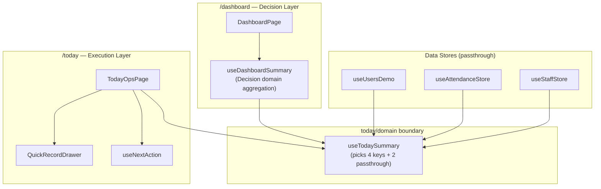

# ADR-002: Today (/today) is an Execution Layer and must remain thin

## Status

Accepted — 2026-02-27

## Context

The system has two closely related pages:

- **`/dashboard`**: comprehensive decision & management dashboard (1031 lines)
- **`/today`**: operational execution view for daily workflow (160 lines)

Both share the same domain aggregation (`useDashboardSummary`).
Without guardrails, `/today` risks growing into a second dashboard (duplicated aggregation, brittle coupling, increasing maintenance cost).

## Decision

1. `/today` is defined as **Execution Layer**.
2. `/today` must not own aggregation logic. It consumes a thin facade hook: `useTodaySummary`.
3. Any new aggregation required by `/today` must be implemented in dashboard domain first, then selected via facade (pick-only).
4. `/today` additions are limited to **UI widgets** or **execution actions** (e.g., QuickRecord).

## Architecture

### Pick Contract (TodaySummary)

#### Picked from DashboardSummary (4)

| Key | Reason | Notes |
|-----|--------|-------|
| `attendanceSummary` | Today の出席サマリーカードに必要 | |
| `dailyRecordStatus` | 未記録数/ヒーローバナー/AutoNext に必要 | `pending`, `pendingUserIds` を参照 |
| `scheduleLanesToday` | NextAction 計算の入力 | `useNextAction(summary.scheduleLanesToday)` |
| `briefingAlerts` | ブリーフィングアラート表示 | |

#### Passthrough (2)

| Key | Source | Reason |
|-----|--------|--------|
| `users` | `useUsersDemo` | 利用者一覧・未記録ソートに必要 |
| `visits` | `useAttendanceStore` | 出欠/送迎状況（P1 実データ接続）に必要 |

#### Guardrail

- TodayOpsPage は `useTodaySummary` 以外から store / dashboard summary を直接参照しない
- 追加キーが必要になった場合は本 ADR の table を更新する（= 意図的摩擦）

## Consequences

### Positive

- Prevents `/today` from becoming a second dashboard
- Makes dependencies explicit and reviewable (facade pick list is the contract)
- Enables independent evolution of dashboard domain without UI leakage
- TodayOpsPage no longer knows about `useDashboardSummary` constructor args

### Negative / Trade-offs

- Adding new data for `/today` requires touching dashboard domain (intentional friction)
- Facade pick list must be maintained (explicit contract)

### Known Interim Measure

`useTodaySummary` は現在 mock defaults（`generateMockActivityRecords`, `mockAttendanceCounts`, `mockSpSyncStatus`）を内部保持している。本来これらは dashboard domain の責務であり、将来的に `useDashboardSummary` のデフォルト値として吸収すべき。

**Target resolution**: Move mock defaults into `useDashboardSummary` before Phase 4 domain consolidation.

## Implementation

- Facade: `src/features/today/domain/useTodaySummary.ts`
- Barrel: `src/features/today/domain/index.ts`
- Responsibility comment: `src/pages/TodayOpsPage.tsx` (header)

## Reviewer Checklist

- [ ] `TodayOpsPage.tsx` が `useDashboardSummary` / `useUsersDemo` / `useAttendanceStore` / `useStaffStore` を直接 import していない
- [ ] Today の新規データ要求は `useTodaySummary` の Pick Contract に追記されている
- [ ] Today 内に集約ロジック（useMemo の大規模合成、selector 増殖）が入っていない

## Follow-ups

- Optional: ESLint boundary rule to prevent `today/*` from importing `dashboard/*` except via `useTodaySummary`
- Optional: Type contract test for facade shape stability
- Move mock defaults from facade to `useDashboardSummary` default params
