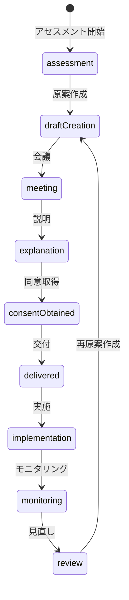
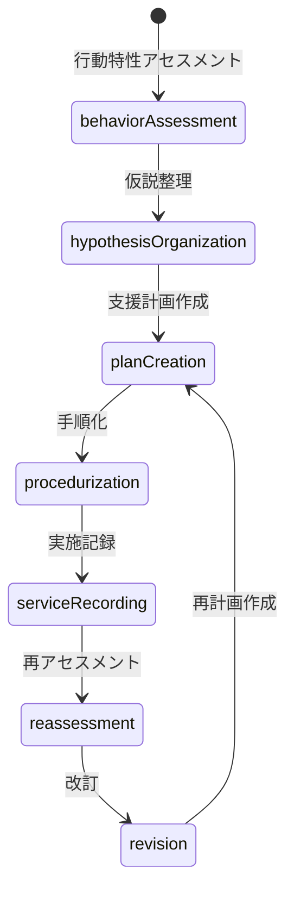

# ADR-005: 個別支援計画（ISP）と支援計画シート等を分離した三層構造を採用する

## Status

Accepted — 2026-03-12

## Context

障害福祉の現場運用において、個別支援計画（ISP）は法定の中核文書であり、本人意向・総合的支援方針・課題・目標・達成時期・同意・交付・モニタリング・見直しを管理する必要がある。

一方、支援計画シート等は、行動特性や場面別支援の具体化、工程別手順、実施記録、再アセスメントのための実装文書である。

両者は関連するが、役割が異なるため、システム上も同一文書・同一責務として統合すべきではない。
これを曖昧にすると、制度適合性の低下、監査耐性の不足、現場での再現性低下、二重入力や情報混乱が生じる。

### 既存コードベースとの関係

| 既存モジュール | 三層モデルでの位置づけ |
|---|---|
| `src/sharepoint/fields/supportPlanFields.ts` | 第1層 ISP の SharePoint 永続化 |
| `src/sharepoint/ispGoalMapper.ts` | 第1層の目標管理ロジック |
| `src/features/ibd/core/ibdTypes.ts` — `SupportPlanSheet` | 第2層 支援計画シート |
| `src/features/ibd/core/ibdTypes.ts` — `SupportProcedureManual` | 第3層 支援手順書 |
| `src/features/ibd/core/ibdTypes.ts` — `ISPReference` | 第1層→第2層リンク |
| `src/features/support-plan-guide/` | 第1層 ISP のガイド付き作成 |
| `src/features/ibd/plans/isp-editor/` | 第1層 ISP の比較・編集 |
| `src/features/ibd/plans/support-plan/` | 第2層 支援計画シート |
| `src/features/ibd/procedures/` | 第3層 場面別支援手順 |
| `src/domain/support/individual-steps.ts` | 第3層 手順テンプレート |

## Decision

本システムでは、以下の三層構造を採用する。

### 第1層: ISP（個別支援計画）

法定の中核文書として、以下を保持する。

| 項目 | 説明 |
|---|---|
| 本人・家族の意向 | アセスメント時に聴取した意向 |
| 総合的支援方針 | 事業所としての支援方針 |
| QOL向上課題 | 本人の生活の質向上に向けた課題 |
| 長期目標 | 概ね1年程度の達成目標 |
| 短期目標 | 概ね3〜6ヶ月の達成目標 |
| 達成時期 | 各目標の達成見込み時期 |
| 留意事項 | 支援上の注意事項・禁忌 |
| 作成日 | ISP 原案作成日 |
| 同意日 | 本人・家族の同意取得日 |
| 交付記録 | 計画書の交付先・交付日 |
| モニタリング結果 | 定期的なモニタリング記録 |
| 見直し日 | 計画見直し実施日 |

### 第2層: 支援計画シート

支援設計文書として、以下を保持する。既存の `SupportPlanSheet` 型と対応。

| 項目 | 既存フィールド |
|---|---|
| 行動観察 | `icebergModel.observableBehaviors` |
| 情報収集 | `icebergModel.underlyingFactors` |
| 分析・理解・仮説 | `icebergModel` 全体 |
| 支援課題 | `positiveConditions` |
| 対応方針 | `icebergModel.environmentalAdjustments` |
| 環境調整 | `icebergModel.environmentalAdjustments` |
| 関わり方の具体策 | `SupportProcedureStep` |
| 作成者 | `confirmedBy` |
| 作成日 | `createdAt` |
| 版番号 | `version` |
| 見直し日 | `nextReviewDueDate` |

### 第3層: 支援手順書兼記録

実施ログとして、以下を保持する。既存の `SupportProcedureManual` + `SupportScene` と対応。

| 項目 | 既存フィールド |
|---|---|
| 時間帯 | `SupportScene.sceneType` + 時間帯拡張 |
| 活動 | `SupportScene.label` |
| 支援手順 | `SupportProcedureStep` |
| 実施チェック | 新設: `ProcedureExecutionRecord` |
| 利用者の様子 | 新設: `ProcedureExecutionRecord.observation` |
| 特記事項 | 新設: `ProcedureExecutionRecord.notes` |
| 連絡事項 | 新設: `ProcedureExecutionRecord.communicationNotes` |
| 実施者 | 新設: `ProcedureExecutionRecord.executedBy` |
| 実施日時 | 新設: `ProcedureExecutionRecord.executedAt` |

## Relationship Rules

- 1つのISPに対し、複数の支援計画シートを紐づけ可能とする
- 1つの支援計画シートに対し、複数の支援手順書兼記録を紐づけ可能とする
- ISPと支援計画シート等は相互参照可能にする
  - 既存: `ISPReference` インターフェースによるスナップショット参照
- 記録から支援計画、支援計画からISPへ遡及可能にする

## Operational Rules

### ISP 状態遷移

以下の状態遷移を追跡可能とする。

### 支援計画シート等 運用フロー

以下の運用を追跡可能とする。

## Consequences

### Positive

- 制度要件に沿った設計になる
- 監査時に ISP と支援計画シートの役割分担を説明しやすい
- 現場支援の再現性が高まる
- 手順記録が再アセスメント資産になる
- AI や開発者の判断がぶれにくくなる
- 既存の `ibdTypes.ts` の型体系と整合的に拡張できる

### Negative / Trade-offs

- 文書やデータ構造が単純な一本化より複雑になる
- 相互参照や版管理の設計コストが増える
- UI 上の見せ方を丁寧に設計する必要がある
- SharePoint リスト設計が既存の `SupportPlans` から拡張が必要

## Rejected Alternatives

### 1. ISP と支援計画シートを一本化する

却下理由:
- 制度上・実務上の役割差が消える
- 監査証跡が曖昧になる
- 現場手順と上位計画が混線する

### 2. 支援手順書兼記録を単なる日報として扱う

却下理由:
- 再現性が失われる
- 再アセスメント根拠として弱い
- 支援の質改善につながりにくい

## Implementation Notes

- 版管理を必須にする（既存: `SupportPlanSheet.version`, `SPSHistoryEntry`）
- 作成者・更新者・作成日・更新日を必須にする（既存: `confirmedBy`, `createdAt`, `updatedAt`）
- 同意・交付・会議・モニタリングの証跡を保持する
- 見直し期限のアラート・一覧を設ける（既存: `nextReviewDueDate`, `getSPSAlertLevel()`）
- 二重入力を避けるため、参照リンクと要約表示を活用する
- 新規型は `src/domain/isp/types.ts` に三層モデルの統合型を定義する

### 関連ドキュメント

- [ibdTypes.ts](file:///c:/Users/安武/.vscode/workspace/audit-management-system/src/features/ibd/core/ibdTypes.ts) — 既存の第2層・第3層型定義
- [supportPlanFields.ts](file:///c:/Users/安武/.vscode/workspace/audit-management-system/src/sharepoint/fields/supportPlanFields.ts) — SharePoint フィールド定義
- [ispGoalMapper.ts](file:///c:/Users/安武/.vscode/workspace/audit-management-system/src/sharepoint/ispGoalMapper.ts) — ISP 目標管理
- [docs/ai-isp-three-layer-protocol.md](file:///c:/Users/安武/.vscode/workspace/audit-management-system/docs/ai-isp-three-layer-protocol.md) — AI 開発エージェント向けプロトコル

---

## Changelog

- 2026-03-12: 既存コードベースとの対応付けを含む形で Accepted
