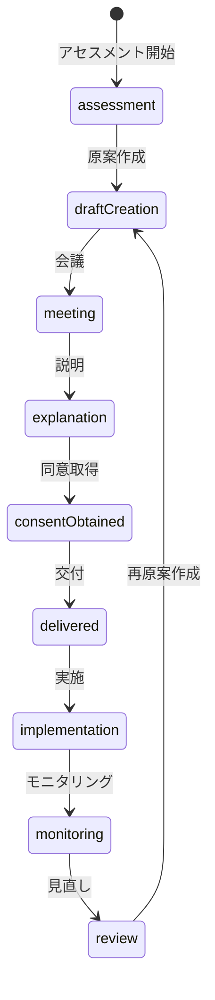
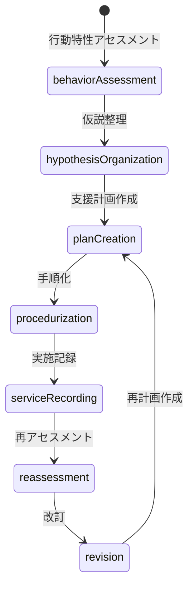

# ADR-005: 個別支援計画（ISP）と支援計画シート等を分離した三層構造を採用する

## Status

Accepted — 2026-03-12

## Context

障害福祉の現場運用において、個別支援計画（ISP）は法定の中核文書であり、本人意向・総合的支援方針・課題・目標・達成時期・同意・交付・モニタリング・見直しを管理する必要がある。

一方、支援計画シート等は、行動特性や場面別支援の具体化、工程別手順、実施記録、再アセスメントのための実装文書である。

両者は関連するが、役割が異なるため、システム上も同一文書・同一責務として統合すべきではない。
これを曖昧にすると、制度適合性の低下、監査耐性の不足、現場での再現性低下、二重入力や情報混乱が生じる。

### 既存コードベースとの関係

| 既存モジュール | 三層モデルでの位置づけ |
|---|---|
| `src/sharepoint/fields/supportPlanFields.ts` | 第1層 ISP の SharePoint 永続化 |
| `src/sharepoint/ispGoalMapper.ts` | 第1層の目標管理ロジック |
| `src/features/ibd/core/ibdTypes.ts` — `SupportPlanSheet` | 第2層 支援計画シート |
| `src/features/ibd/core/ibdTypes.ts` — `SupportProcedureManual` | 第3層 支援手順書 |
| `src/features/ibd/core/ibdTypes.ts` — `ISPReference` | 第1層→第2層リンク |
| `src/features/support-plan-guide/` | 第1層 ISP のガイド付き作成 |
| `src/features/ibd/plans/isp-editor/` | 第1層 ISP の比較・編集 |
| `src/features/ibd/plans/support-plan/` | 第2層 支援計画シート |
| `src/features/ibd/procedures/` | 第3層 場面別支援手順 |
| `src/domain/support/individual-steps.ts` | 第3層 手順テンプレート |

## Decision

本システムでは、以下の三層構造を採用する。

> **⚠️ 適用対象の原則（変更禁止）**
>
> | 層 | 適用対象 | 日次記録画面 |
> |---|---|---|
> | 第1層: ISP + 日次記録 | **全利用者** | `/daily/table` |
> | 第2層: 支援計画シート（SPS） | **IBD（強度行動障害）対象者のみ** | — |
> | 第3層: 支援手順書兼記録 | **IBD対象者のみ** | `/daily/support?wizard=user` |
>
> - 第2層・第3層を全利用者に適用してはならない。
> - IBD対象者の日次記録は `/daily/support`（手順ステップ単位の時間別記録）であり、`/daily/table`（全利用者共通）とは別画面である。
> - この適用範囲はユーザーによる確定定義であり、実装・AI開発・レビュー時に必ず参照すること。

### 第1層: ISP（個別支援計画）

法定の中核文書として、以下を保持する。

| 項目 | 説明 |
|---|---|
| 本人・家族の意向 | アセスメント時に聴取した意向 |
| 総合的支援方針 | 事業所としての支援方針 |
| QOL向上課題 | 本人の生活の質向上に向けた課題 |
| 長期目標 | 概ね1年程度の達成目標 |
| 短期目標 | 概ね3〜6ヶ月の達成目標 |
| 達成時期 | 各目標の達成見込み時期 |
| 留意事項 | 支援上の注意事項・禁忌 |
| 作成日 | ISP 原案作成日 |
| 同意日 | 本人・家族の同意取得日 |
| 交付記録 | 計画書の交付先・交付日 |
| モニタリング結果 | 定期的なモニタリング記録 |
| 見直し日 | 計画見直し実施日 |

### 第2層: 支援計画シート

支援設計文書として、以下を保持する。既存の `SupportPlanSheet` 型と対応。

| 項目 | 既存フィールド |
|---|---|
| 行動観察 | `icebergModel.observableBehaviors` |
| 情報収集 | `icebergModel.underlyingFactors` |
| 分析・理解・仮説 | `icebergModel` 全体 |
| 支援課題 | `positiveConditions` |
| 対応方針 | `icebergModel.environmentalAdjustments` |
| 環境調整 | `icebergModel.environmentalAdjustments` |
| 関わり方の具体策 | `SupportProcedureStep` |
| 作成者 | `confirmedBy` |
| 作成日 | `createdAt` |
| 版番号 | `version` |
| 見直し日 | `nextReviewDueDate` |

### 第3層: 支援手順書兼記録

実施ログとして、以下を保持する。既存の `SupportProcedureManual` + `SupportScene` と対応。

| 項目 | 既存フィールド |
|---|---|
| 時間帯 | `SupportScene.sceneType` + 時間帯拡張 |
| 活動 | `SupportScene.label` |
| 支援手順 | `SupportProcedureStep` |
| 実施チェック | 新設: `ProcedureExecutionRecord` |
| 利用者の様子 | 新設: `ProcedureExecutionRecord.observation` |
| 特記事項 | 新設: `ProcedureExecutionRecord.notes` |
| 連絡事項 | 新設: `ProcedureExecutionRecord.communicationNotes` |
| 実施者 | 新設: `ProcedureExecutionRecord.executedBy` |
| 実施日時 | 新設: `ProcedureExecutionRecord.executedAt` |

## 画面責務表（Screen Responsibility Matrix）

> UI設計・実装・レビュー時の基準表。この分類を変えるには本ADRの改訂が必要。

| 画面 | URL | 対象ユーザー | 役割 | 属する層 |
|---|---|---|---|---|
| ケース記録 | `/daily/table` | **全利用者** | 日々の一覧型記録・経過記録（Type A/B） | 第1層 |
| 支援計画シート | `/isp/:userId/sps/:spsId` 等 | **IBD対象者のみ** | 行動特性分析・氷山分析・支援設計・手順スケジュール定義・3か月見直し基点 | 第2層 |
| 支援手順の実施・記録 | `/daily/support?wizard=user` | **IBD対象者のみ** | SPSに紐づく手順を現場で実行しながら記録する（第2層→第3層ブリッジUI） | **第2層→第3層** |
| PDCA・見直し | `/ibd/pdca/:id` 等 | **IBD対象者のみ** | 実施ログを第2層へフィードバック・再アセスメント・計画改訂 | 第2層・第3層 |

### `/daily/support` の位置づけ（変更禁止）

> `/daily/support` は、IBD対象者に対して、支援計画シートに定義された手順を実行しながら記録する実施ログ画面であり、第2層（支援設計）と第3層（実施記録）を接続するブリッジUIである。

この画面を「単なる記録入力画面」として扱ってはならない。
元データは第2層（SPS）、入力結果は第3層（実施ログ）であり、両層を跨ぐ実行ブリッジである。

### ユーザーへの見せ方（UI上のラベル）

設計層の名称（第1層・第2層・第3層）は現場UIには出さない。画面タイトル・メニューは以下に統一する。

| 対象 | UIラベル |
|---|---|
| 全利用者 | 日々の記録 |
| IBD対象者のみ | 支援計画シート |
| IBD対象者のみ | 支援手順の実施 |
| IBD対象者のみ | 見直し・PDCA |

## Anti-Patterns（禁止事項）

層の越境は設計崩壊の主因となる。以下を明示的に禁止する。

| 禁止パターン | 理由 |
|---|---|
| 第2層（SPS）に日次記録を直接保持する | 第2層は設計文書。ログは第3層に属する |
| 第3層（実施ログ）に分析ロジックを持ち込む | 分析は第2層の責務。第3層は記録のみ |
| ISP（第1層）に実行手順・詳細ログを書き込む | ISPは制度文書。実行詳細は第2・3層に委譲する |
| `/daily/support` で SPS を書き換える | この画面は第2層を read-only で参照し、第3層へ書き込む |
| `/daily/table` を IBD 対象者の主記録として使う | IBD 対象者の実施記録は `/daily/support` が正。両方に分散させない |

**原則：分析は第2層 / 実行は第3層 / 制度文書は第1層**

---

## Data Flow（循環構造）

層をまたぐデータの流れは以下の通り。一方向ではなく循環する。

```
ISP（第1層）
 ↓ ISPReference（スナップショット参照）
SupportPlanSheet / SPS（第2層）
 氷山分析 / FBA / 仮説 / 支援設計 / 手順スケジュール定義
 ↓ planningSheetId
/daily/support（第2層→第3層 ブリッジUI）
 ↓
実施ログ / filledStepIds / step notes（第3層）
 ↓
MonitoringCountdown / PDCA（第2層へフィードバック）
 ↓
SPS 再アセスメント・改訂（第2層更新）
 ↓
ISP モニタリング・見直し（第1層更新）
 ↑_______________________________↑
```

**ポイント：第3層の実施ログが第2層の改訂根拠となり、最終的に第1層ISPの見直しに繋がる。**

---

## `/daily/support` State Responsibility

この画面の入出力と状態責務を明確に定義する。

| 区分 | 内容 |
|---|---|
| **Input（第2層から）** | `planningSheetId`、`schedule`（手順定義）、`positiveConditions` |
| **State（画面内）** | `filledStepIds`、step logs、notes、`unfilledStepsCount` |
| **Output（第3層へ）** | 実施ログ（execution logs）、モニタリングシグナル（PDCA） |
| **Rule** | 第2層（SPS）データは **read-only**。この画面から SPS を変更してはならない |

---

## IBD Mode（UI分岐定義）

利用者が IBD 加算対象かどうかで UI を分岐する。判定は `evaluateSevereDisabilityAddOn()` の結果に従う。

```
if isSevereDisabilityAddonEligible(user):
  enable:
    - 支援計画シート（SPS）拡張フィールド
    - /daily/support（支援手順の実施）
    - MonitoringCountdown（3か月見直しカウントダウン）
    - PDCA / IcebergPdca ナビゲーション
else:
  fallback:
    - /daily/table のみ（ケース記録）
```

IBD モードの有効化判定をアドホックに行ってはならない。判定ロジックは `src/domain/regulatory/severeDisabilityAddon.ts` の `checkUserEligibility()` に一元化する。

---

## Testing Strategy

設計を壊さないためのテスト観点。層の責務をテストが守る状態を維持する。

### 層分離テスト
- SPS（第2層）に日次ログが保存されないこと
- `/daily/support` が SPS を書き換えないこと（read-only 遵守）
- `PersonDaily`（Type A/B）が SPS フィールドを持ち込まないこと

### ナビゲーションテスト
- SPS 詳細 → `planningSheetId` 付き `/daily/support` への遷移
- 実施完了後 → PDCA / IcebergPdca への導線
- IBD 非対象者に `/daily/support` が表示されないこと

### 加算判定テスト
- `evaluateSevereDisabilityAddOn()` の全要件（区分・行動スコア・研修比率・見直し期限）の境界値
- IBD モード有効化フラグと UI 分岐の整合性

---

## Relationship Rules

- 1つのISPに対し、複数の支援計画シートを紐づけ可能とする
- 1つの支援計画シートに対し、複数の支援手順書兼記録を紐づけ可能とする
- ISPと支援計画シート等は相互参照可能にする
  - 既存: `ISPReference` インターフェースによるスナップショット参照
- 記録から支援計画、支援計画からISPへ遡及可能にする

## Operational Rules

### ISP 状態遷移

以下の状態遷移を追跡可能とする。



### 支援計画シート等 運用フロー

以下の運用を追跡可能とする。



## Consequences

### Positive

- 制度要件に沿った設計になる
- 監査時に ISP と支援計画シートの役割分担を説明しやすい
- 現場支援の再現性が高まる
- 手順記録が再アセスメント資産になる
- AI や開発者の判断がぶれにくくなる
- 既存の `ibdTypes.ts` の型体系と整合的に拡張できる

### Negative / Trade-offs

- 文書やデータ構造が単純な一本化より複雑になる
- 相互参照や版管理の設計コストが増える
- UI 上の見せ方を丁寧に設計する必要がある
- SharePoint リスト設計が既存の `SupportPlans` から拡張が必要

## Rejected Alternatives

### 1. ISP と支援計画シートを一本化する

却下理由:
- 制度上・実務上の役割差が消える
- 監査証跡が曖昧になる
- 現場手順と上位計画が混線する

### 2. 支援手順書兼記録を単なる日報として扱う

却下理由:
- 再現性が失われる
- 再アセスメント根拠として弱い
- 支援の質改善につながりにくい

## SSOT と Shadow Model の境界定義

三層モデルにおけるデータの正本（SSOT）と UI 補助用モデル（Shadow Model）の境界を定義する。

### 正本（Single Source of Truth）

| 対象 | 正本 | 管理場所 |
|---|---|---|
| ISP（第1層） | `src/domain/isp/schema` 配下の型・スキーマ | `domain` / `repository` |
| 支援計画シート（第2層） | `SupportPlanningSheet`（schema） | `domain` / `repository` |
| 支援手順書兼記録（第3層） | `ProcedureExecutionRecord` 等（schema） | `domain` / `repository` |

### Shadow Model（UI 思考補助）

| 対象 | Shadow Model | 管理場所 |
|---|---|---|
| 支援計画シート UI 状態 | `ibdTypes.SupportPlanSheet` | `src/features/ibd/core/ibdTypes.ts` |
| IBD ストア | `ibdStore` | `src/features/ibd/` |

### 境界ルール

1. **`domain` → `ibdStore` / `ibdTypes` への依存は禁止**。依存方向は `ibdStore → domain` の片方向のみ
2. **`ibdStore → schema` の同期 adapter は意図的に設けない**。二重構造は制御された設計判断であり技術負債ではない
3. **監査・加算・bridge・永続化・制度ロジック**は `domain` / `schema` / `repository` に配置する
4. **UI 補助・思考補助・可視化・試行的分析**は `ibdStore` / Shadow Model に配置する
5. 将来の整理は**型統合ではなく責務移植**で行う。1責務 = 1PR の原則に従う

> **設計意図**: `ibdStore` と `schema` の二重構造は「制御された二重構造」である。Shadow Model は UI 上の思考補助に特化し、SSOT には制度・監査上の正本のみを保持する。この分離を壊すと、監査ロジックの汚染やデータ整合性の崩壊を招く。

---

## Implementation Notes

- 版管理を必須にする（既存: `SupportPlanSheet.version`, `SPSHistoryEntry`）
- 作成者・更新者・作成日・更新日を必須にする（既存: `confirmedBy`, `createdAt`, `updatedAt`）
- 同意・交付・会議・モニタリングの証跡を保持する
- 見直し期限のアラート・一覧を設ける（既存: `nextReviewDueDate`, `getSPSAlertLevel()`）
- 二重入力を避けるため、参照リンクと要約表示を活用する
- 新規型は `src/domain/isp/types.ts` に三層モデルの統合型を定義する

### 関連ドキュメント

- [ibdTypes.ts](file:///c:/Users/安武/.vscode/workspace/audit-management-system/src/features/ibd/core/ibdTypes.ts) — 既存の第2層・第3層型定義
- [supportPlanFields.ts](file:///c:/Users/安武/.vscode/workspace/audit-management-system/src/sharepoint/fields/supportPlanFields.ts) — SharePoint フィールド定義
- [ispGoalMapper.ts](file:///c:/Users/安武/.vscode/workspace/audit-management-system/src/sharepoint/ispGoalMapper.ts) — ISP 目標管理
- [docs/ai-isp-three-layer-protocol.md](file:///c:/Users/安武/.vscode/workspace/audit-management-system/docs/ai-isp-three-layer-protocol.md) — AI 開発エージェント向けプロトコル

---

## Changelog

- 2026-03-12: 既存コードベースとの対応付けを含む形で Accepted
- 2026-04-09: 適用対象の原則・画面責務表・`/daily/support` ブリッジUI定義・UIラベル統一指針を追記（ユーザー確定定義）
- 2026-04-09: Anti-Patterns・Data Flow・`/daily/support` State定義・IBD Mode・Testing Strategy を追記（設計固定フェーズ完了）
- 2026-04-13: SSOT vs Shadow Model 境界定義セクションを追記 — `SupportPlanningSheet(schema)` が SSOT、`ibdTypes`/`ibdStore` は Shadow Model、同期 adapter 不設置は設計判断であることを明文化
- 2026-04-13: 責務移植第一弾 — 90日見直しアラート（`ibdStore.getExpiringSPSAlerts` / `ibdTypes.getSPSAlertLevel`）の warning 判定を `auditChecks.getReviewApproachingRisk` として domain 側に吸収。型統合ではなく責務移植の実例
- 2026-04-13: 責務移植第二弾 — SPS確定権限（`ibdStore.canConfirmSPS`）を `staffQualificationProfile.checkSPSConfirmationEligibility` として domain 側に移植。bool 戻り値から reasonCodes + missingQualifications を返す構造化結果へ拡張し、中核的人材養成研修修了者も確定可能と明示
- 2026-04-13: 責務移植第三弾（port 契約拡張） — SPS CRUD 責務を `ibdStore` から `PlanningSheetRepository` へ移すための最低契約として、`listByUser(userId)`（isCurrent 問わず全版）と `listBySeries(userId, ispId)`（pure 版管理関数の入力として `SupportPlanningSheet[]` を返す）を port に追加。`delete` / `confirm` / `revise` は専用 API 化せず、既存 `create` / `update` と `planningSheetVersion.ts` の pure 関数（`createRevisionDraft` / `activatePlanningSheetVersion` / `archivePlanningSheetVersion`）の組み合わせで責務を表現する。workflow 抽象化層は呼出元の重複が顕在化した段階で採用判断する方針とした
- 2026-04-13: 責務移植第三弾（UI導線接続） — SPS の永続化・履歴・版管理導線を UI から `PlanningSheetRepository` port へ接続。`useIndividualSupportOrchestrator` と `PlanningSheetVersionPanel` は repository + pure workflow（`planningSheetVersionWorkflow.ts`）を経由し、Shadow Model は思考補助状態のみを維持する
- 2026-04-13: 責務移植第四弾（観察カウンター） — 週次観察カウンター/観察ログ/アラート判定を `domain/ibd/supervisionTracking` + `SupervisionTrackingRepository` へ移植。`ibdStore` は UI 呼出入口として repository 実装を利用し、SSOT 側の責務を分離した
- 2026-04-13: 責務移植第五弾（ABC記録） — ABC 記録の永続化責務を `ibdStore` から `domain/behavior` の repository port（`BehaviorObservationRepository`）へ移植。`ibdStore` は UI 補助状態を維持しつつ、記録の保存/取得は `localBehaviorObservationRepository` を経由する構成へ変更した
- 2026-04-13: ABC 読書き整合（A/B 接続） — `/daily/support` の保存導線（Daily `BehaviorRepository`）から `BehaviorObservationRepository`（B 正本）へ同期書込を追加し、同画面の件数表示および `useMeetingEvidenceDraft` の参照先（B）と整合するよう接続を統一。`domain/abc.AbcRecord` 系は契約差分があるため今回スコープ外とした
- 2026-04-13: ABC 同期失敗ポリシー（A→B） — A 保存成功後に B 同期が失敗した場合でも submit は成功扱いを維持し、同期失敗は warning として記録する方針を導入（bridge migration の可用性優先）
- 2026-04-13: ABC read-path 移行第一弾（today alert） — `useUserAlerts` の参照先を Daily `BehaviorRepository`（A）から `getABCRecordsForUser`（B 正本）へ変更し、表示側の正本整合を開始。判定ロジック（`buildUserAlerts`）は変更せず、取得元のみ移行
- 2026-04-13: ABC read-path 移行第二弾（strategy usage） — `useStrategyUsageCounts` / `useStrategyUsageTrend` の参照先を Daily `BehaviorRepository`（A）から `getABCRecordsForUser`（B 正本）へ変更し、戦略利用集計・トレンド表示の正本整合を進めた。集計/比較ロジック（`aggregateStrategyUsage` / `compareStrategyUsage`）は変更せず、取得元のみ移行
- 2026-04-13: ABC read-path 移行第三弾（default strategy） — `useDefaultStrategies` の参照先を Daily `BehaviorRepository`（A）から `getABCRecordsForUser`（B 正本）へ変更。判定ロジックは維持しつつ、取得元を B 基準へ統一した
- 2026-04-13: ABC read-path 移行第四弾（action engine） — `useAllCorrectiveActions` の参照先を Daily `BehaviorRepository`（A）から `getABCRecordsForUser`（B 正本）へ変更。ExceptionCenter のバッチ一括フェッチ導線において、正本（Path-B）からの 30 日間フィルタリングを実装し、取得元を統一した
- 2026-04-13: ABC read-path 移行最終弾（analysis dashboard / history） — `behaviorStore` での履歴表示および分析用一括取得（`fetchForAnalysis`）の参照先を Path-B（`ibdStore`）へ変更。これにより主要な読取導線の Path-B SSOT 統合を完了した
