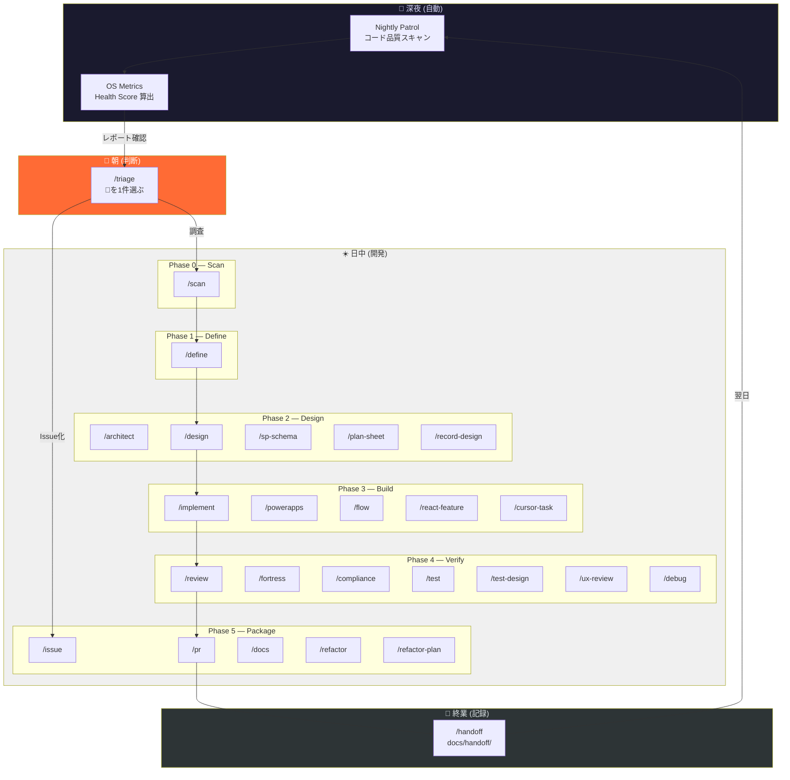
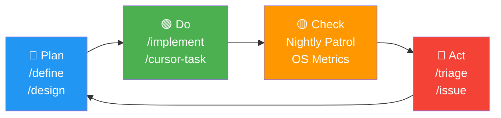
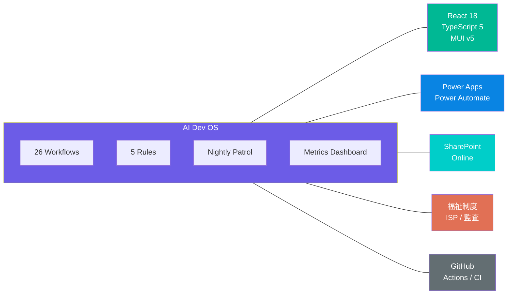

# イソカツ AI Dev OS — Architecture Overview

> **AIで回る開発運用システム** — 観測 → 判断 → 実行 → 記録 の自律ループ

---

## System Architecture



---

## The Loop (PDCA)



---

## Command Map (26 Commands)

| Phase | Commands | Purpose |
|:-----:|----------|---------|
| **0** | `/scan` `/triage` | 既存コード理解 / 朝の巡回判断 |
| **1** | `/define` | 曖昧 → 要件 |
| **2** | `/architect` `/design` `/sp-schema` `/plan-sheet` `/record-design` | 設計 |
| **3** | `/implement` `/powerapps` `/flow` `/react-feature` `/cursor-task` | 実装 |
| **4** | `/review` `/fortress` `/compliance` `/test` `/test-design` `/ux-review` `/debug` | 検証 |
| **5** | `/issue` `/pr` `/handoff` `/docs` `/refactor` `/refactor-plan` | 資産化 |

---

## Technology Coverage



---

## Health Score

```
Score = 100
        − (巨大ファイル × 5)
        − (any使用 × 2)
        − (テスト未整備 × 3)
        − (TODO/FIXME × 1, max 10)
        + (Handoff実施 × 5)
```

| Grade | Score | 意味 |
|:-----:|:-----:|------|
| **A** | 80-100 | 健全。運用が回っている |
| **B** | 60-79 | 良好。改善が進んでいる |
| **C** | 40-59 | 注意。技術負債が蓄積中 |
| **D** | 20-39 | 警告。放置すると事故リスク |
| **F** | 0-19 | 危険。即対応が必要 |

---

## Daily Rhythm

```
 03:00  nightly-health.yml   テスト・ビルド確認
 03:15  nightly-patrol.yml   コード品質スキャン + ダッシュボード生成
         ↓
 08:30  /triage              レポート確認 → 🔴 を1件選択
         ↓
 09:00  /scan → /define      調査 → 要件定義
         ↓
 10:00  /design → /implement 設計 → 実装
         ↓
 16:00  /review → /fortress  レビュー → 硬化チェック
         ↓
 17:00  /pr → /handoff       PR作成 → 引き継ぎ記録
         ↓
 03:15  Nightly Patrol       翌日のスキャン
```

---

## Core Principles

| # | Principle | Rule |
|---|-----------|------|
| 1 | **Code later** | まず要件を分解する |
| 2 | **Separate first** | UI / state / data / 業務ルールを混ぜない |
| 3 | **Audit-ready** | 「動く」だけでは不十分。制度・監査まで |
| 4 | **Role, not task** | AIには「作業」ではなく「責務と出力形式」を渡す |
| 5 | **Always asset** | 毎回 Issue / PR / 手順書に落とす |

---

## Evolution

```
v1    26 Workflows + 5 Rules        ← 開発OS
v2    Nightly Patrol + Metrics      ← 観測OS
v2.5  /triage + /handoff 運用安定   ← 運用OS  ◀ 現在地
v3    AI提案エンジン                ← 自律OS（次）
```

---

> *Built for [イソカツ](https://github.com/yasutakesougo/audit-management-system-mvp) — 福祉事業所の現場OS*
