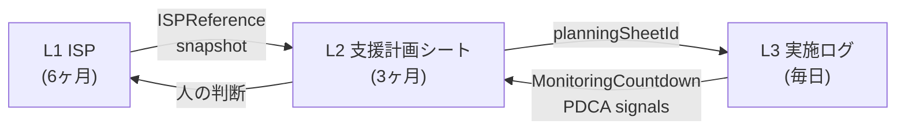

# Architecture Overview

> このドキュメントは **アーキテクチャの入口** です。
> 規範的（canonical）な定義は各 ADR と `docs/architecture/` 配下の専門ドキュメントにあります。
> ここはそれらへの**地図**と、全体像を 5 分で掴むための要約です。

## 1. What this system is

Support Operations OS — 支援業務の PDCA をコード化した基盤。
単なる記録アプリではなく、**Assessment → Planning → Record → Monitoring** の循環を
一本のデータパイプラインとして設計している。

## 2. The 3-Layer Model (ISP Three-Layer)

| 層 | 名称 | 問い | 周期 | 適用対象 | 日次記録画面 |
|---|---|---|---|---|---|
| **L1** | 個別支援計画（ISP） | WHY なぜ支援するか | 6ヶ月 | **全利用者** | `/daily/table` |
| **L2** | 支援計画シート（SPS） | HOW どう支援するか | 3ヶ月 | **IBD対象者のみ** | — |
| **L3** | 支援手順書兼記録 | DO 実施する | 毎日 | **IBD対象者のみ** | `/daily/support?wizard=user` |

> ⚠️ L2/L3 を全利用者に適用してはならない。IBD 判定は
> [src/domain/regulatory/severeDisabilityAddon.ts](../src/domain/regulatory/severeDisabilityAddon.ts) の
> `checkUserEligibility()` に一元化されている。

**Canonical**: [ADR-005](adr/ADR-005-isp-three-layer-separation.md)

## 3. The PDCA Loop



**フィードバックループの閉じ方（重要）**

- **L3 → L2**：自動。`monitoringToPlanningBridge` が実施ログを集計して L2 への変更候補を生成する
- **L2 → L1**：**人の判断を経由**。自動ブリッジは存在しない。ISP 更新は法定プロセス（会議・同意・交付）を必要とするため意図的に自動化されていない

つまり**半自動ループ**であり、完全自動ではない。
これは [ADR-009](adr/ADR-009-support-operations-os-principles.md) の
「AI が提案し、人が判断する」原則の現れ。

## 4. The Bridges (Transform, not Sync)

Bridge は**純関数による変換器**であり、同期器ではない。
副作用を持たず、入力から `patches` を返す。呼び出し側が適用責任を持つ。

| # | Bridge | 方向 | 実装 | 特性 |
|---|---|---|---|---|
| 1 | `assessmentBridge` | Assessment → L2 | [assessmentBridge.ts](../src/features/planning-sheet/assessmentBridge.ts) | マージ / 冪等 / 出典追跡 |
| 2 | `tokuseiToPlanningBridge` | 特性アンケート → L2 | [tokuseiToPlanningBridge.ts](../src/features/planning-sheet/tokuseiToPlanningBridge.ts) | マージ / 冪等 / 出典追跡 |
| 3 | `planningToRecordBridge` | L2 → L3 | [planningToRecordBridge.ts](../src/features/planning-sheet/planningToRecordBridge.ts) | 手順展開 / 重複排除 |
| 4 | `monitoringToPlanningBridge` | 行動モニタリング → L2 | [monitoringToPlanningBridge.ts](../src/features/planning-sheet/monitoringToPlanningBridge.ts) | 集計 / 候補生成 |

**全 Bridge に共通する不変条件**

- 純関数（no I/O、no mutation）
- マージ（既存データを上書きしない）
- 冪等性（同一入力の再取込で重複が増えない）
- Provenance（`ProvenanceEntry` で出典・理由・取込日時を記録）

## 5. SSOT per Layer（どの層の真実はどこにあるか）

| 層 | ドメイン型 | SharePoint 永続化 | 主な読み書き口 |
|---|---|---|---|
| L1 ISP | [src/domain/isp/types.ts](../src/domain/isp/types.ts) | [supportPlanFields.ts](../src/sharepoint/fields/supportPlanFields.ts) | [src/features/support-plan-guide/](../src/features/support-plan-guide/), [src/features/ibd/plans/isp-editor/](../src/features/ibd/plans/isp-editor/) |
| L2 SPS | `SupportPlanSheet` (ibdTypes.ts) | SharePoint `SupportPlans` 拡張 | [src/features/ibd/plans/support-plan/](../src/features/ibd/plans/support-plan/) |
| L3 実施ログ | `SupportProcedureManual` + `ProcedureExecutionRecord` | 新設リスト | [src/features/ibd/procedures/](../src/features/ibd/procedures/), `/daily/support` |

**原則**：L2 は L3 に対して read-only。`/daily/support` は L2 を読んで L3 に書き込む**ブリッジ UI**であり、L2 を書き換えてはならない。

## 6. Invariants（禁止事項）

[ADR-005](adr/ADR-005-isp-three-layer-separation.md) の Anti-Patterns を要約：

- L2 に日次ログを書かない（ログは L3）
- L3 に分析ロジックを置かない（分析は L2）
- L1 に実行手順を書かない（L1 は制度文書）
- `/daily/support` から L2 を書き換えない（read-only）
- `/daily/table` を IBD 対象者の主記録にしない（IBD は `/daily/support` が正）

## 7. Canonical sources（規範的ドキュメント）

### ADR（意思決定記録）

- [ADR-005](adr/ADR-005-isp-three-layer-separation.md) — 三層分離（最重要）
- [ADR-007](adr/ADR-007-assessment-planning-record-bridge.md) — Bridge 設計
- [ADR-009](adr/ADR-009-support-operations-os-principles.md) — OS 設計原則
- [ADR-014](adr/ADR-014-sharepoint-ssot-drift-contract.md) — SharePoint SSOT / Drift 契約
- [ADR Index](adr/README.md)

### アーキテクチャ詳細

- [isp-three-layer-model.md](architecture/isp-three-layer-model.md) — 三層モデル（簡潔版）
- [isp-three-layer-rules.md](architecture/isp-three-layer-rules.md) — 層別ルール
- [isp-three-layer-code-structure.md](architecture/isp-three-layer-code-structure.md) — コード配置
- [planning-daily-monitoring-loop.md](architecture/planning-daily-monitoring-loop.md) — PDCA ループの詳細
- [support-pdca-engine-overview.md](architecture/support-pdca-engine-overview.md) — PDCA エンジン 1 ページ概要
- [sharepoint-resilience.md](architecture/sharepoint-resilience.md) — Drift 耐性・自己修復
- [screen-responsibility-map.md](architecture/screen-responsibility-map.md) — 画面責務一覧

### 業務モデル

- [isp-driven-operations-model.md](model/isp-driven-operations-model.md)
- [operating-model.md](operations/operating-model.md)

## 8. Open questions（未解決・要議論）

この入口文書から見えた、まだ ADR で固定されていない論点：

- **L2→L1 フィードバック**：現状は人手のみ。提案生成（「ISP 見直し推奨」シグナル）の自動化範囲をどこまで広げるかは未定
- **Bridge のバージョン管理**：変換ロジックを更新した場合、過去取込済みデータの再変換ポリシーは Provenance で追跡可能だが運用手順が未定義
- **Bridge 4 本目の位置づけ**：`tokuseiToPlanningBridge` が `assessmentBridge` と並列か下位かは実装を見ると並列だが、ドキュメントには未反映

---

## How to navigate this directory

```
docs/
├── architecture.md             ← あなたはここ（入口）
├── adr/                        ← 意思決定記録（変更は新ADRで）
├── architecture/               ← 専門アーキテクチャ文書
├── model/                      ← 業務モデル
├── operations/                 ← 運用設計
├── product/                    ← プロダクト原則・ロードマップ
├── setup.md (TBD)              ← README から分離予定
├── testing.md (TBD)
├── operations.md (TBD)
└── history/ (TBD)              ← 歴史的記録の退避先
```
