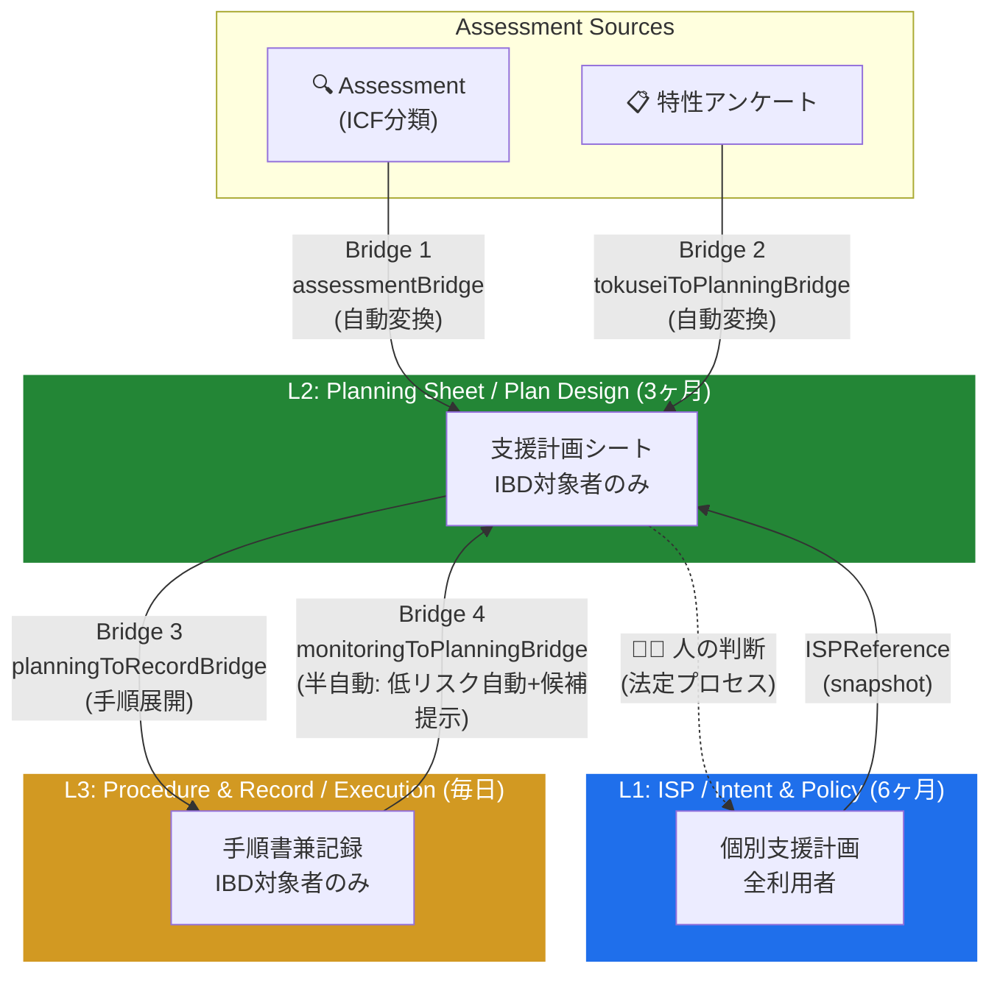

# Architecture Overview

> このドキュメントは **アーキテクチャの入口** です。
> 規範的（canonical）な定義は各 ADR と `docs/architecture/` 配下の専門ドキュメントにあります。
> ここはそれらへの**地図**と、全体像を 5 分で掴むための要約です。

## 1. What this system is

Support Operations OS — 支援業務の PDCA をコード化した基盤。
単なる記録アプリではなく、**Assessment → Planning → Record → Monitoring** の循環を
一本のデータパイプラインとして設計している。

## 2. The 3-Layer Model (ISP Three-Layer)

| 層 | 名称 | 問い | 周期 | 適用対象 | 日次記録画面 |
|---|---|---|---|---|---|
| **L1** | 個別支援計画（ISP） | WHY なぜ支援するか | 6ヶ月 | **全利用者** | `/daily/table` |
| **L2** | 支援計画シート（SPS） | HOW どう支援するか | 3ヶ月 | **IBD対象者のみ** | — |
| **L3** | 支援手順書兼記録 | DO 実施する | 毎日 | **IBD対象者のみ** | `/daily/support?wizard=user` |

> ⚠️ L2/L3 を全利用者に適用してはならない。IBD 判定は
> [src/domain/regulatory/severeDisabilityAddon.ts](../src/domain/regulatory/severeDisabilityAddon.ts) の
> `checkUserEligibility()` に一元化されている。

**Canonical**: [ADR-005](adr/ADR-005-isp-three-layer-separation.md)

### 2.1 L1 ISP — 制度文書層

法定の中核文書。本人意向・総合的支援方針・課題・目標・達成時期・同意・交付・モニタリング・見直しを保持する。

| 責務 | 非責務 |
|---|---|
| 支援の目的と方針を定義する | 実行手順を記述しない |
| 6ヶ月サイクルで見直す | 日次ログを保持しない |
| 同意・交付・会議の証跡を持つ | 行動分析・氷山モデルを持たない |
| ISPReference として L2 にスナップショット提供 | L2/L3 の変更を直接受け取らない |

**SSOT**: ドメイン型 [src/domain/isp/types.ts](../src/domain/isp/types.ts)、SP 永続化 [supportPlanFields.ts](../src/sharepoint/fields/supportPlanFields.ts)

### 2.2 L2 Planning Sheet (SPS) — 支援設計層

行動特性分析・氷山モデル・仮説・支援設計・手順スケジュール定義を保持する設計文書。

| 責務 | 非責務 |
|---|---|
| 行動観察・情報収集・分析・仮説を構造化する | 日次実施ログを保持しない |
| 支援方針・具体策・環境調整を定義する | ISP の制度情報（同意日等）を持たない |
| 3ヶ月サイクルで見直す（`nextReviewDueDate`） | 手順の実施チェックを管理しない |
| L3 へ read-only で手順スケジュールを提供 | — |

**SSOT**: ドメイン型 `SupportPlanSheet`（ibdTypes.ts）、SP 永続化 `SupportPlans` リスト

### 2.3 L3 Procedure / Record — 実施記録層

場面別手順の実施ログ。L2 で定義された手順を現場で実行しながら記録する。

| 責務 | 非責務 |
|---|---|
| 手順ステップの実施チェック（`filledStepIds`） | 分析ロジックを持たない |
| 利用者の様子・特記事項・連絡事項の記録 | SPS を書き換えない |
| 実施者・実施日時の証跡 | ISP の制度情報に触れない |
| モニタリングシグナルとして L2 へフィードバック | — |

**SSOT**: ドメイン型 `SupportProcedureManual` + `ProcedureExecutionRecord`、SP 永続化 新設リスト

**ブリッジ UI**: `/daily/support` は L2 と L3 の境界に位置する。L2 を read-only で参照し、L3 へ書き込む実行ブリッジである。

## 3. The PDCA Loop



**フィードバックループの閉じ方（重要）**

- **L3 → L2**：自動。`monitoringToPlanningBridge` が実施ログを集計して L2 への変更候補を生成する
- **L2 → L1**：**人の判断を経由**。自動ブリッジは存在しない。ISP 更新は法定プロセス（会議・同意・交付）を必要とするため意図的に自動化されていない

つまり**半自動ループ**であり、完全自動ではない。
これは [ADR-009](adr/ADR-009-support-operations-os-principles.md) の
「AI が提案し、人が判断する」原則の現れ。

### 3.1 ループ閉鎖の現状

| 接続 | 自動化レベル | 実装 | 人の介入 |
|---|---|---|---|
| Assessment → L2 | 自動変換 | `assessmentBridge` + `tokuseiToPlanningBridge` | 取込ボタン押下 |
| L2 → L3 | 自動変換 | `planningToRecordBridge` | 手順生成の確認 |
| L3 → L2 | 半自動 | `monitoringToPlanningBridge` | 低リスク=自動追記、判断伴う変更=候補から職員が選択 |
| L2 → L1 | **手動のみ** | ブリッジなし | 法定プロセス（会議・同意・交付）が必須 |

**未決定事項**: L2→L1 の提案シグナル（「ISP 見直しを推奨する」通知）をシステムが自動生成するかどうかは未策定。
現状では `MonitoringCountdown`（3ヶ月見直しカウントダウン）が間接的にトリガーとなっている。

## 4. The Bridges (Transform, not Sync)

Bridge は**純関数による変換器**であり、同期器ではない。
副作用を持たず、入力から `patches` を返す。呼び出し側が適用責任を持つ。

| # | Bridge | 方向 | 実装 | 特性 |
|---|---|---|---|---|
| 1 | `assessmentBridge` | Assessment → L2 | [assessmentBridge.ts](../src/features/planning-sheet/assessmentBridge.ts) | マージ / 冪等 / 出典追跡 |
| 2 | `tokuseiToPlanningBridge` | 特性アンケート → L2 | [tokuseiToPlanningBridge.ts](../src/features/planning-sheet/tokuseiToPlanningBridge.ts) | マージ / 冪等 / 出典追跡 |
| 3 | `planningToRecordBridge` | L2 → L3 | [planningToRecordBridge.ts](../src/features/planning-sheet/planningToRecordBridge.ts) | 手順展開 / 重複排除 |
| 4 | `monitoringToPlanningBridge` | 行動モニタリング → L2 | [monitoringToPlanningBridge.ts](../src/features/planning-sheet/monitoringToPlanningBridge.ts) | 集計 / 候補生成 |

**全 Bridge に共通する不変条件**

- 純関数（no I/O、no mutation）
- マージ（既存データを上書きしない）
- 冪等性（同一入力の再取込で重複が増えない）
- Provenance（`ProvenanceEntry` で出典・理由・取込日時を記録）

### 4.1 assessmentBridge — Assessment → L2

| | 内容 |
|---|---|
| **Input** | `UserAssessment`（ICF 分類）+ `TokuseiSurveyResponse`（特性アンケート） |
| **Output** | `AssessmentBridgeResult` = `formPatches`（SPS フィールド）+ `intakePatches`（インテーク）+ `provenance` |
| **変換内容** | 感覚プロファイル → sensoryTriggers（スコア≧4を過敏抽出）、ICF アイテム → 行動観察・情報収集テキスト、医療フラグ抽出 |
| **不変条件** | 既存 SPS データを上書きしない（追記マージ）。同一アセスメントの再取込で重複行が増えない |

### 4.2 tokuseiToPlanningBridge — 特性アンケート → L2

| | 内容 |
|---|---|
| **Input** | `TokuseiSurveyResponse`（特性アンケート回答） |
| **Output** | `formPatches` + `intakePatches` + `assessmentPatches` + `candidates`（候補提示）+ `provenance` |
| **変換内容** | 5 系統のシグナル抽出（感覚・行動・コミュニケーション・変化固執・医療）→ 高確度は自動入力、解釈を伴う内容は候補提示に留める |
| **不変条件** | `append-first`。既存記載の上書きは明示操作時のみ。全取込フィールドに `TokuseiProvenanceEntry` を保持 |

### 4.3 planningToRecordBridge — L2 → L3

| | 内容 |
|---|---|
| **Input** | `PlanningSheetFormValues` + `PlanningIntake`（SPS から） |
| **Output** | `PlanningToRecordBridgeResult` = `steps`（ProcedureStep[]）+ `globalNotes` + `provenance` |
| **変換内容** | supportPolicy → instruction（支援観点）、concreteApproaches → instruction（具体的手順）、environmentalAdjustments → 新規ステップ、sensoryTriggers/medicalFlags → 全ステップ共通注記 |
| **不変条件** | 既存手順ステップは保持したまま新規ステップを追加。テキスト分割は改行・リスト記号単位 |

### 4.4 monitoringToPlanningBridge — 行動モニタリング → L2

| | 内容 |
|---|---|
| **Input** | `BehaviorMonitoringRecord`（L2 行動モニタリング専用型、ISPモニタリングとは別） |
| **Output** | `MonitoringToPlanningResult` = `autoPatches`（低リスク自動追記）+ `candidates`（職員選択）+ `provenance` |
| **変換内容** | 有効支援 → positiveConditions 追記、見直し候補 → 候補提示、環境調整 → environmentalAdjustments 候補、目標達成評価 → 継続/見直しシグナル |
| **不変条件** | 2モード分離: 低リスク（事実記録の追記）は自動、判断を伴う変更（方針変更等）は候補提示のみ。重複照合は先頭30文字正規化マッチ |
| **人の介入** | `candidates` は職員が選択して初めて SPS に反映される。Bridge が直接 SPS を書き換えることはない |

## 5. Source of Truth（SSOT 境界）

各層の SSOT（ドメイン型・SP 永続化・読み書き口）は §2.1〜2.3 に記載。
ここでは **SSOT の原則** を整理する。

### SSOT 階層

```
ドメイン型（src/domain/）  ← 唯一の真実
  ↓ 写像
SharePoint フィールド定義   ← 永続化層（ドメイン型に従属）
  ↓ 読み取り
UI コンポーネント           ← 表示層（SSOT ではない）
```

### SSOT ルール

- **ドメイン型が正**: SP フィールドと不一致がある場合、ドメイン型を正とし SP 側を修正する
- **UI は SSOT ではない**: 画面に表示された値は参照コピー。UI 状態を根拠にデータ整合性を判断しない
- **Bridge は SSOT を変更しない**: Bridge は patches を返すだけ。SSOT への書き込みは呼び出し側（ViewModel / Store）の責務
- **ADR が設計の SSOT**: 層の責務・Bridge の契約・画面の分類を変更するには ADR の改訂が必要
- **SP drift 検知は ADR-014 に従う**: [ADR-014](adr/ADR-014-sharepoint-ssot-drift-contract.md) が SP スキーマ整合性の判断基準

## 6. Invariants（禁止事項）

[ADR-005](adr/ADR-005-isp-three-layer-separation.md) の Anti-Patterns を要約：

- L2 に日次ログを書かない（ログは L3）
- L3 に分析ロジックを置かない（分析は L2）
- L1 に実行手順を書かない（L1 は制度文書）
- `/daily/support` から L2 を書き換えない（read-only）
- `/daily/table` を IBD 対象者の主記録にしない（IBD は `/daily/support` が正）

## 7. Canonical sources（規範的ドキュメント）

### 情報の権威レベル

| レベル | 何が正か | 変更方法 |
|---|---|---|
| **規範（Normative）** | ADR — 設計判断の根拠と制約 | 新 ADR の発行または既存 ADR の改訂 |
| **入口（Entry）** | `docs/architecture.md`（本文書）— 全体像と地図 | 実装・ADR と同期して更新 |
| **実体（Source）** | 実装コード・ドメイン型・SP スキーマ定義 | コード変更 + テスト |

迷ったときの判断基準：**ADR に書いてあることが設計の正。実装がそれと矛盾していれば実装がバグ。本文書（architecture.md）は ADR と実装を読みやすくまとめた地図であり、ADR と矛盾する場合は ADR が勝つ。**

### ADR（意思決定記録）

- [ADR-005](adr/ADR-005-isp-three-layer-separation.md) — 三層分離（最重要）
- [ADR-007](adr/ADR-007-assessment-planning-record-bridge.md) — Bridge 設計
- [ADR-009](adr/ADR-009-support-operations-os-principles.md) — OS 設計原則
- [ADR-014](adr/ADR-014-sharepoint-ssot-drift-contract.md) — SharePoint SSOT / Drift 契約
- [ADR Index](adr/README.md)

### アーキテクチャ詳細

- [isp-three-layer-model.md](architecture/isp-three-layer-model.md) — 三層モデル（簡潔版）
- [isp-three-layer-rules.md](architecture/isp-three-layer-rules.md) — 層別ルール
- [isp-three-layer-code-structure.md](architecture/isp-three-layer-code-structure.md) — コード配置
- [planning-daily-monitoring-loop.md](architecture/planning-daily-monitoring-loop.md) — PDCA ループの詳細
- [support-pdca-engine-overview.md](architecture/support-pdca-engine-overview.md) — PDCA エンジン 1 ページ概要
- [sharepoint-resilience.md](architecture/sharepoint-resilience.md) — Drift 耐性・自己修復
- [screen-responsibility-map.md](architecture/screen-responsibility-map.md) — 画面責務一覧

### 業務モデル

- [isp-driven-operations-model.md](model/isp-driven-operations-model.md)
- [operating-model.md](operations/operating-model.md)

## 8. Open questions（未解決・要議論）

この入口文書から見えた、まだ ADR で固定されていない論点：

- **L2→L1 フィードバック**：現状は人手のみ。提案生成（「ISP 見直し推奨」シグナル）の自動化範囲をどこまで広げるかは未定
- **Bridge のバージョン管理**：変換ロジックを更新した場合、過去取込済みデータの再変換ポリシーは Provenance で追跡可能だが運用手順が未定義
- **Bridge 4 本目の位置づけ**：`tokuseiToPlanningBridge` が `assessmentBridge` と並列か下位かは実装を見ると並列だが、ドキュメントには未反映

---

## How to navigate this directory

```
docs/
├── architecture.md             ← あなたはここ（入口）
├── adr/                        ← 意思決定記録（変更は新ADRで）
├── architecture/               ← 専門アーキテクチャ文書
├── model/                      ← 業務モデル
├── operations/                 ← 運用設計
├── product/                    ← プロダクト原則・ロードマップ
├── setup.md (TBD)              ← README から分離予定
├── testing.md (TBD)
├── operations.md (TBD)
└── history/ (TBD)              ← 歴史的記録の退避先
```
