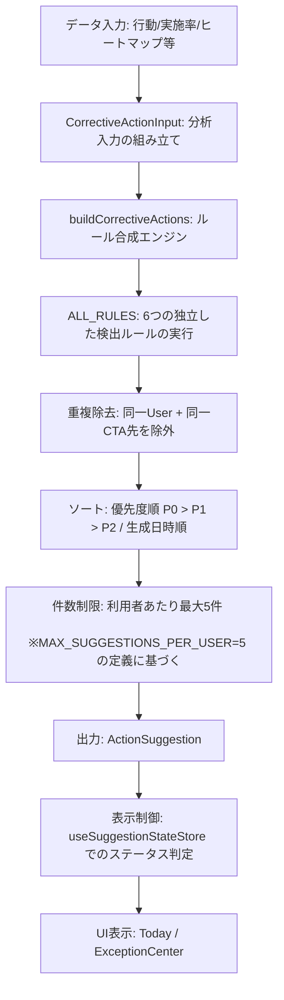
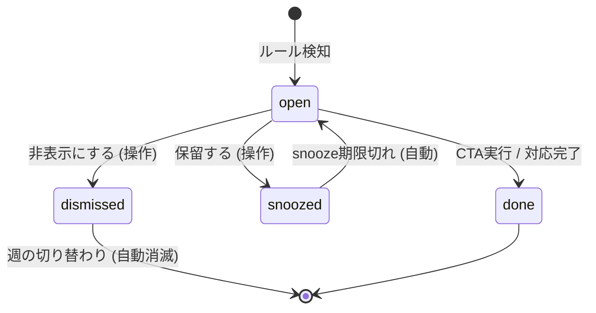

# Audit Management System MVP Action Engine Rule Catalog / Decision Support Logic Map

調査実施日: 2026年6月19日
対象コミット: `7dde895340c5a6914f2c12ecd858621d5821a105`

## 1. 調査目的
本ドキュメントは、Audit Management System MVP における業務支援（Decision Support）ロジックの全貌を明らかにすることを目的とします。
本システムは、行動記録やアセスメント、BIP（Behavior Intervention Plan）、日中の支援記録から「確認漏れ」「期限切れ」「傾向変化」などを検知し、職員に対して適切な確認や見直しを促します。
福祉・介護・医療情報を取り扱うシステムとしての「安全な設計境界」を明確化し、自動判断による誤診断や指示を避け、常に「人間の判断と介入（Human-in-the-loop）」を前提とした確認支援ロジックの仕様と動作基準を体系化します。

---

## 2. Action Engine の全体像
対象コミット時点のコード設計・実装上で確認できた範囲では、Action Engine は、日々の利用者の活動や行動データを基に、純粋関数（Pure Function）を用いて客観的な「修正提案（ActionSuggestion）」を自動計算するエンジンです。



### 提案生成における特性（コード実装に基づく仕様）
* **動的再計算**: `ActionSuggestion` はデータベースに常時固定保存されるものではなく、データ入力や画面表示のたびに最新状態から動的に再計算されます。これにより、データが更新されて条件を満たさなくなった提案は自動的に消滅します（Fail-Safe）。
* **状態（人の判断）の分離**: 動的再計算される「提案（ActionSuggestion）」とは別に、ユーザーが明示的に操作した結果（Snooze, Dismiss 等）は「判断状態（ActionSuggestionState）」として永続化（LocalStorage等）され、`stableId` (`${ruleId}:${userId}:${weekBucket}`) を介して紐付けられます。

---

## 3. ルールカテゴリ一覧
対象コミット時点のコード上で確認できた範囲では、Action Engine には以下の 6 つの検出ルール（`ALL_RULES`）が定義されており、これらを独立して並行実行し、該当する異常や確認ポイントを抽出します。

| # | ルール名 (ruleId) | 提案種別 | 優先度 | 主な目的 |
| :-: | :--- | :--- | :---: | :--- |
| 1 | **behavior-trend-increase** | `assessment_update` | P0 | 行動発生数の著しい増加（悪化傾向）の早期検知とアセスメント見直し喚起 |
| 2 | **low-execution-rate** | `bip_strategy_update` | P0 | 計画された支援手順が現場で実行されていない（乖離）ことの検知 |
| 3 | **high-intensity-cluster** | `plan_update` | P0 | 自傷や他害などの危険性の高い高強度行動の頻発に対する支援計画見直し推奨 |
| 4 | **time-concentration** | `plan_update` | P1 | 特定の時間帯における行動集中の検知と、環境・活動内容の見直し提案 |
| 5 | **missing-bip** | `new_bip_needed` | P1 | 行動記録が蓄積しているにもかかわらず、対応手順（BIP）が未策定であることの検知 |
| 6 | **data-insufficiency** | `data_collection` | P2 | 分析を行うのに十分なデータが記録されていない場合の追加記録入力の促進 |

---

## 4. 主要ルールカタログ（対象コミット時点の定義と閾値）

### Rule 1: 行動増加傾向 (`behavior-trend-increase`)
* **検知条件**:
  - 前期間の平均発生件数（`previousAvg`）が 0 を超える。
  - 直近7日間と前7日間の比較における変化率（`changeRate`）が **40%以上（1.4倍以上）** 増加している。
* **表示メッセージ**:
  - タイトル: `行動発生は要確認です`
  - 理由: `行動発生件数が前週比 {pctIncrease}% 増加しています。状況を要確認のうえ、アセスメントの見直しを推奨します。`
* **CTA（アクション誘導）**:
  - ラベル: `アセスメントを見直す`
  - 遷移先: `/assessment`

### Rule 2: 手順実施率低下 (`low-execution-rate`)
* **検知条件**:
  - 分析期間内にトリガーされた支援手順の総数（`execution.total`）が 1 以上。
  - 支援完了率（`completionRate`）が **60% 未満**。
* **表示メッセージ**:
  - タイトル: `手順実施率が低下しています`
  - 理由: `手順実施率が {completionRate}% に低下しています（閾値: 60%）。対応手順が現場で実行しにくい可能性があります。`
* **CTA（アクション誘導）**:
  - ラベル: `対応手順を見直す`
  - 遷移先: `/analysis/intervention`

### Rule 3: 高強度行動の集中 (`high-intensity-cluster`)
* **検知条件**:
  - 直近 7 日間に、**強度 4 以上** の行動（`highIntensityEvents`）が **3 回以上** 発生している。
* **表示メッセージ**:
  - タイトル: `高強度行動が頻発しています`
  - 理由: `直近7日間に強度4以上の行動が {eventsCount} 回発生しています。支援計画の見直しを強く推奨します。`
* **CTA（アクション誘導）**:
  - ラベル: `支援計画を確認する`
  - 遷移先: `/planning-sheet-list`

### Rule 4: 特定時間帯への集中 (`time-concentration`)
* **検知条件**:
  - ピーク時間帯（`heatmapPeak.hour`）のイベント発生数（`peakCount`）が 5 以上。
  - ピーク時間帯の占有率（`concentration`）が **40% 以上**。
* **表示メッセージ**:
  - タイトル: `{peakHour}時台に行動が集中`
  - 理由: `{peakHour}時台に全体の {pctConcentration}% の行動が集中しています。この時間帯の環境調整や活動内容の見直しを推奨します。`
* **CTA（アクション誘導）**:
  - ラベル: `時間帯別の支援を見直す`
  - 遷移先: `/planning-sheet-list`

### Rule 5: BIP 未作成 (`missing-bip`)
* **検知条件**:
  - 現在有効なアクティブ BIP 数（`activeBipCount`）が 0。
  - 分析対象期間内の総行動件数（`totalIncidents`）が **5 件以上**。
* **表示メッセージ**:
  - タイトル: `行動対応手順(BIP)が未作成です`
  - 理由: `行動記録が {totalIncidents} 件ありますが、対応手順(BIP)が作成されていません。一貫した対応を実現するために BIP の作成を推奨します。`
* **CTA（アクション誘導）**:
  - ラベル: `BIPを作成する`
  - 遷移先: `/analysis/intervention`

### Rule 6: データ不足 (`data-insufficiency`)
* **検知条件**:
  - 分析対象日数（`analysisDays`）が 14 日以上。
  - 期間内の総行動件数（`totalIncidents`）が 3 件未満。
  - 最終記録日（`lastRecordDate`）が未登録、または最終記録から **7 日以上** 経過。
* **表示メッセージ**:
  - タイトル: `行動記録データが不足しています`
  - 理由: `直近14日間の行動記録が {totalIncidents} 件のみです（最終記録: {lastDateLabel}）。正確な分析のためにデータ収集を推奨します。`
* **CTA（アクション誘導）**:
  - ラベル: `行動記録を入力する`
  - 遷移先: `/daily`

---

## 5. 入力データと依存ドメイン
対象コミット時点のコード設計に基づく観測では、Action Engine の入力値である `CorrectiveActionInput` は、ビューモデルまたはアプリケーション層で以下のドメインから集計されて渡されます。

* **Attendance (出欠ドメイン)**: 来所有無の判定に使用。来所しているが支援記録が存在しない状態の検知（「来所済み記録未入力」の警告ロジックへの入力）。
* **Daily / Vital (日中・バイタルドメイン)**: 日々の行動記録、強度、バイタルの異常値、最終入力日などの生データ。
* **Assessment / Planning (アセスメント・計画書ドメイン)**: アクティブな計画書（BIP等）の有無、作成経過日数の計測。

---

## 6. 提案表示・優先度・状態遷移
対象コミット時点のコード設計に基づく観測では、表示される提案は、利用者が下した判断ステータス（`SuggestionStatus`）に基づいてリアルタイムでフィルタリングされます。

### 1. 提案の状態
* `open`（未対応）: 条件合致時に画面に表示される初期状態。
* `dismissed`（却下）: 利用者が「不要」と判断した状態。以降、その週（`weekBucket`）の間は同じ提案が再表示されません。
* `snoozed`（保留）: 一時的に非表示にし、一定期間後に再表示させる状態。
* `done`（完了）: 提案に対する CTA 実行や対応が完了した状態。

### 2. 状態遷移ロジック


---

## 7. Snooze / Dismiss / Complete の扱い
対象コミット時点のコード上で確認できた範囲における保留（Snooze）および却下（Dismiss）は、過剰な通知によって現場職員が警告に慣れてしまう（アラート疲労）のを防ぐ重要な設計です。

### 1. Snooze プリセット (`computeSnoozeUntil`)
職員は、提案を以下のいずれかの期間保留できます。
* **明日まで (`tomorrow`)**: 翌日 00:00:00 (システム時間基準) まで非表示。
* **3日後まで (`three-days`)**: 72時間後まで非表示。
* **今週末まで (`end-of-week`)**: 当該週の日曜 23:59:59.999（月曜始まりの ISO week 基準）まで非表示。

### 2. Dismiss (非表示/却下)
* 却下時には、安定ID（`stableId`）を用いて操作を LocalStorage に記憶。
* `toWeekBucket` ユーティリティにより、同一週（`YYYY-Www`）の間は再検知されても表示を抑制。翌週になると自動的にクリアされ、状態が継続している場合は再提示されます。

### 3. Suggestion から Task への昇格 (Promotion)
提案を一時的な「通知」から、恒久的な「実行ToDo」へと昇格させたものを `ActionTask` と呼びます。
`ActionTask` に昇格されると、一意な `taskId` (UUID) が付与され、実行ステータス（`open`, `in_progress`, `done`, `dismissed`）、実施期限（`dueDate`）、承認者（`approvedBy`）などがデータベース上に永続保存されます。

---

## 8. Telemetry と効果測定
対象コミット時点の観測ベースでは、Action Engine および Suggestions の利用実態や改善効果を客観的に計測するため、Firebase Firestore 上の `telemetry` コレクションへライフサイクルイベントを送信しています。

### 主要テレメトリイベント
* `suggestion_shown`: 提案が画面に描画されたタイミングで記録。
* `suggestion_cta_clicked`: 提案の CTA ボタン（例: 「アセスメントを見直す」）がクリックされた際に記録。
* `suggestion_deep_link_arrived`: CTA 遷移によるディープリンク到達時に記録。
* `suggestion_dismissed`: 職員が提案を「非表示（却下）」にした際に記録。
* `suggestion_snoozed`: 職員が提案を保留（Snooze）にした際に記録（プリセット種別、解除日時を付与）。
* `suggestion_resurfaced`: Snooze 期間が明け、提案が再浮上して表示された際に記録。

---

## 9. 安全上の注意点 (Critical Safety Boundaries)

福祉・介護の業務・監査および医療的判断に関わる機能として、対象コミット時点のコード上で確認できた範囲では、Action Engine および Record Quality 判定には以下の安全制約（Safety Guard）が厳密に適用されています。

### 1. 記録品質レビューの安全宣言 (`RECORD_QUALITY_REVIEW_SAFETY_METADATA`)
支援記録の記述品質を判定する機能（Record Quality Review）は、常に以下の制約事項を安全メタデータとして明示的に保持しています。
```typescript
export const RECORD_QUALITY_REVIEW_SAFETY_METADATA = {
  sourceOfTruth: 'original-support-record', // 原本データは支援記録であり、分析結果が原本を上書きしてはならない
  outputKind: 'review-metadata',            // 出力はあくまでレビューの「付帯データ(メタデータ)」に過ぎない
  requiresHumanReview: true,                // 外部提示や実行には、必ず人間のレビューと承認が必要
  suggestionsOnly: true,                    // システムからの出力は「提案」に限定される
  prohibitedActions: [
    'diagnoseUsers',                        // 利用者の病名・障害をシステムで診断してはならない
    'judgeBehavior',                        // 本人の行動の善悪や問題性をシステムが決めつけてはならない
    'overwriteOriginalRecord',              // 現場が入力した支援記録の本文をシステムが直接改ざん・上書きしてはならない
    'automaticallyDetermineSupportPolicy',  // 今後の支援方針をシステムが自動で確定させてはならない
    'shareWithoutHumanApproval'             // 人間の承認なしに、外部（監査機関や保護者など）に自動送信してはならない
  ]
};
```

### 2. ドメイン推論における禁止事項 (`doNotInfer`)
カテゴリ判定ロジックにおいて、キーワードによる機械的な紐付けの際、システムが過剰な解釈をしないための制約がドメイン別に定義されています。

* **体調・服薬 (`healthPhysicalCondition`)**: 病名をシステムが勝手に決めつけない、痛みの原因を断定しない、医療的な判断（例: 「要受診」など）を下さない。
* **食事・水分 (`mealsHydration`)**: 食欲不振や残食の理由（好き嫌いなど）をシステムで推測・決定しない、栄養状態そのものを判断しない。
* **排泄 (`toileting`)**: 失禁や失敗の原因を断定しない、支援内容（排泄誘導の間隔変更など）をシステムだけで決定しない。
* **睡眠・疲労 (`sleepFatigue`)**: 睡眠不足の原因を決めつけない、眠気などを単純な「意欲の低下」としてラベル付けして固定化しない。
* **感情・不安 (`emotionAnxietyRegulation`)**: 不安や大声の原因・感情の理由をシステムが決めつけない、利用者の「性格・特性」として誤って固定化しない。
* **支援内容 (`staffSupportActions`)**: 職員が行った対応の「良し悪し」をシステムが絶対的に評価・ジャッジしない（職員評価にテレメトリを使用しない）。

### 3. 不足情報ヒント (`classifyRecordQuality`)
支援記録の本文（午前・午後の活動、特記、食事量等）をセルフレビューする際、以下の観点に該当するキーワードが含まれているかを機械的にスキャンし、不足を注意喚起します。
特に「あいまいな表現の具体化（`concreteVagueExpression`）」では、「不安定」「いつも通り」「拒否」「パニック」「問題なし」などの言葉が記載されている場合、具体的な状況（何があったのか）を追記するよう職員に確認を促します。

---

## 10. 今後の改善ロードマップ (Next Small PRs)

1. **`test: add-rule-pure-unit-tests` (小規模)**
   * **目的**: 6つのルールの純粋関数に対し、境界値（例: 手順実施率が 59.9% の時、60.0% の時）における挙動を完全にカバーする Vitest 単体テストを追加し、回帰を防ぐ。
2. **`ui: refine-snooze-dismiss-feedback` (中規模)**
   * **目的**: Suggestion 画面で「非表示（Dismiss）」にした際、「どのような理由で不要と判断したか（例: アセスメント修正済み、一時的な変動）」の選択肢を入力できるようにし、今後のルールモデル適合度評価に活用する。
3. **`ops: enforce-record-quality-safety-telemetry` (小規模)**
   * **目的**: 職員が記録品質レビューを「破棄（Discard）」または「採用（Accept）」した際のアクションに対しても、安全指針（Prohibited Actions）への違反がなかったかを観測するためのテレメトリイベントを追加する。
