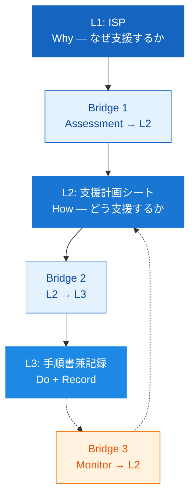
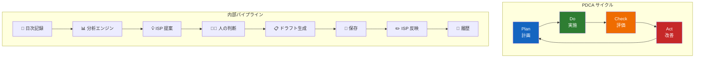
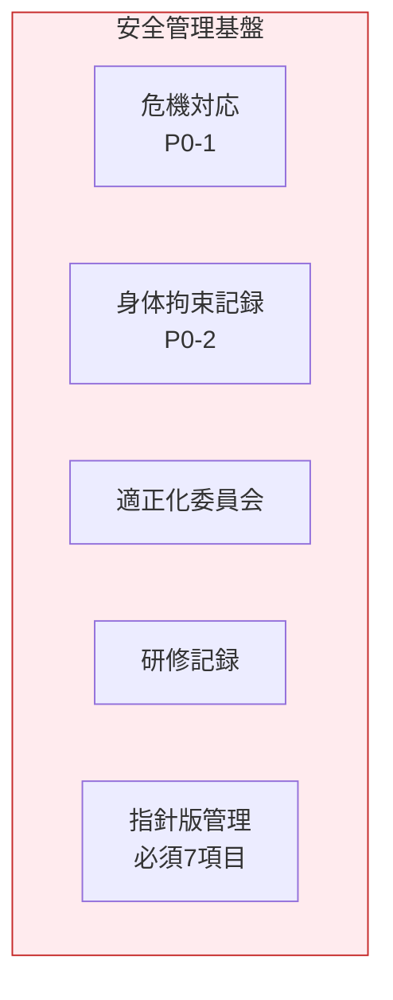
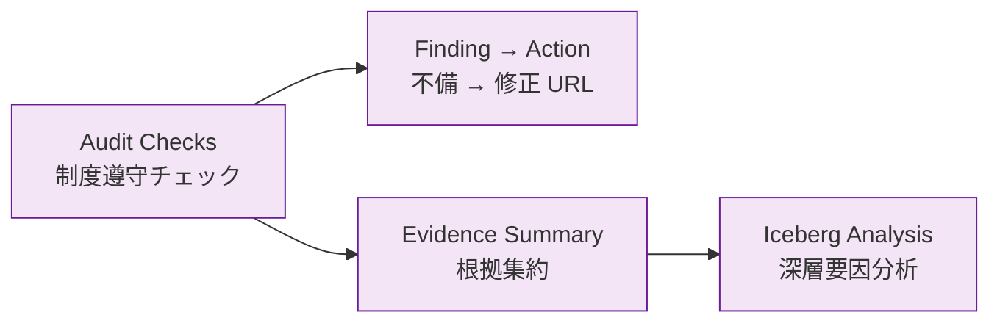

# ISP-Driven Support Operations Model — 読み解きガイド

> **Support Operations OS の全体アーキテクチャ図を「読む」ためのガイド**

<p align="center">
  
</p>

> この図の正式名称は **ISP-Driven Support Operations Model** です。
> ISP（個別支援計画）を起点に、支援業務の全体を PDCA として回す業務 OS の設計図です。

---

## この図の読み方

この図は **3つの軸** で読めます。

| 軸 | 方向 | 意味 |
|---|---|---|
| **縦軸** | 上 → 下 | 意味 → 操作（抽象 → 具体） |
| **横軸** | 左 → 右 | 設計 → 評価（作る → 守る） |
| **深度** | 外側 → 内側 | 原則 → 実装 |

```
上：業務の「意味」（ISP、PDCA、監査）
下：業務の「操作」（画面、インフラ）

左：支援を「設計する」（ISP 三層）
中：支援を「回す」（PDCA エンジン）
右：支援を「守る」（Safety + Regulatory）
```

---

## 1. ISP 三層モデル（左カラム）



### なぜ「三層」なのか

福祉現場の最大の混乱は **L2（支援方法）と L3（日々の手順）が混ざること** です。

| よくある問題 | 三層モデルでの解決 |
|---|---|
| 「なぜこの支援をするのか」が伝わらない | L1 に目的を明示 |
| 支援方針と手順書が同じファイル | L2 と L3 を明確に分離 |
| モニタリング結果が計画に反映されない | Bridge 3 で自動追記 + 候補提示 |

### 三ブリッジの意味

ブリッジは **層と層をつなぐ変換器** です。

| Bridge | 変換内容 | 特徴 |
|---|---|---|
| **Bridge 1** | アセスメント → 支援計画シート | ICF 分類 + 特性アンケートを自動マッピング |
| **Bridge 2** | 支援計画シート → 手順書 | 支援方針・具体的対応を手順ステップに変換 |
| **Bridge 3** | モニタリング → 支援計画シート | 評価結果を自動追記 + チェックボックス候補提示 |

> **重要**: Bridge 3 は upward（下層 → 上層）に向かう唯一のブリッジです。
> これが PDCA の **Act（改善）** にあたります。

---

## 2. 支援 PDCA エンジン（中央）



### なぜ中央にあるのか

PDCA エンジンは **ISP 三層モデルと Safety / Regulatory をつなぐハブ** です。

```
ISP 三層（設計する）
    ↓ ↑
PDCA エンジン（回す）
    ↓ ↑
Safety / Regulatory（守る）
```

### 8 ステップの意味

| # | ステップ | PDCA 位置 | 誰が |
|---|---|---|---|
| ① | 日次記録 | Do | 支援員 |
| ② | 分析エンジン | Check | システム |
| ③ | ISP 提案 | Check → Act | システム |
| ④ | 人の判断 | Act | サビ管 |
| ⑤ | ドラフト生成 | Act → Plan | システム |
| ⑥ | 保存 | — | システム |
| ⑦ | ISP 反映 | Plan | 支援員 |
| ⑧ | 履歴 | — | 全員 |

> **最重要設計判断**: ④「人の判断」がパイプラインの中央にあること。
> システムは提案するが、**最終判断は常に人間** です。

---

## 3. 安全管理基盤（右上）



### なぜ PDCA と分離しているのか

安全管理は **日常業務の PDCA とは異なるライフサイクル** を持ちます。

| 特徴 | PDCA エンジン | 安全管理 |
|---|---|---|
| 頻度 | 日次〜月次 | 事象発生時 + 定期 |
| 判断者 | サビ管 + 支援員 | 管理者 + 委員会 |
| 制度要件 | ISP 更新ルール | 虐待防止法 + 運営基準 |
| 記録の性質 | 支援改善の記録 | 法的義務の記録 |

分離することで、**支援記録に安全管理の複雑さが混入しない** 設計になっています。

---

## 4. 制度遵守 Regulatory（右下）



### なぜ独立サブシステムなのか

制度遵守チェックは **他のサブシステムを横断的に「読む」** 機能です。

```
ISP データ ─────────┐
日次記録 ────────────├──→ Regulatory Engine ──→ Finding
安全管理データ ──────┤                           ↓
職員資格データ ──────┘                       Action URL
```

**読み取り専用** で他サブシステムのデータを参照し、制度上の不備を検出します。

---

## 5. 日常運用画面（下部）

| 画面 | 目的 | 表示するデータ |
|---|---|---|
| **Today** `/today` | 今日やるべきこと | 次のアクション + フェーズインジケータ |
| **Dashboard** `/dash` | 全体俯瞰 | 統計 + アラート |
| **Handoff** `/handoff` | 申し送り | タイムライン + メモ |
| **Schedule** `/schedules` | 予定管理 | カレンダー + アラート |
| **Daily** `/daily` | 日次記録入力 | 支援記録フォーム + 行動タグ |

### なぜ最下層なのか

これらは業務 OS の **UI レイヤ** です。

```
意味（上）: なぜこの支援をするのか → ISP
判断（中）: いつ見直すか → PDCA エンジン
操作（下）: 日々何をするか → 運用画面
```

上から下への一方向ではなく、Daily の記録が PDCA エンジンに流れ、分析されて上層に戻ります。

---

## 6. インフラ層

```
┌─────────────────────┬─────────────────────────────┬──────────────────────┐
│ React 18 + TS + MUI │ SharePoint Online REST API  │ MSAL + GitHub Actions│
└─────────────────────┴─────────────────────────────┴──────────────────────┘
                              │
               ┌──────────────┼──────────────┐
               │              │              │
          LocalStorage    SharePoint     InMemory
           (開発)          (本番)        (テスト)
```

**Ports & Adapters パターン** により、データストアを差し替え可能。
開発時は LocalStorage/InMemory、本番は SharePoint Online。

---

## 7. 設計原則バッジ（右マージン）

| バッジ | 意味 | 実装箇所 |
|---|---|---|
| **DDD** | Domain 層は純粋関数のみ | `features/*/domain/` |
| **Snapshot 設計** | 判断時点を凍結保存 | `RecommendationSnapshot` |
| **追記型イミュータブル** | レコードを上書きしない | 判断履歴 + ドラフト履歴 |
| **Provenance 追跡** | 全フィールドの出典を記録 | `ProvenanceEntry` |
| **Ports & Adapters** | インフラ差し替え可能 | Repository パターン |

---

## この図が答える問い

| 問い | 答えの場所 |
|---|---|
| このシステムは何？ | タイトル + サブタイトル |
| 支援の設計はどうなっている？ | ISP 三層モデル（左） |
| 改善はどう回る？ | PDCA エンジン（中央） |
| 安全はどう守る？ | Safety 基盤（右上） |
| 制度遵守はどう確認する？ | Regulatory（右下） |
| 日々何を使う？ | 日常運用画面（下） |
| 技術は何？ | インフラ層（最下） |
| 設計思想は？ | 設計原則バッジ（右） |

---

## 関連ドキュメント

| ドキュメント | 内容 |
|---|---|
| [1 ページ概要](support-pdca-engine-overview.md) | README / プレゼン向け凝縮版 |
| [完全アーキテクチャ図](system-architecture-complete.md) | ISP 三層 + ブリッジの技術詳細 |
| [支援 PDCA エンジン](support-pdca-engine.md) | モニタリング分析の技術詳細 |
| [業務モデル・運用設計](../operations/operating-model.md) | ロール・フロー・障害対応 |
