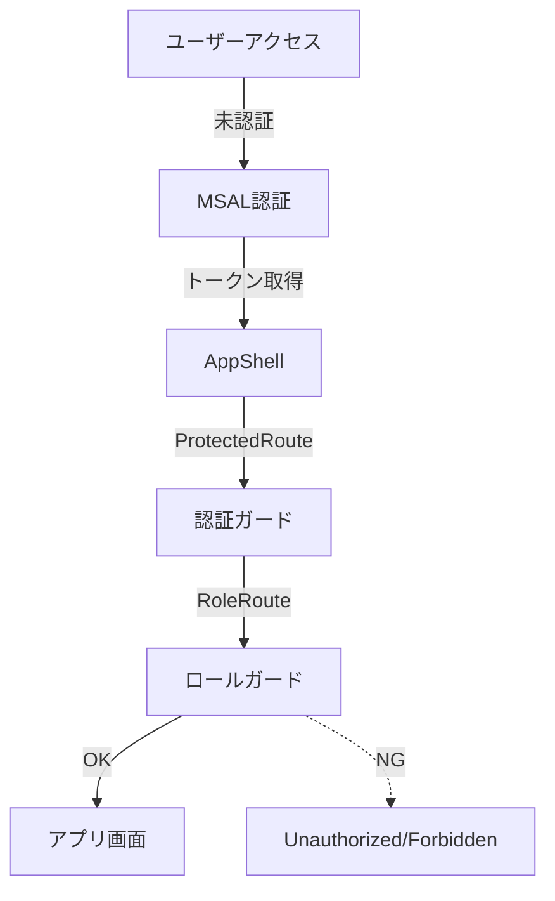

# Auth Flow（認証・権限制御フロー）

本システムは MSAL (Microsoft Authentication Library) を用いた Azure AD 認証と、アプリ内ロール（Staff/Admin/Viewer）によるガードを組み合わせています。

---

## 構成図（Mermaid）

---

## ガード順序
1. **MSAL認証**：未認証ならログイン画面へリダイレクト
2. **ProtectedRoute**：トークン有無でアクセス制御
3. **RoleRoute**：ロール（Staff/Admin/Viewer）で画面到達可否を判定
4. **AppShell**：全体レイアウト・ナビゲーション

---

## ロールごとの到達範囲
| 画面/機能         | Admin | Staff | Viewer |
|-------------------|:-----:|:-----:|:------:|
| ダッシュボード    |   ○   |   ○   |   △    |
| 日次記録          |   ○   |   ○   |   ×    |
| 支援計画          |   ○   |   ○   |   ×    |
| 管理者設定        |   ○   |   ×   |   ×    |

- △: 閲覧のみ
- ×: 到達不可

---

## テスト観点
- 未認証時は必ずMSALログイン画面に遷移すること
- ロールごとに到達可否が正しいこと（E2E/ユニットで担保）
- トークン失効時は再認証が発生すること
