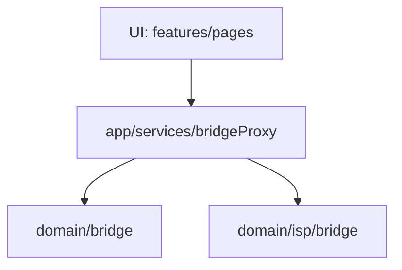

# Bridge 境界ルール (Bridge Boundary Rules)

## 目的
Bridge は「ドメイン間の複雑な相互作用」や「ドメインを跨いだ集計・変換」を扱う低レベルなレイヤーです。
UI層（`features`, `pages`）が Bridge に直接依存すると、Bridge 側のリファクタリングが UI に波及し、保守性が著しく低下します。

この境界ルールは、**「Bridge を専売公社化（Proxy 経由のみ許可）」**することで、UI と Bridge の結合度を下げることを目的としています。

---

## 基本原則
UI (`features/*`, `pages/*`) は、`domain/bridge/*` を直接 import してはなりません。

### 許可される依存方向


- **UI層**: `bridgeProxy.ts` もしくは専用の `useXXXBridge()` フックのみを参照する。
- **Proxy層**: Bridge の関数をラップし、型定義を UI 向けにエクスポートする。
- **Bridge層**: 業務ロジックの集約・変換を行う。UI については関知しない。

---

## 運用ルール

### 1. 参照の分類と対応方針
Bridge 関連の参照は以下の3類型に分類し、それぞれのルールに従います。

- **A. bridgeProxy への移管 (推奨)**: 
  ドメインロジックのみを呼び出す箇所。`bridgeProxy.ts` に関数を追加し、そちらを経由します。
- **B. Feature Adapter (許容)**: 
  UI近傍での入出力整形（ViewModelへの変換など）を含む箇所。`features/*/planningToRecordBridge.ts` のようなファイルとして残せますが、**domain bridge を直接呼ばず bridgeProxy を経由** しなければなりません。
- **C. Legacy Shim (一時許容)**: 
  依存範囲が広く、即時の移管が困難な箇所。`bridgeProxy.ts` 内に `shim` コメント付きで配置し、将来的な廃止対象（バックログ）として扱います。

### 2. 禁止事項
以下の import を UI (components, hooks, pages) で行うことは禁止です（ESLint `no-restricted-imports` で強制）。
- `@/domain/bridge/**` (bridgeProxy 以外から)
- `@/domain/isp/bridge/**` (bridgeProxy 以外から)
- `@/features/bridge/**` (もし存在する場合)

### 3. 新機能追加時の手順
1. **Bridge 実装**: `src/domain/bridge/` 等にロジックを実装。
2. **Proxy 追加**: `src/app/services/bridgeProxy.ts` にラップ関数を追加。
3. **UI / Feature から利用**: `import { ... } from '@/app/services/bridgeProxy'` として呼び出す。

### 4. eslint 例外の扱い
`.eslintrc.cjs` にて一部のファイルが例外として許可されている場合があります。これらは「移行中の残置物」であり、新規に追加してはなりません。もし見つけた場合は、将来の負債として Proxy への移行を検討してください。

---

## 既存の正解例（Reference）

以下の機能は既に Bridge デカップリングが完了しています。実装時の参考にしてください。

- **個別支援計画画面 (`support-planning-sheet`)**
  - Workflow Assessment への疎通を `bridgeProxy` 経由で実施。
- **Today画面 (`today`)**
  - 手順変換ロジックを Proxy 経由で取得。
- **モニタリング画面 (`monitoring`)**
  - 会議記録の下書き生成や ABC 分析の集計を Proxy 経由で実施。
- **PDCAサイクル (`pdca`)**
  - サイクル状態の判定を Proxy 経由で実施。

---

## ESLint Guardrail について
`.eslintrc.cjs` の以下の設定により、誤った依存を検知します。

```javascript
{
  files: ['src/pages/**', 'src/features/**/components/**', 'src/features/**/hooks/**', 'src/app/**'],
  rules: {
    'no-restricted-imports': [
      'error',
      {
        patterns: [{
          group: ['@/domain/bridge/**', '@/domain/isp/bridge/**'],
          message: 'UI layer must not import Bridge directly. Use bridgeProxy instead.'
        }]
      }
    ]
  }
}
```

---

## 将来の展望と責務分割方針

### 現時点の判断
`bridgeProxy.ts` は現在約150行程度であり、ファイル分割によるコードジャンプのオーバーヘッドを避けるため、**現時点では単一ファイルでの維持**を推奨します。ただし、将来的な責務増大に備え、ファイル内を関心事ごとに整理（Region分け）済みです。

### 分割の基準
以下のいずれか、または両方を満たした場合に物理的なファイル分割を検討してください。
1. `bridgeProxy.ts` が 500行を超えた場合。
2. 特定のドメイン（例: Monitoring）の関数が多数追加され、他ドメインのコードを阻害し始めた場合。

### 分割後の構成イメージ
分割が必要になった際は、以下の命名規則に従いサービスを切り出します。
- `bridgeWorkflowService.ts`: 計画策定フロー、アセスメント、状態判定
- `bridgeMonitoringService.ts`: 証跡生成、ABC分析集計
- `bridgePlanningService.ts`: PDCAサイクル、ドメイン間変換（Monitoring -> Planning 等）

---

## 補足
もし `src/domain/bridge` 以外で UI からの直接importを制限すべき境界が見つかった場合は、同様の手順（Proxy化＋ESLint設定）で境界を保護してください。
