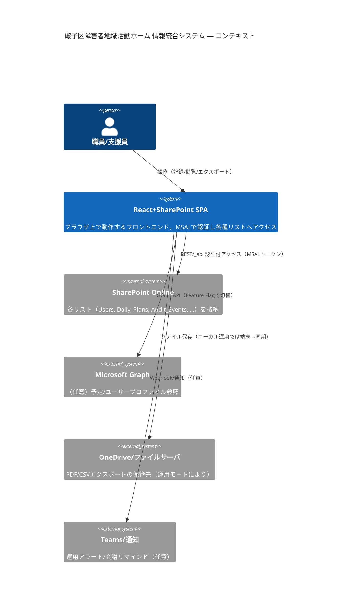
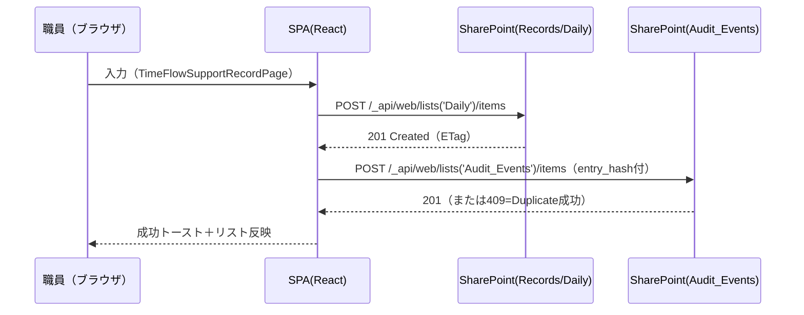
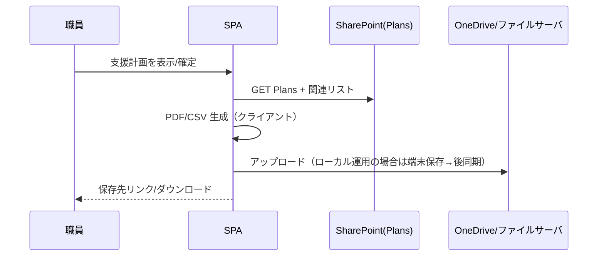
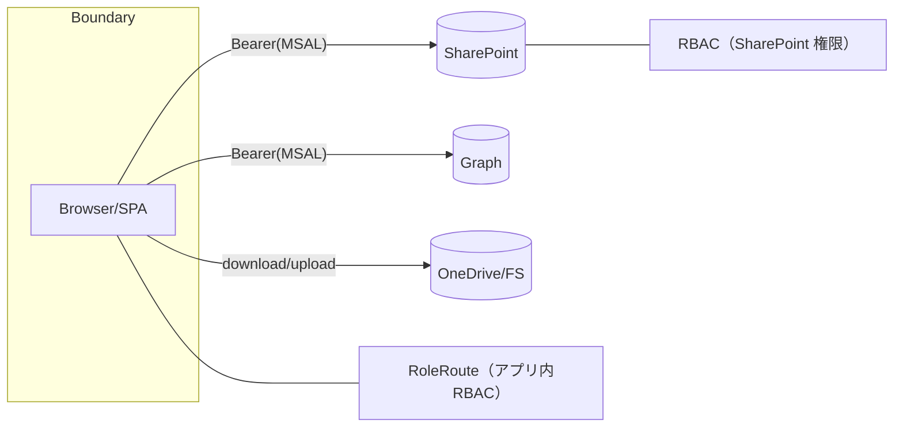

# 目的
- システム内外の**データの流れと保管先**を可視化し、設計・運用・監査・セキュリティ対応を一枚で共有する。
- **責務とインターフェイス**を明確化し、変更時の影響範囲を素早く把握する。

---

# 1) コンテキスト（System Context）



---

# 2) データフロー（主要ユースケース）

## 2.1 日次記録（作成/更新）



## 2.2 監査ログの一括同期（$batch）

```mermaid
flowchart LR
  A[ローカル監査バッファ] --> B[100件チャンク化]
  B --> C[POST _api/$batch (changeset)]
  C --> D[multipart解析→Content-ID集計]
  D --> E{全件成功? (201/409)}
  E -- Yes --> F[ローカル監査クリア]
  E -- No --> G[失敗のみ再送キュー]
  D --> H[UI: audit-metrics (new/duplicates/failed/duration)]
```

## 2.3 支援計画 → PDF/CSV エクスポート



---

# 3) データ分類と格納先

| データ種別 | 例 | 重要度 | 主格納 | 二次格納/出力 | 備考 |
|---|---|---|---|---|---|
| 利用者マスタ | Users_Master | 高 | SharePoint | CSV出力 | 個人情報。閲覧権限はRBAC |
| 日次記録 | SupportRecord_Daily | 高 | SharePoint | PDF/CSV | 記録の真正性（監査対象） |
| 支援計画 | Plans/Goals | 高 | SharePoint | PDF | 版管理・承認ワークフロー |
| 監査ログ | Audit_Events | 中 | SharePoint | CSV | entry_hash で冪等性 |
| 統計/集計 | progress.ts 生成値 | 低 | 非永続（UI） | なし | 必要ならCSV出力 |
| 予定 | Graph Events | 中 | Graph | なし | Feature Flag で参照のみ |

---

# 4) 保持・廃棄ポリシー（ドラフト）

詳細は docs/compliance/checklist.md を優先

| データ | 最低保持目安 | 廃棄タイミング | 補足 |
|---|---|---|---|
| 日次記録 | 5年（自治体規程に準拠） | 期末+N年 | 監査終了後も一定期間保持 |
| 支援計画 | 最終更新+5年 | 期末+N年 | PDF版を証跡として保持 |
| 監査ログ | 3年 | ローテーション | CSVエクスポートでバックアップ |
| 監査レポート | 5年 | 期末+N年 | Releases/metrics と紐付け |

---

# 5) インターフェイス一覧

| IF | 種別 | 経路 | 認証 | 備考 |
|---|---|---|---|---|
| SPO REST | HTTPS | _api/web/... | MSAL (Bearer) | リトライ/ETag/SWR 対応 |
| Graph | HTTPS | /v1.0/... | MSAL (Bearer) | 予定/ユーザー情報 |
| Export | File | ブラウザDL or OneDrive | ブラウザ権限 | PDF/CSV |
| Teams通知 | HTTPS | Incoming Webhook | 共有秘密 | 任意機能（Feature Flag） |

---

# 6) エラー/可用性設計（要点）
- 429/503/504: 指数バックオフ + jitter、Retry-After 優先
- 409(Duplicate): 成功扱い（entry_hash一意）
- $batch: 成功/重複/失敗を Content-ID で厳密集計、失敗のみ再送
- SWR: GET の再検証に ETag を活用（VITE_SP_GET_SWR=1）
- ローカル運用モード: オフライン継続→復帰時一括同期（記録の消失防止）

---

# 7) セキュリティ境界（抜粋）



- 二重のRBAC: アプリ内（RoleRoute）＋SharePoint権限（最小権限）
- 機密データは外部へ送らない（クライアントのみでPDF/CSV生成、外部API送信はしない）
- 詳細は docs/security/policy.md, docs/architecture/threat-model.md 参照

---

# 8) 変更影響の見積り（ガイド）

| 変更 | 影響範囲 | 推奨テスト |
|---|---|---|
| リストスキーマ増減 | SPO REST, 監査, Export | Unit（DTO/型）+ E2E 到達 |
| 認証スコープ変更 | MSAL, RoleRoute | auth-flow E2E + RBAC表 |
| バッチサイズ変更 | 監査メトリクス, 所要時間 | 監査E2E（整合&duration） |
| Feature Flag追加 | ルート/ナビ | 直リンクE2E + 旗OFF時退避 |

---

# 9) 参照
- docs/architecture/system-map.md
- docs/architecture/auth-flow.md, docs/architecture/rbac.md
- docs/metrics/audit-observability.md
- docs/ops/runbook.md, docs/ops/faq.md
- docs/security/policy.md
