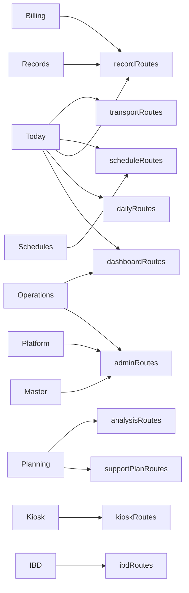
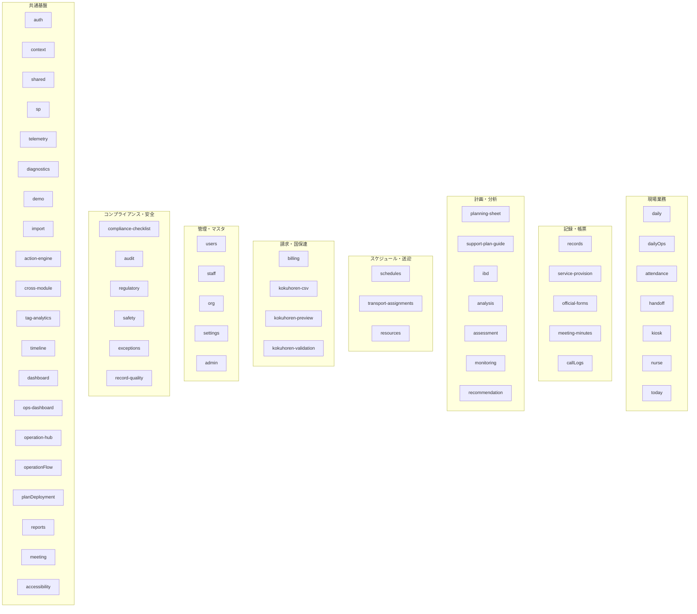

# Frontend Feature Inventory

> フロントエンド機能棚卸レポート — 業務機能の実装状態・データ連携・成熟度を整理する

- **調査対象コミット**: `c406bc5f7eb37ed21abd1b6ba72cffc52744ff72`
- **調査日**: 2026-06-19
- **補完ドキュメント**: `docs/architecture/frontend-structure.md`（構造レポート）

---

## 第1章 調査の目的と位置づけ

本レポートは、`frontend-structure.md`（構造レポート）の補完として、**業務機能の実装状態**を整理する。

```
frontend-structure.md   → アプリの構造・ルーティング・レイヤー・Provider・設計方針
feature-inventory.md    → 画面・業務機能・実装状態・データ連携・テスト・未完成領域の棚卸
```

### 想定読者

- 新規参画の開発者が「何がどこまで動くか」を把握する
- プロダクトオーナーが実装進捗を確認する
- 監査担当者が業務機能の網羅性を検証する

---

## 第2章 Hub 構成と業務ドメインのマッピング

アプリケーションは **8つの Hub** を最上位の情報設計（IA）として採用している。
各 Hub はナビゲーションの単位であり、業務ドメインの入口として機能する。

### 2.1 Hub 一覧

| # | Hub ID | 表示名 | 目的 | 最低ロール | スタンドアロン |
|---|--------|--------|------|-----------|--------------|
| 1 | `today` | Today | 今やることを確認する | viewer | No |
| 2 | `schedules` | Schedules | 予定を確認・調整する | viewer | No |
| 3 | `records` | Records | 記録を書く・確認する | viewer | No |
| 4 | `planning` | Planning | 計画を作成・見直しする | viewer | Yes |
| 5 | `operations` | Operations | 運営状況を把握・調整する | viewer | Yes |
| 6 | `billing` | Billing | 請求・精算を行う | reception | No |
| 7 | `master` | Master | マスタ情報を管理する | reception | Yes |
| 8 | `platform` | Platform | システム設定と運用基盤を扱う | admin | Yes |
| — | `severe` | Intensive Support | 強度行動障害支援の計画と分析 | viewer | Yes |

> **補足**: `severe` Hub は特定の重度支援ドメイン向け。既存の planning/analysis 機能への別動線を提供する。

### 2.2 Hub → ルートグループの対応



---

## 第3章 ルートグループ別の機能マッピング

### 3.1 dashboardRoutes

| ルートパス | 画面名 | 主なコンポーネント | 権限 |
|-----------|--------|-------------------|------|
| `/` | ルートリダイレクト | `DashboardRedirect` | viewer |
| `/dashboard` | ダッシュボード | `StaffDashboardPage` | viewer |
| `/dashboard/briefing` | ブリーフィング | `DashboardBriefingPage` | viewer |
| `/today` | 今日の業務 | `TodayOpsPage_v3` | viewer + `todayOps` flag |
| `/room-management` | お部屋管理 | `RoomManagementPage` | viewer |
| `/meeting-guide` | 会議ガイド | `MeetingGuidePage` | viewer |
| `/compliance` | コンプラ報告 | プレースホルダ | viewer |
| `/ops` | 運用メトリクス | `OpsMetricsPage` | viewer + AdminSurface |

### 3.2 dailyRoutes

| ルートパス | 画面名 | 主なコンポーネント | 権限 |
|-----------|--------|-------------------|------|
| `/daily` | リダイレクト → `/dailysupport` | — | viewer |
| `/dailysupport` | 日々の記録メニュー | `DailyRecordMenuPage` | viewer |
| `/daily/table` | 一覧形式の日々の記録 | `TableDailyRecordPage` | viewer |
| `/daily/activity` | 活動記録 | `DailyRecordPage` | viewer |
| `/daily/attendance` | 通所管理 | `AttendanceRecordPage` | viewer |
| `/daily/support` | 時間別支援記録 | `TimeBasedSupportRecordPage` | viewer |
| `/daily/support-checklist` | 支援チェックリスト | `TimeFlowSupportRecordPage` | viewer |
| `/daily/health` | 健康観察 | `HealthObservationPage` | viewer |

### 3.3 recordRoutes

| ルートパス | 画面名 | 主なコンポーネント | 権限 |
|-----------|--------|-------------------|------|
| `/records` | 記録一覧 | `RecordList` | viewer |
| `/records/monthly` | 月次サマリー | `MonthlyRecordPage` | reception |
| `/records/journal` | 業務日誌プレビュー | `BusinessJournalPreviewPage` | reception |
| `/records/journal/personal` | 個人月次業務日誌 | `PersonalJournalPage` | reception |
| `/records/service-provision` | サービス提供実績記録 | `ServiceProvisionFormPage` | reception |
| `/records/quality-review` | 記録品質レビュー | `RecordQualityHumanReviewPage` | viewer |
| `/billing` | 請求処理 | `BillingPage` | reception |
| `/handoff-timeline` | 申し送りタイムライン | `HandoffTimelinePage` | viewer |
| `/handoff-analysis` | 申し送り分析 | `HandoffAnalysisPage` | viewer + AdminSurface |
| `/meeting-minutes/*` | 議事録（CRUD） | `MeetingMinutesRoutes` | viewer |

### 3.4 scheduleRoutes

| ルートパス | 画面名 | 主なコンポーネント | 権限 |
|-----------|--------|-------------------|------|
| `/schedules/week` | 週間予定 | `NewSchedulesWeekPage` | viewer + `schedules` flag |
| `/schedules/day` | 日別（リダイレクト） | `SchedulesDayRedirect` | viewer + `schedules` flag |
| `/schedules/month` | 月別（リダイレクト） | `SchedulesMonthRedirect` | viewer + `schedules` flag |
| `/schedules/timeline` | タイムライン（リダイレクト） | `SchedulesTimelineRedirect` | viewer + `schedules` flag |
| `/schedule`, `/schedule/*` | レガシーリダイレクト | `Navigate → /schedules/week` | viewer + `schedules` flag |

### 3.5 supportPlanRoutes

| ルートパス | 画面名 | 主なコンポーネント | 権限 |
|-----------|--------|-------------------|------|
| `/support-plan-guide` | 個別支援計画 | `SupportPlanGuidePage` | viewer |
| `/isp-editor` | ISP比較エディタ | `ISPComparisonEditorPage` | admin |
| `/isp-editor/:userId` | ISP比較エディタ（ユーザー指定） | `ISPComparisonEditorPage` | admin |
| `/support-planning-sheet/:id` | 支援計画シート | `SupportPlanningSheetPage` | viewer |
| `/planning-sheet-list` | 支援計画シート一覧 | `PlanningSheetListPage` | viewer |
| `/abc-record` | ABC行動記録 | `AbcRecordPage` | viewer |
| `/monitoring-meeting/:userId` | モニタリング会議記録 | `MonitoringMeetingRecordPage` | viewer |

### 3.6 analysisRoutes

| ルートパス | 画面名 | 主なコンポーネント | 権限 |
|-----------|--------|-------------------|------|
| `/analysis/dashboard` | 行動分析ダッシュボード | `AnalysisDashboardPage` | viewer + AdminSurface |
| `/analysis/iceberg-pdca` | 氷山PDCA | `IcebergPdcaPage` + `IcebergPdcaGate` | viewer + AdminSurface |
| `/analysis/iceberg` | 氷山分析ワークスペース | `IcebergAnalysisPage` | viewer + AdminSurface |
| `/analysis/intervention` | 行動対応プラン | `InterventionDashboardPage` | viewer + AdminSurface |
| `/assessment` | アセスメント管理 | `AssessmentDashboardPage` | viewer |
| `/survey/tokusei` | 特性アンケート結果 | `TokuseiSurveyResultsPage` | admin |
| `/support-review` | 支援の確認・見直しハブ | `SupportReviewHubPage` | viewer |

### 3.7 adminRoutes（主要抜粋）

| ルートパス | 画面名 | 権限 |
|-----------|--------|------|
| `/admin` | 管理ツールハブ | admin |
| `/admin/dashboard` | 管理ダッシュボード | admin |
| `/checklist` | 自己点検 | admin |
| `/audit` | 監査ログ | admin |
| `/users`, `/users/:userId` | 利用者管理 | reception |
| `/staff`, `/staff/attendance` | 職員管理・勤怠入力 | admin / reception |
| `/admin/templates` | 支援活動テンプレート管理 | admin |
| `/admin/step-templates` | 支援手順テンプレート管理 | admin |
| `/admin/individual-support/:userCode?` | 個別支援手順管理 | admin |
| `/admin/staff-attendance` | 職員勤怠管理 | reception |
| `/admin/integrated-resource-calendar` | 統合リソースカレンダー | admin + `schedules` flag |
| `/admin/regulatory-dashboard` | 制度遵守ダッシュボード | admin |
| `/admin/compliance-dashboard` | 適正化運用ダッシュボード | admin |
| `/admin/exception-center` | 例外センター | admin |
| `/admin/telemetry` | テレメトリダッシュボード | admin |
| `/admin/status` | 環境診断 | admin |
| `/admin/csv-import` | CSVインポート | admin |
| `/admin/mode-switch` | モード切替 | admin |
| `/settings/operation-flow` | 1日の流れ設定 | admin |

### 3.8 kioskRoutes

| ルートパス | 画面名 | 主なコンポーネント | 権限 |
|-----------|--------|-------------------|------|
| `/kiosk` | キオスクホーム | `KioskHomePage` | Protected |
| `/kiosk/toilet` | トイレ確認 | `KioskToiletPage` | Protected |
| `/kiosk/users` | 利用者選択 | `KioskUserSelectPage` | Protected |
| `/kiosk/users/:userId/procedures` | 支援手順一覧 | `KioskProcedureListPage` | Protected |
| `/kiosk/users/:userId/procedures/:slotKey` | 手順詳細 | `KioskProcedureDetailPage` | Protected |

### 3.9 その他

| ルートグループ | ルートパス | 画面名 | 権限 |
|--------------|-----------|--------|------|
| ibdRoutes | `/ibd` | 強度行動障害支援ハブ | viewer |
| transportRoutes | `/transport/assignments` | 送迎配車表 | viewer |
| transportRoutes | `/transport/execution` | 送迎実施 | viewer |
| safetyRoutes | `/incidents` | インシデント履歴 | viewer |
| safetyRoutes | `/exceptions` | 例外センター | viewer + AdminSurface |
| safetyRoutes | `/exceptions/audit` | 通知監査ログ | viewer + AdminSurface |
| callLogRoutes | `/call-logs` | 電話・連絡ログ | viewer |

---

## 第4章 features/ ディレクトリ棚卸

調査時点で `src/features/` 配下に **57 ディレクトリ** が存在する。
以下、業務ドメインごとに分類して整理する。

### 4.1 業務ドメイン分類マップ



### 4.2 機能棚卸テーブル

各ドメインの実装状態を以下の列で整理する。

| 列 | 説明 |
|----|------|
| **ドメイン** | `src/features/` 配下のディレクトリ名 |
| **業務概要** | 対応する業務機能の概要 |
| **ルートパス** | 対応するルート（ある場合） |
| **データソース** | SharePoint / InMemory / ローカル計算 |
| **RepositoryFactory** | Ports & Adapters パターンの適用有無 |
| **テスト** | `__tests__/` ディレクトリの有無と相対的な充実度 |
| **成熟度** | A〜E（後述のランク定義参照） |

#### 成熟度ランク定義

| ランク | 定義 |
|--------|------|
| **A** | 本番運用中。Repository パターン適用済み。テストあり。 |
| **B** | 主要機能は動作。テストは部分的。 |
| **C** | 画面は存在するが、未完成部分やプレースホルダが残る。 |
| **D** | 機能が限定的、またはレガシー API に依存。 |
| **E** | 未実装、または構想段階。 |

> **注意**: 成熟度はコードの構造的特徴（テスト有無、Repository パターン適用、コンポーネント分割状態）から推定したものであり、ユーザー受入テストや本番での動作確認結果を反映したものではない。

---

#### 現場業務系

| ドメイン | 業務概要 | ルートパス | データソース | Repo Factory | テスト | 成熟度 |
|---------|---------|-----------|------------|-------------|-------|-------|
| `daily` | 日々の支援記録入力 | `/daily/*` | SP / InMemory | ✅ | 充実（12+件） | A |
| `dailyOps` | 日常業務の運営支援 | — | 内部計算 | — | なし | D |
| `attendance` | 通所管理・出欠記録 | `/daily/attendance` | SP / InMemory | ✅ | あり（4+件） | A |
| `handoff` | 申し送り管理 | `/handoff-timeline` | SP | — | 充実（16+件） | A |
| `kiosk` | 現場キオスク端末 | `/kiosk/*` | SP / LocalStorage | — | あり | B |
| `nurse` | 看護記録（健康・服薬・バイタル） | — | SP | — | あり | B |
| `today` | 今日の業務ダッシュボード | `/today` | 複合（集約） | — | あり | A |

#### 記録・帳票系

| ドメイン | 業務概要 | ルートパス | データソース | Repo Factory | テスト | 成熟度 |
|---------|---------|-----------|------------|-------------|-------|-------|
| `records` | 記録ノート一覧・月次 | `/records/*` | SP | — | あり（2件） | B |
| `service-provision` | サービス提供実績記録 | `/records/service-provision` | SP / InMemory | ✅ | あり（2件） | A |
| `official-forms` | 公式帳票 Excel 生成 | — | ローカル計算 | — | あり（1件） | B |
| `meeting-minutes` | 議事録 CRUD | `/meeting-minutes/*` | SP | — | あり | B |
| `callLogs` | 電話・連絡ログ | `/call-logs` | SP | — | なし | C |

#### 計画・分析系

| ドメイン | 業務概要 | ルートパス | データソース | Repo Factory | テスト | 成熟度 |
|---------|---------|-----------|------------|-------------|-------|-------|
| `planning-sheet` | 支援計画シート管理 | `/planning-sheet-list`, `/support-planning-sheet/:id` | SP | — | 充実（12+件） | A |
| `support-plan-guide` | 個別支援計画書 | `/support-plan-guide` | SP / InMemory | ✅ | 充実 | A |
| `ibd` | 強度行動障害支援 | `/ibd` | SP | — | あり | B |
| `analysis` | 行動分析ワークスペース | `/analysis/*` | SP | — | 充実（11+件） | A |
| `assessment` | アセスメント管理 | `/assessment` | SP | — | あり（1件） | B |
| `monitoring` | モニタリング会議記録 | `/monitoring-meeting/:userId` | SP | — | あり | B |
| `recommendation` | AI 推奨提案 | — | 内部計算 | — | なし | D |

#### スケジュール・送迎系

| ドメイン | 業務概要 | ルートパス | データソース | Repo Factory | テスト | 成熟度 |
|---------|---------|-----------|------------|-------------|-------|-------|
| `schedules` | 予定管理（週間・日別・月別） | `/schedules/*` | SP / InMemory | ✅ | 充実（5+件） | A |
| `transport-assignments` | 送迎配車管理 | `/transport/assignments`, `/transport/execution` | SP | — | 充実（7+件） | A |
| `resources` | 統合リソースカレンダー | `/admin/integrated-resource-calendar` | SP | — | あり（1件） | B |

#### 請求・国保連系

| ドメイン | 業務概要 | ルートパス | データソース | Repo Factory | テスト | 成熟度 |
|---------|---------|-----------|------------|-------------|-------|-------|
| `billing` | 請求処理 | `/billing` | SP / InMemory | ✅ | あり（1件） | B |
| `kokuhoren-csv` | 国保連 CSV 生成 | — | ローカル計算 | — | あり（2件） | B |
| `kokuhoren-preview` | 国保連プレビュー | — | ローカル計算 | — | あり（1件） | B |
| `kokuhoren-validation` | 国保連バリデーション | — | ローカル計算 | — | あり（2件） | B |

#### 管理・マスタ系

| ドメイン | 業務概要 | ルートパス | データソース | Repo Factory | テスト | 成熟度 |
|---------|---------|-----------|------------|-------------|-------|-------|
| `users` | 利用者マスタ管理 | `/users/*` | SP / InMemory | ✅ | 充実 | A |
| `staff` | 職員マスタ管理 | `/staff/*` | SP / InMemory | ✅ | あり（2件） | A |
| `org` | 組織情報 | — | ローカルストア | — | あり（1件） | C |
| `settings` | アプリ設定 | `/settings/*` | ローカル | — | あり（4件） | B |
| `admin` | 管理ツール共通 | `/admin/*` | — | — | なし | C |

#### コンプライアンス・安全系

| ドメイン | 業務概要 | ルートパス | データソース | Repo Factory | テスト | 成熟度 |
|---------|---------|-----------|------------|-------------|-------|-------|
| `compliance-checklist` | 自己点検チェックリスト | `/checklist` | SP | — | なし | C |
| `audit` | 監査ログ | `/audit` | SP | — | なし | C |
| `regulatory` | 制度遵守判定 | `/admin/regulatory-dashboard` | SP | — | あり（5件） | B |
| `safety` | インシデント管理 | `/incidents` | SP | — | あり（1件） | C |
| `exceptions` | 例外センター | `/admin/exception-center` | SP | — | あり（3件） | B |
| `record-quality` | 記録品質レビュー | `/records/quality-review` | SP | — | あり | B |

#### 共通基盤系

| ドメイン | 業務概要 | ルート | テスト | 成熟度 |
|---------|---------|-------|-------|-------|
| `auth` | 認証・MSAL | `/auth/callback` | あり | A |
| `context` | アプリケーション横断コンテキスト | — | なし | C |
| `shared` | 共有ドメインロジック（Goal 等） | — | あり | B |
| `sp` | SharePoint 接続ヘルスチェック | — | あり（7件） | A |
| `telemetry` | 運用計測・テレメトリ | `/admin/telemetry` | 充実（12+件） | A |
| `diagnostics` | システム診断 | — | なし | D |
| `demo` | デモモード制御 | — | あり | C |
| `import` | データインポート | `/admin/csv-import` | なし | C |
| `action-engine` | アクション提案エンジン | — | なし | D |
| `cross-module` | モジュール横断統合 | — | あり | B |
| `tag-analytics` | タグ分析 | — | あり | B |
| `timeline` | ユーザータイムライン | — | あり（2件） | B |
| `dashboard` | ダッシュボード共通 | `/dashboard` | 充実（8件） | A |
| `ops-dashboard` | 運用メトリクスダッシュボード | `/ops` | なし | C |
| `operation-hub` | 運用ハブ | — | なし | D |
| `operationFlow` | 1日の流れ定義 | `/settings/operation-flow` | あり（1件） | B |
| `planDeployment` | 計画デプロイメント | — | あり（1件） | C |
| `reports` | レポート生成 | — | あり（1件） | B |
| `meeting` | 会議セッション管理 | `/meeting-guide` | あり（4件） | B |
| `accessibility` | アクセシビリティ支援 | — | あり（1件） | C |

---

## 第5章 データ連携パターン

### 5.1 Repository Factory パターン

本アプリは **Ports & Adapters** アーキテクチャの一環として、`repositoryFactory` パターンを採用している。
`createRepositoryFactory()` ユーティリティが、環境変数 `VITE_FORCE_DEMO` や `defaultShouldUseDemo()` に基づいて、
InMemory（デモ）実装と SharePoint（本番）実装を自動切替する。

```
src/lib/createRepositoryFactory.ts  ← 共通ファクトリ
src/features/{domain}/repositoryFactory.ts  ← 各ドメイン固有
```

#### 適用済みドメイン

| ドメイン | ファイル | 本番実装 | デモ実装 |
|---------|---------|---------|---------|
| `attendance` | `repositoryFactory.ts` | SharePoint | InMemory |
| `billing` | `repositoryFactory.ts` | SharePoint | InMemory |
| `daily` | `repositoryFactory.ts` | SharePoint | InMemory |
| `schedules` | `repositoryFactory.ts` | SharePoint | InMemory |
| `service-provision` | `repositoryFactory.ts` | SharePoint | InMemory |
| `staff` | `repositoryFactory.ts` | SharePoint | InMemory |
| `support-plan-guide` | `repositoryFactory.ts` | SharePoint | InMemory |
| `users` | `repositoryFactory.ts` | SharePoint | InMemory |

### 5.2 SharePoint リスト定義

SharePoint との接続は `src/sharepoint/definitions/` に集約されている。

| 定義ファイル | 対象業務 |
|------------|---------|
| `attendance.ts` | 通所管理 |
| `compliance.ts` | コンプライアンス |
| `daily.ts` | 日々の記録 |
| `handoff.ts` | 申し送り |
| `master.ts` | マスタデータ |
| `meeting.ts` | 会議 |
| `other.ts` | その他 |
| `recordQuality.ts` | 記録品質 |
| `schedule.ts` | スケジュール |
| `supportCase.ts` | 支援ケース |

### 5.3 フィーチャーフラグ

ルート定義で確認されたフィーチャーフラグ:

| フラグ名 | 対象ルート | ガード方式 |
|---------|-----------|-----------|
| `todayOps` | `/today` | `ProtectedRoute flag="todayOps"` |
| `schedules` | `/schedules/*`, `/admin/integrated-resource-calendar` | `ProtectedRoute flag="schedules"` + `SchedulesGate` |

---

## 第6章 成熟度サマリー

### 6.1 ランク別集計

| ランク | 件数 | 割合（概算） |
|--------|------|------------|
| A | 16 | 28% |
| B | 24 | 42% |
| C | 12 | 21% |
| D | 5 | 9% |
| E | 0 | 0% |

> 全 57 ドメインのうち、約 70%（40ドメイン）が B ランク以上であり、主要な業務機能は概ね実装されている。

### 6.2 成熟度の高いドメイン（A ランク）

実運用の中核を担う成熟度 A のドメイン:

- `daily` — 日々の支援記録
- `attendance` — 通所管理
- `handoff` — 申し送り
- `today` — 今日の業務
- `service-provision` — サービス提供実績
- `planning-sheet` — 支援計画シート
- `support-plan-guide` — 個別支援計画書
- `analysis` — 行動分析
- `schedules` — スケジュール
- `transport-assignments` — 送迎配車
- `users` — 利用者マスタ
- `staff` — 職員マスタ
- `sp` — SharePoint 接続
- `telemetry` — 運用計測
- `dashboard` — ダッシュボード
- `auth` — 認証

### 6.3 改善機会のあるドメイン

#### テスト不足（機能はあるがテストが薄い）

- `callLogs` — 電話ログ（テストなし）
- `compliance-checklist` — 自己点検（テストなし）
- `audit` — 監査ログ（テストなし）
- `admin` — 管理共通（テストなし）
- `ops-dashboard` — 運用メトリクス（テストなし）

#### 機能が限定的 / レガシー依存

- `dailyOps` — 独立した価値が不明確
- `operation-hub` — 用途が限定的
- `action-engine` — 提案エンジンの実装が初期段階
- `diagnostics` — 診断ユーティリティ

#### プレースホルダ / 未完成

- `/compliance` — ルート定義に「近日公開」プレースホルダが存在

---

## 第7章 権限モデルの概要

ルート定義で使用されている権限ガードの分布:

| ガード | 使用箇所の例 | 説明 |
|--------|------------|------|
| `RequireAudience requiredRole="viewer"` | `/dashboard`, `/today`, `/records` | 全スタッフ |
| `RequireAudience requiredRole="reception"` | `/users`, `/staff/attendance`, `/records/monthly`, `/billing` | 受付以上 |
| `RequireAudience requiredRole="admin"` | `/admin/*`, `/checklist`, `/audit` | 管理者 |
| `ProtectedRoute` | `/kiosk/*`, `/staff/attendance` | 認証済みであることのみ |
| `ProtectedRoute flag="..."` | `/today`, `/schedules/*` | フィーチャーフラグ |
| `AdminSurfaceRouteGuard` | `/analysis/*`, `/ops`, `/handoff-analysis` | 管理画面表示制御 |
| `SchedulesGate` | `/schedules/*` | スケジュール機能のゲート |
| `IcebergPdcaGate` | `/analysis/iceberg-pdca` | 氷山 PDCA のゲート |

---

## 第8章 クロスカッティング機能

### 8.1 Hub → 機能画面のクロスリファレンス

一部の画面は複数の Hub から参照される:

| 画面 | 参照元 Hub |
|------|-----------|
| `/records/monthly` | Records, Planning |
| `/records/service-provision` | Records, Billing |
| `/admin/integrated-resource-calendar` | Schedules, Operations |
| `/transport/assignments` | Today, Schedules |
| `/transport/execution` | Today |
| `/planning-sheet-list` | Planning, Severe |
| `/analysis/dashboard` | Planning, Severe |
| `/admin/exception-center` | Operations, Safety |

### 8.2 ルートパスに対応しない features/

以下のドメインは画面ルートを持たず、他の機能から参照されるライブラリとして機能する:

```
action-engine, accessibility, context, cross-module, dailyOps,
demo, diagnostics, import, nurse, operation-hub, operationFlow,
org, planDeployment, recommendation, reports, shared, sp,
tag-analytics, telemetry, timeline
```

---

## 第9章 今後の調査候補

本レポートはコードの構造的特徴に基づく静的分析の結果である。
以下の観点は、別途の調査や運用データに基づく評価が必要になる。

1. **実際のユーザー利用頻度** — テレメトリデータとの突合
2. **SharePoint リスト設計の最適性** — インデックス・列数・パフォーマンス
3. **E2E テストカバレッジ** — ユニットテスト以外のカバレッジ状況
4. **アクセシビリティ適合度** — WCAG 準拠状況の実測
5. **モバイル対応状況** — レスポンシブ対応の実態調査

---

## 改版履歴

| 日付 | 内容 |
|------|------|
| 2026-06-19 | 初版作成 |
