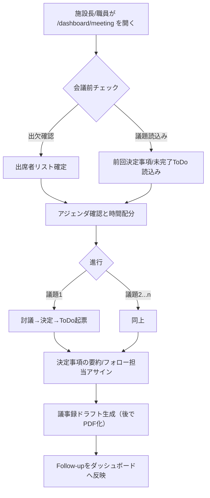

# フロー：運用会議（ミーティングガイド起点）

```mermaid
flowchart TD
  A[施設長/職員が /dashboard/meeting を開く] --> B{会議前チェック}
  B -->|出欠確認| C[出席者リスト確定]
  B -->|議題読込み| D[前回決定事項/未完了ToDo 読込み]
  C --> E[アジェンダ確認と時間配分]
  D --> E
  E --> F{進行}
  F -->|議題1| G[討議→決定→ToDo起票]
  F -->|議題2...n| H[同上]
  G --> I[決定事項の要約/フォロー担当アサイン]
  H --> I
  I --> J[議事録ドラフト生成（後でPDF化）]
  J --> K[Follow-upをダッシュボードへ反映]
```

イベント/データ
	• 入力：出欠、議題、タイムキープ、決定事項、担当・期限
	• 出力：決定事項サマリー、ToDo（タスク）、議事録PDFドラフト

画面
	• /dashboard/meeting（MeetingGuidePage.tsx）
