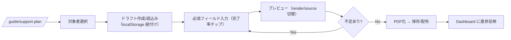

# フロー：個別支援計画ガイド（作成→プレビュー→PDF）

```mermaid
flowchart LR
  A[/guide/support-plan/] --> B[対象者選択]
  B --> C[ドラフト作成/読込み（localStorage 紐付け）]
  C --> D[必須フィールド入力（完了率チップ）]
  D --> E[プレビュー（render/source 切替）]
  E --> F{不足あり?}
  F -- Yes --> D
  F -- No --> G[PDF化 → 保存/配布]
  G --> H[Dashboard に進捗反映]
```

要点
	• SupportPlanGuidePage.tsx：32名までドラフト自動保存（600ms デバウンス）
	• 必須：serviceUserName, supportLevel, planPeriod, goals, supports, decision, monitoring, risk
