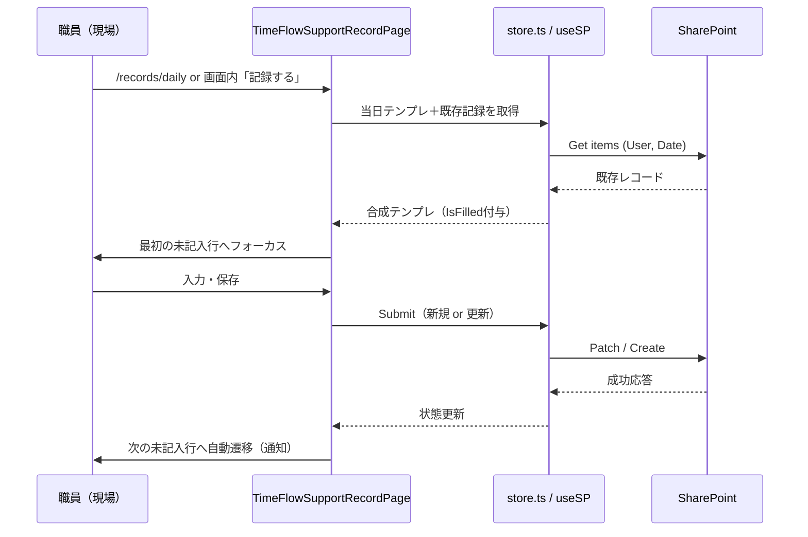

# フロー：日次記録（黒ノート）

```mermaid
sequenceDiagram
  participant U as 職員（現場）
  participant T as TimeFlowSupportRecordPage
  participant S as store.ts / useSP
  participant SP as SharePoint

  U->>T: /records/daily or 画面内「記録する」
  T->>S: 当日テンプレ＋既存記録を取得
  S->>SP: Get items (User, Date)
  SP-->>S: 既存レコード
  S-->>T: 合成テンプレ（IsFilled付与）
  T->>U: 最初の未記入行へフォーカス

  U->>T: 入力・保存
  T->>S: Submit（新規 or 更新）
  S->>SP: Patch / Create
  SP-->>S: 成功応答
  S-->>T: 状態更新
  T->>U: 次の未記入行へ自動遷移（通知）
```

要点
	• colTemplate 合成（テンプレ + 当日記録）
	• 未入力ジャンプと色分け（IsFilled）
	• 保存後の次行ナビ（生産性向上）
