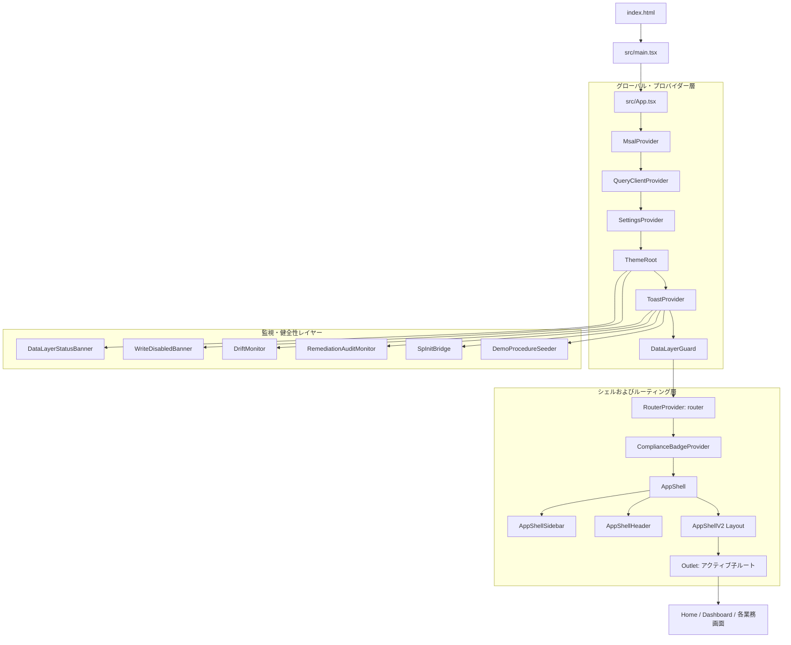
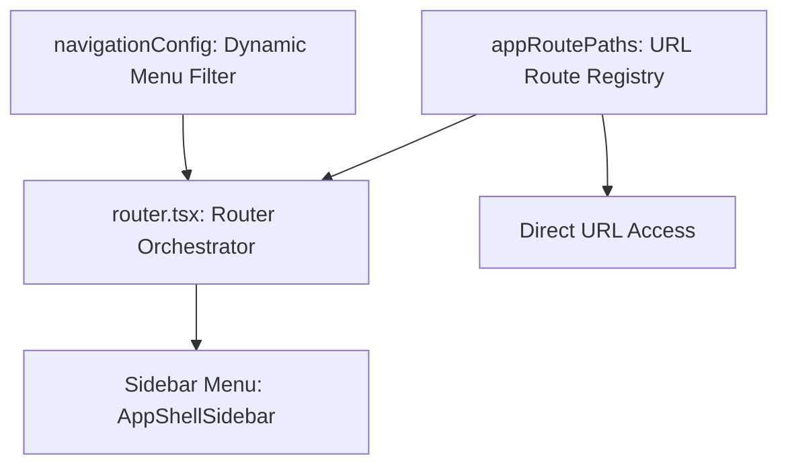

# Audit Management System MVP フロントエンド構造分析調査レポート

本ドキュメントは、ローカル開発サーバー（`http://localhost:5173`）で稼働する **Audit Management System MVP**（障害福祉制度監査・運営支援システム）の主要なフロントエンド構造を把握するための調査レポートです。

* **調査実施日:** 2026年6月19日
* **対象コミット:** `ca980b5c35a36aea98ac4379c3bc96bc9d3fbd1b`

---

## 1. システム全体俯瞰図 (Architectural Flow)

Vite でビルドされる本アプリケーションの起動から画面描画までのフロー、各種 Provider およびレイアウトコンポーネントの入れ子構造を以下に示します。



---

## 2. ディレクトリ構成とモジュール設計

`src/` 配下の構成は、機能単位の分離を意識した構成になっています。

```txt
src/
├── app/                  # アプリケーションの基盤コード（シェル、テーマ、ルーター）
│   ├── config/           # ナビゲーションやルートグループ設定
│   ├── routes/           # 各業務ドメインのルート定義
│   ├── AppShell.tsx      # デスクトップ・モバイルに対応するアプリケーションシェル
│   ├── Home.tsx          # ホーム画面（デモモード切替、主要機能タイルリンク）
│   ├── router.tsx        # 薄いオーケストレーターとしてのルーター定義
│   └── theme.tsx         # MUI テーマ、Motion/アクセシビリティ定義、カラーパレット定義
├── components/           # グローバル共有 UI コンポーネント、レイアウトコンポーネント
├── features/             # ドメイン駆動でモジュール化された機能群 (多数の業務ドメイン)
│   ├── action-engine/    # 監査リスク検知・提案エンジン
│   ├── attendance/       # 利用者および職員の出欠管理
│   ├── daily/            # 日々の支援記録シート、バイタル、食事等の記録
│   ├── diagnostics/      # システム不整合検知（DriftMonitor等）
│   ├── schedules/        # マスタースケジュール、カレンダー
│   └── users/            # 利用者マスタ基本情報
├── sharepoint/           # SharePoint リスト定義・スキーマ、プロビジョニング
├── auth/                 # MSAL (Microsoft Authentication Library) 連携ロジック
├── infra/                # 外部インフラストラクチャ（Firebase/SharePoint）接続
├── hooks/                # 汎用カスタムフック（useToast, useViewport等）
├── lib/                  # ユーティリティ、ヘルパー関数
└── types/                # グローバル TypeScript 型定義
```

---

## 3. ルーティングとナビゲーションの構造分離

本システムでは、「URLの解決」を行うルーティング定義と、「ユーザーへ提示するナビゲーション構成」を論理的・物理的に分離して管理しています。これによって、一時的なナビゲーション非表示やアクセス権限の変更に柔軟に対応できる設計となっています。



1. **ルーティング層 (URLルートの定義):**
   * `src/app/routes/appRoutePaths.ts` でアプリケーションに存在する主要な有効パス定義を配列として一元管理し、タイポやルーティングの整合性テストを自動化しています。
   * 各業務画面のコンポーネントとパスの紐付けは、`src/app/router.tsx` がオーケストレーターとなってドメインごとのルート配列 (`dailyRoutes`, `scheduleRoutes` 等) を合成します。
2. **ナビゲーション層 (メニューの構成定義):**
   * `src/app/config/navigationConfig.ts` にて、サイドバーやモバイルドロワーで表示する項目を制御します。
   * Feature Flag（`schedulesEnabled` 等）やユーザー権限（`isAdmin`, `isFieldStaff`）に基づいて、アイテムを動的に選別 (`isNavVisible`) してビルドします。
3. **表示・描画層 (`AppShellSidebar`):**
   * ナビゲーション層から選別された配列を受け取り、検索フィルター、グループ分け表示、折りたたみ機能、未読バッジのカウント描画を担います。

---

## 4. UI/UX 設計およびデザインシステム

UI コンポーネントは `@mui/material` をベースとしつつ、制度監査や現場運用に最適化された独自のデザインシステムを構築しています。

### テーマ＆カラーパレット (Design Tokens)
`src/app/theme.tsx` にて一元定義されています。
* **2つの基本モード:**
  * **Light Mode:** 森林や優しさを想起させる `#4E7E4D` (プライマリグリーン) を基調とした落ち着いたカラー。
  * **Dark Mode:** GitHub ライクな `#0D1117` (背景) と `#161B22` (カード) をベースにした高コントラストかつ目に優しい設計。
* **サービス種別カラー (`serviceTypeColors`):**
  * `normal` (日中活動/生活介護等): 空色 (`#0EA5E9`)
  * `transport` (送迎): 緑色 (`#16A34A`)
  * `respite` (短期入所): 橙色 (`#F59E0B`)
  * `nursing` (医療的ケア): 紫色 (`#A855F7`)
  * `absence` (欠席): グレー (`#94A3B8`)
* **Density（情報密度）制御:**
  * `compact`, `comfortable`, `spacious` の3段階をサポート。CSS 変数 (`--theme-density-base` 等) と MUI の `spacing` トークンが連動し、現場職員の好みのサイズ感に一瞬で切り替えられます。
* **モーションデザイン (`motionTokens`):**
  * 各種イージング（`pop`, `spring`, `smooth` 等）とフェード・変形のアニメーション時間をミリ秒単位で管理し、UI のレスポンスを滑らかに見せる工夫が施されています。

### アクセシビリティ (A11y)
* **タッチターゲット:** スマートフォンや共有タブレットでの誤操作を防ぐため、ボタンの最小高を原則 `48px`（ポインティングデバイスが荒い環境でも `44px` 以上）に確保。
* **フォーカスリング:** キーボード操作時に一目で位置を特定できるよう、すべてのインタラクティブ要素に明瞭なフォーカスリング（MUI CssBaseline にて `outline: 3px solid #4E7E4D` 等）を設定。

---

## 5. フロントエンド境界レイヤー (Layer Boundaries)

フロントエンド内の役割定義およびモジュール間の依存関係を明確にするため、以下のレイヤー設計を適用しています。

| レイヤー | 役割・責務範囲 | 具体例 |
| :--- | :--- | :--- |
| **View / Components** | 画面描画、フォーム操作UI、MUIコンポーネント | ボタン、カード、ダイアログ、状態を表示するプレビュー画面 |
| **Hooks / Use cases** | 状態管理の統合、ビジネスロジック、取得・保存処理のオーケストレーション | `useActionSuggestions`, `useSchedulesToday` |
| **Repository** | データ取得インターフェースの抽象化（Mock / メモリ / SharePoint 実通信の切替） | `spListRegistry` の読み取り、API アダプター層 |
| **Infra** | 外部システム・サービスへの直接接続、ネットワーク・SDKの初期設定 | MSAL 認証プロバイダー、SharePoint Online 接続定義、Firebase SDK 設定 |
| **Guards / Monitors** | システム健全性監視、書き込み権限制限、ドリフト監視、初期化同期ゲート | `DriftMonitor`, `ConnectionDegradedBanner`, `SpInitBridge` |

---

## 6. 特徴的な支援ロジック：Action Engine

本システムの特徴的な業務支援ロジックである **Action Engine**（`src/features/action-engine`）は、記録の抜け漏れや制度運用上の注意点を検知し、職員の確認行動につなげる補助機能です。

* **検知アプローチ:**
  * 「利用者が来所しているが支援記録が未入力」などの運用記録のギャップ検出。
  * 「アセスメントが一定期間（6ヶ月）更新されていない」などの管理期限切れ警告。
  * 「バイタル値に急激な変動や異常値（例: 高熱）がある」などのリスク注意喚起。
* **テレメトリログ:**
  * 提案の表示回数やクリック率（CTR）、保留（スヌーズ）の頻度を Firebase Firestore を経由して収集し、ルールの有用性を客観的に解析するためのライフサイクルテレメトリを実装しています。
* **UX の位置づけ:**
  * システムが業務を「強制決定」するのではなく、問題を発見しやすいようハイライトし、最終的な判断・入力を促す「支援型 UI」として動作します。
