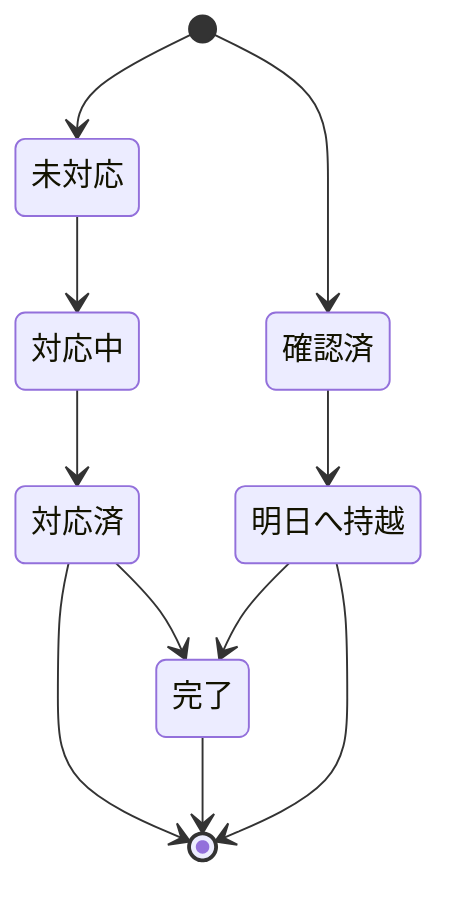

# Handoff 機能 構造把握レポート

## 概要

Handoff（申し送り）は、現場の実務連携と監査証跡の両方を担う中核機能として、三層アーキテクチャ内で以下の役割を持つ。

- SharePoint（運用データ）: 申し送り本体と状態更新の真実系ソース
- TypeScript（アプリ層）: UI/状態機械/API クライアント/キャッシュで扱う業務ロジック
- AI分析基盤: 制度系申し送りに対する完了基準・監査条件の判定

本レポートは実装変更なしで現状構造を固定し、今後のテスト追加・機能改善時の判断基準とすることを目的とする。

## 1. データモデル（現状認識）

### 1-1 SharePoint 由来主要フィールド

| フィールド | 意図 |
|---|---|
| `Status` | 申し送りの状態。未対応→対応中→対応済 / 確認済→持越→完了系 |
| `CarryOverDate` | 持越日。例外ケースの運用値として利用 |
| `Source` | 制度系ソース（`regulatory-finding`, `severe-addon-finding` 等）を識別 |
| `ResolvedBy` | 完了処理者。制度系では監査観点で必須判定対象 |
| `ResolvedAt` | 完了時刻。制度系では監査観点で必須判定対象 |
| `ResolutionNote` | 解決内容ノート。必要性がある場合は記録要 |

### 1-2 TypeScript 側データ接続

- API 層では SharePoint の `Status` を起点に Handoff タイムライン・サマリを構成する。
- ローカル補完ストアが上乗せされる場合があり、表示時の優先順位や期限切れ後の後始末が設計上の重要論点となる。
- 画面では場面（通常/夕会/朝会）に応じてフィルタ条件を切り替え、同一の申し送りを別の文脈で再解釈する。

## 2. 状態遷移の構造

### 2-1 標準フロー（観測）

### 2-2 終端取り扱い

- `対応済` と `完了` は、ユーザー操作上はどちらも終了系として扱う設計余地がある。
- UI / API / 分析で「終端」の意味が異なると、再更新可否・再開可否の判定不整合が起きるため、明確な統一ルール化が必要。

### 2-3 制度系の完了条件（監査観点）

制度系 (`regulatory-finding`, `severe-addon-finding`) 由来の申し送りは、単純な `完了` 判定で足りず、監査証跡が揃っているかを必須条件で見る。

- `Status` が完了系（`対応済`/`完了`）
- `ResolvedBy` が存在
- `ResolvedAt` が存在
- `ResolutionNote` が必要であれば記録済み

上記が欠落している場合は、形式的な完了でも監査上は未完了扱いの可能性が高い。

## 3. API / キャッシュの連携

- タイムライン取得とサマリ取得は同時に状態変化を反映するためのインターフェースとして機能。
- キャッシュは可用性を上げる一方、`CarryOverDate` のような期限情報と競合しやすく、  
  1) SharePoint 側優先の原則、2) ローカル補完の期限切れ扱い、3) 完了遷移後の補完値消去、を実装の分岐点として明示する必要がある。
- キャッシュを前提とする場合でも、状態遷移イベント発火時の再取得条件を厳格化し、UI と API の整合を保つ。

## 4. 画面統合

### 4-1 3画面への影響

- `/dashboard`: 俯瞰 KPI / ライブフィード。申し送りの閲覧中心
- `/today`: 行動起点の主導線。朝の状況に応じた最短アクション導線
- `/handoff-timeline`（会議系含む）: 申し送りの詳細編集・状態遷移・監査メモの中核

### 4-2 画面横断整合

- `/dashboard` と `/today` は詳細編集を持たず、基本的に詳細遷移は `/handoff-timeline` 側に委譲。
- 朝会・夕会では表示スコープ（日付の前日/当日）が変わり、同一申し送りでも可視条件が変化する。

## 5. AI分析・制度監査連携

- AI 分析は「完了」と見えるレコードをそのまま監査完了と誤認しないことが重要。
- 制度系フィルタを起点として、上位の `Resolution` メタ情報（`ResolvedBy`/`ResolvedAt`/`ResolutionNote`）を照合することで、監査未完了リスクを検知しやすくする。
- モデル側は `Source` と `Status` のセットで制度系を優先判定し、通常申し送りとの差分ルールを明確化する方針。

## 6. 未解決論点（次のアクション）

### A. 状態遷移テスト

- 通常・夕会・朝会モードごとの allowed actions
- `対応済` / `完了` の終端判定の一貫性
- 管理者以外の `reopen` 不可

### B. 制度系監査トレイルテスト

- 制度系由来かどうかの判定
- 完了状態時に `ResolvedBy` / `ResolvedAt` 欠落がある場合の監査未完了判定
- 通常申し送りが制度系監査要件から除外されることの確認

### C. CarryOver 運用チェック

- SharePoint の `CarryOverDate` とローカル補完値の優先順位
- ローカル補完の古い値消去
- `明日へ持越`→`完了` 後の補完残存有無

## 7. 想定 PR 進行

1. docs-only: `docs/architecture/handoff-structure-report.md` を追加し、実装変更なし
2. test-only: 終端状態/持越遷移の状態機械をテスト追加
3. test-only / analysis-only: 制度系監査証跡のテスト追加

## 8. Handoff 完了履歴

- 2026-06-09
  - `#2137` docs-only: Handoff 構造レポート追加
  - `#2139` test-only: 状態遷移（`normal/evening/morning` / 終端 / `reopen`）の固定
  - `#2141` test-only: 制度系監査証跡（`ResolvedBy` / `ResolvedAt` / `ResolutionNote`）検証追加
  - `#2143` test + small behavior fix: CarryOverDate 補完の優先順位・終端ステータス時の再適用防止

---

最終更新: 2026-06-09
