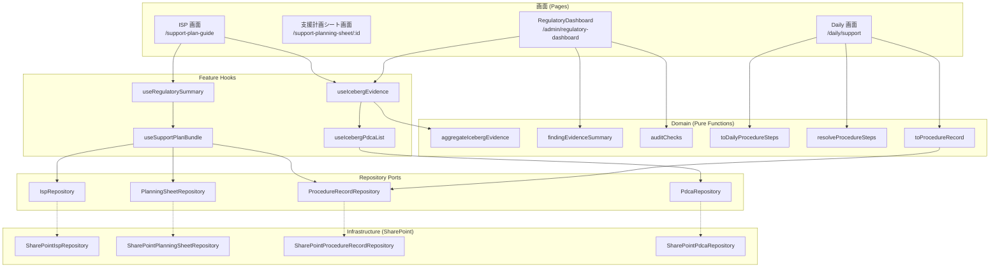
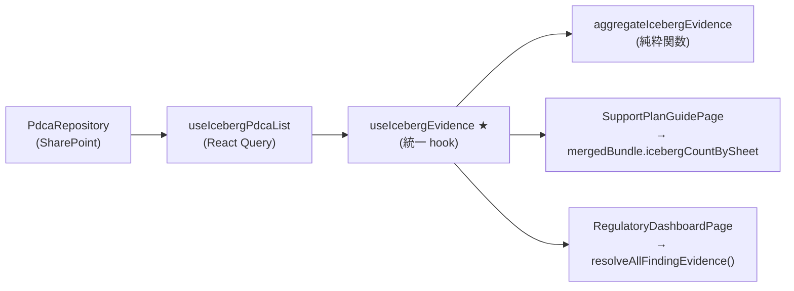
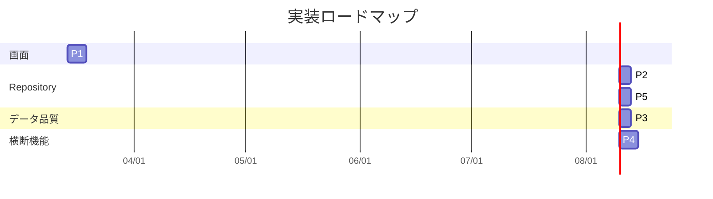

# ISP 三層モデル — 実装構造マップ

> **ADR-005 + ADR-006 準拠** — データモデルの三層分離と画面責務境界を
> コード構造に完全対応させた定義

このドキュメントは「どの概念が・どのフォルダに属し・どの Repository が責任を持ち・
どの画面が参照し・どの Bridge が境界をまたぐか」を 1 枚で示す。

---

## 全体概観



---

## 1. ドメイン層（`src/domain/`）

### `src/domain/isp/` — ISP 三層モデル中核

| ファイル | 責務 | 層 |
|---------|------|---|
| [`schema.ts`](../../src/domain/isp/schema.ts) | Zod スキーマ + 型定義（ISP, PlanningSheet, ProcedureRecord, SupportPlanBundle） | L1+L2+L3 |
| [`types.ts`](../../src/domain/isp/types.ts) | 詳細ドメインモデル（状態遷移、監査証跡、版管理、三層統合ビュー） | L1+L2+L3 |
| [`port.ts`](../../src/domain/isp/port.ts) | Repository Port インターフェース 3 本 | L1+L2+L3 |

### `src/domain/isp/bridge/` — 層間 Adapter（Daily 連携）

| ファイル | 変換方向 | 入力 → 出力 |
|---------|---------|------------|
| [`toDailyProcedureSteps.ts`](../../src/domain/isp/bridge/toDailyProcedureSteps.ts) | L2 → Daily | `PlanningDesign.procedureSteps` → `ProcedureStep[]`（時間割） |
| [`resolveProcedureSteps.ts`](../../src/domain/isp/bridge/resolveProcedureSteps.ts) | L2/CSV/Base → Daily | 手順の優先解決（planning_sheet > csv_import > base_steps） |
| [`toProcedureRecord.ts`](../../src/domain/isp/bridge/toProcedureRecord.ts) | Daily → L3 | `ABCRecord + ProcedureStep` → `ProcedureRecordInput` |

### `src/features/planning-sheet/` — 三層ブリッジ（PDCA 連携）

| ファイル | ブリッジ | 変換方向 | 入力 → 出力 |
|---------|---------|---------|------------|
| [`assessmentBridge.ts`](../../src/features/planning-sheet/assessmentBridge.ts) | 第1ブリッジ | Assessment → L2 | アセスメント → formPatches + intakePatches + provenance |
| [`planningToRecordBridge.ts`](../../src/features/planning-sheet/planningToRecordBridge.ts) | 第2ブリッジ | L2 → L3 | 方針/具体策/環境 → ProcedureStep[] + globalNotes |
| [`monitoringToPlanningBridge.ts`](../../src/features/planning-sheet/monitoringToPlanningBridge.ts) | 第3ブリッジ | Monitoring → L2 | 行動モニタリング → 自動追記 + 候補提示 |
| [`monitoringSchedule.ts`](../../src/features/planning-sheet/monitoringSchedule.ts) | L2 時間軸 | — | supportStartDate → 次回日・経過・超過・進捗 |

**三層ブリッジの全体像**:

```
    Assessment                L2 (支援計画シート)           L3 (手順書兼記録)
        │                          │                           │
   assessmentBridge()    planningToRecordBridge()               │
  [第1ブリッジ] ──────►          ──────────────────────►        │
        │                          │                           │
        │              monitoringToPlanningBridge()             │
        │              [第3ブリッジ] ◄──── Monitoring ──────────┘
        │                          │
        │               monitoringSchedule()
        │              [supportStartDate 起点]
        │                          │
        ▼                          ▼
   provenance 追跡          PDCA 循環完成
```

### `src/domain/regulatory/` — 制度遵守チェックエンジン

| ファイル | 責務 |
|---------|------|
| [`auditChecks.ts`](../../src/domain/regulatory/auditChecks.ts) | AuditFinding 生成ルール |
| [`buildFindingActions.ts`](../../src/domain/regulatory/buildFindingActions.ts) | Finding → 対応アクション URL |
| [`findingEvidenceSummary.ts`](../../src/domain/regulatory/findingEvidenceSummary.ts) | Finding → 根拠サマリー解決 |
| [`aggregateIcebergEvidence.ts`](../../src/domain/regulatory/aggregateIcebergEvidence.ts) | `IcebergPdcaItem[]` → `IcebergEvidenceBySheet` 集計 |
| [`userRegulatoryProfile.ts`](../../src/domain/regulatory/userRegulatoryProfile.ts) | 利用者の制度プロファイル |
| [`staffQualificationProfile.ts`](../../src/domain/regulatory/staffQualificationProfile.ts) | 職員資格プロファイル |

---

## 2. Repository 層

### Port（`src/domain/isp/port.ts`）

| Port | 主要メソッド | 対象層 |
|------|------------|-------|
| `IspRepository` | `getById`, `getCurrentByUser`, `listByUser`, `create`, `update` | L1 |
| `PlanningSheetRepository` | `getById`, `listByIsp`, `listCurrentByUser`, `create`, `update` | L2 |
| `ProcedureRecordRepository` | `getById`, `listByPlanningSheet`, `listByUserAndDate`, `create`, `update` | L3 |

### Port（`src/features/ibd/analysis/pdca/domain/`）

| Port | 主要メソッド | 対象 |
|------|------------|------|
| `PdcaRepository` | `list({ userId, planningSheetId })`, `save`, `delete` | Iceberg |

### Infrastructure（SharePoint Adapter）

| Adapter | Port | ファイルパス |
|---------|------|------------|
| `SharePointIspRepository` | `IspRepository` | [`src/data/isp/sharepoint/SharePointIspRepository.ts`](../../src/data/isp/sharepoint/SharePointIspRepository.ts) |
| `SharePointPlanningSheetRepository` | `PlanningSheetRepository` | [`src/data/isp/sharepoint/SharePointPlanningSheetRepository.ts`](../../src/data/isp/sharepoint/SharePointPlanningSheetRepository.ts) |
| `SharePointProcedureRecordRepository` | `ProcedureRecordRepository` | [`src/data/isp/sharepoint/SharePointProcedureRecordRepository.ts`](../../src/data/isp/sharepoint/SharePointProcedureRecordRepository.ts) |
| `SharePointPdcaRepository` | `PdcaRepository` | [`src/features/ibd/analysis/pdca/infra/SharePointPdcaRepository.ts`](../../src/features/ibd/analysis/pdca/infra/SharePointPdcaRepository.ts) |
| `InMemoryPdcaRepository` | `PdcaRepository`（テスト/デモ用） | [`src/features/ibd/analysis/pdca/infra/inMemoryPdcaRepository.ts`](../../src/features/ibd/analysis/pdca/infra/inMemoryPdcaRepository.ts) |

### Repository Factory

| Factory | 切替ロジック | ファイル |
|---------|------------|---------|
| `getPdcaRepository()` | featureFlag `icebergPdca` + `isDemoModeEnabled()` で切替 | [`repositoryFactory.ts`](../../src/features/ibd/analysis/pdca/repositoryFactory.ts) |
| `useIspRepositories()` | SharePoint 接続状況で切替 | [`useIspRepositories.ts`](../../src/features/support-plan-guide/hooks/useIspRepositories.ts) |

---

## 3. Feature 層（`src/features/`）

### `src/features/support-plan-guide/` — ISP (L1) 画面

```
support-plan-guide/
├── components/
│   ├── tabs/                            # タブ UI (Overview, Assessment, ...)
│   └── RegulatorySummaryBand.tsx         # 制度サマリー帯
├── hooks/
│   ├── useSupportPlanForm.ts            # ISP フォーム管理（メインフック）
│   ├── useSupportPlanBundle.ts          # 本番 Repository → SupportPlanBundle
│   ├── useRegulatorySummary.ts          # Bundle → 制度サマリーデータ
│   ├── useIspRepositories.ts            # SP Repository DI
│   ├── useDraftBootstrap.ts             # ドラフト初期化
│   ├── useDraftAutoSave.ts              # 自動保存
│   ├── useDraftFieldHandlers.ts         # フィールド入力ハンドラ
│   ├── useDraftManagement.ts            # ドラフト CRUD
│   ├── useGoalActions.ts                # 目標アクション (Phase 3)
│   └── draftPersistence.ts              # 永続化ロジック
├── domain/
│   └── SupportPlanDraftRepository.ts    # Draft 永続化 Port
├── infra/
│   ├── SharePointSupportPlanDraftRepository.ts
│   └── InMemorySupportPlanDraftRepository.ts
├── utils/
│   └── helpers.ts                       # 入力率計算など
└── types.ts                             # SupportPlanDraft, SupportPlanForm
```

### `src/features/ibd/analysis/pdca/` — Iceberg PDCA 分析

```
ibd/analysis/pdca/
├── queries/
│   ├── useIcebergPdcaList.ts            # React Query: PDCA 一覧取得
│   ├── useIcebergEvidence.ts            # 統一 evidence hook ★
│   └── useIcebergPdcaMutations.ts       # PDCA 変更操作
├── domain/
│   └── pdcaRepository.ts                # PdcaRepository Port
├── infra/
│   ├── SharePointPdcaRepository.ts      # SP 実装
│   └── inMemoryPdcaRepository.ts        # テスト/デモ実装
├── repositoryFactory.ts                 # getPdcaRepository()
├── icebergEvidenceAdapter.ts            # PDCA → モニタリング根拠変換
├── types.ts                             # IcebergPdcaItem
└── IcebergPdcaPage.tsx                  # PDCA 分析 UI
```

### `src/features/daily/` — Daily 画面 (L3)

```
daily/
├── domain/
│   ├── ProcedureRepository.ts           # ProcedureStep 型, ProcedureSource
│   ├── BehaviorRepository.ts            # 行動記録 Port
│   ├── DailyRecordRepository.ts         # 日次記録 Port
│   ├── ExecutionRecordRepository.ts      # 実施記録 Port
│   └── dailyRecordLogic.ts              # 記録ロジック
├── components/
│   ├── procedure/                       # 支援手順 UI
│   ├── wizard/                          # ウィザード UI
│   └── time-flow/                       # タイムフロー UI
├── hooks/
├── stores/
└── adapters/
```

---

## 4. 画面層（`src/pages/`）

| 画面 | ファイル | 読むもの | 書くもの |
|------|---------|---------|---------|
| ISP | [`SupportPlanGuidePage.tsx`](../../src/pages/SupportPlanGuidePage.tsx) | ISP, PlanningSheet (一覧表示), Iceberg evidence | ISP ドラフト |
| 支援計画シート | (将来) `SupportPlanningSheetPage.tsx` | PlanningSheet, Iceberg PDCA | PlanningSheet |
| Daily | (既存) `/daily/support` 内 | ProcedureStep (L2→Bridge), 行動記録 | ProcedureRecord (L3) |
| RegulatoryDashboard | [`RegulatoryDashboardPage.tsx`](../../src/pages/RegulatoryDashboardPage.tsx) | ISP, PlanningSheet, Iceberg evidence, ProcedureRecord | なし（読取専用） |

---

## 5. Evidence Source の統一パターン



**ルール**:
- Iceberg の件数・直近日付は **必ず `useIcebergEvidence` 経由** で取得する
- 画面固有のローカル集計を新設してはならない
- `aggregateIcebergEvidence()` は純粋関数であり、テスト可能

---

## 6. データフロー完全図

```
┌─────────────────────────────────────────────────────────────────┐
│                        SharePoint Lists                        │
│  ┌──────────┐  ┌──────────────┐  ┌───────────────┐  ┌───────┐ │
│  │   ISP    │  │PlanningSheet │  │ProcedureRecord│  │ PDCA  │ │
│  └────┬─────┘  └──────┬───────┘  └───────┬───────┘  └───┬───┘ │
└───────┼───────────────┼──────────────────┼──────────────┼─────┘
        │               │                  │              │
        ▼               ▼                  ▼              ▼
   ┌─────────┐   ┌────────────┐   ┌─────────────┐   ┌─────────┐
   │ IspRepo │   │  PSRepo    │   │   PRRepo    │   │PdcaRepo │
   └────┬────┘   └─────┬──────┘   └──────┬──────┘   └────┬────┘
        │              │                  │               │
        │    ┌─────────┴──────────┐       │               │
        ▼    ▼                    │       │               ▼
   ┌──────────────┐               │       │       ┌──────────────┐
   │useSupportPlan│               │       │       │useIceberg    │
   │   Bundle     │               │       │       │  Evidence    │
   └──────┬───────┘               │       │       └──────┬───────┘
          │                       │       │              │
          ▼                       │       │              │
   ┌──────────────┐               │       │              │
   │useRegulatory │               │       │              │
   │  Summary     │               │       │              │
   └──────┬───────┘               │       │              │
          │                       │       │              │
          ▼                       ▼       ▼              ▼
   ┌──────────────┐        ┌──────────────────┐   ┌───────────────┐
   │SupportPlan   │        │  Bridge 層       │   │ Regulatory    │
   │ GuidePage    │◄──┐    │ toDailyProc...   │   │ Dashboard     │
   │ (ISP 画面)   │   │    │ resolveProcS...  │   │ Page          │
   └──────────────┘   │    │ toProcRecord...  │   └───────────────┘
                      │    └────────┬─────────┘
                      │             │
                      │             ▼
                      │    ┌──────────────────┐
                      │    │  Daily 画面      │
                      │    │ /daily/support   │
                      └────│                  │
                           └──────────────────┘
```

---

## 7. Iceberg の紐付けルール

| 紐付け先 | フィールド | 理由 |
|---------|-----------|------|
| ✅ PlanningSheet | `IcebergPdcaItem.planningSheetId` | 行動分析は支援計画シートの根拠 |
| ❌ ISP | (存在しない) | ISP は上位計画であり、分析レベルではない |

```
IcebergPdcaItem
  ├── planningSheetId: string    ← 正しい紐付け
  ├── userId: string
  ├── phase: 'PLAN' | 'DO' | 'CHECK' | 'ACT'
  ├── title: string
  ├── summary?: string
  └── updatedAt: string
```

---

## 8. 境界をまたぐ参照の方向

| 方向 | 許可 | 例 |
|------|-----|---|
| ISP → PlanningSheet | ✅ 参照表示 | ISP 画面でシート一覧を表示 |
| PlanningSheet → Iceberg | ✅ 分析接続 | シート画面で Iceberg 件数を表示 |
| PlanningSheet → Daily | ✅ 導線 | シート画面から Daily への遷移 |
| Daily → ProcedureRecord | ✅ 記録 | 実行結果を制度記録に変換 |
| Daily → PlanningSheet | ❌ 編集不可 | 支援設計の変更はシート画面で行う |
| Daily → ISP | ❌ 編集不可 | 上位計画の変更は ISP 画面で行う |
| ISP → Iceberg | ❌ 直接紐付け不可 | Iceberg は PlanningSheet 経由 |
| RegulatoryDashboard → 任意 | ✅ 読取専用 | 全層を横断的にチェック |

---

## 9. 主キー / 参照キー SSOT

### エンティティ別キー定義

| エンティティ | 主キー | 主要参照キー | 型定義 |
|------------|--------|------------|-------|
| ISP | `isp.id` | `userId` | `IndividualSupportPlan` |
| PlanningSheet | `planningSheet.id` | `userId`, `ispId` | `SupportPlanningSheet` |
| ProcedureRecord | `record.id` | `userId`, `planningSheetId`, `ispId?` | `SupportProcedureRecord` |
| IcebergPdcaItem | `pdca.id` | `userId`, `planningSheetId` | `IcebergPdcaItem` |
| SupportPlanDraft | `draft.id` | `userId?`, `userCode?` | `SupportPlanDraft` |

### 参照グラフ

```
ISP.id ←─────── PlanningSheet.ispId
  │                    │
  │                    ├─── ProcedureRecord.planningSheetId
  │                    │
  │                    └─── IcebergPdcaItem.planningSheetId
  │
  └── ISP.userId ===== PlanningSheet.userId
                  ===== ProcedureRecord.userId
                  ===== IcebergPdcaItem.userId
```

### 集計の参照方向

| 集計 | 入力キー | 参照方向 | 使用箇所 |
|------|---------|---------|----------|
| Iceberg 件数 by Sheet | `planningSheetId` | PdcaItem → PlanningSheet | `aggregateIcebergEvidence()` |
| 記録件数 by Sheet | `planningSheetId` | ProcedureRecord → PlanningSheet | `countRecordsBySheet()` |
| 現行 ISP | `userId` + `isCurrent` | User → ISP | `IspRepository.getCurrentByUser()` |
| 現行シート一覧 | `userId` + `isCurrent` | User → PlanningSheet | `PlanningSheetRepository.listCurrentByUser()` |

---

## 10. テストの対応

| 層 | テストファイル | テスト数 |
|---|------------|---------|
| Domain: regulatory | `src/domain/regulatory/__tests__/` (5 files) | ~70 |
| Domain: isp schema | `src/domain/isp/__tests__/schema.spec.ts` | ~30 |
| Domain: isp bridge | `src/domain/isp/bridge/__tests__/` | ~25 |
| Feature: PDCA evidence | `src/features/ibd/analysis/pdca/queries/__tests__/useIcebergEvidence.spec.ts` | ~3 |
| Feature: support-plan-guide | `src/features/support-plan-guide/hooks/__tests__/` | ~50 |

---

## 11. 将来の拡張ポイント

| 拡張 | 影響範囲 | 備考 |
|------|---------|------|
| ~~支援計画シート専用画面の新設~~ | ~~`SupportPlanningSheetPage.tsx`~~ | ✅ 実装済み |
| PlanningSheet Repository の本番接続 | `src/data/isp/sharepoint/` の活用 | Port は定義済み |
| Iceberg → PlanningSheet 紐付けの強化 | `IcebergPdcaItem.planningSheetId` の必須化 | 旧データは `null` 許容 |
| 全ユーザー横断の RegulatoryDashboard | `useIcebergEvidence` を複数 userId で呼ぶ | 現在は単一 userId |
| `supportStartDate` UI フォーム統合 | `SupportPlanningSheetPage` のフォーム | スキーマ追加済み、フォーム入力UI 未実装 |
| `ImportMonitoringDialog` の活性化 | モニタリングデータ取得 hook の接続 | ダイアログ UI 実装済み |

---

## 12. 実装優先順位

以下の順序で開発を進めることを推奨する。
各ステップは前のステップに依存する。

| 順位 | 施策 | 理由 | 前提 |
|------|------|------|------|
| **P1** | SupportPlanningSheetPage 新設 | ADR-006 で定義された画面責務境界を実装に反映。PlanningSheet が ISP 画面に混在している現状を解消 | なし |
| **P2** | PlanningSheet Repository 本番接続 | SheetPage が SharePoint の実データを読み書きできる状態にする。Port は `src/domain/isp/port.ts` に定義済み | P1 |
| **P3** | Iceberg `planningSheetId` 必須化 | 旧データ (`planningSheetId: null`) を移行し、evidence 集計の精度を上げる。移行スクリプトが必要 | P2 |
| **P4** | RegulatoryDashboard 複数 userId 対応 | 全利用者横断で制度チェックを一覧表示。`useIcebergEvidence` を並列呼び出しまたはバッチ化 | P3 |
| **P5** | Daily → L3 制度記録の自動書き込み | `toProcedureRecord` Bridge を使い、Daily の行動記録を `ProcedureRecordRepository.create()` に連携 | P2 |



---

## References

- [ADR-005: ISP 三層分離](../adr/ADR-005-isp-three-layer-separation.md)
- [ADR-006: 画面責務境界](../adr/ADR-006-screen-responsibility-boundaries.md)
- [AI ISP 三層プロトコル](../ai-isp-three-layer-protocol.md)
- [3 画面責務分担マップ](./screen-responsibility-map.md) — Dashboard/Today/Handoff の責務定義
