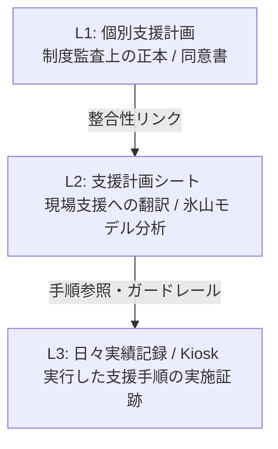

# Support Planning Sheet Governance
## L1-L2-L3 Responsibility Boundary

本ドキュメントは、就労継続支援B型事業所における「個別支援計画（L1）」「支援計画シート（L2）」「日々実績記録（L3）」の三層構造について、その責務範囲、データ項目、状態管理（ライフサイクル）、および監査上の整合性ルールを規定します。

---

### 1. 三層構造の基本定義と責務

システムは、制度上の法的な正当性と、現場における支援手順の具体性を両立するため、明確に分離された三層構造で構成されます。

> [!NOTE]
> **「L1は制度監査上の正本、L2は現場支援への翻訳・実装設計、L3は実施記録。」**  
> L2単体で作成・編集を行うことは可能ですが、実際の「運用中」状態としてサービス記録に適用するには、必ずL1（法的な正本）との紐づきが必要になります。

| レイヤー | 名称 | 主な役割・責務 | 監査・システム上の位置づけ |
| :--- | :--- | :--- | :--- |
| **L1** | **個別支援計画** (Individual Support Plan) | ・法的に署名・捺印を受領する公的文書 ・大まかな長期・短期目標の合意 ・計画有効期間の法的な縛りを定義 | **制度監査上の正本（マスター）** ※未作成・更新漏れは「計画未作成減算」の対象 |
| **L2** | **支援計画シート** (Support Planning Sheet) | ・アセスメントや特性調査（Tokusei）の取込 ・**氷山モデル（Iceberg Model）**による仮説分析 ・日々の支援者全員が共通して動く「具体的な支援手順」 | **現場支援への翻訳・実装設計** ※単体での下書き・編集は可能だが、本番稼働にはL1との紐づけが必須 |
| **L3** | **日々実績記録** (Daily Support Records / Kiosk) | ・L2で定義された「具体的な支援手順」の実施チェック ・日々の具体的な記録文の入力 ・モニタリングおよび次のアセスメント（L1）へのFB循環 | **支援プロセスの実施証跡** ※計画に基づく適正なサービス提供であることを証明する監査の証跡 |

---

### 2. データ構造と責務境界

各レイヤーは、異なるスキーマと責務を持った独立した SharePoint リスト（またはデータソース）に永続化されます。

#### L1: 個別支援計画（`ISP_Master`）
- **法的な計画期間**（`PlanStartDate` / `PlanEndDate`）
- **目標設定**（長期目標・短期目標・達成基準・期間）
- **説明と同意のステータス**（同意日、署名者名、サービス管理責任者名）
- **次回モニタリング予定日・更新期限**（6ヶ月以内のスケジュール管理）

#### L2: 支援計画シート（`SupportPlanningSheet_Master`）
- **支援開始日**（`SupportStartDate`）：現場で実際にこの計画手順を適用開始した日付。
- **90日モニタリング起点**：制度上の3ヶ月周期モニタリングの基礎日。暦月による `addMonths(..., 3)` に伴う計算不整合を防ぐため、**「90日固定」**で起点を厳密に管理。
- **特性分析・仮説モデル**（`ObservationFacts`（行動観察） / `InterpretationHypothesis`（機能仮説）など）
- **具体的支援・環境調整**（`EnvironmentalAdjustments` / `ConcreteApproaches`）
- **紐づく親L1 ID**（`ISPId` または `ISP_x0020_ID`）
- **状態（Lifecycle）**：`draft`（下書き） ➔ `active`（運用中）

#### L3: 日々の記録 / kiosk（`SupportProcedureRecord_Daily` 等）
- **L2の具体的な手順への参照キー**（`PlanningSheetId`）
- **実施日時と実施者ID**（`RecordDate` / `ExecutorId`）
- **実施手順ごとのチェック結果**
- **特記事項および日報記録**

---

### 3. `active` 状態への遷移とガードレール要件

L2（支援計画シート）における `active`（運用中）ステータスは、単なるUIの見た目上の表示フラグではありません。

> [!IMPORTANT]
> **active 状態は、L2単体の完成度だけではなく、L1との整合、支援開始日、支援方針または支援手順の存在を満たしたうえで、現場運用へ適用してよいことを明示する業務上の承認状態である。**

この整合性を厳格に保護するため、以下のガードレールが強制されます。

#### A. `supportStartDate`（支援開始日）の必須化ガード
- **新規アクティブ化の抑止:** `supportStartDate` が未入力の支援計画シートは、決して `active` 状態に更新（遷移）できません。
- **既存データ救済:** 旧データ移行や既存編集UIにおいて、`supportStartDate` を補完・入力してからでなければ `active` への復帰はできません。

#### B. L3 ➔ L2 への単方向フェイルセーフガード（Kioskガード）
- **下書き参照の防止:** L3（日報/Kiosk画面）を開いた際、参照対象の支援計画シート（L2）が `draft` 状態のままである場合、記録作成をブロックし、L2の活性化・計画確認画面へ利用者を安全に誘導（Redirect/Alert）しなければなりません。
- **権限分離の徹底:** 日報の入力画面（L3）から、支援計画シート（L2）のステータスを直接 `active` に書き換えることは禁止します。計画のアクティブ化は、必ずサービス管理責任者がアセスメントとL1合意を確認した上で、L2の管理画面から明示的に行わなければなりません。

#### C. E2E / テストレベルでの防御（Test Guardrails）
- データソース（InMemory / Mock / SharePoint）での大文字・小文字表記重複（`Id` と `ID` の競合等）による `sp-undefined` 遷移を防ぐため、以下の防御機構を実装しています。
  - SharePoint field mock におけるフィールド名の Case-Insensitive Deduplication（重複排除）
  - Planning Sheet に関連する候補フィールド（candidate fields）のスキーマへの完全な網羅
  - テスト実行環境におけるタイムゾーン等の影響排除
  - 取込プレビューダイアログの「確認してフォームに反映する」ボタンなど、実際のインタラクティブ要素のセレクターに完全に同期させたE2Eシナリオ構築

---

### 4. 改修履歴（#1953 〜 #1957）によるマージ状況

本ガバナンス設計は、以下のPRシーケンスによって現在すべて `main` に反映され、検証されています。

- **#1953:** L2 の `draft` ➔ `active` の厳密なライフサイクル実装
- **#1954:** L3/kiosk における L2 `draft` 検知時の L2 誘導ロジック
- **#1955:** 画面ライフサイクルにおける Hook 呼び出し順序の整合化
- **#1956:** 既存シート編集における `supportStartDate` の後日補完・編集機能
- **#1957:** E2Eスタブ・セレクターの安定化と、偽陽性テストエラーの排除

今後、個別支援計画や支援計画手順の画面・モデルに変更を加える際は、この **「L1（法的正本） - L2（翻訳・実装手順） - L3（実施証跡）」** の三層構造および単方向ガードレールの責務境界を維持してください。
