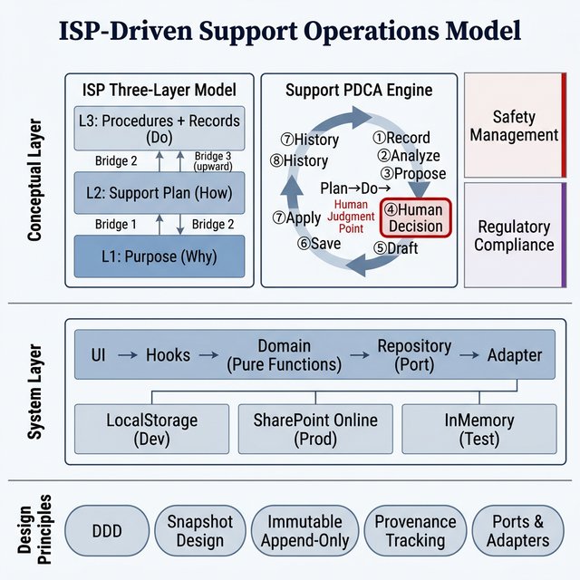

# ISP-Driven Support Operations Model

> **障害福祉サービスにおける ISP 駆動型支援業務 OS の概念と設計**

<p align="center">
  
</p>

---

## 1. 背景

### 障害福祉サービスの現状

障害福祉サービス事業所は、利用者一人ひとりに対して **個別支援計画（ISP: Individual Support Plan）** を策定し、それに基づいた日常支援を行い、定期的にモニタリング・見直しを実施する義務がある。

しかし、現場では以下の構造的課題が存在する。

| 課題 | 現状 | 影響 |
|---|---|---|
| 計画と記録の断絶 | ISP と日次記録が別システム or 紙 | 「なぜこの支援をするのか」が現場に伝わらない |
| モニタリングの属人化 | 時期管理・分析が個人の記憶頼り | 見直し遅延・形骸化 |
| 証跡の後付け | 監査時に証跡を遡って整理 | 本来の支援改善とは無関係な事務負荷 |
| 安全管理の混在 | 支援記録と安全管理が同じ帳票 | 制度対応がボトルネックになる |

### 既存のアプローチとその限界

| アプローチ | 例 | 限界 |
|---|---|---|
| 紙 + Excel | 多くの事業所 | データ分析不能・証跡管理が手動 |
| パッケージソフト | 福祉記録ソフト各社 | 記録のみ。分析・提案・計画更新は手動 |
| グループウェア | kintone / Notion | 汎用すぎて ISP の三層構造を表現できない |
| 自治体システム | 国保連連携 | 請求特化。支援改善の仕組みがない |

**いずれのアプローチも「記録して終わり」であり、記録から計画改善への自動的なフィードバックループを持たない。**

---

## 2. 問題定義

本モデルが解決する問題は、以下の一文に集約される。

> **支援記録は蓄積されるが、それが支援計画の改善に自動的に還元されない。**

この問題を構造的に分解すると、3つの断絶がある。

```
断絶1: ISP の「目的」と日常支援の「手順」が分離している
         → 支援員は「なぜ」を知らずに「どう」だけ実行する

断絶2: 記録はあるが、分析・提案が自動化されていない
         → 記録は書かれるが、誰も読まない

断絶3: 提案があっても、計画への反映が手動である
         → 「見直しが必要」とわかっても、更新されない
```

---

## 3. モデル: ISP-Driven Support Operations Model

### 3.1 設計思想

本モデルは、以下の2つの原則に基づく。

**原則1: ISP を起点とする（ISP-Driven）**

```
ISP（なぜ支援するか）
    ↓
支援計画（どう支援するか）
    ↓
手順と記録（実施と記録）
    ↓
分析とモニタリング（評価）
    ↓
ISP の見直し（改善）
```

ISP が全体の起点であり、最終的な帰着点でもある。
この循環が **自動的に回る** ことが、本モデルの核心である。

**原則2: 人間が判断し、システムが支援する**

```
システム: 記録を分析し、提案を生成する
人間:     提案を受けて、採用・保留・見送りを判断する
システム: 判断結果に基づいて、計画書ドラフトを生成する
人間:     ドラフトを確認し、計画書に反映する
```

**最終判断は常に人間に委ねられる。** システムは意思決定を「代行」するのではなく、「支援」する。

### 3.2 ISP 三層モデル

ISP の構造を3つの層に明確に分離する。

```
┌─────────────────────────────────────────┐
│ L1: ISP                                 │
│ Why — なぜこの支援をするのか             │
│ (生活全体の方向性、長期目標)             │
├─────────────────────────────────────────┤
│ L2: 支援計画シート                       │
│ How — どう支援するか                     │
│ (支援方針、具体的対応、環境調整)         │
├─────────────────────────────────────────┤
│ L3: 手順書兼記録                         │
│ Do + Record — 実施と記録                 │
│ (日常の手順ステップ、実施チェック)       │
└─────────────────────────────────────────┘
```

**なぜ三層か:**

福祉現場の最大の混乱は **L2（支援設計）と L3（日常手順）が混ざること** で起きる。

- L1 と L2 が混ざると → 抽象的すぎて実行できない
- L2 と L3 が混ざると → 手順変更のたびに支援設計が揺らぐ
- L3 が L1 に直結すると → 「なぜ」を飛ばして手順だけが独り歩きする

三層分離により、**各層が独立に更新可能** になる。

### 3.3 三ブリッジ

層と層の間を **橋渡しする変換器（Bridge）** を設ける。

| Bridge | 方向 | 内容 | 人間の関与 |
|---|---|---|---|
| **Bridge 1** | Assessment → L2 | アセスメント結果を支援計画に変換 | 確認+編集 |
| **Bridge 2** | L2 → L3 | 支援方針を日常手順に分解 | 確認+取捨選択 |
| **Bridge 3** | Monitor → L2 | モニタリング結果を計画に還元 | チェックボックス候補提示 |

Bridge 3 は **upward bridge** であり、PDCA サイクルの Act（改善）にあたる。
これにより、日常記録の蓄積が自動的に支援計画の見直しに還元される。

### 3.4 支援 PDCA エンジン

三層モデルの上に、**8ステップのパイプライン** を構築する。

```
① 日次記録    [Do]     支援員が日々の支援を記録
      ↓
② 分析エンジン [Check]  活動分布・行動タグ・目標進捗を自動集計
      ↓
③ ISP 提案    [Check]  進捗に応じた見直しレベルを導出
      ↓
④ 人の判断    [Act]    サビ管が採用/保留/見送りを判断
      ↓
⑤ ドラフト生成 [Act]    判断結果から計画書ドラフトを自動生成
      ↓
⑥ 保存        [—]     SharePoint へスナップショット保存
      ↓
⑦ ISP 反映    [Plan]   ドラフトを計画書フォームへ転記
      ↓
⑧ 履歴        [—]     過去ドラフトの比較・再利用
```

**ステップ④が設計上の最重要点である。**

パイプラインの中央に「人の判断」を配置することで、**システムが意思決定を代行しない** ことを構造的に保証する。

### 3.5 安全管理基盤の分離

支援 PDCA と安全管理は **異なるライフサイクル** を持つため、サブシステムとして分離する。

| 特性 | 支援 PDCA | 安全管理 |
|---|---|---|
| トリガー | 日次記録の蓄積 | 事象発生 or 定期 |
| 判断者 | サビ管 + 支援員 | 管理者 + 委員会 |
| 法的根拠 | ISP 更新ルール（省令） | 虐待防止法・運営基準 |
| 記録の性質 | 改善の記録 | 法的義務の記録 |

分離することで、**支援記録に安全管理の複雑さが侵入しない。**

### 3.6 制度遵守（Regulatory）の横断設計

制度遵守チェックは、他のサブシステムを **読み取り専用で横断参照** する。

```
ISP データ ────────┐
日次記録 ───────────├──→ Regulatory Engine ──→ Finding
安全管理データ ─────┤                           ↓
職員資格データ ─────┘                       Action URL
```

この設計により、**制度チェックが支援業務のフローを邪魔しない。**

---

## 4. 設計原則

このモデルを支える5つの設計原則がある。

### 4.1 ドメイン駆動設計（DDD）

```
UI → Hooks → Domain (Pure Functions) → Repository → Infrastructure
```

Domain 層は **純粋関数のみ** で構成される。副作用がないため、テストが容易で変更に強い。

### 4.2 Snapshot 設計

判断時点のデータを `RecommendationSnapshot` として **凍結保存** する。

後からロジックが変わっても、**「当時どういう分析結果があり、何を提案し、誰がどう判断したか」** を正確に追跡できる。

### 4.3 追記型イミュータブル記録

判断レコード・ドラフト記録は **上書きしない。** 常に新規レコードを追加する。

これにより、完全な **監査証跡（Audit Trail）** が自動的に蓄積される。

### 4.4 Provenance 追跡

全フィールドに **出典情報（Provenance）** を記録する。

```
ProvenanceEntry {
    field:  "observationFacts"
    source: "assessment_icf"
    reason: "ICF b710 関節可動域"
    value:  "左膝関節拘縮あり"
}
```

「いつ・どこから・なぜ この値が書かれたか」を常に追跡可能にする。

### 4.5 Ports & Adapters

データアクセスを **抽象化** し、インフラストラクチャを差し替え可能にする。

```
Domain ←→ Port (Interface) ←→ Adapter
                                  │
                        ┌─────────┼──────────┐
                   LocalStorage  SharePoint  InMemory
                    (開発)        (本番)      (テスト)
```

---

## 5. 実装

### 技術スタック

| レイヤー | 技術 | 選定理由 |
|---|---|---|
| Frontend | React 18 + TypeScript | 型安全 + エコシステム |
| UI | MUI v5 (Material UI) | 福祉現場の操作性 + アクセシビリティ |
| Schema | Zod | ランタイム型検証 |
| Backend | SharePoint Online REST API | Microsoft 365 テナントに標準搭載 |
| Auth | MSAL (Microsoft Entra ID) | 既存の組織 ID 基盤を活用 |
| Build | Vite | 高速ビルド |
| Test | Vitest + React Testing Library + Playwright | ユニット + 統合 + E2E |
| CI/CD | GitHub Actions | 自動テスト + 品質ゲート |

### SharePoint を選んだ理由

| 要件 | SharePoint の優位性 |
|---|---|
| 導入コスト | Microsoft 365 に含まれており追加費用ゼロ |
| 権限管理 | Azure AD (Entra ID) と統合済み |
| 運用保守 | Microsoft が SLA を保証 |
| データ主権 | 法人のテナント内にデータが残る |

### テスト戦略

| 層 | テスト手法 | テスト数 |
|---|---|---|
| Domain | 純粋関数のユニットテスト | 200+ |
| Hooks | React Testing Library | 50+ |
| Integration | Repository + Domain 結合 | 40+ |
| E2E | Playwright ブラウザテスト | 30+ |
| **合計** | | **517+** |

---

## 6. 運用モデル

### 利用者ロール

| ロール | 業務 | 使う機能 |
|---|---|---|
| 支援員 | 日次記録・手順実施 | Daily / Today / Handoff |
| サビ管 | モニタリング・ISP 判断 | PDCA エンジン / ISP Editor |
| 管理者 | 全体管理・監査対応 | Regulatory / Safety / 履歴 |

### データ保全

| 原則 | 内容 |
|---|---|
| 追記のみ | レコードは削除・上書きしない |
| Snapshot 凍結 | 判断時点のデータを保存 |
| 自動リスト作成 | `ensureListExists` で環境差分を吸収 |
| テナント内保持 | データは法人の Microsoft 365 テナントに残る |

---

## 7. 効果（期待値）

### 定性的効果

| 対象 | 現状の課題 | このモデルでの解決 |
|---|---|---|
| 支援員 | 記録後にモニタリング資料を別途作成 | 記録から分析・ドラフトまで自動 |
| サビ管 | ISP 更新時期の把握が属人的 | 進捗・提案が自動で可視化 |
| 管理者 | 監査時に証跡を後付けで整理 | Snapshot + Provenance で常時蓄積 |
| 法人 | 施設ごとに記録方法がバラバラ | 標準化された PDCA フロー |

### 定量的効果（見込み）

| 指標 | 現状（推定） | 導入後（目標） |
|---|---|---|
| ISP 見直し準備の所要時間 | 4〜8 時間 / 人 | 1〜2 時間 / 人 |
| モニタリング期限超過率 | 20〜30% | 5% 未満 |
| 監査証跡の事後整理時間 | 2〜3 日 | 0（常時蓄積） |
| 支援計画シートの更新頻度 | 年1〜2回 | 四半期ごと |

> ※定量的効果は **実運用データの蓄積をもって検証する。**

---

## 8. 今後の発展

### 短期（半年）: 知能化

- ドラフト差分比較
- PDF/Word 出力（行政報告書）
- AI 所見生成
- 管理者ダッシュボード

### 中期（1年）: 連携

- 国保連データ連携強化
- 自治体報告テンプレート
- BI ダッシュボード
- 外部 API 基盤

### 長期（2年）: 拡張

- マルチテナント（多施設展開）
- OSS 公開 or SaaS 化
- 研究連携

---

## 結論

ISP-Driven Support Operations Model は、障害福祉サービスの支援業務を **ISP を起点とする PDCA サイクル** として構造化し、記録の蓄積から計画の改善までを **自動的なフィードバックループ** として実現するモデルである。

このモデルの核心は、以下の3点に集約される。

1. **ISP 三層分離** — 目的・方法・手順を明確に分け、変更の影響範囲を限定する
2. **人間中心の意思決定** — システムは提案し、人間が判断する。裁量は常に人にある
3. **監査証跡の自動蓄積** — Snapshot + イミュータブル + Provenance により、記録が事後的な証跡整理を不要にする

これは「支援記録アプリ」ではなく、**支援業務の OS** である。

---

## 関連ドキュメント

| ドキュメント | 内容 |
|---|---|
| [アーキテクチャ読み解きガイド](architecture-explained.md) | 全体図の各セクション解説 |
| [1 ページ概要](support-pdca-engine-overview.md) | プレゼン・導入向け凝縮版 |
| [完全アーキテクチャ図](system-architecture-complete.md) | ISP 三層 + ブリッジ技術詳細 |
| [完成形ロードマップ](roadmap.md) | Phase 6→7→8 進化図 |
| [業務モデル・運用設計](../operations/operating-model.md) | ロール・フロー・障害対応 |
