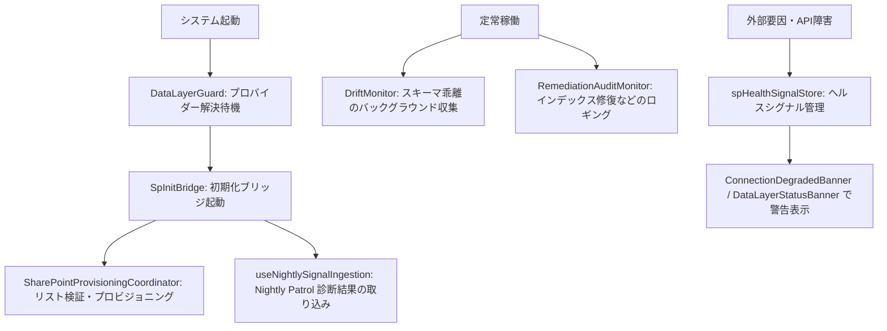

# Audit Management System MVP Observability / Runbook / Health Guard Map Report

調査実施日: 2026年6月19日
対象コミット: `c406bc5f7eb37ed21abd1b6ba72cffc52744ff72`

## 1. 調査目的
本調査の目的は、Audit Management System MVP における異常検知、ステータス表示、自動修復、および可観測性（Observability）の仕組みを整理し、本番運用時の障害対応手順（Runbook）の全体像を可視化することです。
SharePoint リストのスキーマ乖離（Drift）、書き込み制限（Write Disabled）、接続劣化（Degraded）、認証エラー（MSAL/Graph API）などの多様な異常に対し、システムが「どこで検知し、誰にどう見せ、どう回復させるか」を体系化し、運用の信頼性を高めることを目指します。

---

## 2. Runtime Health / Observability の全体像
システムの起動から定常稼働、およびバッチ監視処理における可観測性チェックは、以下のライフサイクルで実行されます。



---

## 3. Global Monitor / Banner / Bridge の役割分担
アプリケーション最上位（`App.tsx`）およびUI共通部分に配置され、システム状態を監視・表示するコンポーネント群の役割分担です。

| 監視/Guard | 監視対象と役割 | 表示先/作用 | 対象者 | 自動修復 | 人間対応 | 判定 |
| :--- | :--- | :--- | :--- | :--- | :--- | :---: |
| **DataLayerGuard** | データプロバイダー初期化完了までの待機制御。 | 接続待機画面 (ローディングスピナー) | 全ユーザー | なし (初期化完了を待機) | 不要 (起動時の自動同期) | **A** |
| **DataLayerStatusBanner** | SharePoint 接続時の必須リスト欠損、列名不一致、フォールバック発生の監視。 | ヘッダー下部 (黄色/赤色の簡易バナー) | 運用者/開発者 | 一部 (代替カラムへのフォールバック) | 必要 (不一致の修復) | **A/B** |
| **WriteDisabledBanner** | `VITE_WRITE_ENABLED=0` 設定時のグローバル警告。 | 画面最上部 (オレンジ色の常駐アラート) | 全ユーザー | なし | 必須 (`.env` 設定の修正) | **A** |
| **DriftMonitor** | アプリ動作中の SharePoint スキーマ乖離イベントの収集と永続化。 (Kiosk除外) | ロジックのみ (UIなし) | 運用者/開発者 | 一部 (大文字小文字/サフィックスの補正) | 必要 (スキーマ同期) | **B** |
| **RemediationAuditMonitor**| インデックス自動構築などの修復ログの収集と永続化。 (Kiosk除外) | ロジックのみ (UIなし) | 管理者/開発者 | 一部 | 必要 | **B** |
| **SpInitBridge** | 起動時の祝日取得およびスキーマプロビジョニング調整。 | ロジックのみ (UIなし) | 開発者/管理者 | 一部 (欠損リストの自動作成 `ensureList`) | 失敗時 (管理者へ通知) | **B** |
| **DemoProcedureSeeder** | デモモード (`VITE_DEMO_MODE=1`) におけるダミーデータの自動挿入。 | ロジックのみ (UIなし) | 開発者/デモ用 | あり (手動変更がない限り自動シード) | 原則不要 | **B** |

### 判定ランクの定義
* **A**: 検知ロジック、表示先、対応手順、テストコードが揃っており、運用の安全性が高い。
* **B**: 検知と表示はあるが、テストコードや詳細な Runbook（人間用復旧手順）が一部不足。
* **C**: 異常は検知できるが、表示先やアクション導線が曖昧で、現場に伝わりにくい。
* **D/E**: ログへの出力のみで運用へのフィードバックがない、または整理が必要。

---

## 4. SharePoint Drift / Provision / Remediation の検知フロー

### 1. スキーマ乖離（Drift）の検知・通知
アプリ実行時に OData マッパーやリポジトリ層でフィールド名の不整合が起きた際、`driftLogic.ts` の `emitDriftRecord` を通じて `driftEventBus` にイベントが発行されます。
* **Drift の型分類**:
  * `case_mismatch`: 大文字小文字の違い (例: `FullName` vs `fullname`)
  * `suffix_mismatch`: カラム名末尾の数字付与 (例: `Status` -> `Status0`)
  * `fuzzy_match`: OData 文字列置換による曖昧一致 (例: `_x0020_` スペース変換)
  * `fallback`: Minimal Fields (最小必須構成) や代替カラムへの切り替え
  * `resolution_failure`: スキーマ解決失敗
* **処理フロー**: `DriftMonitor` の監視スレッド (`DriftObserver`) がイベントをキャッチし、非同期で SharePoint ログリスト（`DriftEventsLog`）に書き込みます（Fail-Open設計により、ログ書き込みの失敗が本来のデータ操作を妨げないよう制御されています）。

### 2. 自己修復（Remediation）とプロビジョニング
アプリ起動時に `SpInitBridge` から呼び出される `SharePointProvisioningCoordinator` は、登録された SharePoint リストスキーマをチェックし、存在しないリストの自動生成 (`ensureList`) やインデックス不足の自動構築を実行します。
* 修復結果は `remediationAuditBus` に通知され、`RemediationAuditMonitor` を介して監査ログに記録されます。

---

## 5. Write Disabled / Degraded / Demo Mode の表示境界

ユーザーに表示される警告バナーは、「業務影響度」に基づいて表示・非表示が厳密に切り分けられます。

### 1. Write Disabled (書き込み保護モード)
環境変数 `VITE_WRITE_ENABLED` が `0` の場合、`isWriteEnabled` が false になり、画面最上部に常駐のオレンジ色警告バナー (`WriteDisabledBanner`) が表示されます。このとき、リポジトリ層の書き込み処理はすべてインターセプトされ、保存処理は実行されません。

### 2. Connection Degraded (接続劣化モード)
`useConnectionStatus` フックが、`spHealthSignalStore` から「最高優先度のヘルスシグナル」を取得して表示を制御します。
* **表示条件**:
  * データプロバイダー設定が未完了である (`config_missing`)。
  * ヘルスシグナルの重要度が `action_required` または `critical` である。
* **表示の意図的抑制ルール (重要)**:
  * 異常のあったリストが「オプション（ライフサイクル: `optional`）」に分類される場合（例: テレメトリログ用リストなど）、または重要度が `watch` や `warning` の場合は、**バナー表示を抑制して `connected`（正常）** と判定します。
  * これは、基幹業務（出欠や支援記録の登録）に直接関係のないエラーで現場の職員に不要な混乱を与えないための「Fail-Open」思想に基づく設計です。

---

## 6. Domain別の観測ポイント
各機能ドメインにおける主要なログ・テレメトリの収集実態です。

1. **Daily (支援記録)**: `TodayHub` からの記録入力時に、必須入力フィールドのスキップ状況を `skippedFieldTelemetry.ts` を用いて計測。
2. **Schedules (スケジュール)**: リスト存在チェックがタイムアウトした場合に `sp_gate_escape_hatch` シグナルを発行し、15秒のタイムアウト前に 7秒で optimistic 救済（UIの永続ハング防止）。
3. **Operations (運営管理)**: 三要素充足監査ログやインデックスガバナンス監査（`index-audit.ts`）の結果を `LatestDiagnosticsReport` へ記録。

---

## 7. CI Failure と Runtime Failure の切り分け
開発・デプロイから本番運用に至るまでの障害トリアージを迅速に行うための切り分けマップです。

```mermaid
graph TD
    A[障害発生] --> B{発生場所はどこか?}
    B -- GitHub Actions CI --> C[CI Failure]
    B -- 本番稼働環境 --> D[Runtime Failure]

    C --> C1{失敗したジョブは?}
    C1 -- TypeCheck / Lint --> C2[TypeScript 型エラーまたは規約違反 <br/> ※unrelated 既存差分に起因する場合はコミット時に --no-verify で回避]
    C1 -- test-ids-guard --> C3[E2E用 data-testid のドリフト]
    C1 -- unit-test / smoke --> C4[ロジックデグレード または act警告 <br/> ※check-act-warnings.mjs の出力を確認]

    D --> D1{バナーの表示内容は?}
    D1 -- 書き込みが無効 --> D2[VITE_WRITE_ENABLED=0 に設定されている <br/> ※.env またはコンテナ環境変数を確認]
    D1 -- データの同期遅延 / 接続劣化 --> D3[SharePoint 認証エラー (MSAL) または OData スキーマ乖離 <br/> ※管理者向け /admin/status での診断情報を確認]
    D1 -- リソースが見つかりません (404) --> D4[SharePoint のリスト未構築 <br/> ※SpInitBridge の bootstrap ログを確認]
```

---

## 8. 現場向け・管理者向け・開発者向けメッセージ分類

対象者のロールや動作モードに応じて、システムはメッセージの粒度を自動的に出し分けます。

* **現場職員（Kioskモード / staff）向け**:
  - キオスク端末や共有画面では、専門用語（OData, Drift, MSAL 等）を徹底的に排除し、「📡 データの同期に時間がかかっています」「再読み込みを試してください」といった平易なアクションガイドを表示します。
* **管理者（normalモード / admin）向け**:
  - `/admin/status`（環境診断）や `/admin/navigation-diagnostics`（ナビ診断）への直行リンク（`actionUrl`）を提供し、「どのリストのどのフィールドで不整合が起きているか（reasonCode）」「期待される SharePoint グループID」などの具体的な診断結果を表示します。
* **開発者（DEVモード）向け**:
  - `import.meta.env.DEV` が有効な場合、認証遷移の内部パラメータを監視する `AuthDiagnosticsPanel` や、コンソールへの詳細な `console.debug('[auth-guard]', guardState)` 出力が有効化されます。

---

## 9. Runbook Gap と次に切るべき小PR候補

可観測性と障害対応をさらに強化するための具体的な改善ロードマップです。

1. **`ci: add-remediation-runbook-reference` (小規模)**
   * **目的**: `ConnectionDegradedBanner` や `/admin/status` 画面の「修復ガイド」の中に、障害発生時の具体的な PowerShell コマンド例（スキーマ強制修復コマンド等）を直接表示するヘルプテキストを埋め込む。
2. **`test: add-drift-simulation-tests` (中規模)**
   * **目的**: テストコード（Vitest）において、意図的に SharePoint フィールド名に大文字小文字の違いやサフィックス不一致を注入し、`driftLogic` が期待通りに fuzzy_match で解決しつつ `DriftEventBus` にシグナルを流すかを検証する統合テストケースを追加。
3. **`ops: align-optional-list-filters` (小規模)**
   * **目的**: `useConnectionStatus` の抑制リストに、新しく追加された補助的なログ用リストを登録し、不要な接続エラー警告バナーの誤表示を完全にシャットアウトする。
