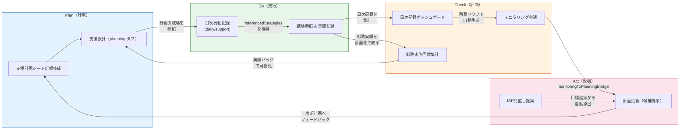
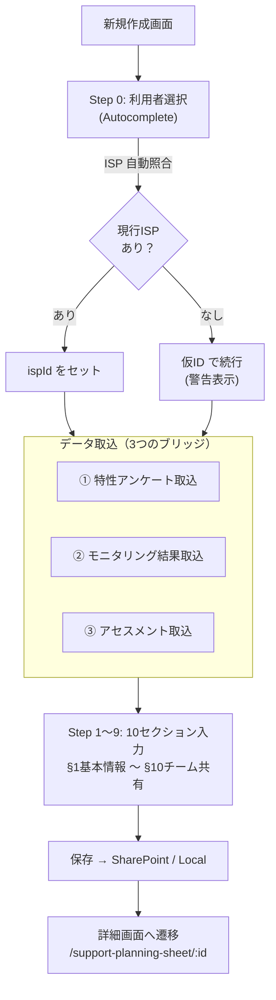
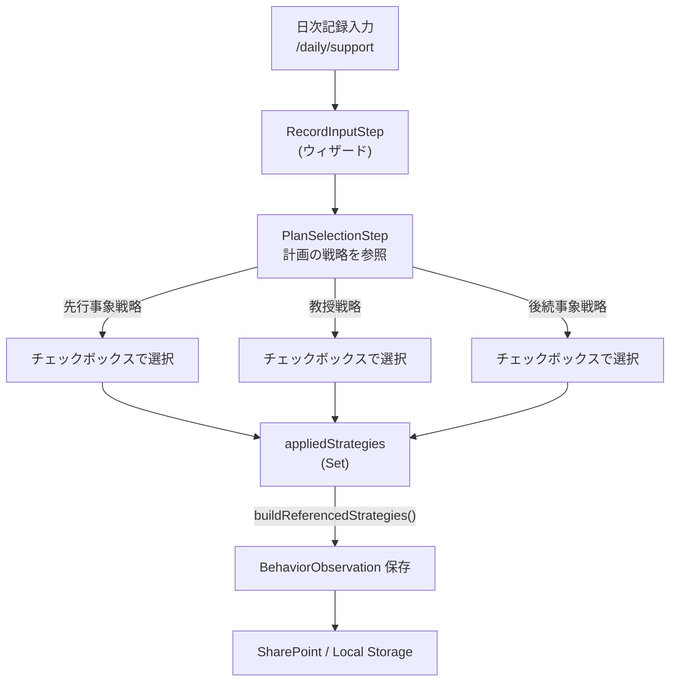
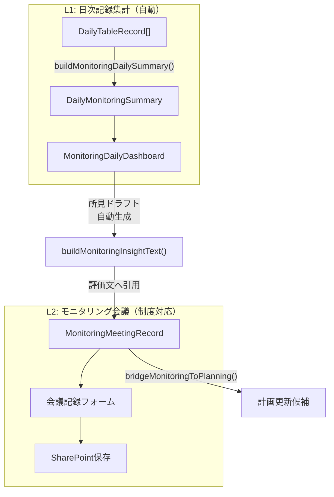
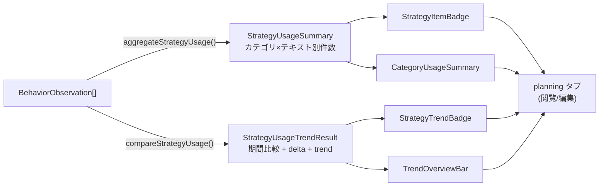
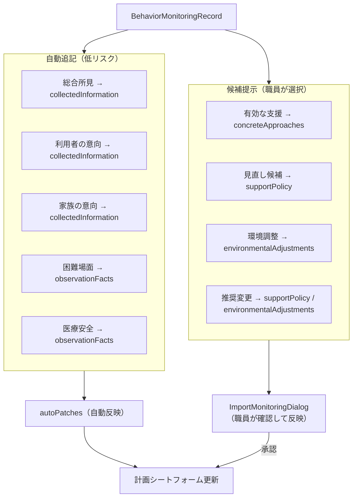
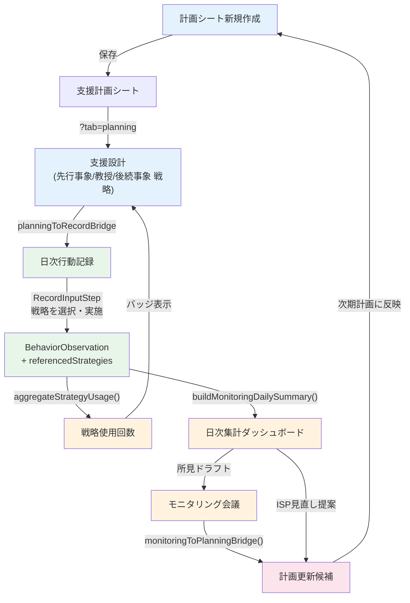

# 支援計画シート PDCA アーキテクチャ全体図

> **支援計画–日次記録–モニタリング循環モデル**
>
> 支援計画シートを起点に、記録・評価・見直しがどう循環しているかを
> 業務ロジックと実装ロジックの両面から説明する。

---

## 1. 概要

本システムの支援計画シートは **静的な文書** ではない。
計画に書いた戦略が現場で参照され、実施記録が残り、
集計結果が計画側に戻ってくる **PDCA 基盤** として機能している。

```
Plan（計画を作る）
  → Do（戦略を参照して支援を実施する）
    → Check（実施結果を集計・評価する）
      → Act（評価に基づいて計画を更新する）
        → Plan（次期計画へ）…
```

---

## 2. PDCA 全体像



---

## 3. Plan: 計画作成と planning タブ

### 3.1 エントリポイント

| 経路 | URL | コンポーネント |
|------|-----|---------------|
| 一覧から新規作成 | `/planning-sheet-list` → 新規ボタン | `PlanningSheetListPage` |
| 直リンク | `/support-planning-sheet/new` | `NewPlanningSheetForm` |
| 詳細/編集 | `/support-planning-sheet/:planningSheetId` | `SupportPlanningSheetPage` |

ルート定義: `src/app/routes/supportPlanRoutes.tsx`

### 3.2 新規作成フロー



### 3.3 3つのデータブリッジ（Plan 方向への取込）

| # | ブリッジ | ソースファイル | 入力 | 出力 |
|---|---------|---------------|------|------|
| ① | 特性アンケート → 計画 | `tokuseiToPlanningBridge.ts` | `TokuseiSurveyResponse` | フォームパッチ + provenance |
| ② | モニタリング → 計画 | `monitoringToPlanningBridge.ts` | `BehaviorMonitoringRecord` | 自動追記パッチ + 候補提示 + provenance |
| ③ | アセスメント → 計画 | `assessmentBridge.ts` | アセスメント結果 | フォームパッチ + provenance |

**全ブリッジ共通の設計原則:**

| 原則 | 説明 |
|------|------|
| **純関数** | 副作用なし。テスト容易 |
| **追記マージ** | 既存テキストを上書きしない。`appendText()` でブロック追記 |
| **冪等性** | 同じ入力から同じ出力。重複照合 (`dedup()`) で二重追記を防止 |
| **provenance** | どのフィールドに・何のデータから・なぜ反映したかを記録 |

### 3.4 planning タブの構造

`?tab=planning` で表示される **支援設計セクション**:

```
支援計画シート詳細
├── overview タブ（基本情報）
├── planning タブ ← ★支援設計
│   ├── §5 支援方針
│   ├── §6 支援設計
│   │   ├── 先行事象戦略（antecedent）
│   │   ├── 教授戦略（teaching）
│   │   └── 後続事象戦略（consequence）
│   │
│   │   各戦略カテゴリごとに:
│   │   ├── ChipInput（戦略の追加/削除）
│   │   ├── CategoryUsageSummary（カテゴリ別使用回数バッジ）
│   │   ├── StrategyItemBadge（個別戦略の使用回数バッジ）
│   │   ├── StrategyTrendBadge（↑ +3 / ↓ -2 トレンド）
│   │   └── CategoryTrendSummary（カテゴリ別トレンド）
│   │
│   └── TrendOverviewBar（期間切替 7/30/90日 + 全体トレンド）
├── environment タブ
└── team タブ
```

---

## 4. Do: 日次記録と referencedStrategies

### 4.1 記録フロー



計画とrecordをつなぐブリッジ: `planningToRecordBridge.ts`

### 4.2 referencedStrategies のデータ構造

```typescript
// BehaviorObservation に optional で付加（既存フローを壊さない）
interface BehaviorObservation {
  id: string;
  userId: string;
  recordDate: string;
  // ... ABC記録フィールド ...

  // Phase C-1 で追加
  referencedStrategies?: ReferencedStrategy[];
}

interface ReferencedStrategy {
  strategyKey: 'antecedent' | 'teaching' | 'consequence';
  strategyText: string;   // ★スナップショット保存
  applied: boolean;       // 実施したかどうか
}
```

**重要な設計判断:**

- **`referencedStrategies` は optional**: 既存データ・既存の保存フローを壊さない
- **`strategyText` はスナップショット保存**: 計画文言が後から変わっても「その時点で何を実施したか」が残る（監査耐性）

### 4.3 保存後の表示

| コンポーネント | 用途 |
|---------------|------|
| `AppliedStrategiesBadges` | 記録一覧で実施戦略をバッジ表示 |
| `TbsRecentRecordsDialog` | 時間帯別直近記録ダイアログ |
| `RecentRecordsDialog` | 直近記録ダイアログ（split-stream） |

---

## 5. Check: 日次集計とモニタリング会議

### 5.1 2層のモニタリング体系



| 層 | 目的 | データソース | 頻度 |
|---|------|-------------|------|
| **L1** | 日常のデータ活用 | `DailyTableRecord[]` | リアルタイム（画面表示時） |
| **L2** | 制度上のモニタリング義務 | `MonitoringMeetingRecord` | 6月に1回以上（法定） |

この分離により、**現場入力を止めずに制度上必要な正式評価にもつなげる** 構造になっている。

### 5.2 L1: DailyMonitoringSummary の集計内容

`monitoringDailyAnalytics.ts` → `buildMonitoringDailySummary()`

| セクション | 型 | 内容 |
|-----------|-----|------|
| `period` | `PeriodSummary` | 記録日数・記録率 |
| `activity` | `ActivitySummary` | AM/PM別 Top活動 |
| `lunch` | `LunchSummary` | 摂食安定度スコア |
| `behavior` | `BehaviorSummary` | 問題行動推移 + 前半後半変化率 |
| `behaviorTagSummary` | `BehaviorTagSummary` | 行動タグ頻度・カテゴリ分布 |
| `goalProgress` | `GoalProgressSummary[]` | 目標別進捗判定 |
| `ispRecommendations` | `IspRecommendationSummary` | ISP見直し提案（自動導出） |

### 5.3 L2: モニタリング会議

`src/domain/isp/monitoringMeeting.ts`

制度根拠: 障害者総合支援法 指定基準 第58条
「少なくとも6月に1回以上」のモニタリング実施義務

```typescript
interface MonitoringMeetingRecord {
  meetingType: MeetingType;
  //   regular | interim | emergency | plan_change
  goalEvaluations: GoalEvaluation[];
  overallAssessment: string;
  planChangeDecision: PlanChangeDecision;
  //   no_change | minor_revision | major_revision | urgent_revision
  decisions: string[];
  nextMonitoringDate: string;
}
```

### 5.4 戦略実施回数の計画側表示

`src/domain/isp/aggregateStrategyUsage.ts`



---

## 6. Act: 計画更新ブリッジ

### 6.1 monitoringToPlanningBridge

`src/features/planning-sheet/monitoringToPlanningBridge.ts`

PDCA ループの **C→A（L2→L2）** を接続する第3ブリッジ。



**2つの反映モード:**

| モード | リスク | UIフロー |
|--------|-------|---------|
| **自動追記** | 低（追記のみ） | ブリッジ実行時に即座にパッチ適用 |
| **候補提示** | 中〜高（方針変更） | `ImportMonitoringDialog` で職員が 1 件ずつ選択 |

### 6.2 ISP見直し提案（自動導出）

`buildIspRecommendations()` が `goalProgress` から自動的に見直し提案を生成:

| 条件 | 提案 |
|------|------|
| 目標進捗が低い | 見直し推奨 |
| 目標進捗が高い | 継続推奨 |
| データ不足 | 保留（データ蓄積待ち） |

### 6.3 ISP計画書ドラフト生成→反映

```
DailyMonitoringSummary + ISP判断記録 + 所見ドラフト
  → buildIspPlanDraft()
    → IspPlanDraftPreview（プレビュー表示）
      → onApplyToEditor() でISP計画書フォームへ転記
      → onSaveDraft() でドラフト保存
```

---

## 7. データモデル

### 7.1 データ循環の全体フロー



### 7.2 主要エンティティ

| エンティティ | 保存先 | ライフサイクル |
|-------------|--------|---------------|
| `PlanningSheetFormValues` | SharePoint / Local | 計画期間中 |
| `BehaviorObservation` | SharePoint / Local | 日次（追記のみ） |
| `DailyTableRecord` | SharePoint / Local | 日次（追記のみ） |
| `MonitoringMeetingRecord` | SharePoint / Local | 会議ごと |
| `IspRecommendationDecision` | SharePoint / Local | 判断ごと（追記のみ） |

---

## 8. ファイル依存関係

### Plan（計画）側

| ファイル | 責務 |
|---------|------|
| `features/planning-sheet/components/new-form/NewPlanningSheetForm.tsx` | 新規作成フォーム（10セクション） |
| `pages/SupportPlanningSheetPage.tsx` | 詳細/編集画面（タブ切替） |
| `features/planning-sheet/components/EditablePlanningDesignSection.tsx` | 支援設計（編集モード） |
| `features/planning-sheet/components/ReadOnlySections.tsx` | 支援設計（閲覧モード） |

### Bridge（橋渡し）

| ファイル | 方向 |
|---------|------|
| `features/planning-sheet/tokuseiToPlanningBridge.ts` | 特性アンケート → 計画 |
| `features/planning-sheet/assessmentBridge.ts` | アセスメント → 計画 |
| `features/planning-sheet/monitoringToPlanningBridge.ts` | モニタリング → 計画 |
| `features/planning-sheet/planningToRecordBridge.ts` | 計画 → 日次記録 |

### Do（実行）側

| ファイル | 責務 |
|---------|------|
| `features/daily/components/wizard/RecordInputStep.tsx` | 行動記録入力（戦略合流） |
| `features/daily/components/AppliedStrategiesBadges.tsx` | 実施戦略バッジ表示 |

### Check（評価）側

| ファイル | 責務 |
|---------|------|
| `features/monitoring/domain/monitoringDailyAnalytics.ts` | 日次記録集計（純関数 693 行） |
| `features/monitoring/components/MonitoringDailyDashboard.tsx` | 集計ダッシュボード UI |
| `domain/isp/aggregateStrategyUsage.ts` | 戦略使用回数集計 + トレンド比較 |
| `domain/isp/monitoringMeeting.ts` | モニタリング会議ドメイン |

---

## 9. 設計原則

### 9.1 純関数中心の集計

以下の関数群はすべて **副作用なし・UI非依存・テスト容易**:

| 関数 | 入力 → 出力 |
|------|------------|
| `buildMonitoringDailySummary()` | `DailyTableRecord[]` → `DailyMonitoringSummary` |
| `aggregateStrategyUsage()` | `BehaviorObservation[]` → `StrategyUsageSummary` |
| `compareStrategyUsage()` | `BehaviorObservation[] + 期間` → `StrategyUsageTrendResult` |
| `bridgeMonitoringToPlanning()` | `BehaviorMonitoringRecord` → `MonitoringToPlanningResult` |
| `buildIspRecommendations()` | `GoalProgressSummary[]` → `IspRecommendationSummary` |
| `buildIspPlanDraft()` | `BuildIspPlanDraftInput` → `IspPlanDraft` |

### 9.2 ブリッジの一方向性

各ブリッジは **一方向** に設計。逆方向は別ブリッジが担当。

```
assessment ──→ planning ──→ record
                  ↑                 │
                  │                 ↓
              monitoring ←── observation
```

責務が混ざらないため、保守・テスト・変更時の影響範囲が限定的。

### 9.3 スナップショット設計

| 対象 | なぜスナップショットか |
|------|---------------------|
| `strategyText` | 計画変更後も「その時点で何を実施したか」を保持 |
| `RecommendationSnapshot` | 判断時点の分析結果を凍結（ロジック変更後も追跡可能） |
| `ProvenanceEntry` | どのデータがどこから来たかを記録（監査証跡） |

### 9.4 段階的自動化

```
完全手動 → テンプレート支援 → 提案型自動化 → 人が最終判断
```

システムは **提案** する。判断の裁量は常に **職員** にある。

---

## 10. 今後の拡張候補

| # | 拡張 | 概要 |
|---|------|------|
| 1 | **しきい値ベースの気づき** | 急増/消失した戦略を自動通知 |
| 2 | **モニタリング会議への戦略実績自動引用** | L2 会議作成時に直近の使用回数・トレンドをドラフト差込 |
| 3 | **audience/route guard の明文化** | viewer / reception / staff / admin の画面アクセス権限表 |
| 4 | **戦略の有効性スコアリング** | 問題行動減少と戦略使用の相関分析 |
| 5 | **計画版間の戦略差分ビュー** | 旧計画と新計画で戦略がどう変わったかを可視化 |

---

## 関連ドキュメント

| ドキュメント | 内容 |
|-------------|------|
| [Support PDCA Engine Overview](support-pdca-engine-overview.md) | ISP パイプラインの全体像 |
| [Support PDCA Engine (Technical)](support-pdca-engine.md) | モニタリング分析エンジンの技術詳細 |
| [ISP Three Layer Model](isp-three-layer-model.md) | ISP 三層モデルの設計思想 |
| [System Architecture (Full)](system-architecture-complete.md) | システム全体のアーキテクチャ |
