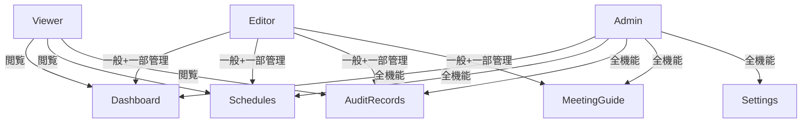

# RBAC早見表（Role-Based Access Control）

## 概要
- 本システムのロール別アクセス範囲を一覧化し、権限制御の根拠・E2Eテスト設計の指針とする。
- 参照: [auth-flow.md](./auth-flow.md)

## 1) ロール定義

| ロール      | 概要                     | 代表ユーザー例         |
|-------------|--------------------------|------------------------|
| Admin       | 全機能・全データ管理     | システム管理者         |
| Editor      | 一般操作＋一部管理       | 担当職員・リーダー     |
| Viewer      | 閲覧のみ                 | 一般職員・外部監査員   |


## 2) アクセス権限マトリクス

| ページ/機能                | Admin | Editor | Viewer |
|----------------------------|:-----:|:------:|:------:|
| ダッシュボード             |  ○    |   ○    |   ○    |
| 予定（スケジュール）        |  ○    |   ○    |   ○    |
| 監査記録一覧               |  ○    |   ○    |   ○    |
| 監査記録の新規作成         |  ○    |   ○    |   ×    |
| 監査記録の編集・削除       |  ○    |   ○    |   ×    |
| 監査ガイド（meeting guide）|  ○    |   ○    |   ×    |
| 設定画面                   |  ○    |   ×    |   ×    |
| 管理者専用機能             |  ○    |   ×    |   ×    |


## 3) Mermaid可視化




## 4) E2E到達テスト例

- Admin: `/dashboard/meeting` へ到達可
- Viewer: `/dashboard/meeting` へは退避 or 403 UI

```ts
// tests/e2e/roles-access.e2e.ts
import { test, expect } from '@playwright/test';
test('viewer cannot access meeting guide', async ({ page }) => {
  await page.goto('/dashboard/meeting');
  // 403 UI なら:
  // await expect(page.getByTestId('forbidden')).toBeVisible();
  // リダイレクトなら:
  // await expect(page).toHaveURL(/\/dashboard/);
});
```

## 5) 注意点・運用Tips
- ロール判定は `auth-flow.md` のガード順に従う
- 新機能追加時はこの表を必ず更新
- E2Eテストは全ロール分の到達/制限を網羅
