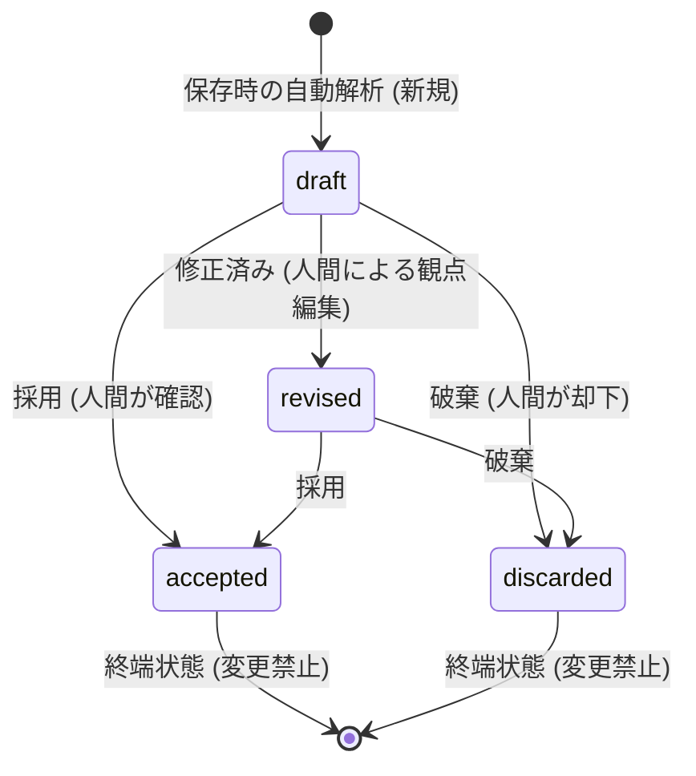

# Audit Management System MVP Record Quality Human Review Lifecycle / Safety Contract

調査実施日: 2026年6月19日
対象コミット: `7dde895340c5a6914f2c12ecd858621d5821a105`

## 1. 調査目的
本ドキュメントは、Audit Management System MVP における「記録品質レビュー（Record Quality Review）」のライフサイクルと安全契約（Safety Contract）の仕様を整理し、本番運用時の安全性と信頼性を保証するための設計境界を明確にすることを目的とします。
本システム内の自動レビュー機能がどのように人間の意思決定を支援し、原本データを破壊せず、安全なメタデータとしてのみ振る舞うかを体系化します。

---

## 2. Record Quality Review の安全設計原則
対象コミット時点のコード設計に基づけば、自動レビュー（AI / ルールベース）の出力は常に以下の安全原則（Safety Guard）に従います。

* **人間の確認の必須化 (Requires Human Review)**:
  - システムが生成する評価やチェック内容は、確認なしに直接外部（監査機関や保護者など）へ連携されたり、支援方針として確定されることはありません。必ず人間がレビューして採用または破棄するプロセス（Human-in-the-loop）が義務付けられます。
* **判定代替の排除 (No Auto-Judgment)**:
  - システムは「利用者の障害を診断する」「行動の善悪をジャッジする」「支援の方針を決定する」といった行為を行いません。これらはシステムレベルで「禁止行為（Prohibited Actions）」として厳密に保護されています。

---

## 3. Source of Truth と Review Metadata の分離
原本データ（Source of Truth）とレビュー用のメタデータの関係には、厳格なセキュリティ・プライバシー境界が敷かれています。

* **原本データの一元管理**:
  - 利用者の支援記録テキストそのものは、原本（デイリー記録等）にのみ存在し、レビューデータ（`RecordQualityReviewDraft`）には**保存されません**。
* **メタデータの非永続化設計**:
  - 対象コミット時点のコード実装（`recordQualityReview.spec.ts` での検証等）が示す通り、レビュー下書きオブジェクトには原本テキスト（`originalText` 属性）は持たせず、原本への一意なID参照（`originalRecord` の `recordId`）のみを保持します。
  - これにより、プライバシー情報の二次保持を防ぎ、原本テキストが修正された場合でも不整合が起きないよう設計されています。

---

## 4. Human Review Lifecycle
自動レビューが生成されてから人間が処理するまでの状態遷移（Lifecycle）は以下の通りです。

### 状態遷移の制約（コード実装に基づく仕様）
* **初期状態 (`draft`)**:
  - 支援記録保存時にシステムで自動検出された初期のレビュー下書き。
* **中間状態 (`revised`)**:
  - 人間が確認観点などを編集・補正した状態。
* **終端状態 (`accepted` / `discarded`)**:
  - 採用（`accepted`）または破棄（`discarded`）に遷移したものは**終端状態**となり、これ以降の状態移行（例: `accepted` から `discarded` への再遷移等）はシステムによってエラーとしてブロックされます（後述のテストでも厳密に保護）。

---

## 5. Daily Record 保存時の連携フロー
支援記録が保存される際、品質レビュー下書きはバックグラウンドで自動同期して構築されます。

1. **保存処理のインターセプト (`saveDailyRecordWithQualityReview`)**:
   - 支援記録の入力保存時、原本の保存処理に続いて自動的に品質レビューの構築フローが呼び出されます。
2. **対象テキストの抽出**:
   - 利用者ごとの「午前活動」「午後活動」「食事量」「特記事項」を抽出し、空白トリミングおよびフィルタリングを行った上で連結したレビュー用テキストを作成します。
3. **重複作成の防止**:
   - リポジトリから既に当該日付・利用者IDに対するレビューデータが存在するかを確認し、存在する場合は新規作成をスキップします。これにより、二重作成を避けて人間側の重複レビュー負荷を抑えます。
4. **解析と永続化**:
   - レビューデータが存在しない場合、キーワード分類機能（`classifyRecordQuality`）を実行して下書き（`draft`）を生成し、レビューリポジトリへ保存します。

---

## 6. Decision Model / Queue / Repository の責務
レビュー下書きを管理・表示するコンポーネント間の責務分担です。

* **`RecordQualityReviewRepository`**:
  - レビューデータの永続化を担い、データプロバイダーに応じたアダプター（InMemory / SharePoint / Firestore 等）を介してデータを読み書きします。
* **`RecordQualityHumanReviewQueueRepository`**:
  - 人間のレビューを待つ「アクティブな確認待ちキュー」を一覧化します。
  - **表示フィルタ仕様**:
    - 対象コミット時点のコード仕様によれば、キューに表示されるアイテム（`items`）は、ステータスが **`draft` または `revised` の未確定なもののみ**に制限されます。
    - `accepted` または `discarded` に遷移したアイテムは、キューの表示一覧からは自動的に除外されます。
* **`buildRecordQualityHumanReviewQueueSummary`**:
  - 確定済み・未確定を問わず、全体の件数内訳（要確認件数、未確認件数、修正済み件数、採用済み件数、破棄件数）を集計し、進捗状況のサマリーを返します。

---

## 7. UI 上の人間レビュー導線
画面（`RecordQualityHumanReviewPage` および内部コンポーネント）では、職員が以下の直感的な操作を行えるようUI導線が提供されています。

* **進捗サマリー表示**:
  - チップ（Chip）を用いて「要確認〇件」「未確認〇件」「修正済み〇件」などの内訳数および最古の更新日時を表示し、業務の滞留を防ぎます。
* **意思決定アクションボタン**:
  - 各レビュー項目に対して、以下の3つのボタンを提供し、ワンクリックで状態遷移を実行します。
    1. **採用**: 対象項目を `accepted` 状態へ移行。
    2. **修正済み**: レビュー時の確認観点を修正・編集し、`revised` 状態へ移行。
    3. **破棄**: 対象項目を不要と判断し、`discarded` 状態へ移行。

---

## 8. 禁止される遷移・禁止される推論

### 1. 状態遷移の禁止契約
一度 `accepted` または `discarded` に到達したレビューに対し、再度アクション（`accept` や `discard` 等）を実行すると、例外エラーが発生して処理をブロックします。これにより、一度人間が完了とした判断を誤って後から上書きしてしまう事態を防ぎます。

### 2. 禁止される推論・判断（`doNotInfer` および `prohibitedActions` 仕様）
対象コミット時点のコード上で確認できた範囲では、以下の安全制約が厳密にコードとテストで定義されています。

* **システム上の絶対的禁止行為 (`prohibitedActions`)**:
  - 利用者の病名・障害をシステムで自己診断する行為 (`diagnoseUsers` / `diagnose_users`)。
  - 本人の行動の良し悪しや問題性をシステムが一方的にジャッジする行為 (`judgeBehavior` / `judge_behavior`)。
  - 方針をシステムが自動で確定する行為 (`automaticallyDetermineSupportPolicy` / `determine_support_policy`)。
  - 原本の支援記録テキストをシステムが改ざん・上書きする行為 (`overwriteOriginalRecord` / `overwrite_original_record`)。
* **ドメイン推論制限 (`doNotInfer`)**:
  - 各種判定カテゴリ（体調・服薬、食事・水分、排泄、睡眠、感情・不安など）において、機械的なマッチングの際に「病名を断定しない」「原因を決めつけない」「医療的判断を下さない」「性格特性として単純化しない」という境界がコード上の規約として定められています。

---

## 9. テストカバレッジ

本安全設計およびライフサイクルは、`recordQualityReview.spec.ts` などのユニットテストにより、以下の観点から自動検証されています。

* **安全メタデータの検証**:
  - 新規作成した下書きに、`sourceOfTruth: 'original_record'`、`outputKind: 'review_metadata'`、および `requiresHumanReview: true` が正しくセットされていることの検証。
  - 状態遷移後（例: `accepted` 移行後）も、`prohibitedActions` の安全制約配列が改ざんされずに保持されていることの検証。
* **原本テキスト非保持の検証**:
  - レビュー下書きオブジェクトの属性に `originalText` が含まれておらず、原本の非永続化設計が維持されていることの検証。
* **不当な状態遷移の拒否**:
  - `accepted -> accepted`、`discarded -> accepted`、`accepted -> discarded` などの不正な二重遷移を実行した際に、期待されるエラーメッセージ（`Cannot transition...`）を伴って例外が正しくスローされることの検証。

---

## 10. 今後の改善ロードマップ (Next Small PRs)

1. **`test: add-queue-re-sorting-specs` (小規模)**
   * **目的**: レビューキュー（Queue）において、アイテムを更新日時の昇順でソートする仕様（最古のアイテムを最優先で表示する）が、データ追加やステータス更新時にも崩れないことを検証する単体テストを追加。
2. **`ui: enforce-prohibited-actions-disclaimer` (小規模)**
   * **目的**: 人間レビュー画面（WorkflowSummary）の最上部に、安全指針（病名診断・善悪判断の禁止など）を明記した確認用免責バナー（Disclaimer Alert）を常時表示し、現場職員の安全意識を啓蒙する。
3. **`ops: align-daily-row-cleanup-triggers` (中規模)**
   * **目的**: 支援記録が原本側で「削除」された場合、それに関連付けられた `RecordQualityReview` の下書きメタデータも自動的に連動してクリーンアップされるトリガー処理をアプリケーション層へ追加。
