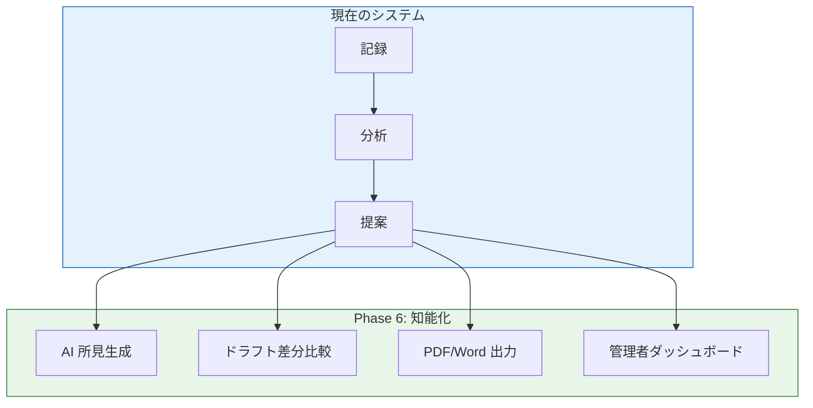
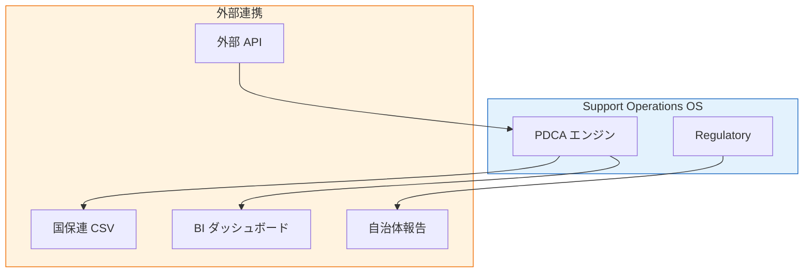
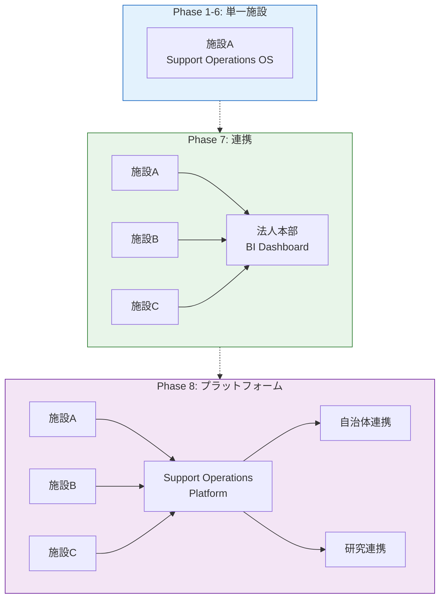
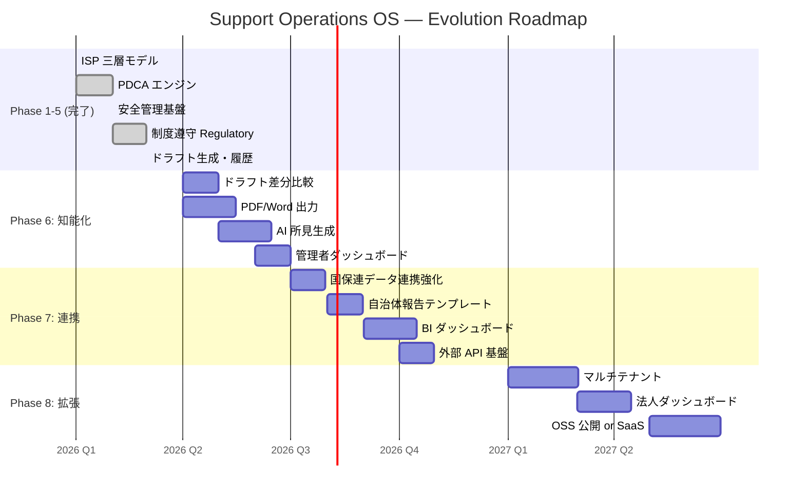

# Support Operations OS — 完成形ロードマップ

> **現在 → 半年後 → 2年後の進化図**
> 業務 OS としての到達点と、その先の可能性を描く

---

## 現在地（2026 Q1）

### 到達済みの成熟度


### 完成しているもの

| サブシステム | 状態 | 機能レベル |
|---|---|---|
| ISP 三層モデル | ✅ 完成 | L1/L2/L3 + 三ブリッジ + Provenance |
| 支援 PDCA エンジン | ✅ 完成 | 記録→分析→提案→判断→ドラフト→反映→履歴 |
| 安全管理基盤 | ✅ 完成 | 危機対応 + 身体拘束 + 適正化 + 研修 + 指針版 |
| 制度遵守 Regulatory | ✅ 完成 | Audit Checks + Finding + Evidence + Iceberg |
| 日常運用画面 | ✅ 完成 | Today / Dashboard / Handoff / Schedule / Daily |
| ドキュメント体系 | ✅ 完成 | README + 概要 + 技術 + 運用 + 読み解きガイド |

### 現在の技術的な強み

| 強み | 理由 |
|---|---|
| **完全な監査証跡** | Snapshot + イミュータブル + Provenance |
| **ゼロタッチ環境構築** | `ensureListExists` + ファクトリパターン |
| **テスト駆動** | 517+ テスト + Vitest + Playwright |
| **ドメイン分離** | 純粋関数 Domain 層で変更に強い |

---

## Phase 6（〜半年後・2026 Q2–Q3）

### テーマ: **「記録の知能化」**

記録を溜めるだけでなく、記録が **自ら語り始める** フェーズ。



| 機能 | 価値 | 難易度 | 優先度 |
|---|---|---|---|
| **6-A: ドラフト差分比較** | 前回 ↔ 今回の変更を可視化。「何が変わったか」が一目でわかる | ★★☆ | ★★★ |
| **6-B: PDF/Word 出力** | 制度報告書の自動生成。行政提出が楽になる | ★★★ | ★★★ |
| **6-C: AI 所見生成** | タグ分析 + 進捗から文章を自動生成。月次報告が半自動化 | ★★★ | ★★☆ |
| **6-D: 管理者ダッシュボード** | 全利用者のドラフト状況を一望。サビ管の判断負荷を軽減 | ★★☆ | ★★☆ |

### 6-A: ドラフト差分比較

```
ドラフト v1 (2月)    ドラフト v2 (3月)
┌──────────────┐    ┌──────────────┐
│ 目標1: 継続   │    │ 目標1: 継続   │
│ 目標2: 変更案 │ →→ │ 目標2: 変更済 │ ← 差分ハイライト
│              │    │ 目標3: 新規追加│ ← 新規ハイライト
└──────────────┘    └──────────────┘
```

### 6-B: PDF/Word 出力

```
ISP エディタ
    ↓
テンプレート選択
    ↓
PDF 生成（自治体フォーマット準拠）
    ↓
ダウンロード or 直接印刷
```

---

## Phase 7（半年後〜1年後・2026 Q3–Q4）

### テーマ: **「つながる OS」**

単一施設の OS から、**外部とデータが行き来する OS** へ。



| 機能 | 価値 | 影響範囲 |
|---|---|---|
| **7-A: 国保連データ連携強化** | CSV 出力を標準化。事務作業を大幅削減 | 事務 + 管理者 |
| **7-B: 自治体報告テンプレート** | 各自治体フォーマットに合わせた報告生成 | 管理者 |
| **7-C: BI ダッシュボード** | 経営層向け。利用率・支援密度・コスト可視化 | 法人経営 |
| **7-D: 外部 API 基盤** | 他システムからの記録取り込み基盤 | 開発者 |

---

## Phase 8（1年後〜2年後・2027）

### テーマ: **「拡がる OS」**

単一施設 → **多施設展開** → **プラットフォーム化**



| 段階 | 形態 | 必要なもの |
|---|---|---|
| **8-A: マルチテナント** | 施設ごとの SharePoint サイト分離 | テナント設計 + 環境変数管理 |
| **8-B: 法人ダッシュボード** | 複数施設の横断集計 | BI 層 + 権限管理 |
| **8-C: OSS 公開** | GitHub 公開 + ドキュメント整備 | ライセンス + コントリビューションガイド |
| **8-D: SaaS 化** | ホスティング + 課金 + オンボーディング | Azure 基盤 + Stripe |

---

## 進化タイムライン全体図



---

## 分岐点（Phase 7 後の判断）

Phase 7 までは共通です。
Phase 8 で **OSS か SaaS かの分岐** が発生します。

```
Phase 7 完了
    │
    ├──→ OSS ルート
    │     ├ GitHub 公開
    │     ├ ドキュメント英語化
    │     ├ コミュニティ形成
    │     └ 自治体・研究機関連携
    │
    └──→ SaaS ルート
          ├ Azure 基盤構築
          ├ マルチテナント
          ├ 課金システム
          └ 導入支援サービス
```

| ルート | メリット | リスク |
|---|---|---|
| **OSS** | 信用が増える。研究発表に使える。福祉業界への貢献 | マネタイズが弱い |
| **SaaS** | 法人導入で収益化。サポートで差別化 | 開発・運用コストが継続的に発生 |
| **ハイブリッド** | コア OSS + 付加価値 SaaS。最もバランスが良い | 両方の運用が必要 |

---

## 研究テーマ化（並行可能）

この OS は **論文テーマ** として独立に成立します。

### テーマ候補

```
「障害福祉サービスにおける
  ISP 駆動型支援業務 OS の設計と実装」
```

### 論文構成（現時点での充足率）

| 章 | 内容 | 充足率 |
|---|---|---|
| 1. 背景 | 福祉 DX の現状と課題 | 80% (Operating Model に記載) |
| 2. 課題 | L2/L3 混同・PDCA 断絶・証跡不在 | 90% (Architecture Explained に記載) |
| 3. モデル | ISP 三層 + PDCA エンジン + 設計原則 | **100%** (全ドキュメント完成) |
| 4. システム | アーキテクチャ + 技術スタック | **100%** (System Architecture) |
| 5. 運用 | ロール + フロー + 障害対応 | **100%** (Operating Model) |
| 6. 効果 | 運用データ + 定量評価 | 20% (実運用データ蓄積待ち) |

> **現時点で論文の約 80% が完成** しています。
> 残りは実運用データの蓄積と定量評価のみ。

---

## バージョン命名規則（提案）

| バージョン | フェーズ | 名称 |
|---|---|---|
| **v1.0** | Phase 1–5 完了 | **ISP-Driven Support Operations Model** |
| **v2.0** | Phase 6 完了 | **Intelligent Support OS** |
| **v3.0** | Phase 7 完了 | **Connected Support OS** |
| **v4.0** | Phase 8 完了 | **Support Operations Platform** |

---

## 関連ドキュメント

| ドキュメント | 内容 |
|---|---|
| [アーキテクチャ読み解きガイド](architecture-explained.md) | 図の「読み方」解説 |
| [1 ページ概要](support-pdca-engine-overview.md) | README / プレゼン向け凝縮版 |
| [完全アーキテクチャ図](system-architecture-complete.md) | 技術詳細 |
| [業務モデル・運用設計](../operations/operating-model.md) | ロール・フロー・障害対応 |
