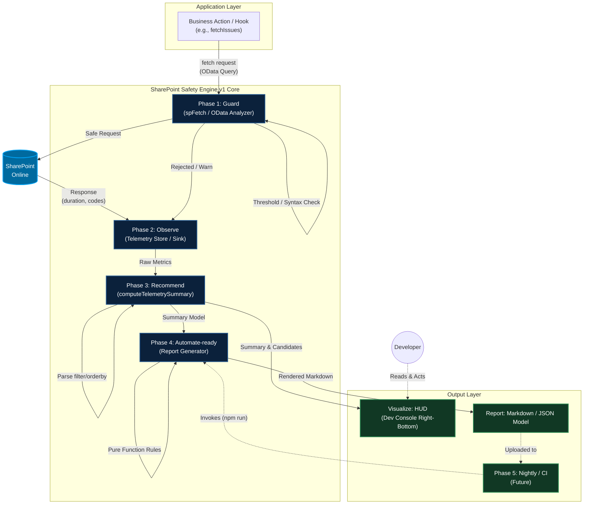

# SharePoint Safety Engine v1 

**SharePoint Safety Engine v1 は、SharePoint REST / Graph API 開発における高リスク OData クエリを、予防・観測・推薦可能にする軽量 Observability ミドルウェアである。**

開発における「クエリの勘定・不安定性の事故」を開発者の勘ではなく**構造によって減らす自動化基盤**として設計されています。「クエリを事前に防ぎ、発生した事実を観測し、リアルタイムで画面に提示し、最終的に運用レポート化する」までのライフサイクルが完全に回り始めています。

---

## Architecture Diagram

---

## 4フェーズ構造の役割と実装

本エンジンはビジネスロジックから独立し、以下の4つのコア・フェーズによって構成されています。

- **Phase 1: Guard (防止)**
  - 対象: `spFetch` / `graphFetch`
  - 指針: アプリケーションから発火される OData クエリ (`$top`, `$filter` 等) をリクエスト前に解析。5000件問題やサポート外のクエリ構文を未然に防ぎ、サーバー起因の 500/503 エラーを誘発させません。
- **Phase 2: Observe (観測)**
  - 対象: `telemetry.ts`, `telemetryStore.ts`
  - 指針: クエリの実行時間 (`durationMs`)、リスクレベル、エラーコード等のメトリクス情報を集計ストアにプールします。Zustand の軽量 Store を用い、パフォーマンスを阻害しません。
- **Phase 3: Recommend (推薦)**
  - 対象: `computeTelemetrySummary.ts`, `extractor.ts`
  - 指針: 蓄積された生のテレメトリ情報と OData 構文から、纯粋関数ベースの Parser (`extractor`) を用いて軽量・高速にインデックス候補列を抽出・スコアリングします。
- **Phase 4: Automate-ready (自動化準備)**
  - 対象: `reportGenerator.ts`
  - 指針: 整理済みのサマリモデルを受け取り、Markdown (あるいは JSON Model) へ変換する純粋関数 (Pure Function) 層です。I/O 処理を持たず、ノイズ除外の閾値オプションを持ちます。

### Output: 実装の出口
上記のコア層を通過したデータは、以下の出力層によって外界や開発者へ届けられます。

- **Visualize:** UI として常駐する HUD (`QueryTelemetryHUD.tsx`)。Recommend が出力した情報をリアルタイムで開発画面へ映し出します。
- **Report:** Automate 層が出力する Markdown レポートテキストや JSON モデル。

---

## 運用境界の設定 (Operational Boundaries)
Safety Engine v1 は、あくまで**「アプリケーション側で完結する観測・提案モジュール」**です。以下の境界を逸脱しないように設計されています。

1. **IO およびネットワークから隔離された Reporter (Automate層)**
   - ファイルアクセスや API 通信を一切行わず純粋関数として機能するため、CLI、GitHub Actions、内部 API などあらゆる実行基盤に安全に組み込めます。
2. **SharePoint 側の「実際のインデックス」は確認しない (越権の排除)**
   - アプリケーションが「実行したクエリの振る舞い」からインデックス要否を推定・推薦することに特化し、SharePoint サーバー本体へ設定情報を照会する機能は持ち合わせません。
3. **断定論調の排除**
   - レポート上での提案は「必須である」という強制ではなく、「頻度や遅延を伴うため確認を推奨する」という開発・運用支援のトーンに留めます。

---

## 次フェーズの入口 (Phase 5: Runtime Integration)
Safety Engine コアロジック (v1) の完了により、システムは継続的運用・監視機能（Observability Platform）へと進化しました。今後は以下の機構（Phase 5）を、必要になったタイミングで容易に拡張可能です。

- **Phase 5-A: Nightly Audit Runner**
  - アプリケーション外から実行可能な CLI（例: `npm run audit:nightly`）を構築し、蓄積された Telemetry から定期的にレポートを生成する口を作ります。
- **Phase 5-B: CI / GitHub Actions Wiring**
  - Nightly 時の GitHub Actions などで Action を回し、自動的に Markdown レポートを GitHub の Issue に起票・コメントする仕組みを構築します。
- **Phase 5-C: Artifact Output & Notifications**
  - Teams / Slack への Webhook 統合による、危険クエリアラートの自動通知への展開。
