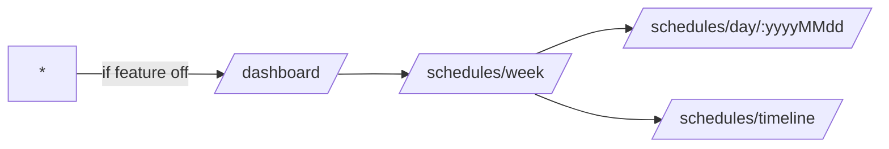

# Schedules Architecture

## 概要
- 目的: 週間/日/タイムラインの 3 画面で職員予定・連絡事項を可視化
- 依存: `Feature Flags`, `env.ts`, `useSP` or Microsoft Graph

## 1) ルーティング規約
- `/schedules/week` — 週表示（デフォルト）
- `/schedules/day/:yyyyMMdd?` — 日表示（省略時は今日）
- `/schedules/timeline` — 担当者軸の横断タイムライン
- **直リンク方針**: タブではなく **パス**で状態を表現（E2E安定）

## 2) Feature Flags

変数	例	意味
VITE_FEATURE_SCHEDULES	1	ルート/ナビ有効化
VITE_FEATURE_SCHEDULES_GRAPH	1	取得元を Demo→Microsoft Graph に切替

	• オフ時：ナビ非表示＋直アクセスは /dashboard に退避
	• E2E：localStorage["feature:schedules"]="1" を事前注入で強制開通

## 3) タイムゾーン方針
	• VITE_SCHEDULES_TZ（既定：Asia/Tokyo）を壁時計→UTCで確定
	• 禁止：Date#setHours 等のローカル依存丸め
	• 実装：zonedTimeToUtc 相当のヘルパ経由に統一

## 4) テスト観点（最小）
	• ルート到達：/schedules/week / /schedules/day / /schedules/timeline
	• フラグOFF直リンク：* → /dashboard に退避
	• TZ差：月末/閏日/週またぎの表示崩れ無し（ユニット）
	• Graph切替：ダミーデータ→Graph の条件分岐 1 本

## 5) 推奨 data-testid
	• schedules-week-page, schedules-day-page, schedules-timeline-page
	• ナビ: nav-schedules-week, nav-schedules-day, nav-schedules-timeline

## 6) よくある落とし穴
	• TZ未設定で海外ロケール端末がズレる → getAppConfig() で IANA 確定必須
	• 週始まりが UI とロジックで不一致 → VITE_SCHEDULES_WEEK_START を単一ソースに
