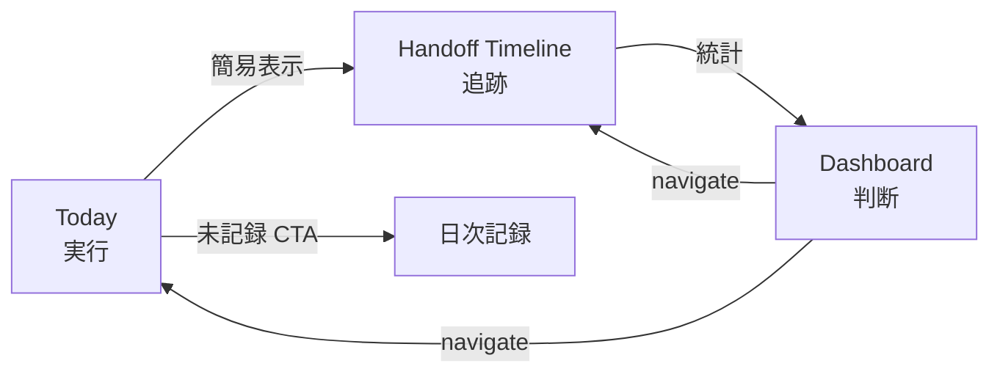
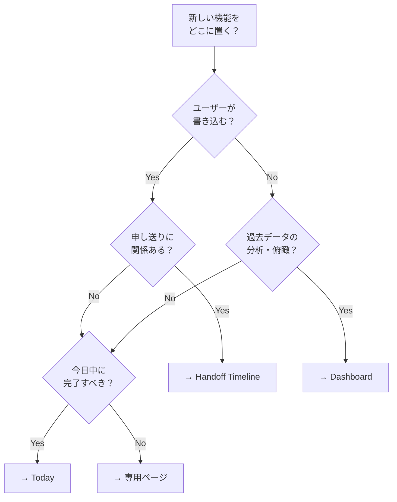

# 3画面責務分担マップ

Dashboard / Today / Handoff Timeline の責務境界を定義し、新機能の配置判断に使う。

---

## 1. 一言定義

| 画面 | ルート | 一言定義 | 使う人 | 使うタイミング |
|-----|-------|---------|-------|-------------|
| **Dashboard** | `/dashboard` | **判断・俯瞰・管理** | 管理者・サビ管 | 随時（週次含む） |
| **Today** | `/today` | **実行・入力・未処理ゼロ化** | 全職員 | 朝〜終業 |
| **Handoff Timeline** | `/handoff-timeline` | **申し送り記録・追跡・状態遷移** | 全職員 | 気づいた時・朝夕会 |

---

## 2. 各画面の責務

### Dashboard — 判断レイヤー

**向いているもの:**
- 出席率・記録率の集計と傾向
- 週次サマリー・グラフ
- クロスモジュールアラート（安全、記録漏れ等）
- 朝会 / 夕会の振り返り view
- 管理者向け役割別セクション
- 統合利用者プロファイル

**向いていないもの:**
- 個別データの入力・記録
- リアルタイムのステータス操作
- 「今すぐやる」タスク

> Dashboard は **読んで判断** する画面。書き込む操作は別画面への導線にとどめる。

### Today — 実行レイヤー

**向いているもの:**
- 未記録 → 記録への CTA
- 出席状況のリアルタイム一覧
- 今日のブリーフィング（共有事項 + 引き継ぎ要点）
- 業務体制の確認
- 次のアクション表示
- 送迎進捗

**向いていないもの:**
- 過去データの振り返り・統計
- 週次集計
- 申し送りの詳細ワークフロー（状態遷移・コメント）

> Today は **朝 開いて → 全部済ませて → 閉じる** 画面。残タスクをゼロにすることがゴール。

### Handoff Timeline — 申し送り追跡レイヤー

**向いているもの:**
- 申し送りの新規作成・編集
- ステータス遷移（未対応 → 対応中 → 完了）
- 会議モード（朝会 / 夕会）
- コメントスレッド
- 監査ログ
- カテゴリー別サマリー・統計

**向いていないもの:**
- 出席管理
- 日次記録の入力
- スケジュール閲覧
- 業務体制の確認

> Handoff Timeline は **記録して → 追跡して → 会議でクローズ** する画面。情報の寿命管理が責務。

---

## 3. 境界の重要ルール

### Today は Handoff の consumer

`/today` は申し送りの **簡易表示** (`TodayHandoffTimelineList`) を埋め込むが、
詳細ワークフロー（ステータス遷移・コメント・監査）は `/handoff-timeline` 本体に委譲する。

### Dashboard は集約 view

`/dashboard` は各モジュールの集約データを **読み取り専用** で表示。
書き込みは Dashboard 内で完結せず、対象画面への navigate で行う。

### 3画面の情報の流れ

---

## 4. 新機能の配置判断フロー

---

## 5. よくある迷いパターン

| パターン | 正解 | 理由 |
|---------|------|------|
| 「未記録アラート」 | **Today** | 今日中に潰すタスク |
| 「今週の記録率グラフ」 | **Dashboard** | 俯瞰・判断 |
| 「気になった点をメモ」 | **Handoff Timeline** | 追跡・状態管理が必要 |
| 「職員の在席確認」 | **Today** | 今日の業務体制 |
| 「先週の申し送り傾向」 | **Dashboard** | 統計・分析 |
| 「送迎の進行確認」 | **Today** | リアルタイム実行 |
| 「朝会で昨日分を振り返る」 | **Handoff Timeline** | dayScope='yesterday' |
