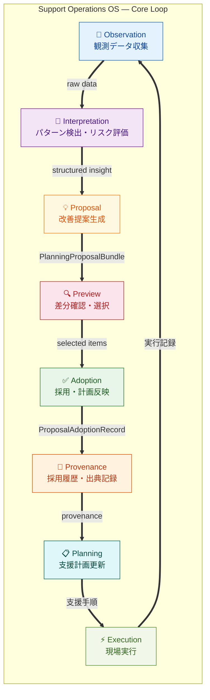
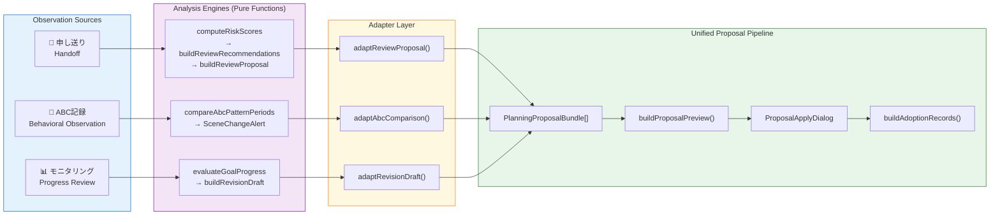
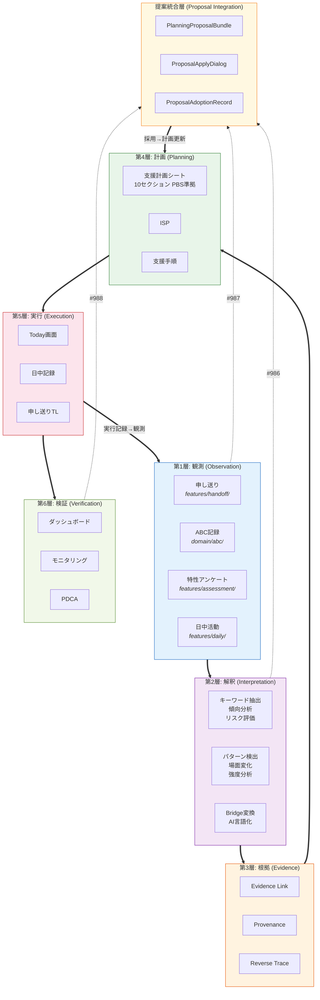
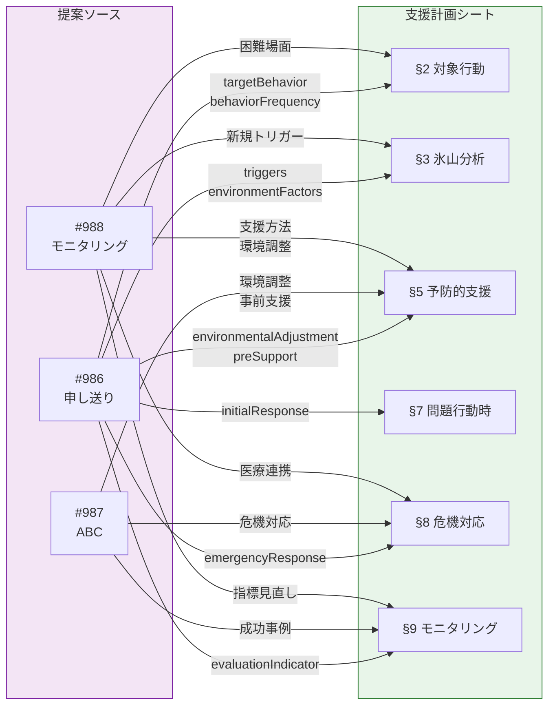
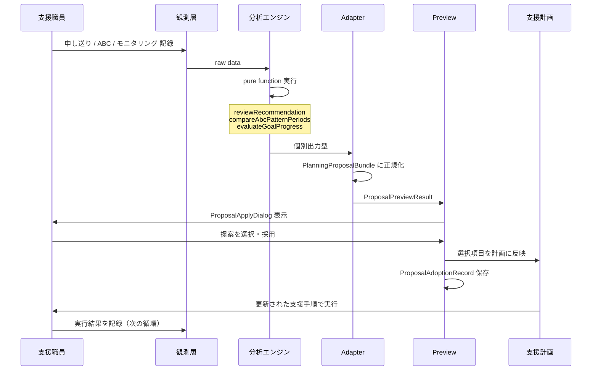
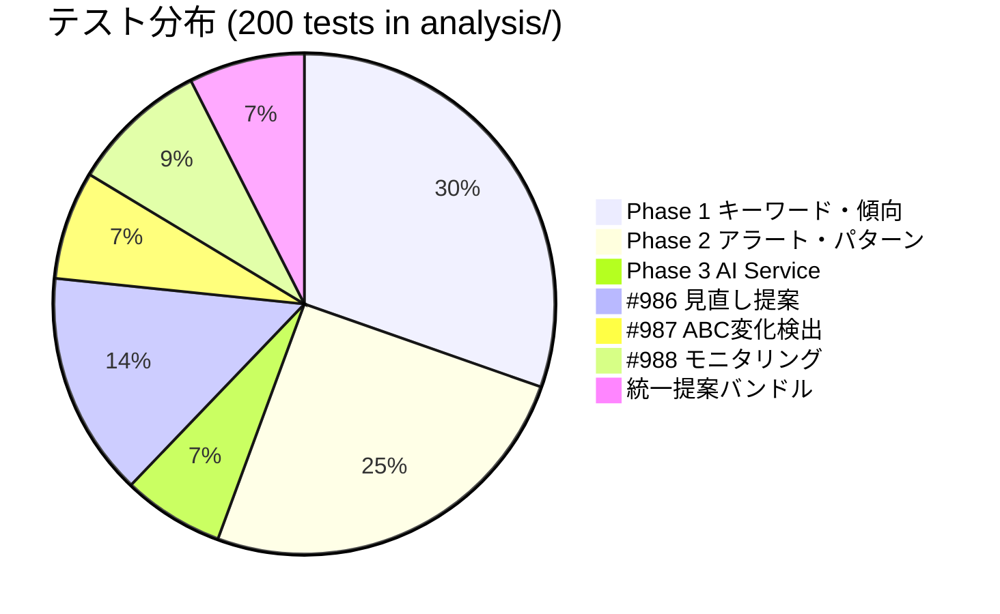
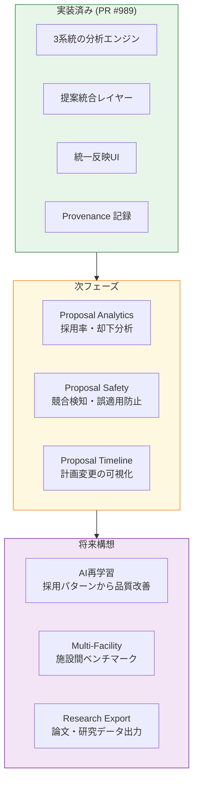

# Support Operations OS — Full Architecture

> 福祉DXにおける支援改善循環エンジンの設計と実装
>
> Audit Management System MVP — 2026-03-16

---

## 1. 循環モデル概要

本システムの核心は、**記録が蓄積されるだけでなく、分析・提案・採用・履歴化を経て計画が自律的に改善される循環構造**にある。

---

## 2. 提案統合パイプライン（Proposal Integration Layer）

3つの独立した分析パイプラインが、共通の統一レイヤーに合流する。

---

## 3. 6層モデルと実装の対応

---

## 4. 提案フィールドフローマップ

各提案パイプラインが支援計画シートのどのセクションに作用するかを示す。

---

## 5. データフロー — 1回の循環

---

## 6. テスト構成

---

## 7. 設計原則

| 原則 | 説明 | 実装例 |
|---|---|---|
| **Pure Function First** | 分析ロジックはUI・DB依存ゼロ | `compareAbcPatternPeriods()` |
| **Adapter Isolation** | 型変換は adapter 層に集約 | `adaptRevisionDraft()` |
| **Provenance Mandatory** | 全採用に出典・理由・日時を記録 | `ProposalAdoptionRecord` |
| **Evidence Link** | 計画の各要素に観測データへの参照 | `EvidenceLink` |
| **Bridge Pattern** | 外部データ→計画への安全な橋渡し | `tokuseiToPlanningBridge()` |
| **Progressive Disclosure** | 差分プレビュー→確認→採用の段階 | `ProposalApplyDialog` |

---

## 8. 従来型との比較

| 観点 | 従来の福祉システム | Support Operations OS |
|---|---|---|
| 記録 | 保存して終わり | 循環の起点 |
| 分析 | 別システム or 手動 | システム内で構造化 |
| 計画更新 | コピー＆ペースト | 提案→差分確認→反映 |
| 出典追跡 | なし | Evidence Link + Provenance |
| 改善サイクル | 会議で口頭共有 | データ駆動の PDCA |
| 提案 | なし | 3系統の自動提案 |
| 採用履歴 | なし | ProposalAdoptionRecord |
| 監査 | 紙ベース | 構造化された変更履歴 |

---

## 9. 今後の発展方向

---

## 10. 論文化のための位置づけ

### タイトル案

> **Support Operations OS: 観測駆動型支援改善循環エンジンの設計と実装**
> — 強度行動障害支援における Evidence-Based Plan Revision の自動化 —

### Abstract 構造

1. **背景**: 福祉現場の支援計画は観測データと断絶しがち
2. **課題**: 記録→分析→計画更新の循環が自動化されていない
3. **提案**: 3系統の分析エンジン + 統一提案レイヤー + Provenance
4. **実装**: Pure function first / Adapter pattern / Progressive disclosure
5. **評価**: 81テストによる検証、200+テストの分析基盤
6. **貢献**: 福祉DXにおける循環型支援改善モデルの提示

### キーワード

`Support Operations OS` / `Evidence-Based Practice` / `Proposal Integration` / `Provenance` / `PBS (Positive Behavior Support)` / `Welfare DX` / `循環型支援改善`
