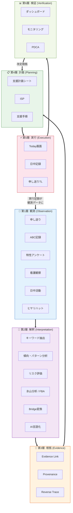
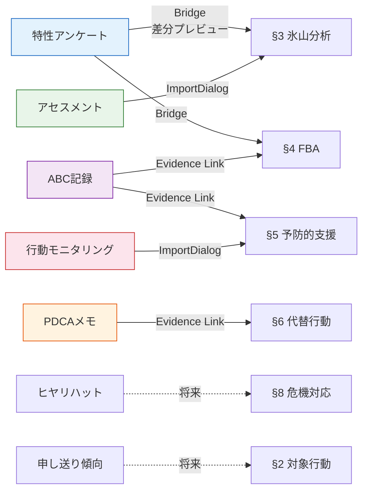
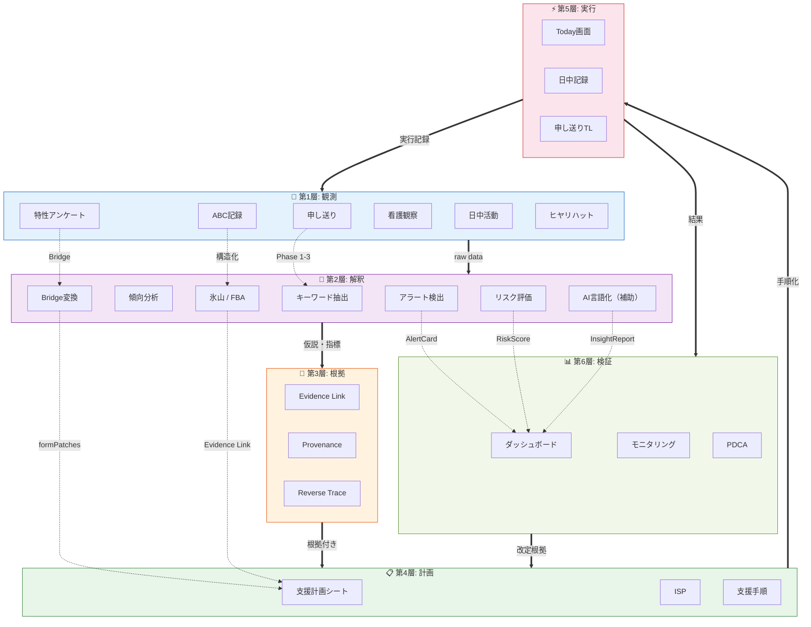

# Support Operations OS — Architecture Document

> **Audit Management System MVP**
> 生活介護事業所向け 支援改善循環エンジン
>
> Version 1.0 — 2026-03-16

---

## 目次

1. [システム概要](#1-システム概要)
2. [支援運用OSの概念](#2-支援運用osの概念)
3. [6層モデル](#3-6層モデル)
4. [観測層](#4-観測層-observation)
5. [解釈層](#5-解釈層-interpretation)
6. [根拠層](#6-根拠層-evidence)
7. [計画層](#7-計画層-planning)
8. [実行層](#8-実行層-execution)
9. [検証層](#9-検証層-verification)
10. [出力・外部連携層](#10-出力外部連携層-output)
11. [循環モデル — 1枚図](#11-循環モデル--1枚図)
12. [今後強化すべきデータフロー](#12-今後強化すべきデータフロー)
13. [用語集](#13-用語集)

---

## 1. システム概要

本システムは障害福祉（生活介護・強度行動障害支援）の現場運用を支える **支援運用OS（Support Operations OS）** である。

単なる記録保存アプリケーションではなく、**複数の観測ソースを根拠化し、支援計画と現場実行を循環させるエンジン** として設計されている。

### 定義

> **支援運用OS** とは、観測データを根拠化し、支援計画と現場実行を循環させる支援改善エンジンである。

### 技術スタック

| 層 | 現在の構成 | 備考 |
|---|---|---|
| Frontend | React 18 + TypeScript + MUI v5 | SPA |
| State | React hooks + localStorage | Optimistic update |
| Data Source | SharePoint REST API | 既存基盤との連携 |
| Persistence | localStorage (IndexedDB 移行候補) | 計画・根拠データ |
| AI | Azure OpenAI (Adapter pattern) | 補助的言語化のみ |
| CI/CD | GitHub Actions | Lint + Type check + Test |
| Hosting | React Static (社内配備) | 将来: SPFx or Azure Static Web Apps |

### AI の位置づけ

> **重要**: AIは観測データを直接解釈・判断するのではなく、Phase 1-2 で得られた**数値根拠を言語化する補助層**として位置づける。支援の判断責任は常に人間（支援チーム）に帰属する。

---

## 2. 支援運用OSの概念

### 「記録アプリ」との違い

| 観点 | 記録アプリ | 支援運用OS |
|---|---|---|
| データの扱い | 保存して終わり | 循環させる |
| 分析 | 別システム or 手動 | システム内で構造化 |
| 出典追跡 | なし | Evidence Link + Provenance |
| 計画への反映 | コピー&ペースト | Bridge 変換 + 差分プレビュー |
| 改善サイクル | 会議で口頭共有 | データ駆動の PDCA |

### コア循環

```
観測 → 意味づけ → 根拠化 → 計画化 → 実行 → 検証 → 計画更新
```

この循環が1回まわるたびに、支援の質が向上する。

---

## 3. 6層モデル

本システムは以下の **6層** で構成される。



### 新機能の判断基準

新しい機能を検討するとき、以下を問う:

1. それは **どの層** に属するか？
2. **どの層の間の線** を太くするか？
3. **循環全体** にどう寄与するか？

---

## 4. 観測層 (Observation)

現場の支援活動から生まれるすべての観測データの入力口。

### 観測ソース一覧

| ソース | 入力者 | 頻度 | 主な用途 | モジュール |
|---|---|---|---|---|
| 申し送り | 全職員 | 毎日3回 | 状態変化・引き継ぎ | `features/handoff/` |
| ABC記録 | 支援職員 | 随時 | 先行事象・行動・結果 | `domain/abc/` |
| 特性アンケート | 保護者・関係者 | 半年〜年1 | 感覚・行動・意思疎通 | `features/assessment/` |
| 日中活動記録 | 支援職員 | 毎日 | 活動参加度・食事 | `features/daily/` |
| 看護観察 | 看護師 | 随時 | バイタル・医療観察 | `features/nurse/` |
| ヒヤリハット | 全職員 | 随時 | 危険事案・リスク | `features/safety/` |
| 家族連絡 | 相談員 | 随時 | 家庭状態・保護者要望 | — |
| PDCAメモ | 支援リーダー | 週〜月次 | 支援仮説の検証メモ | `features/ibd/analysis/pdca/` |

---

## 5. 解釈層 (Interpretation)

観測データを **支援仮説** へ変換する分析処理群。

### Phase 1: テキスト・数値分析

| 関数 | 入力 | 出力 | テスト |
|---|---|---|---|
| `extractKeywords` | 申し送りテキスト | キーワード頻度マップ | 28 |
| `computeUserTrends` | 利用者別申し送り | 増減傾向 | 20 |
| `computeTimePatterns` | タイムスタンプ | 時間帯ヒートマップ | 17 |

### Phase 2: パターン検出・リスク評価

| 関数 | 入力 | 出力 | テスト |
|---|---|---|---|
| `alertRules` | Phase 1 結果 | 重要度付きアラート | 21 |
| `detectRepeatingPatterns` | 時系列データ | 繰り返しパターン | 18 |
| `riskScoring` | 複合指標 | 利用者別リスクスコア | 15 |

### Phase 3: AI 言語化（補助層）

| 関数 | 入力 | 出力 | テスト |
|---|---|---|---|
| `buildHandoffSummaryPrompt` | Phase 1-2 数値 | プロンプト文字列 | 12 |
| `parseInsightReport` | AI 応答 | 構造化レポート | 25 |
| `handoffAiService` | オーケストレーション | InsightReport | 14 |

> **注**: AI は Phase 1-2 の数値結果を自然言語に変換するのみ。分析そのものは pure function で行う。AI が利用不可の場合はフォールバックで機能継続する。

### 特性アンケートブリッジ

| 関数 | 入力 | 出力 | テスト |
|---|---|---|---|
| `tokuseiToPlanningBridge` | TokuseiSurveyResponse | formPatches + provenance | 53 |
| `buildImportPreview` | formPatches + 現在値 | 差分プレビュー | 8 |

ブリッジの取込フロー:

```
特性アンケート回答
    ↓ tokuseiToPlanningBridge()
formPatches（変換結果）
    ↓ buildImportPreview()
差分プレビューダイアログ
    ↓ ユーザー確認・確定
フォーム反映 + Provenance記録
```

---

## 6. 根拠層 (Evidence)

**本システムの設計上の核心。** 支援計画の各要素が「なぜそう書いたか」を追跡する。

### Evidence Link

支援計画の各フィールドに **観測データへの参照** を紐付ける。

```
支援計画シート §5 予防的支援
    ├── Evidence Link (ABC) → ABC記録 #42「食事場面・視線回避」
    ├── Evidence Link (PDCA) → PDCAメモ #7「環境調整の検証」
    └── Provenance → 特性アンケート 山田花子(母) 3/14
```

### Provenance（出典追跡）

自動取込されたデータに対して、以下を保持する:

| 要素 | 例 |
|---|---|
| ソース種別 | `tokusei_survey` / `assessment` / `behavior_monitoring` |
| 回答者 | 山田花子 |
| 続柄 | 母 |
| 回答日 | 2026/03/14 |
| 変換先フィールド | `triggers`, `environmentFactors` |
| 信頼度 | high / medium / low |
| 取込日時 | 2026/03/16 17:06 |

UI表示例:

```
📋 特性アンケ 山田花子(母) 3/14
```

### Reverse Trace（逆方向追跡）

計画 → 根拠の方向だけでなく、**根拠 → 計画** の逆方向追跡も可能:

```
ABC記録 #42
    └── 参照元: 支援計画シート A-001 §5, B-003 §4
```

### コードベース

| モジュール | 役割 |
|---|---|
| `domain/isp/evidenceLink.ts` | Evidence Link 型定義・操作 |
| `domain/isp/reverseTrace.ts` | 逆方向追跡 |
| `domain/isp/countStrategyAdoptions.ts` | 戦略採用回数の集計 |
| `domain/isp/getTopReferencedEvidence.ts` | 頻出根拠の抽出 |
| `domain/isp/evidencePatternAnalysis.ts` | パターン分析 |
| `infra/localStorage/localEvidenceLinkRepository.ts` | 永続化 |

---

## 7. 計画層 (Planning)

複数の観測ソースが **統合される場所**。

### 支援計画シート (SupportPlanningSheet)

10セクション構成。強度行動障害の PBS（ポジティブ行動支援）に準拠。

| § | セクション | 主な入力ソース |
|---|---|---|
| 1 | 基本情報 | 手入力 |
| 2 | 対象行動 | 行動モニタリング |
| 3 | 氷山分析 | **特性アンケート** (Bridge) |
| 4 | FBA | **ABC記録** (Evidence Link) |
| 5 | 予防的支援 | ABC記録 + アセスメント |
| 6 | 代替行動 | PDCA (Evidence Link) |
| 7 | 問題行動時対応 | 手入力 |
| 8 | 危機対応 | ヒヤリハット + 看護 |
| 9 | モニタリング | 行動モニタリング |
| 10 | チーム共有 | 手入力 |

### データソース統合マップ



---

## 8. 実行層 (Execution)

計画された支援が日々の現場で実行される層。

| 画面 | パス | 役割 |
|---|---|---|
| Today 業務画面 | `/today` | 当日のタスク・スケジュール |
| 日中活動記録 | `/daily-record` | 個別の支援記録 |
| 申し送りタイムライン | `/handoff-timeline` | 交代時の引き継ぎ |
| 1日の流れ | `/daily-schedule-settings` | 時間帯別活動設定 |

### 実行 → 観測へのフィードバック

実行層で記録されたデータは **自動的に観測層に戻る**。これが循環の起点となる。

- 日中活動記録 → 次の申し送りの根拠
- 支援記録 → ABC記録の素材
- ヒヤリハット → 危機対応の改善根拠

---

## 9. 検証層 (Verification)

支援結果を評価し、計画改定の根拠を生む。

| 手段 | データソース | 出力 | モジュール |
|---|---|---|---|
| ダッシュボード | Phase 1-2 | KPI + Trend | `features/handoff/analysis/` |
| AlertCard | alertRules | アラート一覧 | 同上 |
| RiskScoreCard | riskScoring | リスク順位 | 同上 |
| InsightReport | AI 要約 | 自然文サマリー | 同上 |
| モニタリング | 計画 + 実行記録 | 改定判断材料 | `features/monitoring/` |
| ケース会議 | Meeting Minutes | 多職種合意 | `features/meeting/` |
| PDCA | Iceberg PDCA | 仮説検証 | `features/ibd/analysis/pdca/` |
| 運営基準 | チェックリスト | 法令遵守 | `features/compliance-checklist/` |

---

## 10. 出力・外部連携層 (Output)

支援プロセスの結果を外部に出力する補助層。

| 出力先 | 内容 | モジュール |
|---|---|---|
| PDF出力 | 支援計画シート・業務日誌 | `features/official-forms/` |
| 国保連CSV | 請求データ | `features/kokuhoren-csv/` |
| Excel公文書 | 業務日誌・活動記録 | `features/official-forms/` |
| 請求確認 | 月次明細 | `features/billing/` |
| 国保連プレビュー | CSV確認 | `features/kokuhoren-preview/` |

---

## 11. 循環モデル — 1枚図



### 矢印の凡例

| 線種 | 意味 |
|---|---|
| `==>` 太実線 | 主循環（常に流れるデータ） |
| `-.->` 点線 | 重点連携（個別モジュール間のフロー） |

---

## 12. 今後強化すべきデータフロー

### 🔴 最重要: 申し送り → 支援計画提案

**現状**: 申し送り分析（Phase 1-3）はダッシュボード表示まで。

**課題**: 分析結果が「この利用者の支援計画を見直すべき」という**計画改定提案**にまだ届いていない。

**強化案**:

```
申し送り分析
    ↓ riskScoring が閾値超過
    ↓
「支援計画見直し提案」自動生成
    ↓
支援計画シートに改定候補を表示
```

**実装イメージ**:
- `riskScoring` のスコアが `critical` の利用者を抽出
- 該当利用者の支援計画シートに「見直し推奨」バナー表示
- クリックで申し送り分析ダッシュボードへ遷移

### 🟠 重要: ABC記録 → 支援計画改善

**現状**: ABC記録は Evidence Link で支援計画に紐付け可能。パターン分析・逆方向追跡も実装済み。

**課題**: 「パターンが変化した → 支援手順の修正が必要」という**変化検出**が自動化されていない。

**強化案**:

```
ABC記録パターン分析
    ↓ 先月と今月で頻出場面が変化
    ↓
「場面変化アラート」生成
    ↓
支援計画 §5 予防的支援の改善提案
```

### 🟡 次点: モニタリング → 計画改定

**現状**: モニタリング結果は手動で支援計画に反映可能。

**課題**: モニタリング周期の自動スケジュール + 改定必要性の判定。

**強化案**:

```
モニタリング結果
    ↓ 目標達成度を評価
    ↓
計画改定の必要性判定
    ↓
改定ドラフト自動生成（AI補助）
```

---

## 13. 用語集

| 用語 | 定義 |
|---|---|
| **支援運用OS** | 観測データを根拠化し、支援計画と現場実行を循環させる支援改善エンジン |
| **Evidence Link** | 支援計画の各フィールドに観測データへの参照を紐付ける機構 |
| **Provenance** | 自動取込データの出典情報（誰が・いつ・何を根拠に） |
| **Reverse Trace** | 観測データ → 支援計画の逆方向追跡 |
| **Bridge** | 外部データ（アンケート等）を計画フォームに変換する中間層 |
| **formPatches** | Bridge が生成するフォームへの変更差分 |
| **PBS** | Positive Behavior Support（ポジティブ行動支援） |
| **FBA** | Functional Behavior Assessment（行動機能分析） |
| **氷山分析** | 行動の表面（水面上）と要因（水面下）を構造化する分析手法 |
| **ISP** | Individual Support Plan（個別支援計画） |

---

## 付録 A: モジュール全体マップ

### Feature Modules（43モジュール）

```
features/
├── handoff/              # 申し送り（観測 + 解釈 Phase 1-3）
├── assessment/           # アセスメント・特性アンケート（観測）
├── daily/                # 日中活動（観測 + 実行）
├── nurse/                # 看護（観測）
├── safety/               # ヒヤリハット・身体拘束（観測 + 検証）
├── ibd/                  # 強度行動障害支援
│   ├── analysis/         #   解釈: 氷山・FBA・PDCA
│   ├── plans/            #   計画: テンプレート
│   └── procedures/       #   計画: 支援手順
├── planning-sheet/       # 支援計画シート（計画 + 根拠 + Bridge）
├── monitoring/           # モニタリング（検証）
├── support-plan-guide/   # ISP ナビゲーション（計画）
├── today/                # Today 業務画面（実行）
├── meeting/              # 会議記録（検証）
├── compliance-checklist/ # 運営基準（検証）
├── billing/              # 請求（出力）
├── kokuhoren-*/          # 国保連CSV（出力）
├── official-forms/       # 公文書（出力）
├── dashboard/            # ダッシュボード（検証）
└── ...                   # 共通 / 設定 / etc
```

### Domain Modules（9モジュール）

```
domain/
├── abc/         # ABC記録型定義
├── assessment/  # アセスメント型定義・変換ロジック
├── behavior/    # 行動型定義
├── bridge/      # モジュール間ブリッジ
├── daily/       # 日中記録型定義
├── isp/         # ISP + EvidenceLink + ReverseTrace
├── regulatory/  # 制度型定義
├── safety/      # 安全管理型定義
└── support/     # 支援型定義
```

---

## 付録 B: テスト資産

| カテゴリ | テスト数 | カバー範囲 |
|---|---|---|
| 申し送り分析 Phase 1 | 65 | キーワード・傾向・時間帯 |
| 申し送り分析 Phase 2 | 54 | アラート・パターン・リスク |
| 申し送り分析 Phase 3 | 51 | プロンプト・パーサー・AI Service |
| 特性アンケート Bridge | 61 | 正規化・変換・プレビュー |
| Evidence Link | 30+ | リンク操作・パターン分析・逆追跡 |
| ナビゲーション整合性 | 2 | ルート定義の一貫性 |
| **合計** | **260+** | |

---

> この文書は実コードベースの調査に基づいて作成されました。
> 各モジュールのパス・関数名・テスト数はすべて実装に対応しています。
