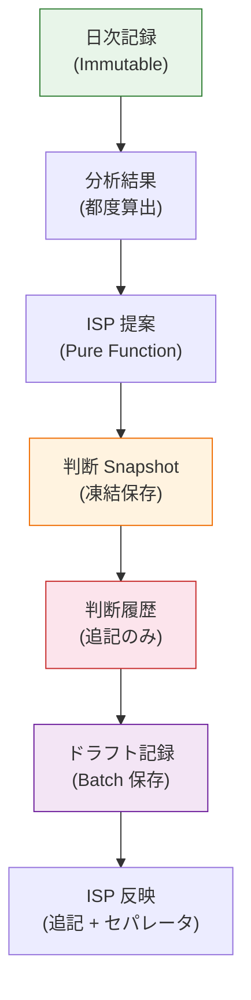

# 支援 PDCA エンジン — 1 ページ概要

> **1 ページで全体がわかるシステムサマリー**
> README・プレゼン・導入提案にそのまま使える形式

<p align="center">
  
</p>

---

## システムの目的

障害福祉サービスの日次支援記録から ISP 更新までを一貫して自動支援する
**支援 PDCA エンジン**。

「記録して終わり」ではなく、記録 → 分析 → 提案 → 判断 → 計画更新 までを
**一本のパイプライン** として設計したシステムです。

---

## 全体パイプライン

```mermaid
graph LR
    A["📝 日次記録"] --> B["📊 分析エンジン"]
    B --> C["💡 ISP 見直し提案"]
    C --> D["🧑‍⚕️ 人の判断"]
    D --> E["📋 ドラフト生成"]
    E --> F["💾 SharePoint 保存"]
    F --> G["✏️ ISP 計画書反映"]
    G --> H["📂 履歴・再反映"]

    style A fill:#e3f2fd,stroke:#1565c0,color:#0d47a1
    style B fill:#e8f5e9,stroke:#2e7d32,color:#1b5e20
    style C fill:#fff3e0,stroke:#ef6c00,color:#e65100
    style D fill:#fce4ec,stroke:#c62828,color:#b71c1c
    style E fill:#f3e5f5,stroke:#6a1b9a,color:#4a148c
    style F fill:#e0f2f1,stroke:#00695c,color:#004d40
    style G fill:#fff9c4,stroke:#f57f17,color:#f57f17
    style H fill:#efebe9,stroke:#4e342e,color:#3e2723
```



| ステップ | 内容 | 誰が |
|---|---|---|
| ① 日次記録 | 支援実施・行動観察を記録 | 支援員 |
| ② 分析エンジン | 活動分布・行動タグ・目標進捗を自動集計 | システム |
| ③ ISP 見直し提案 | 進捗に応じた見直しレベルを導出 | システム |
| ④ 人の判断 | 提案を採用/保留/見送り | サビ管 / 支援員 |
| ⑤ ドラフト生成 | 判断結果から ISP 計画書ドラフトを自動生成 | システム |
| ⑥ 保存 | SharePoint リストへスナップショット保存 | システム |
| ⑦ ISP 反映 | ドラフトを計画書フォームへワンクリック転記 | 支援員 |
| ⑧ 履歴・再反映 | 過去ドラフトの比較・再利用 | 支援員 |

---

## 技術スタック

| レイヤー | 技術 |
|---|---|
| Frontend | React 18 + TypeScript + MUI v5 |
| Backend | SharePoint Online REST API |
| Auth | MSAL (Microsoft Entra ID) |
| Build | Vite |
| Test | Vitest + React Testing Library + Playwright |
| CI/CD | GitHub Actions |

---

## 設計原則

### 1. ドメイン駆動設計 (DDD)

```
UI → Hooks → Domain (Pure Functions) → Repository (Interface) → SharePoint
```

Domain 層は副作用ゼロの純粋関数。テスト容易性と変更耐性を確保。

### 2. Snapshot 設計

判断時点のデータを `RecommendationSnapshot` として凍結保存。
ロジック変更後も当時の状態を正確に追跡可能。

### 3. 追記型イミュータブル記録

判断レコード・ドラフト記録は上書きしない。
常に新規レコード追加。監査証跡として完全な履歴を保持。

### 4. 段階的自動化

```
完全手動 → テンプレート支援 → 提案型自動化 → 人が最終判断
```

AI が提案し、人が判断する。判断の裁量は常に人にある。

---

## 導入価値

| 対象 | 現状の課題 | この OS での解決 |
|---|---|---|
| **支援員** | 記録後にモニタリング資料を別途作成 | 記録から分析・ドラフトまで自動 |
| **サビ管** | ISP 更新時期の把握が属人的 | 進捗・提案が自動で見える |
| **管理者** | 監査時に証跡を後付けで整理 | Snapshot 履歴が常に蓄積 |
| **法人** | 施設ごとに記録方法がバラバラ | 標準化された PDCA フロー |

---

## 監査性・証跡モデル



**監査で問われる5つの問い** にすべて答えられます：

| 問い | 答え |
|---|---|
| いつ記録したか？ | 日次記録の `createdAt` |
| どんな分析をしたか？ | 分析エンジンの算出ロジック (Pure Function, 再現可能) |
| 何を提案したか？ | `RecommendationSnapshot` に凍結保存 |
| 誰がどう判断したか？ | `decidedBy` + `status` + `decisionMemo` |
| 計画にどう反映したか？ | ドラフト記録 + ISP 反映ログ (セパレータ付き追記) |

---

## 詳細ドキュメント

| ドキュメント | 内容 |
|---|---|
| [System Architecture (Full)](system-architecture-complete.md) | ISP 三層 + ブリッジ + PDCA 全体図 |
| [Support PDCA Engine (Technical)](support-pdca-engine.md) | モニタリング分析エンジンの技術詳細 |
| [Planning–Daily–Monitoring Loop](planning-daily-monitoring-loop.md) | 支援計画シートを起点とした PDCA 循環モデル |
| [Operating Model](../operations/operating-model.md) | 業務モデル・運用・保守の設計 |
