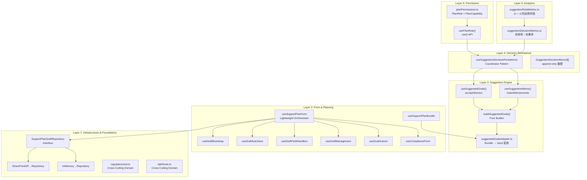
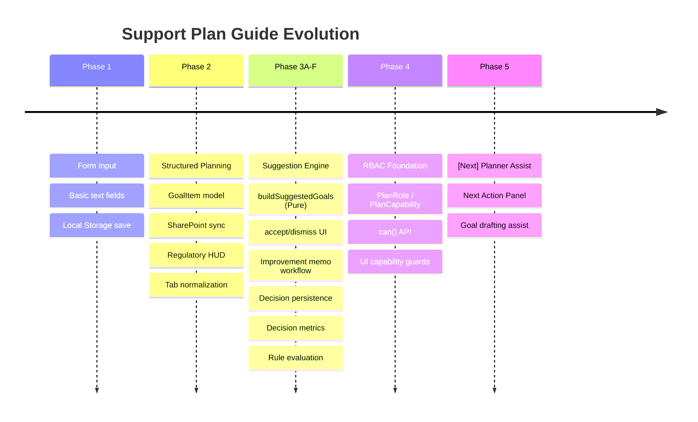

# 支援計画ガイド — 全体アーキテクチャ図

> **Support Plan Guide: Architecture Overview**
> Updated: 2026-03-17 (P4 完了時点)

---

## システム概要

支援計画ガイドは、障害福祉サービスにおける個別支援計画の作成・管理・評価を統合する **意思決定ワークベンチ** です。

単なるフォーム入力ツールではなく、以下の6層で構成される **Support Operations OS** です。



---

## レイヤ別詳細

### Layer 1: Infrastructure & Cross-Cutting Foundations（基盤層）

データの永続化と、複数レイヤから参照される横断的ドメインユーティリティ。

> [!NOTE]
> `regulatoryHud.ts` と `tabRoute.ts` は永続化インフラではなく **Cross-Cutting Domain Utilities** です。
> 複数のレイヤ・タブから参照される共有ドメインロジックとしてこの層に配置しています。

| ファイル | 責務 | サイズ |
|---|---|---|
| [SupportPlanDraftRepository.ts](file:///Users/yasutakesougo/audit-management-system-mvp/src/features/support-plan-guide/domain/SupportPlanDraftRepository.ts) | Repository Interface（DI境界） | 2.8KB |
| [SharePointSP…Repository.ts](file:///Users/yasutakesougo/audit-management-system-mvp/src/features/support-plan-guide/infra/SharePointSupportPlanDraftRepository.ts) | SP List 永続化実装 | 11.8KB |
| [InMemory…Repository.ts](file:///Users/yasutakesougo/audit-management-system-mvp/src/features/support-plan-guide/infra/InMemorySupportPlanDraftRepository.ts) | テスト用 In-Memory 実装 | 2.9KB |
| [repositoryFactory.ts](file:///Users/yasutakesougo/audit-management-system-mvp/src/features/support-plan-guide/repositoryFactory.ts) | 環境別 Repository DI | 3.6KB |
| [regulatoryHud.ts](file:///Users/yasutakesougo/audit-management-system-mvp/src/features/support-plan-guide/domain/regulatoryHud.ts) | 制度適合 HUD 判定（Pure） | 11.7KB |
| [tabRoute.ts](file:///Users/yasutakesougo/audit-management-system-mvp/src/features/support-plan-guide/domain/tabRoute.ts) | タブ構造定義・ルーティング | 6.0KB |

```
┌─────────────────────────────┐
│  SupportPlanDraftRepository │  Interface
├─────────────────────────────┤
│  + getAll(): Draft[]        │
│  + save(draft): void        │
│  + delete(id): void         │
└──────────┬──────────────────┘
           │ implements
    ┌──────┴──────┐
    ▼             ▼
SharePoint    InMemory
(Production)  (Testing)
```

---

### Layer 2: Form & Planning（フォーム・計画層）

7つの composable sub-hook で構成された、薄いオーケストレータパターン。

| Hook | 責務 | サイズ |
|---|---|---|
| [useSupportPlanForm](file:///Users/yasutakesougo/audit-management-system-mvp/src/features/support-plan-guide/hooks/useSupportPlanForm.ts) | **Orchestrator**（統合窓口） | 13.0KB |
| [useDraftBootstrap](file:///Users/yasutakesougo/audit-management-system-mvp/src/features/support-plan-guide/hooks/useDraftBootstrap.ts) | SP/LS 初期化 + URL パラメータ同期 | 7.3KB |
| [useDraftAutoSave](file:///Users/yasutakesougo/audit-management-system-mvp/src/features/support-plan-guide/hooks/useDraftAutoSave.ts) | 自動保存ライフサイクル | 3.2KB |
| [useDraftFieldHandlers](file:///Users/yasutakesougo/audit-management-system-mvp/src/features/support-plan-guide/hooks/useDraftFieldHandlers.ts) | フィールド変更ハンドラ | 3.7KB |
| [useDraftManagement](file:///Users/yasutakesougo/audit-management-system-mvp/src/features/support-plan-guide/hooks/useDraftManagement.ts) | Draft CRUD | 5.7KB |
| [useGoalActions](file:///Users/yasutakesougo/audit-management-system-mvp/src/features/support-plan-guide/hooks/useGoalActions.ts) | 目標 CRUD（GoalItem） | 3.6KB |
| [useComplianceForm](file:///Users/yasutakesougo/audit-management-system-mvp/src/features/support-plan-guide/hooks/useComplianceForm.ts) | コンプライアンス項目管理 | 7.7KB |
| [useSupportPlanBundle](file:///Users/yasutakesougo/audit-management-system-mvp/src/features/support-plan-guide/hooks/useSupportPlanBundle.ts) | 複合データソース集約 | 7.2KB |

```
         useSupportPlanForm (Orchestrator)
                    │
    ┌───────┬───────┼───────┬──────────┐
    ▼       ▼       ▼       ▼          ▼
Bootstrap AutoSave Fields  Mgmt    GoalActions
    │                                  │
    └──── Repository (DI) ◄────────────┘
```

---

### Layer 3: Suggestion Engine（提案エンジン）

4データソースからルールベースで目標候補を生成し、人間が判断する。

| ファイル | 責務 | サイズ |
|---|---|---|
| [suggestedGoals.ts](file:///Users/yasutakesougo/audit-management-system-mvp/src/features/support-plan-guide/domain/suggestedGoals.ts) | **Pure Builder**（AI非依存） | 18.3KB |
| [suggestedGoalsAdapter.ts](file:///Users/yasutakesougo/audit-management-system-mvp/src/features/support-plan-guide/domain/suggestedGoalsAdapter.ts) | Bundle → Input 変換 | 3.5KB |
| [useSuggestedGoals](file:///Users/yasutakesougo/audit-management-system-mvp/src/features/support-plan-guide/hooks/useSuggestedGoals.ts) | SmartTab 用 accept/dismiss | 6.2KB |
| [useSuggestionMemo](file:///Users/yasutakesougo/audit-management-system-mvp/src/features/support-plan-guide/hooks/useSuggestionMemo.ts) | ExcellenceTab 用 note/defer/promote | 8.2KB |
| [suggestionDecisionHelpers.ts](file:///Users/yasutakesougo/audit-management-system-mvp/src/features/support-plan-guide/domain/suggestionDecisionHelpers.ts) | 判断ヘルパー（latestDecision 等） | 4.9KB |

```
┌──────────────────────────────────────────┐
│         4 Data Sources                   │
│  ┌──────────┐ ┌────────┐ ┌───────────┐  │
│  │Assessment│ │Iceberg │ │Monitoring │  │
│  └────┬─────┘ └───┬────┘ └─────┬─────┘  │
│       │           │             │        │
│  ┌────┴───────────┴─────────────┴──┐     │
│  │      suggestedGoalsAdapter      │     │
│  │    (Bundle → SuggestedGoalsInput)│    │
│  └────────────────┬────────────────┘     │
│                   ▼                      │
│  ┌────────────────────────────────┐      │
│  │    buildSuggestedGoals()       │ ◄─── │ Form data
│  │    Pure / AI-free / Testable   │      │ (strengths,
│  │    + 重複排除 + provenance     │      │  goals, etc.)
│  └────────────────┬───────────────┘      │
│                   ▼                      │
│           GoalSuggestion[]               │
└──────────────────────────────────────────┘
                    │
         ┌──────────┴──────────┐
         ▼                     ▼
   useSuggestedGoals     useSuggestionMemo
   (SmartTab)            (ExcellenceTab)
   accept / dismiss      note / defer / promote
```

> [!IMPORTANT]
> `buildSuggestedGoals()` は **pure 関数** であり、LLM に依存しない。
> 将来 LLM を追加する場合も、この関数を拡張するか、並行して呼ぶ形になる。

---

### Layer 4: Decision Persistence（判断永続化層）

Coordinator パターンで判断を Draft に append-only 保存。

| ファイル | 責務 | サイズ |
|---|---|---|
| [useSuggestionDecisionPersistence](file:///Users/yasutakesougo/audit-management-system-mvp/src/features/support-plan-guide/hooks/useSuggestionDecisionPersistence.ts) | **Coordinator**（保存統合） | 6.9KB |

```
Page (SupportPlanGuidePage)
    │
    ▼
useSuggestionDecisionPersistence (Coordinator)
    │
    ├── onDecisionChange(record) ──► draft.suggestionDecisions.push(record)
    ├── onDecisionUndo(id) ──────► draft.suggestionDecisions.push({..., undo})
    ├── smartInitialDecisions ───► SmartTab (初期 accept/dismiss 復元)
    ├── memoInitialActions ──────► ExcellenceTab (初期 note/defer 復元)
    ├── suggestionMetrics ───────► メトリクス算出
    └── currentDecisions ────────► ルール別評価
```

> [!TIP]
> append-only 設計により、判断履歴が完全に保存される。
> UI では `id` ごとの最新レコードを参照する。

---

### Layer 5: Analytics（分析層）

判断データから採用率・ルール品質を算出する pure 関数群。

| ファイル | 責務 | サイズ |
|---|---|---|
| [suggestionDecisionMetrics.ts](file:///Users/yasutakesougo/audit-management-system-mvp/src/features/support-plan-guide/domain/suggestionDecisionMetrics.ts) | 採用率・効果率・ソース別集計 | 5.0KB |
| [suggestionRuleMetrics.ts](file:///Users/yasutakesougo/audit-management-system-mvp/src/features/support-plan-guide/domain/suggestionRuleMetrics.ts) | provenance 分類 + ルール別品質 | 7.7KB |

```
SuggestionDecisionRecord[]
         │
         ├──► computeSuggestionMetrics()
         │        acceptedCount, dismissedCount
         │        acceptanceRate, effectivenessRate
         │        bySource: { smart, memo }
         │
         └──► computeSuggestionRuleMetrics()
                  classifyProvenance()
                  ├── assessment   (アセスメント起源)
                  ├── iceberg      (Iceberg分析起源)
                  ├── monitoring   (モニタリング起源)
                  ├── form         (フォーム入力起源)
                  └── unknown
                  → bestRule, noisiestRule
```

---

### Layer 6: Permission（権限層）

capability ベースの表示制御。UIとロジックを完全分離。

| ファイル | 責務 | サイズ |
|---|---|---|
| [planPermissions.ts](file:///Users/yasutakesougo/audit-management-system-mvp/src/features/support-plan-guide/domain/planPermissions.ts) | **SSoT**: Role × Capability 定義 | 5.8KB |
| [usePlanRole.ts](file:///Users/yasutakesougo/audit-management-system-mvp/src/features/support-plan-guide/hooks/usePlanRole.ts) | React Hook ラッパー | 1.1KB |

```
┌─────────────────────────────────────────┐
│          planPermissions.ts (SSoT)      │
│                                         │
│  PlanRole: staff ⊂ planner ⊂ admin     │
│                                         │
│  ┌─────────────────────────────────┐    │
│  │ ROLE_CAPABILITIES               │    │
│  │                                 │    │
│  │ staff:   form.edit, form.save   │    │
│  │                                 │    │
│  │ planner: + suggestions.view     │    │
│  │          + suggestions.decide   │    │
│  │          + memo.view/act        │    │
│  │          + metrics.view         │    │
│  │          + compliance.approve   │    │
│  │                                 │    │
│  │ admin:   + ruleMetrics.view     │    │
│  │          + regulatoryHud.view   │    │
│  │          + settings.manage      │    │
│  └─────────────────────────────────┘    │
│                                         │
│  Pure functions:                        │
│  - resolvePlanRole({isAdmin}) → Role    │
│  - hasCap(role, cap) → boolean          │
│  - isAtLeast(role, min) → boolean       │
│  - getCapabilities(role) → Set          │
└─────────────────────────────────────────┘
             │
             ▼
      usePlanRole({ isAdmin })
             │
             ▼
      can('capability') → boolean
```

> [!NOTE]
> `resolvePlanRole` は pure 関数。将来 Graph API / Azure AD / SharePoint Group からの
> RBAC 情報を受け取る場合、`roleHint` パラメータを使うだけで接続可能。

---

## UI コンポーネント構成

### Page → Tab 構造

```
SupportPlanGuidePage.tsx (484 lines)
│
├── useSupportPlanForm() ─────── Layer 2 Orchestrator
├── useSuggestionDecisionPersistence() ── Layer 4 Coordinator
├── usePlanRole() ────────────── Layer 6 Permission
├── useRegulatorySummary() ──── Layer 1 Regulatory
│
├── RegulatorySummaryBand ────── can('regulatoryHud.view')
├── PlanningSheetStatsGrid
│
└── Tabs (10 sections)
    ├── OverviewTab ──────── 基本情報
    ├── AssessmentTab ────── アセスメント
    ├── SmartTab ─────────── SMART目標 + 提案UI
    │   ├── StructuredGoalEditor (共有)
    │   ├── SuggestedGoalsList ── can('suggestions.view')
    │   └── SuggestionMetricsBadge ── can('metrics.view')
    ├── SupportsTab ──────── 支援内容
    ├── DecisionTab ──────── 意思決定
    ├── ComplianceTab ────── コンプライアンス
    │   └── EditableComplianceSection
    ├── MonitoringTab ────── モニタリング
    │   ├── MonitoringDashboardSection
    │   ├── MonitoringEvidencePanel
    │   └── MonitoringFieldSection
    ├── RiskTab ──────────── リスク管理
    ├── ExcellenceTab ────── 改善メモ
    │   ├── ISPCandidateImportSection
    │   ├── SuggestionMemoSection ── can('memo.view')
    │   ├── SuggestionMetricsBadge ── can('metrics.view')
    │   ├── RuleMetricsPanel ── can('ruleMetrics.view')
    │   └── AdoptionMetricsPanel
    └── PreviewTab ───────── プレビュー・出力
```

### Suggestion UI コンポーネント（6 files）

| コンポーネント | 用途 |
|---|---|
| [SuggestedGoalsList](file:///Users/yasutakesougo/audit-management-system-mvp/src/features/support-plan-guide/components/suggested-goals/SuggestedGoalsList.tsx) | SmartTab: 目標候補一覧 |
| [SuggestedGoalCard](file:///Users/yasutakesougo/audit-management-system-mvp/src/features/support-plan-guide/components/suggested-goals/SuggestedGoalCard.tsx) | 個別候補カード |
| [SuggestionMemoSection](file:///Users/yasutakesougo/audit-management-system-mvp/src/features/support-plan-guide/components/suggested-goals/SuggestionMemoSection.tsx) | ExcellenceTab: メモワークスペース |
| [SuggestionMemoCard](file:///Users/yasutakesougo/audit-management-system-mvp/src/features/support-plan-guide/components/suggested-goals/SuggestionMemoCard.tsx) | 個別メモカード |
| [SuggestionMetricsBadge](file:///Users/yasutakesougo/audit-management-system-mvp/src/features/support-plan-guide/components/suggested-goals/SuggestionMetricsBadge.tsx) | メトリクスサマリー |
| [RuleMetricsPanel](file:///Users/yasutakesougo/audit-management-system-mvp/src/features/support-plan-guide/components/suggested-goals/RuleMetricsPanel.tsx) | ルール別品質パネル |

---

## データフローの全体図

```
┌─────────────────────────────────────────────────────────────────┐
│                     INPUT LAYER                                 │
│                                                                 │
│  SharePoint Lists ──► useDraftBootstrap ──► drafts[]            │
│  PlanningSheet API ──► useSupportPlanBundle ──► bundle          │
│  Users_Master ──► userOptions                                   │
│  Auth (MSAL) ──► isAdmin ──► resolvePlanRole ──► PlanRole       │
└──────────────────────────────┬──────────────────────────────────┘
                               │
┌──────────────────────────────▼──────────────────────────────────┐
│                  PROCESSING LAYER                               │
│                                                                 │
│  useSupportPlanForm ──► form state (SupportPlanForm)            │
│  suggestedGoalsAdapter ──► SuggestedGoalsInput                  │
│  buildSuggestedGoals ──► GoalSuggestion[]                       │
│  regulatoryHud ──► RegulatoryChip[]                             │
│  computeDeadlineInfo ──► DeadlineInfo[]                         │
│  useComplianceForm ──► ComplianceState                          │
└──────────────────────────────┬──────────────────────────────────┘
                               │
┌──────────────────────────────▼──────────────────────────────────┐
│                   DECISION LAYER                                │
│                                                                 │
│  SmartTab: accept / dismiss ──────────────────┐                 │
│  ExcellenceTab: note / defer / promote ───────┤                 │
│                                               ▼                 │
│  useSuggestionDecisionPersistence ──► draft.suggestionDecisions │
│                                               │                 │
│  computeSuggestionMetrics ──► 採用率           │                 │
│  computeSuggestionRuleMetrics ──► ルール品質   │                 │
└──────────────────────────────┬──────────────────────────────────┘
                               │
┌──────────────────────────────▼──────────────────────────────────┐
│                    OUTPUT LAYER                                  │
│                                                                 │
│  Markdown Export ──► .md                                        │
│  PDF Export ──► .pdf                                            │
│  ISP Create ──► SharePoint ISP List                             │
│  Auto Save ──► SharePoint Draft List                            │
└─────────────────────────────────────────────────────────────────┘
```

---

## テストカバレッジ

| Layer | ファイル数 | テスト数 | カバー範囲 |
|---|---|---|---|
| Domain | 8 spec files | ~250 | suggestedGoals, adapter, regulatoryHud, tabRoute, decisionHelpers, decisionMetrics, ruleMetrics, planPermissions |
| Hooks | 5 spec files | ~90 | complianceForm, adoptionMetrics, ispCreate, suggestionMemo, bundle |
| **Total** | **22 files** | **342 tests** | Pure domain + critical hooks |

---

## ロール × 機能マトリクス

> [!IMPORTANT]
> **staff は「読み取り専用」ではありません。** フォームの入力・保存は全ロールに許可されています。
> staff に制限されるのは提案機能・メトリクス・制度HUD などの **高度な意思決定支援機能** です。

| capability | staff | planner | admin | UI 適用箇所 |
|---|:---:|:---:|:---:|---|
| `form.edit` | ✅ | ✅ | ✅ | 全タブのフィールド入力 |
| `form.save` | ✅ | ✅ | ✅ | 自動保存・手動保存 |
| `suggestions.view` | ❌ | ✅ | ✅ | SmartTab 提案セクション |
| `suggestions.decide` | ❌ | ✅ | ✅ | accept / dismiss ボタン |
| `suggestions.promote` | ❌ | ✅ | ✅ | 目標昇格 |
| `memo.view` | ❌ | ✅ | ✅ | ExcellenceTab メモセクション |
| `memo.act` | ❌ | ✅ | ✅ | note / defer / promote 操作 |
| `metrics.view` | ❌ | ❌ | ✅ | メトリクスバッジ |
| `ruleMetrics.view` | ❌ | ❌ | ✅ | ルール別評価パネル |
| `regulatoryHud.view` | ❌ | ❌ | ✅ | 制度サマリー帯 |
| `settings.manage` | ❌ | ❌ | ✅ | 全設定変更（将来） |
| `compliance.approve` | ❌ | ✅ | ✅ | 承認操作 |

**ロール早見表:**

| ロール | 実務上の役割 | できること |
|---|---|---|
| **staff** | 記録担当 | フォーム入力・保存 |
| **planner** | 支援計画担当 | + 提案判断・改善メモ・承認 |
| **admin** | 運用管理者 | + 制度HUD・ルール評価・設定 |

---

## 設計原則

### 1. Pure Domain First

ビジネスロジックは全て `domain/` に置き、React に依存しない。

- `buildSuggestedGoals()` — Pure
- `computeSuggestionMetrics()` — Pure
- `computeSuggestionRuleMetrics()` — Pure
- `resolvePlanRole()` — Pure
- `hasCap()` — Pure

### 2. Thin Orchestrator

`useSupportPlanForm` は 7 つの sub-hook を compose するだけの薄い層。
ロジックは各 sub-hook に委譲。

### 3. Coordinator Pattern

`useSuggestionDecisionPersistence` は Page 層に配置し、
SmartTab / ExcellenceTab の判断を統合的に永続化する。

### 4. Repository Pattern (DI)

インフラ層は Interface で抽象化。
テスト時は InMemory、本番は SharePoint の実装を DI。

### 5. Capability-Based Access Control

UIコンポーネントは `isAdmin` の代わりに `can('capability')` で判定。
権限定義は `planPermissions.ts` に集約（SSoT）。

---

## 進化の軌跡



---

## ファイル統計

| ディレクトリ | ファイル数 | 合計サイズ |
|---|---|---|
| `domain/` | 9 files (+8 tests) | ~65KB |
| `hooks/` | 20 files (+5 tests) | ~110KB |
| `components/` | 27 files | ~120KB |
| `infra/` | 2 files (+tests) | ~15KB |
| `utils/` | 3 files (+tests) | ~35KB |
| **Total** | **~75 source files** | **~345KB** |
