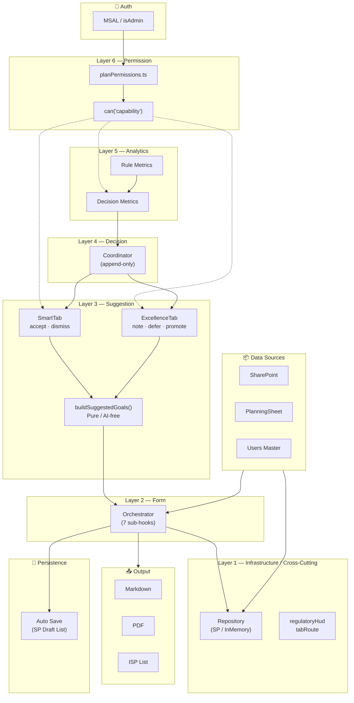

# 支援計画ガイド — アーキテクチャ概要（共有版）

> **Support Plan Guide: Architecture Brief**
> 2026-03-17 | P4 完了時点 | 1枚図 + 4ページ

---

## 📐 1枚図：全体構成



**読み方：上から下へ、権限 → 分析 → 判断 → 提案 → フォーム → 基盤 の6層構造**

---

## 📖 Page 1：レイヤ解説

| Layer | 名称 | 主要ファイル | 責務 |
|:---:|---|---|---|
| **6** | Permission | `planPermissions.ts`, `usePlanRole` | ロール定義・capability ガード |
| **5** | Analytics | `suggestionDecisionMetrics.ts`, `suggestionRuleMetrics.ts` | 採用率・ルール品質の算出 |
| **4** | Decision | `useSuggestionDecisionPersistence` | 判断の永続化（Coordinator） |
| **3** | Suggestion | `suggestedGoals.ts`, `suggestedGoalsAdapter.ts` | 4ソースからの目標候補生成 |
| **2** | Form | `useSupportPlanForm` + 7 sub-hooks | フォーム状態・保存・CRUD |
| **1** | Infrastructure / Cross-Cutting | Repository (DI), `regulatoryHud.ts`, `tabRoute.ts` | 永続化 + 横断ドメインユーティリティ |

### 設計5原則

```
1. Pure Domain First     — ビジネスロジックは React 非依存
2. Thin Orchestrator     — 統合 hook は compose のみ
3. Coordinator Pattern   — 判断永続化は Page 層に集約
4. Repository DI         — SP / InMemory を環境切替
5. Capability-Based AC   — can('feature.action') で表示制御
```

### ロール階層

```
staff ⊂ planner ⊂ admin

staff    = 日常入力・保存まで可能（フォーム編集は全ロール共通）
planner  = + 提案判断・改善メモ・承認
admin    = + 制度HUD・ルール評価・設定管理
```

---

## 📖 Page 2：データフロー

```
INPUT                 PROCESSING            DECISION              OUTPUT
─────                 ──────────            ────────              ──────

SharePoint ──┐
             ├──► useSupportPlanForm ──► form state
PlanningSheet┤                              │
             ├──► suggestedGoalsAdapter     │
Users_Master─┘        │                     │
                       ▼                     │
                 buildSuggestedGoals()       │
                       │                     │
                       ▼                     │
              GoalSuggestion[]               │
                  │           │              │
                  ▼           ▼              │
             SmartTab    ExcellenceTab       │
            accept/      note/defer/         │
            dismiss      promote             │
                  │           │              │
                  └─────┬─────┘              │
                        ▼                    │
              DecisionPersistence            │
              (append-only)                  │
                        │                    │
                  ┌─────┴─────┐              │
                  ▼           ▼              │
            Metrics     RuleMetrics          │
                                             │
                                             ▼
                                      ┌─────────────┐
                                      │ Markdown     │  ← 帳票出力
                                      │ PDF          │
                                      │ ISP (SP List)│
                                      └─────────────┘
                                      ┌─────────────┐
                                      │ Auto Save    │  ← 永続化
                                      │ (SP Draft)   │
                                      └─────────────┘
```

### 提案エンジンの4データソース

| ソース | 入力 | 生成例 |
|---|---|---|
| **Assessment** | リスクレベル・標的行動・仮説 | 「攻撃行動の背景仮説に基づく短期目標」 |
| **Iceberg** | 観察事実・支援課題・具体的アプローチ | 「氷山モデル分析からの改善目標」 |
| **Monitoring** | モニタリング計画・改善アイデア | 「計画変更推奨に基づく見直し目標」 |
| **Form** | ストレングス・改善メモ | 「利用者の強みを活かした目標」 |

---

## 📖 Page 3：ロール × 機能マトリクス

| 機能グループ | capability | staff | planner | admin |
|---|---|:---:|:---:|:---:|
| **フォーム** | `form.edit` | ✅ | ✅ | ✅ |
| | `form.save` | ✅ | ✅ | ✅ |
| **提案** | `suggestions.view` | — | ✅ | ✅ |
| | `suggestions.decide` | — | ✅ | ✅ |
| | `suggestions.promote` | — | ✅ | ✅ |
| **メモ** | `memo.view` | — | ✅ | ✅ |
| | `memo.act` | — | ✅ | ✅ |
| **分析** | `metrics.view` | — | — | ✅ |
| | `ruleMetrics.view` | — | — | ✅ |
| **制度** | `regulatoryHud.view` | — | — | ✅ |
| **設定** | `settings.manage` | — | — | ✅ |
| **承認** | `compliance.approve` | — | ✅ | ✅ |

### ロールと福祉現場の対応

| ロール | 実務上の役割 | 典型的な職種 |
|---|---|---|
| **staff** | 日常記録・フォーム入力 | 直接支援員・世話人 |
| **planner** | 支援計画の作成・判断 | サービス管理責任者・相談支援専門員 |
| **admin** | 運用管理・品質監視 | 管理者・施設長 |

### 将来の接続先

`resolvePlanRole()` は pure 関数。以下への差し替えが可能：

```
現在:  isAdmin (boolean) → PlanRole
将来:  Graph API / Azure AD Role / SharePoint Group → PlanRole
       ↓ roleHint パラメータで接続
```

---

## 統計サマリ

| 項目 | 数値 |
|---|---|
| ソースファイル | ~75 files |
| 合計サイズ | ~345 KB |
| テストファイル | 22 files |
| テスト数 | 342 tests |
| タブ数 | 10 sections |
| Suggestion UI | 6 components |
| Sub-hooks | 7 composable |
| Capabilities | 12 defined |
| Page 行数 | 484 lines |

---

## 📖 Page 4：Planner Assist 構想（P5）

> [!NOTE]
> P5 は「次にやるべきこと」を planner に提示し、作業時間を短縮する機能群です。
> P4 で定義した `planner` ロールの可視性を活かした、planner 専用の導線強化です。

### 位置づけ

```
現在の到達点                    P5 で追加
──────────────                ────────────
提案が出る                   → 「次にやるべきこと」が見える
人が判断する                 → 優先順位が提示される
結果が保存される              → 作業進捗が把握できる
品質が測れる                  → 改善ループが回る
```

### Next Action Panel

planner がログインしたとき、**最初に見るべき情報** を1パネルに集約。

```
┌──────────────────────────────────────────────┐
│  📋 Next Actions for Planner                 │
│                                              │
│  ⚡ 未判断の提案:  3件  ────────── SmartTab   │
│  ⬆️  昇格候補:      1件  ────────── Memo      │
│  ⚠️  未設定の目標:  2件  ────────── SmartTab   │
│  📊 制度要件漏れ:  1件  ────────── HUD        │
│                                              │
│  📈 今週の採用率: 67%  ↑12%                   │
└──────────────────────────────────────────────┘
```

### 機能候補

| 機能 | 入力 | 出力 | 優先度 |
|---|---|---|:---:|
| **未判断カウント** | `GoalSuggestion[]` + `decisions[]` | 未判断件数バッジ | 🔴 High |
| **昇格候補トリアージ** | `promoted` 状態のメモ | 目標化候補の整理リスト | 🟡 Medium |
| **空目標検出** | `goals[]` の空フィールド | 不完全目標の警告 | 🟡 Medium |
| **制度要件チェック** | `RegulatoryChip[]` の未充足 | 制度対応の残タスク | 🟢 Low |
| **目標下書き補助** | strengths + assessment | 目標文の雛形提案 | 🟢 Low |

### データフロー（P5 追加分）

```
Layer 3 (Suggestion) ──► 未判断カウント ──┐
Layer 4 (Decision)   ──► 昇格候補       ──┤
Layer 2 (Form)       ──► 空目標検出     ──┼──► Next Action Panel
Layer 1 (Regulatory)  ──► 制度要件      ──┤    (planner only)
Layer 5 (Analytics)  ──► 週次サマリ     ──┘
```

### 設計方針

| 原則 | 適用 |
|---|---|
| Pure Domain First | アクション算出は `domain/plannerActions.ts` に置く |
| Capability Guard | `can('plannerAssist.view')` で planner 以上に制限 |
| Thin Component | Panel は算出結果を受け取るだけ（ロジック不在） |
| 既存レイヤ再利用 | 新レイヤは追加せず、Layer 2-5 の出力を集約 |

### 期待効果

```
計画作成にかかる時間
 Before:  planner が各タブを順に確認 → 40分
 After:   Panel で残タスク確認 → 該当タブへ直行 → 25分

 目標: 作業時間 30% 短縮
```
