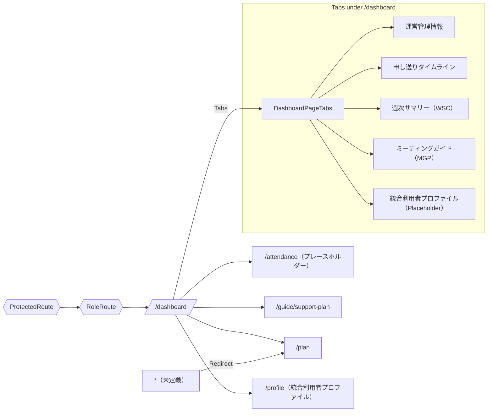

# System Map（主要構成）

## スコープ
- ルートと画面の対応関係
- モジュール依存（UI/Store/SP/Guards）
- ルーティング規約と非機能（ガード順序、Feature Flag）
- 最小のテスト観点（ユニット/E2Eの切り分け）

---

## 1) モジュール依存関係（高レベル）

```mermaid
graph LR
  subgraph App Shell
    R[router.tsx] --> S[AppShell.tsx]
  end

  subgraph Auth & Guard
    PR[ProtectedRoute.tsx]
    RR[RoleRoute.tsx]
  end

  subgraph 黒ノート・ダッシュボード
    DT[DashboardPageTabs.tsx]
    D[DashboardPage.tsx]
    M[MeetingGuidePage.tsx]
    WSC[WeeklySummaryChart.tsx]
    PG[progress.ts]
  end

  subgraph 日次記録/サポート記録
    TFSR[TimeFlowSupportRecordPage.tsx]
  end

  subgraph 個別支援計画
    SPG[SupportPlanGuidePage.tsx]
  end

  subgraph 共通
    STORE[store.ts]
    UI[ui/*, types/*]
    SP[lib/useSP, spClient]
  end

  R --> PR --> RR --> S
  S --> DT
  S --> TFSR
  S --> SPG

  DT --> D
  DT --> M
  DT --> WSC
  WSC --> PG

  D --> STORE
  TFSR --> STORE
  SPG --> STORE
  STORE --> SP
  D --> UI
  TFSR --> UI
  SPG --> UI
```

要点
	• ルーティングは Auth → Role → Shell の順でガード。
	• 週次サマリーは progress.ts にロジック分離（テスト容易）。
	• 取得系は store.ts と useSP() の二層で吸収。

⸻

2) 主要ルートと遷移



補足
	• /attendance は仮画面で 404 回避。将来差し替え口を固定。
	• キャッチオールは /plan へ。

⸻

3) ルーティング規約
	• 命名：トップは名詞、ガイド/設定は guide/* / settings/*。
	• タブにURLを付与：/dashboard/meeting のようにパス派で固定（E2E 安定）。
	• ガード順序：<ProtectedRoute><RoleRoute><AppShell/>/RoleRoute</ProtectedRoute>。
	• Feature Flag：非公開機能はナビ非表示＋直アクセスは /dashboard に退避。
	• キャッチオール：* -> /plan（案内UI付き）。

⸻

4) テスト観点（最小で効くセット）

領域	目的	推奨テスト
ルーティング	認証・権限で到達可否が正しい	E2E：未認証→Unauthorized、Staff→許可、Viewer→拒否
Dashboard Tabs	タブの直リンク復元	E2E：/dashboard/meeting 直リンクで MGP 表示
WeeklySummary	集計の正当性	Unit：progress.ts の入力→期待出力
日次記録	初期フォーカス/未入力ジャンプ	E2E or RTL：最初の未記入行へフォーカス
SP連携	失敗時の再試行	Unit：401/429 リトライと UI 通知
Placeholder 安定	mount/unmount 可能	Smoke：profile タブの生存確認

Coverage Gate：Line/Func/Stmts 70% / Branch 65%（E2E は最小、ロジックはユニット厚め）。

⸻

5) 既知のギャップと対処（短期パッチ）
	• MeetingGuidePage.tsx を追加（ビルド安定化）。
	• 統合利用者プロファイルは Placeholder 明示（data-testid="profile-placeholder"）。
	• /attendance 差し替え用に export const routeId = 'attendance' を固定公開。
	• Roles の境界（Staff/Admin/Viewer）は E2E 3ケースで担保。

⸻

6) ファイル設置チェックリスト
	• src/pages/MeetingGuidePage.tsx：最小骨格を設置
	• router.tsx：/dashboard/meeting を path 化
	• tests/e2e/routing.spec.ts：認証/ロール/キャッチオール
	• tests/unit/progress.spec.ts：週次集計の正当性
