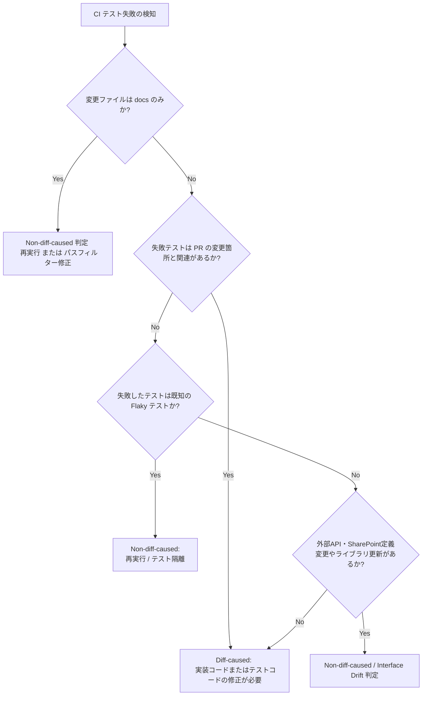

# Audit Management System MVP Test Coverage / Quality Gate Matrix Report

調査実施日: 2026年6月19日
対象コミット: `c406bc5f7eb37ed21abd1b6ba72cffc52744ff72`

## 1. 調査目的
本調査の目的は、Audit Management System MVP における多層的なテスト環境（Unit, Component, Hook, Integration, E2E）および CI/CD 品質ゲートの実態を棚卸し、主要ドメインの「防衛状況」と「潜在的な品質リスク」を可視化することです。
最近の「docsのみのPRでのCIの重さ」「一部テストの不安定性（Flaky）」「TypeScriptの型ズレ（drift）」といった課題に対し、機能ごとのテスト防御力マップと、PR判定時におけるトリアージ基準（diff-caused / non-diff-caused）を整理することで、安全かつ迅速な開発サイクルの維持を目指します。

## 2. テスト種別と品質ゲートの全体像
プロジェクトで運用されているテストおよび品質ゲートは、以下の多層構造で構成されています。

- **Unit Test (単体テスト)**: `vitest` を使用。純粋関数、OData mapper、ドメインモデル（policy）、ユーティリティを高速検証。
- **Hook Test (カスタムフックテスト)**: React Hook (`useUsers`, `useAttendance` など) の状態遷移やデータ取得・保存シーケンスのテスト。`@testing-library/react` の `renderHook` を使用。
- **Component Test (コンポーネントテスト)**: UI表示、フォームバリデーション、ボタン活性・非活性制御の検証。
- **Integration Test (統合テスト)**: Provider、Repository実体、SharePoint adapter などの結合部分の検証。モック環境（Memory/Mock Repository）や SharePoint API のダミーレスポンス境界。
- **E2E / Smoke Test (Playwright E2E)**: Playwright を使用。実画面の導線、通常モードとキオスクモードの画面遷移、認証・保存の基本フローの検証。
- **Typecheck & Lint (静的解析)**: TypeScript による型チェック (`typecheck`, `typecheck:full`) と ESLint (`lint`) によるコード規約の検証。
  - `typecheck:full` は型定義ファイル（`.d.ts`）や typed-test を含むプロジェクト全体の完全な型検証を実施し、リポジトリと UI 間の暗黙的な型の不整合（Interface Drift）を検出します。

---

## 3. 主要ドメイン別テストカバレッジ

主要なドメインと周辺コアコンポーネントにおけるテストのカバー状況を、テスト防御力マップおよび防御力ランク（A〜E）としてマッピングします。

### ドメイン別テスト防御力マップ

| 領域 | Unit | Component | Hook | Integration | E2E/Smoke | Typecheck | 判定 | 補強候補 |
| :--- | :---: | :---: | :---: | :---: | :---: | :---: | :---: | :--- |
| **Kiosk** (23件) | あり | あり | あり | 一部 | あり | あり | **A/B** | smoke安定性整理 |
| **Daily** (101件) | あり | 一部 | あり | あり | 一部 | あり | **B** | 保存後再取得テスト |
| **Record Quality** (6件) | あり | 一部 | あり | あり | 要確認 | あり | **B** | UI導線テスト |
| **Users** (45件) | あり | あり | あり | あり | 要確認 | あり | **B** | master更新系 |
| **Attendance** (20件) | あり | 要確認 | あり | 一部 | 要確認 | あり | **B/C** | SharePoint境界 |
| **Checklist / Exceptions** (24件) | 少なめ | 要確認 | 要確認 | 要確認 | 要確認 | 要確認 | **C** | repository境界化後 |
| **Navigation / AppShell** (18件) | あり | あり | - | あり | あり | あり | **A/B** | 通常/キオスク分岐 |
| **SharePoint Repository** (94件) | あり | 一部 | - | あり | なし | あり | **B** | スキーマ変更検知 |

* ※ファイル件数は、テストファイル名（`*.test.ts`, `*.spec.ts` 等）の検索およびドメイン分類基準に基づく直近の集計値です。

### 判定ランクの定義
* **A (十分な防衛)**: 主要フローが unit/component/hook/integration/E2E の複数層で守られている。
* **B (概ね堅牢)**: 主要ロジックは守られているが、E2Eまたは永続化境界のテストが一部不足。
* **C (一部不足)**: テストはあるが、UIまたは永続化境界の重要パスが不足。
* **D (脆弱)**: テストが断片的にしか存在せず、デグレード検知力が弱い。
* **E (要再調査)**: テスト状態が不明、または旧実装と新実装が混在して再構成が必要。

---

## 4. CI Workflow / Quality Gate の整理

GitHub Actions 上で設定されている主要なワークフローファイルのトリガーと実行内容を整理します。

### CI / Quality Gate 分類

| Check | 種別 | 重さ | PR判定での扱い | 備考 |
| :--- | :--- | :--- | :--- | :--- |
| **lint** | static | 軽量 | requiredとして観測される check | docsのみのPRでも走る |
| **typecheck** | static | 中量 | requiredとして観測される check | unrelated drift（関係のない型乖離）に注意 |
| **Core API Contracts** | contract | 中量 | requiredとして観測される check | 主要APIの契約整合 |
| **links** | docs | 軽量 | required/qualityとして観測される check | docs PRでリンク破損を防ぐために重要 |
| **smoke** | E2E | 重量 | required/準requiredとして観測される check | flaky（実行ごとの不安定さ）の切り分けが必要 |
| **Deep Tests (Chromium)** | E2E | 重量 | optional/統合観測として扱われる check | 差分非起因の failure に注意 |
| **quality_extended** | extended | 重量 | optional/既知不安定として扱われる check | 既知の不安定テスト（Flaky）の分類用 |

* ※「重さ」は直近PRでの実行時間・負荷に基づく観測ベースの分類（軽量 / 中量 / 重量）です。

### ワークフロー詳細

#### 1. CI Preflight (`ci-preflight.yml`)
* **トリガー**: PR作成/更新、`main` への push
* **実行ジョブ**:
  * `test-ids-guard` (軽量): E2Eテスト用のデータ属性（`data-testid`）のドリフトを検出。
  * `typecheck` (中量): `npm run typecheck` による型エラーチェック。
  * `lint` (中量): `npm run lint` による静的検証。
  * `preflight-unit` (中量): 必須ユニットテストスイート (`test:ci:required`) のシャード実行 (VITE_FEATURE_SCHEDULES_GRAPH マトリクス)。
  * `schedule-unit` (中量): タイムゾーン環境（Asia/Tokyo, America/Los_Angeles）ごとのスケジュール単体テスト。
  * `e2e` (重量): Playwright E2E。PR に `e2e` ラベルが付与されている場合のみのオプトイン実行。

#### 2. Main CI (`ci.yml`)
* **トリガー**: PR作成/更新、`main` / `develop` への push
* **実行ジョブ**:
  * `contracts` (軽量): `spClient` と `navigationConfig` のコア API 契約テスト。
  * `registry-*` (軽量〜中量): 静的レジストリ監査、SSOT契約テスト、レジストリ統合、およびスキーマドリフト検証。
  * `typecheck` (中量): ESLint（アーキテクチャガード）、インデックス監査（Schema Driftの防止）、および TypeScript のコンパイル確認。
  * `unit-test-shard` (中量〜重量): Vitest ユニットテストを 1/3, 2/3, 3/3 の3つに分割実行。PR時は必須部分（`test:ci:required`）を実行し、マージ時は全テスト（`test:ci`）を実行。テストでの `act()` 警告を検知した場合は自動で GitHub Issue を起票。
  * `typecheck-and-test` (Aggregator): 上記ジョブがすべてパスすることを確認する aggregator。

#### 3. Smoke Tests (Fast) (`smoke.yml`)
* **トリガー**: PR作成/更新、`workflow_dispatch`
* **実行ジョブ**:
  * `nav-integrity` (軽量): ルーター・ナビゲーションの整合性を検証する `nav-router-consistency.spec.ts` などの実行。
  * `e2e-smoke` (重量): Playwright スモークテスト。`E2E_SAVE_MODE=mock` でモック化された SharePoint 境界を保証。

#### 4. Fast Lane (`fast-lane.yml`)
* **トリガー**: `port/flags`, `main` への push、`main` への PR
* **実行ジョブ** (中量〜重量): 変更に即応するための高速ビルドと、主要コンポーネント（Users detail, Nurse BP sync, Prefetch 等）の限定的 E2E テスト。

---

## 5. diff-caused / non-diff-caused 判定基準

PR でテストが落ちた際、その PR 自体のコード変更が原因（diff-caused）か、あるいは外部要因や他のマージによって発生した別問題（non-diff-caused）かを正しく切り分けるための判定フローです。

### 1. Diff-caused (差分起因失敗)
* **定義**: PR で追加・修正したコードそのものが不具合を持っている、または既存ロジックとの競合によってテストが破壊された状態。
* **対処方針**: 実装コードのバグ修正、または仕様変更に合わせたテストコードの更新を行います。他モジュールへの影響（波及バグ）の場合は、インターフェース設計の見直しを行います。

### 2. Non-diff-caused (差分非起因失敗)
* **定義**: PR の変更コードとは無関係なタイミング要因、テストインフラの不整合、またはリポジトリ外部（SharePoint リストスキーマや環境変数）の変更によって発生したテストの失敗。
* **対処方針**:
  * **docs-only PR** でのユニットテストや E2E の失敗については、ドキュメントファイルの更新しかしていないため、非起因とみなしてテストの再実行、または GitHub Actions のパスフィルター（`paths-ignore`）によるジョブ起動防止を行います。
  * **Flaky テスト**（タイミング依存の E2E タイムアウト等）は、再実行でパスすることを確認した上で「既知の Flaky テスト」として隔離（`test.skip` や `retry` チューニング）します。
  * **Interface/Schema Drift** の場合は、外部 SharePoint スキーマとリポジトリ定義の乖離を解消するための別タスクを切り、スキーマ同期ツール（`spProvisioningCoordinator`）の適用を検討します。

---

## 6. Flaky / Known Failure の扱い

プロジェクト内で発生する代表的な Flaky テストの原因と、その具体的な対処ルールを定義します。

### 代表的な発生原因
1. **Playwright E2E の非同期タイミングの揺れ**
   * UIアニメーションの完了や API レスポンス（モック時）の描画タイミングと、テスト側のアサーションが同期せずタイムアウトするケース。
2. **React Testing Library の `act(...)` 警告**
   * フック内での非同期的なステート変更がテストライフサイクルの範囲外で発生し、警告を誘発するケース。
3. **TimeZone (TZ) による 9時間ズレの発生**
   * テストランナーのデフォルト環境（UTC）と日本時間（JST）の解釈の違いにより、日付境界でアサーションが落ちるケース。

### 対処ルール
* **リトライの設定**: CI上ではリトライ（Playwright: `--retries=1~2`）で救済される場合でも、ローカル環境で再現する場合は、アサーションの直前に明示的な `page.waitForSelector` や `await waitFor(...)` を追加して DOM 描画を保証します。
* **TimeZone の明示**: タイムゾーン依存のテストには必ず `TZ=Asia/Tokyo` または `VITE_SCHEDULES_TZ=Asia/Tokyo` を環境変数として明示し、実行時のタイムゾーン差異を排除します。
* **`act()` 警告の解消**: `vi.useFakeTimers()` を使用している場合は、アサーション前に timers を適切にフラッシュ（`vi.runAllTimers()` または `vi.advanceTimersByTime()`）させ、非同期フック処理が完全に完了した状態をテストします。

---

## 7. テスト不足・補強候補

主要ドメインの棚卸しにより判明した、現在のテスト不足領域と今後の補強アクションプランです。

1. **Checklist (Compliance) ドメインのテスト拡充 (最優先・優先度: 高)**
   * **現状**: テストファイルが 2件のみで、制度監査の要件を満たすチェック項目の変更や判定の検証が薄い。
   - **対策**: `SharePointChecklistRepository` の契約テストと、チェックリストカスタムフックに対する境界値テストを新規追加する。
2. **E2E Smoke テストの安定化 (優先度: 高)**
   * **現状**: モックデータ接続時における Playwright 実行時の不安定さ（Flaky）が PR ビルドのボトルネックになっている。
   - **対策**: アニメーション完了を待つヘルパーの追加と、E2Eテスト内の過剰なハードコーディングウェイト（`setTimeout`）を排除し、スマートウェイトへ置き換える。
3. **Daily Records の保存後再取得フローのテスト追加 (優先度: 中)**
   * **現状**: 支援記録を保存した直後、画面を更新せずに最新データが Daily Board に反映されるかどうかの状態リロード検証が Vitest / Component レベルで一部不十分。
   - **対策**: Hook レベルで `save` 成功時にトリガーされる `refetch` キャッシュ無効化シーケンスのテストを追加する。

---

## 8. 次に切るべき小PR候補

テスト防御力と CI 効率を改善するための、具体的な小規模 PR の分割案です。

1. **`test: stabilize-e2e-smoke-timing`**
   * **スコープ**: `tests/e2e/` 内の主要スモークテストでの DOM 待機処理の改善（スマートウェイトへの置き換え）。
   * **効果**: PR ビルドにおける Flaky な Playwright 失敗を抑制。
2. **`test: add-checklist-repository-contract`**
   * **スコープ**: `src/features/compliance-checklist` 領域の SharePoint リストマッパーおよびリポジトリ契約テストの追加。
   * **効果**: 監査チェックリスト機能のリファクタリング耐性を確保。
3. **`ci: refine-docs-only-path-filter`**
   * **スコープ**: `.github/workflows/` 内の各 yaml に対する `paths-ignore`（ドキュメントファイルの指定）の設定。
   * **効果**: docs-only PR における不要な CI コストと開発者待機時間を削減。
