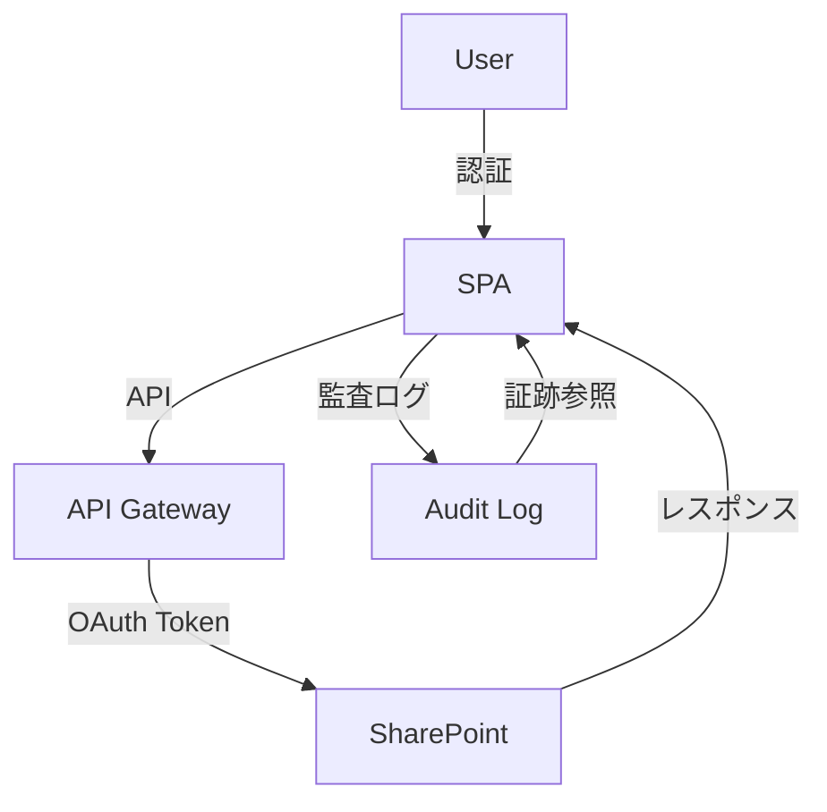

# STRIDEミニ分析 — 脅威モデリング

## 概要
- 本システムにおける主要な脅威カテゴリ（STRIDE）ごとに、該当例・対策・リスク評価を整理。
- セキュリティ設計・運用の指針とし、開発・レビュー・運用時の共通認識を醸成する。

---

## 1) STRIDEカテゴリと該当例

| カテゴリ | 該当例（本システム） | 対策 | リスク |
|---|---|---|---|
| Spoofing（なりすまし） | Azure AD認証バイパス、偽装トークン | MSAL+PKCE, ロールガード, セッション有効期限 | High |
| Tampering（改ざん） | APIリクエスト改ざん、CSRF | HTTPS, CORS, CSRFトークン, 入力バリデーション | Medium |
| Repudiation（否認） | 操作ログの欠如、監査証跡の不備 | 監査ログ, 操作記録, data-testid証跡 | Medium |
| Information Disclosure（情報漏洩） | 機密データの誤送信, .env流出 | RBAC, .env管理, HTTPS, ログマスキング | High |
| Denial of Service（DoS） | バッチ連投, APIスロットリング, 無限ループ | レート制限, バックオフ, バッチサイズ制限 | Medium |
| Elevation of Privilege（権限昇格） | ロール誤設定, 管理画面直リンク | RBAC, ルートガード, E2E到達テスト | High |

---

## 2) データフロー可視化（Mermaid）

---

## 3) リスク評価と優先度

- **High**: Spoofing, Information Disclosure, Elevation of Privilege
- **Medium**: Tampering, Repudiation, DoS
- **Low**: 現状該当なし（設計・運用で随時見直し）

---

## 4) 運用上の対応

- **バックアップ**: SharePoint/監査ログの定期バックアップ
- **監査**: 主要操作の監査証跡（data-testid, 操作ログ）を保持
- **再認証**: セッション有効期限・再認証フローの実装
- **権限管理**: RBAC早見表・auth-flow.mdに従い、ロール設定を定期点検
- **インシデント対応**: runbook.mdに従い、異常時は即時トリアージ

---

## 5) 参考
- [auth-flow.md](./auth-flow.md)
- [rbac.md](./rbac.md)
- [runbook.md](../ops/runbook.md)
- [audit-observability.md](../metrics/audit-observability.md)
