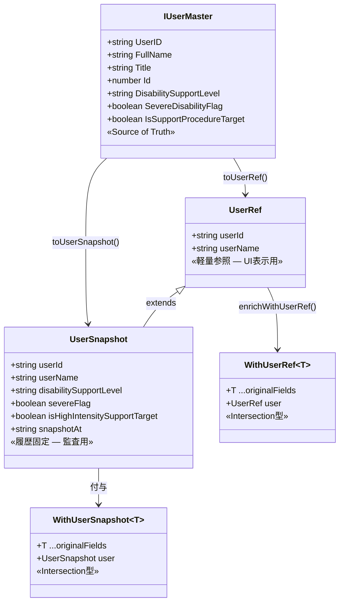
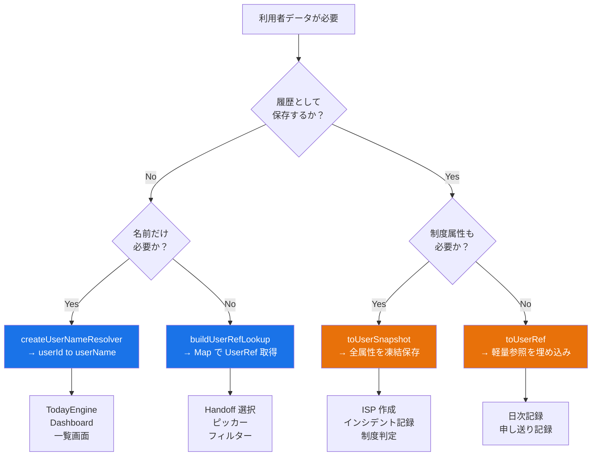
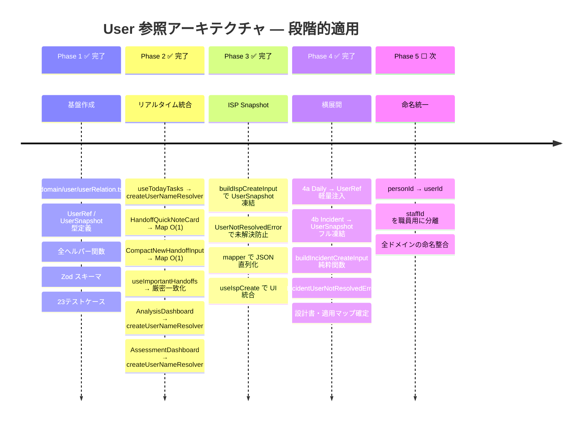
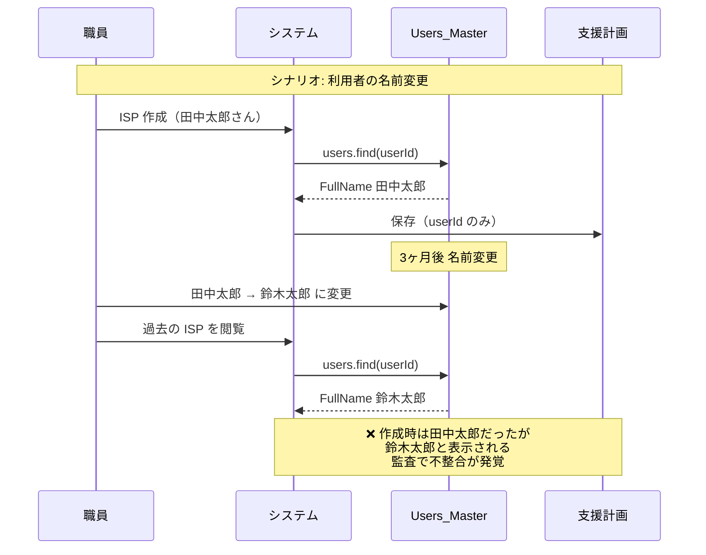
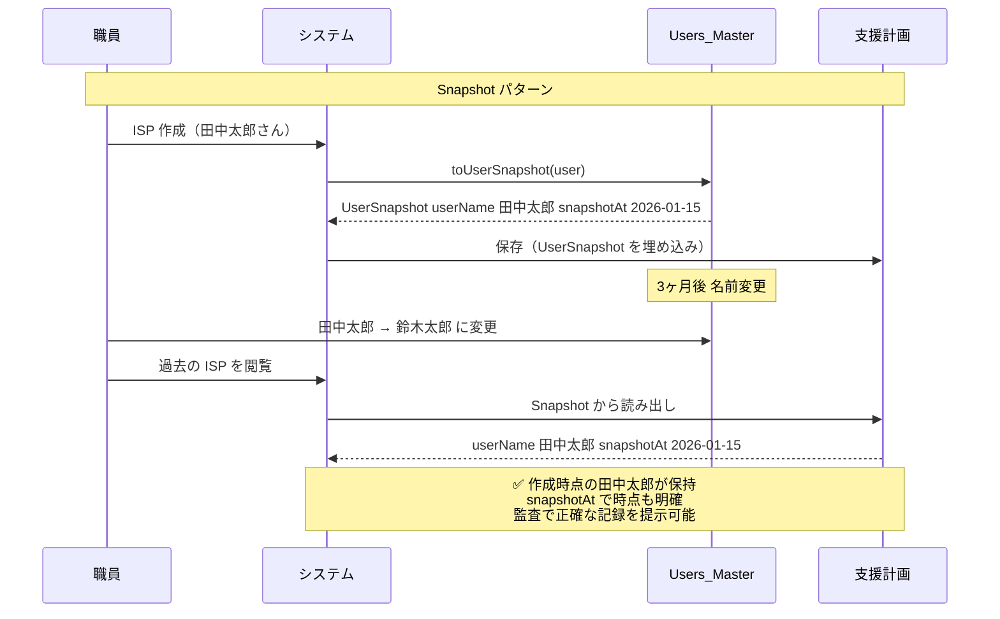

# User 参照アーキテクチャ — Support Operations OS のコア設計

> **ADR**: [ADR-011](../adr/ADR-011-user-reference-architecture.md)
> **ステータス**: 承認済
> **最終更新**: 2026-03-17

> **本文書の位置づけ**: このシステムにおけるすべてのデータは「誰の」データかという問いに帰着する。
> User 参照アーキテクチャは、その「誰の」を **安全・統一・履歴保全** の3原則で解決する中心設計である。

---

## 設計思想

### なぜこれがコア設計なのか

障害福祉の業務システムでは、**利用者** が全データの起点になる。

```
日次記録        → 誰の記録か
支援計画（ISP） → 誰の計画か
申し送り        → 誰についての申し送りか
インシデント    → 誰に発生したか
行動分析        → 誰の行動か
アセスメント    → 誰の特性か
```

この「誰の」を解決する仕組みが壊れると、**システム全体が壊れる**。

### 3つの原則

| 原則 | 意味 | 違反した場合のリスク |
|------|------|---------------------|
| **安全** | O(1) 解決、型安全 | パフォーマンス劣化、型崩れ |
| **統一** | 全ドメインが同一経路で解決 | 画面ごとにバラバラなロジック |
| **履歴保全** | 参照時点の情報を凍結保存 | 利用者変更で過去記録が破壊 |

---

## 識別子ポリシー

> [!IMPORTANT]
> 利用者の特定は **識別子** で行う。名前は表示専用であり、結合条件に使ってはならない。

| 識別子 | 役割 | 用途 |
|--------|------|------|
| `userId` | システム内部の一意識別子 | リレーション結合の唯一の基準 |
| `userCode` | 現場運用・帳票・照合用の業務識別子 | 帳票出力、現場での口頭照合 |
| `userName` | UI 表示用の正規化済み名称 | 画面表示のみ。結合に使用禁止 |

### 命名規約

- `UserRef.userName` は UI 表示用の正規化済み名称とする
- `IUserMaster.FullName` / `Title` / `displayName` などの元フィールド差異は `domain/user` で吸収する
- `includes` などの **曖昧一致で利用者を特定してはならない**

### 役割の分離

```
リレーション結合  → userId  のみ
表示・検索補助    → userCode / userName
帳票・現場照合    → userCode
```

---

## Snapshot 不変原則

> [!CAUTION]
> `UserSnapshot` は保存時点の事実を凍結したものであり、**後から更新しない**。

- 利用者マスタが変更されても、過去レコードに埋め込まれた Snapshot は変更しない
- 表記修正や制度情報修正が必要な場合は、**元レコードの訂正履歴**として扱う
- Snapshot の改竄は監査違反となりうるため、コードレビューで厳密にチェックする

### Snapshot の必須 / 任意フィールド

**必須（全 Snapshot に含める）**

| フィールド | 型 | 説明 |
|------------|-----|------|
| `userId` | `string` | 永続識別子 |
| `userName` | `string` | 時点名称 |
| `snapshotAt` | `string` | ISO 8601 タイムスタンプ |

**制度系（必要な場合のみ含める）**

| フィールド | 型 | 必要場面 |
|------------|-----|----------|
| `disabilitySupportLevel` | `string` | ISP、制度判定 |
| `severeFlag` | `boolean` | 報酬算定 |
| `isHighIntensitySupportTarget` | `boolean` | 重度加算判定 |

> [!TIP]
> 「全部盛り Snapshot」を避ける。消費側が不要なフィールドまで保持すると、
> スキーマ変更時の影響範囲が広がる。

---

## 欠損時の挙動

> [!WARNING]
> 利用者データの欠損は運用上必ず発生する（退所、テストデータ、マスタ遅延同期）。
> フォールバック方針を統一する。

### リアルタイム参照（`createUserNameResolver`）

- userId が解決できない場合、**userId そのものをフォールバック表示**する
- UI は `"不明な利用者"` ではなく、技術者が特定可能な `userId` を返す

### ルックアップ（`buildUserRefLookup`）

- Map に存在しない userId は `undefined` を返す
- 呼び出し側で未解決を検知し、UI 上で「利用者不明」などの表示を行う

### 履歴保存時

- **userId 未解決のまま Snapshot を保存しない**
- 利用者が選択されていない状態での保存はバリデーションで防ぐ

### バッチ enrich 時

- `enrichAllWithUserRef` は未解決レコードを除外せず、`user` フィールドが付与されないレコードとして返す
- 呼び出し側で `missing` 状態を検知し、ログまたは UI で通知する

---

## 全体アーキテクチャ

```mermaid
graph TB
  subgraph "Source of Truth"
    SP["SharePoint<br/>Users_Master リスト"]
  end

  subgraph "Repository Layer"
    Repo["useUsersDemo / UserRepository<br/>IUserMaster[]"]
  end

  subgraph "domain/user — 参照解決レイヤー"
    direction TB
    
    subgraph "軽量参照（リアルタイム）"
      UserRef["UserRef<br/>userId + userName"]
      Resolver["createUserNameResolver<br/>(userId) → userName"]
      Lookup["buildUserRefLookup<br/>Map&lt;string, UserRef&gt;"]
    end
    
    subgraph "履歴固定（スナップショット）"
      UserSnapshot["UserSnapshot<br/>UserRef + 制度属性 + snapshotAt"]
      SnapshotLookup["buildUserSnapshotLookup<br/>Map&lt;string, UserSnapshot&gt;"]
    end
    
    subgraph "バッチ処理"
      ResolveNames["resolveUserNames<br/>配列の一括名前解決"]
      EnrichRef["enrichAllWithUserRef<br/>配列への UserRef 付与"]
    end
  end

  subgraph "消費側 — リアルタイム表示"
    TodayEngine["TodayEngine<br/>resolveUserName callback"]
    Handoff["Handoff 画面<br/>利用者選択 / 名前表示"]
    Dashboard["Dashboard 画面<br/>分析対象者の名前表示"]
    Daily["日次記録<br/>利用者ピッカー"]
  end

  subgraph "消費側 — 履歴保存"
    ISP["ISP / 支援計画<br/>作成時点の利用者属性"]
    DailySnap["DailyUserSnapshot<br/>日次記録の利用者情報"]
    Incident["HighRiskIncident<br/>事故時点の利用者情報"]
    Regulatory["UserRegulatoryProfile<br/>制度判定プロファイル"]
  end

  SP -->|fetch| Repo
  Repo -->|IUserMaster[]| UserRef
  Repo -->|IUserMaster[]| UserSnapshot
  
  UserRef --> Resolver
  UserRef --> Lookup
  UserSnapshot --> SnapshotLookup
  
  Lookup --> ResolveNames
  Lookup --> EnrichRef
  
  Resolver --> TodayEngine
  Resolver --> Dashboard
  Lookup --> Handoff
  Lookup --> Daily
  
  UserSnapshot -->|buildIspCreateInput| ISP
  UserRef -->|buildDailyUserSnapshot| DailySnap
  UserSnapshot -->|buildIncidentCreateInput| Incident
  UserSnapshot --> Regulatory
```

---

## 型の階層と責務



---

## 参照パターンの使い分け

### 判断フロー



### パターン一覧

| パターン | 関数 | 入力 | 出力 | 用途 |
|----------|------|------|------|------|
| **名前解決** | `createUserNameResolver` | `users[]` | `(id) → name` | TodayEngine, Dashboard |
| **軽量参照** | `buildUserRefLookup` | `users[]` | `Map<id, UserRef>` | ピッカー, フィルター |
| **バッチ名前付与** | `resolveUserNames` | `records[], lookup` | `records[] + userName` | 一覧表示 |
| **レコード付与** | `enrichAllWithUserRef` | `records[], lookup` | `records[] + user: UserRef` | 記録と利用者の結合 |
| **スナップショット** | `toUserSnapshot` | `user` | `UserSnapshot` | ISP, インシデント |

---

## Phase 別の適用マップ



---

## Create 境界ルール（Phase 4 確定）

> [!IMPORTANT]
> **新規ドメインで利用者参照を持つ場合は、以下のルールに従うこと。**

### Snapshot 種別の選択基準

| 条件 | 選択 | 例 |
|------|------|----|
| 監査で制度属性の遡及参照が必要 | `UserSnapshot`（フル） | ISP, Incident |
| 件数が多くストレージ効率優先 | `UserRef`（軽量） | Daily |
| リアルタイム表示のみ | `createUserNameResolver` | Dashboard, TodayEngine |

### 確定済みルール

| # | ルール | 理由 |
|---|--------|------|
| 1 | **create 時のみ snapshot 生成** | update で再生成すると時点整合が崩れる |
| 2 | **user 未解決は create を失敗させる** | サイレントフォールバックは監査リスク |
| 3 | **snapshot は不変** | `snapshotAt` で凍結時点を ISO 8601 記録 |
| 4 | **既存データは後方互換** | `userSnapshot` / `userRef` は optional |
| 5 | **Domain 型は JSON を意識しない** | mapper 層で吸収 |

### 実装済みの Create 境界

| ドメイン | 関数 | Snapshot 種別 | エラー型 |
|----------|------|---------------|----------|
| ISP | `buildIspCreateInput` | `UserSnapshot` | `UserNotResolvedError` |
| Daily | `buildDailyUserSnapshot` | `UserRef` | フォールバック許容 |
| Incident | `buildIncidentCreateInput` | `UserSnapshot` | `IncidentUserNotResolvedError` |

---

## なぜ Snapshot が必要か — 福祉システム特有の理由

> [!CAUTION]
> **利用者マスタは変わる。** 名前変更、支援区分変更、退所。
> Snapshot なしでは過去の記録が「誰のものか分からなくなる」。

### 具体的なリスクシナリオ



### Snapshot による解決



---

## ファイル構成

```
src/domain/user/
├── index.ts              # バレルエクスポート
├── userRelation.ts       # 型定義 + ヘルパー関数（全公開API）
└── __tests__/
    └── userRelation.spec.ts  # 23テストケース
```

### 公開 API 一覧

| カテゴリ | エクスポート | 説明 |
|----------|-------------|------|
| **型** | `UserRef` | 軽量参照（userId + userName） |
| **型** | `UserSnapshot` | 履歴固定（UserRef + 制度属性 + snapshotAt） |
| **型** | `WithUserRef<T>` | T に UserRef を付与する Intersection |
| **型** | `WithUserSnapshot<T>` | T に UserSnapshot を付与する Intersection |
| **型** | `IUserMasterLike` | domain 層用の最小インターフェース |
| **ファクトリ** | `toUserRef(user)` | IUserMaster → UserRef |
| **ファクトリ** | `toUserSnapshot(user)` | IUserMaster → UserSnapshot |
| **ルックアップ** | `buildUserRefLookup(users)` | `Map<string, UserRef>` を構築 |
| **ルックアップ** | `buildUserSnapshotLookup(users)` | `Map<string, UserSnapshot>` を構築 |
| **解決** | `createUserNameResolver(users)` | `(userId) → userName` 関数を生成 |
| **バッチ** | `resolveUserNames(records, lookup, keyFn)` | 配列に userName を一括付与 |
| **付与** | `enrichWithUserRef(record, lookup, keyFn)` | 単一レコードに UserRef を付与 |
| **付与** | `enrichAllWithUserRef(records, lookup, keyFn)` | 配列に UserRef を一括付与 |
| **スキーマ** | `userRefSchema` | Zod バリデーション |
| **スキーマ** | `userSnapshotSchema` | Zod バリデーション |

---

## 設計原則

> [!IMPORTANT]
> この設計は以下の3つの DDD パターンに基づいている。

### 1. Reference Object パターン

```
UserRef = 集約の外から別の集約を参照する最小型
```

ISP は User 集約そのものを保持しない。`UserRef`（または `UserSnapshot`）だけを保持する。
これにより集約間の結合度を最小化する。

### 2. Domain Service パターン

```
createUserNameResolver = UserReferenceResolver
```

名前解決は「User 集約」の責務でも「ISP 集約」の責務でもない。
ドメインサービスとして独立させることで、どの集約からも利用可能にする。

### 3. Event Snapshot パターン

```
UserSnapshot = イベント発生時点の利用者状態を凍結
```

イベントソーシングにおける「イベントに関連エンティティのスナップショットを埋め込む」パターン。
これにより、マスタデータの変更が過去の記録に影響しない。

---

## 関連ドキュメント

- [userRelation.ts](../src/domain/user/userRelation.ts) — 実装
- [index.ts](../src/domain/user/index.ts) — バレルエクスポート
- [userRelation.spec.ts](../src/domain/user/__tests__/userRelation.spec.ts) — テスト
- [ADR-011](../adr/ADR-011-user-reference-architecture.md) — アーキテクチャ決定記録
