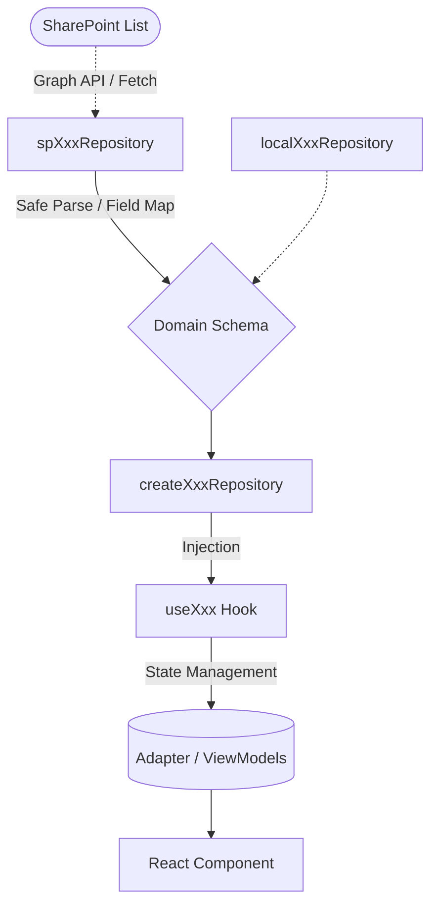

# 福祉OS 開発フレームワーク (Welfare OS Development Framework)

## 1. Purpose (目的)

「毎回ゼロから設計せず、福祉業務システムに最適化された“作り方そのもの”を資産化する」

本ドキュメントは、監査対応管理システム（福祉OS）を高速かつ安全に増築し続けるための、**共通レール（設計・実装・テスト・運用の標準化）**を定義します。
機能拡張のたびにアーキテクチャやデータ接続方式に悩む時間をなくし、一貫した品質と運用への安心感を担保することが最大の目的です。

---

## 2. Core Principles (コア原則)

開発を進めるにあたり、以下の6つの原則を遵守します。

1. **Domain First**: 業務ロジックやドメイン型の定義（Domain）を最初に置き、外部依存（SharePoint 等）を持たせない。
2. **Repository Boundary**: データ取得ロジックは必ず Repository に隠蔽し、SharePointのIDや構造をDomain・UI層に絶対に漏らさない。
3. **SharePoint Isolation**: SharePoint特有の事情（カラム名制限、内部名、API制限）は `infra/sharepoint` 配下に隔離・封じ込める。
4. **Strict Env Mode**: データソースの向き先は `VITE_SP_ENABLED` という単一環境変数で厳密に制御し、他の認証フラグなどを混ぜない。
5. **Verification Ladder**: レベル別に定義されたテスト・検証の「階段」を必ず下から順に踏んで実装する。
6. **Runbook / ADR First**: 実装のコードを書く**前**に、スキーママップや設計ADR、検証用Runbookを作成し、「運用とテストのゴール」を見据えてから開発を始める。

---

## 3. Standard Module Structure (標準モジュール構成)

新機能（モジュール）を追加する際は、以下のディレクトリ構造を標準の雛形として開発を行います。

```text
src/
  domain/
    {module}.ts                  // 1. ドメイン型定義
    {module}Repository.ts        // 2. インターフェース定義 (Port)

  infra/sharepoint/
    repos/sp{Module}Repository.ts // 3. SharePoint用 Repository 実装 (Adapter)
    fields/{module}Fields.ts     // 4. SPカラムのフィールドマップとパース処理 (Schema Validator)

  features/{module}/
    repositories/
      create{Module}Repository.ts // 5. Local / SP の Factory (ここで Env Mode 分岐)
    hooks/use{Module}.ts         // 6. UI層から呼ばれるカスタムフック (Data Fetching / State)
    adapters/adapt{Module}.ts    // 7. ドメインモデルからUI用ViewModelsへの変換 (必要な場合のみ)
    components/                  // 8. UIコンポーネント配下
    __tests__/                   // 9. モジュール結合テスト群

docs/runbooks/
  {module}-verification.md       // 10. Manual Verification 用の Runbook
```

---

## 4. SharePoint Integration Blueprint (データ接続の標準形)

データ接続時はこの流れを標準パターンとします。
（※第1号 参照実装： `MonitoringMeetings`）



- SPリスト側のカラム変更や制約は `InfraRepo` までの層で吸収し、`Domain Schema` を絶対に汚染させない方針を貫きます。

---

## 5. Mode Policy (環境切替の単一ルール)

環境変数の設定によって、安全かつ確定的に Repository のモック／実接続を切り替えます。

- **`VITE_SP_ENABLED=true` の場合のみ**: `sharepoint` モード（SP接続・MSAL認証必須・本番＆検証用）
- **未設定、`false`、その他の文字列の場合**: すべて `local` モード（localStorage/Mockベース、認証不要、高速なUI開発用）

> 詳細なポリシーについては `docs/runbooks/env-mode-policy.md` を参照。

---

## 6. Verification Ladder (品質保証の階段)

機能の実装を「完成」とするには、以下の6段階の検証ステップを規定順序でクリアする必要があります。

- **Level 1**: Schema / Field Map (Zodスキーマの作成とSharePointの列型の完全一致確認)
- **Level 2**: Repository CRUD (Local mockとSharePoint 両方のRepositoryレイヤーの単体テスト)
- **Level 3**: Factory / Hook / Adapter (ロジック結合と状態遷移のテスト)
- **Level 4**: UI Integration (コンポーネントとHookの結合、描画テスト)
- **Level 5**: Edge Cases (オフライン時、不正な環境変数、SPのAPI制限・エラーハンドリングなど)
- **Level 6**: Manual Browser Verification (実環境での Runbook ベースの指差し・目視確認)

---

## 7. Welfare Workflow Mapping (福祉プロセスへの配置)

本システムは単なるデータベースのフロントエンドではなく、福祉の業務プロセス（PDCA）に従ってモジュールを設計・配置します。
機能起案時は、必ずどの領域に対するモジュールかを意識します。

1. **Assessment (把握)**: 支援に必要な利用者の実態把握 (Ex: Iceberg Analysis)
2. **Planning (計画)**: 目標と支援内容の策定 (Ex: Support Planning Sheet)
3. **Execution (実行/Do)**: 日々の支援実行と記録 (Ex: Daily Record, Attendance, Handoff)
4. **Monitoring (評価)**: 計画に対する実施状況の振り返り (Ex: Monitoring Meeting, Meeting Minutes)
5. **Revision (改善)**: 評価に基づいた計画の見直し (Ex: ISP Revision)

---

## 8. Definition of Done (完成の定義)

モジュール実装が完了し、本番へ統合可能とみなすための基準（DoD）です。

- [ ] Domain Model / Repository Contract (Port) が依存なく綺麗に定義されている。
- [ ] Field Map と Runbook が実装**前**に用意され、仕様の認識が合っている。
- [ ] `VITE_SP_ENABLED` によるモード切替分岐に則り Factory が実装されている。
- [ ] Verification Ladder の Level 1〜6 がすべて順に消化されている。
- [ ] SharePoint実環境（または同等の検証環境）での Manual Verification（Runbook手順） が想定エラーなしで完了している。
