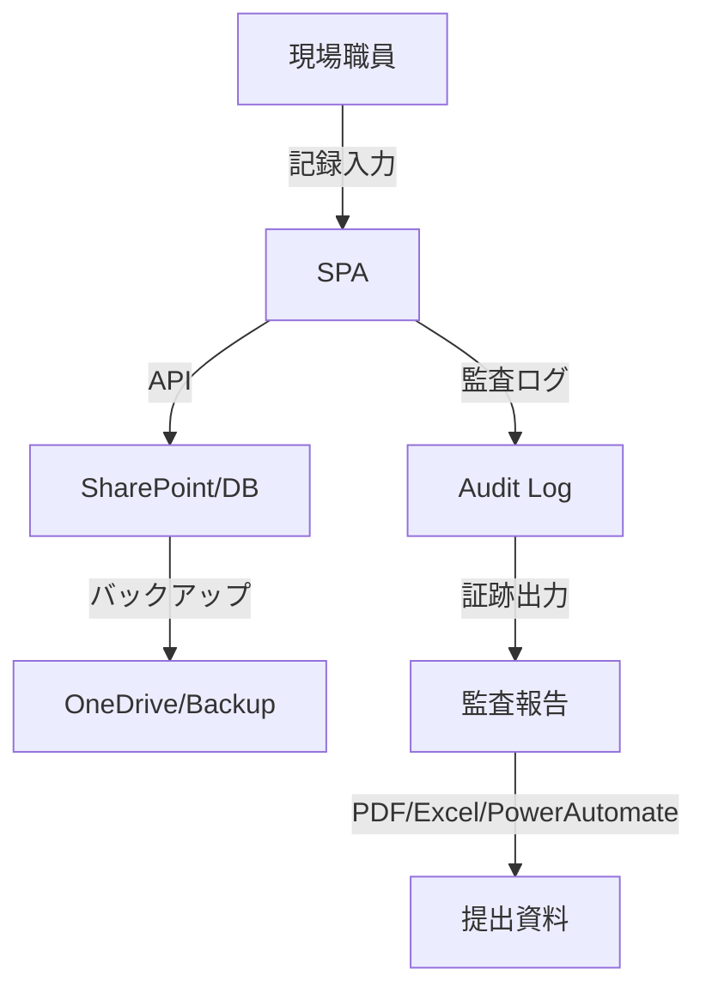

# Audit Evidence — 監査報告用証跡テンプレート

## 目的
- 障害福祉サービス事業所の行政監査・運営指導時に、**即提出できる証跡・記録・加算要件**を網羅。
- Power Automate/PDF出力/画面キャプチャ等の成果物も添付可能な構成。

---

## 1) 提出用チェックリスト（提出時にチェック）

- [ ] 利用者記録（5年以上保存）
- [ ] サービス提供記録（日次・週次・月次）
- [ ] 支援計画・モニタリング記録
- [ ] 運営会議・職員会議の議事録
- [ ] 個人情報保護・アクセス制御の証跡
- [ ] 加算要件（各種加算の記録・集計）
- [ ] 監査ログ・操作証跡（data-testid, 操作ログ）
- [ ] バックアップ・復元手順の記録
- [ ] Power Automate/PDF等の自動化フロー成果物
- [ ] その他（自治体指定の追加資料）

---

## 2) 証跡リンク・添付ファイル一覧

| 項目 | 証跡リンク/ファイル | 備考 |
|---|---|---|
| 利用者記録 | [SharePoint/DB](https://...) | 5年以上保存の証明 |
| サービス提供記録 | [記録画面キャプチャ](./service-records.pdf) | 日次/週次/月次 |
| 支援計画 | [支援計画書PDF](./support-plan.pdf) | モニタリング含む |
| 運営会議議事録 | [議事録PDF](./meeting-minutes.pdf) | 職員会議含む |
| 個人情報保護 | [RBAC設定画面](../architecture/rbac.md) | アクセス制御証跡 |
| 加算要件 | [加算集計Excel](./addition-metrics.xlsx) | 自動判定ロジック説明 |
| 監査ログ | [audit-metrics](../metrics/audit-observability.md) | 操作証跡・data-testid |
| バックアップ | [runbook.md](../ops/runbook.md) | 復元手順含む |
| 自動化フロー | [PowerAutomateフローPDF](./flow.pdf) | PDF出力/自動化証跡 |

---

## 3) データフロー可視化（Mermaid）

---

## 4) 提出時の注意点
- 個人情報・機微情報は**マスキング**して提出（サンプルデータ推奨）
- 画面キャプチャ・PDFは**日付・担当者・バージョン**を明記
- Power Automate等の自動化フローは**設定画面のPDF/画像**も添付
- 監査証跡は**data-testidや操作ログ**で再現性を担保

---

## 5) 参考・関連ドキュメント
- [compliance/checklist.md](./checklist.md)
- [metrics/audit-observability.md](../metrics/audit-observability.md)
- [architecture/rbac.md](../architecture/rbac.md)
- [ops/runbook.md](../ops/runbook.md)
