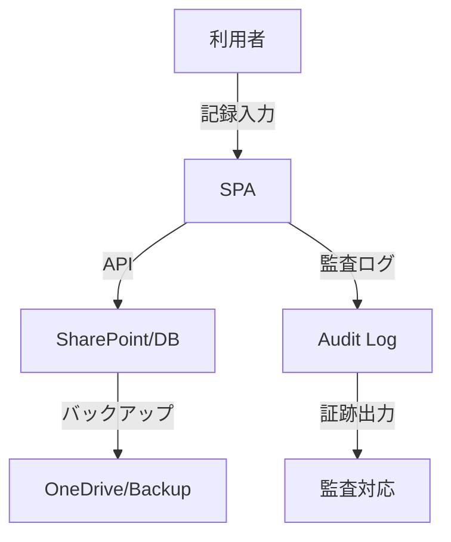

# Compliance Checklist — 法令・監査対応

## 目的
- 障害福祉サービス事業所向けの法令・加算要件・記録保存基準を一覧化し、現場監査・運営指導時の説明責任を果たす。
- システム設計・運用が「説明できる」状態を維持する。

---

## 1) 法令・ガイドライン対応

| 項目 | 根拠法令・通知 | システム対応 | 備考 |
|---|---|---|---|
| 利用者記録の保存 | 障害者総合支援法 第50条 | SharePoint/DBに5年以上保存 | 削除・改ざん防止策あり |
| サービス提供記録 | 厚労省Q&A, 報酬算定要件 | 日次/週次記録画面・監査ログ | 記録の追記・訂正履歴保持 |
| 個人情報保護 | 個人情報保護法 | RBAC・アクセス制御・暗号化 | 閲覧/編集権限を厳格管理 |
| 加算要件チェック | 報酬改定通知 | 記録テンプレ・自動集計 | 加算要件の自動判定ロジック |
| 監査証跡 | 運営指導通知 | data-testid, 操作ログ, 監査メトリクス | 監査時にエクスポート可 |
| バックアップ | ガイドライン | SharePoint/OneDrive定期バックアップ | 復元手順 runbook.md 参照 |

---

## 2) チェックリスト（運用・監査用）

- [ ] 利用者記録は5年以上保存されている
- [ ] サービス提供記録の追記・訂正履歴が残る
- [ ] アクセス権限（RBAC）が適切に設定されている
- [ ] 個人情報の暗号化・アクセス制御が有効
- [ ] 加算要件の自動判定・集計が機能している
- [ ] 監査証跡（操作ログ・data-testid）が取得できる
- [ ] 定期バックアップと復元手順が整備されている
- [ ] 監査・運営指導時に説明できる体制がある

---

## 3) データフロー可視化（Mermaid）

---

## 4) 参考・関連ドキュメント
- [runbook.md](../ops/runbook.md)
- [audit-observability.md](../metrics/audit-observability.md)
- [rbac.md](../architecture/rbac.md)
- [threat-model.md](../architecture/threat-model.md)
