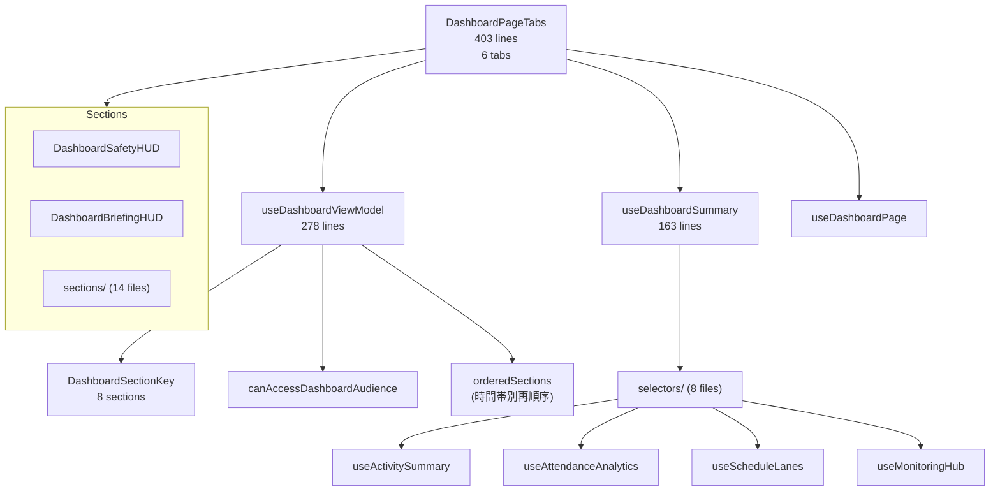

# /dashboard 改修ガードレール

> **目的**: `/dashboard` を改修する際の不変条件・テスト範囲・レビュー基準。
> 「読んで判断する画面」としての性質を守りつつ、安全に変更を届ける。

---

## 1. アーキテクチャ概要



### Hook 間の責務境界

| Hook | 責務 |
|------|------|
| **useDashboardViewModel** | ロール判定、セクション構成・順序、時間帯コンテキスト、ブリーフィングチップ生成 |
| **useDashboardSummary** | 7つの modular selector を統合し、ドメインデータを集約して返す |
| **useDashboardPage** | ページ固有の状態管理、handoff summary 取得（TanStack Query 経由） |

> Summary はデータ集約、ViewModel はデータ → 表示構造への変換、Page はそれらの接着。
> `useDashboardPage` は page-local UI state と cross-feature wiring の集約点であり、集約ロジックや表示順判定を持ち込まない。

---

## 2. 不変条件

### 2.1 セクションレジストリ

| ルール | 詳細 |
|--------|------|
| **8 セクションキー** | `safety` / `attendance` / `daily` / `schedule` / `handover` / `stats` / `adminOnly` / `staffOnly` |
| **型でガード** | `DashboardSectionKey` を追加したら `renderSection` の switch も更新 — 漏れは TS が検出 |
| **ロール制御** | `adminOnly` / `staffOnly` は `canAccessDashboardAudience()` でガード |

> [!CAUTION]
> セクションキーの追加・削除は **ViewModel** / **DashboardPageTabs の renderSection** / **テスト** の3箇所に波及する。
> 新セクション追加時は `DashboardSectionKey` → `buildSections` → `renderSection` → テスト の順で更新する。

### 2.2 時間帯コンテキスト

| ルール | 詳細 |
|--------|------|
| **3 時間帯** | `morning` (8-12) / `afternoon` (12-17) / `evening` (17-翌8) |
| **セクション再順序** | `priorityMap` でセクション表示順が時間帯ごとに変わる |
| **朝会・夕会判定** | `isBriefingTime` + `briefingType` — 朝会 8:00-8:30, 夕会 17:00- |

> [!NOTE]
> 時間帯別のセクション優先度は `useDashboardViewModel.ts` の `priorityMap` で一元管理。ハードコードされた時間判定を他の場所に追加しない。

### 2.3 タブ構成

| タブ | 値 | 備考 |
|------|---|------|
| 運営管理情報 | `management` | メインタブ |
| 申し送りタイムライン | `timeline` | Handoff consumer |
| 週次サマリー | `weekly` | lazy loaded |
| 朝会 | `morning` | 会議モード |
| 夕会 | `evening` | 会議モード |
| 統合利用者プロファイル | `profile` | |

> [!IMPORTANT]
> タブの追加・削除は `TABS` 定数と `DashboardPageTabs` 内の switch rendering の両方を更新する。

### 2.4 Dashboard は「読んで判断する画面」

- 書き込み操作は Dashboard 内で**完結させない** — 対象画面への navigate で行う
- Handoff データは **TanStack Query 経由の読み取り専用**（`useDashboardPage` → `useHandoffSummary`）
- 申し送りの詳細ワークフロー（ステータス遷移・コメント・監査）は `/handoff-timeline` に委譲
- 例外: CTA や navigate は許可するが、状態変更・保存・承認などの書き込み操作は専用画面へ委譲する

### 2.5 外部参照

| 外部ファイル | 使用内容 |
|-------------|---------|
| [DashboardPage.tsx](file:///Users/yasutakesougo/audit-management-system-mvp/src/pages/DashboardPage.tsx) | 旧実装（段階移行中）⚠️ |

> ⚠️ `DashboardPage.tsx` は段階移行中の互換レイヤー。新規機能追加先は `DashboardPageTabs.tsx` / `features/dashboard/` を原則とする。
| [RoomManagementPage.tsx](file:///Users/yasutakesougo/audit-management-system-mvp/src/pages/RoomManagementPage.tsx) | Dashboard layout 参照 |
| [AnalysisDashboardPage.tsx](file:///Users/yasutakesougo/audit-management-system-mvp/src/pages/AnalysisDashboardPage.tsx) | 分析用 Dashboard |
| [DailyRecordMenuPage.tsx](file:///Users/yasutakesougo/audit-management-system-mvp/src/pages/DailyRecordMenuPage.tsx) | Dashboard navigate |

---

## 3. 変更カテゴリ別チェックリスト

### ✅ 低リスク

- [ ] セクション内の UI テキスト・色・余白調整
- [ ] 既存 selector 内のロジック改善（export 変更なし）
- [ ] テストの追加

### ⚠️ 中リスク

- [ ] 新しいセクション (`sections/`) の追加 → `DashboardSectionKey` + `renderSection` 更新
- [ ] 新しい selector の追加 → `useDashboardSummary` の return に追加
- [ ] タブの追加・並び替え
- [ ] `BriefingChip` の種類追加
- [ ] `priorityMap` の時間帯別順序変更

### 🔴 高リスク

- [ ] `DashboardSectionKey` の削除・名前変更
- [ ] `DashboardRole` の追加・変更 → RBAC ガード全体に波及
- [ ] `useDashboardViewModel` の型シグネチャ変更
- [ ] 時間帯判定ロジック（朝会・夕会の時刻）の変更
- [ ] Dashboard 内での書き込み操作の追加（「読んで判断」原則の例外）

---

## 4. テスト安全ネット

### 4.1 既存テストスイート — 9 spec files

```bash
# ドメインロジック
npx vitest run src/features/dashboard/__tests__/dashboardSummary.spec.ts
npx vitest run src/features/dashboard/__tests__/activitySummary.spec.ts
npx vitest run src/features/dashboard/__tests__/attendanceSummary.spec.ts
npx vitest run src/features/dashboard/__tests__/ircSummary.spec.ts
npx vitest run src/features/dashboard/__tests__/crossModuleAlerts.test.ts

# ViewModel
npx vitest run src/features/dashboard/__tests__/useDashboardViewModel.spec.ts
npx vitest run src/features/dashboard/__tests__/useDashboardSummary.spec.ts

# UI
npx vitest run src/features/dashboard/__tests__/BriefingPanel.test.tsx

# Staff Availability（feature 直下）
npx vitest run src/features/dashboard/staffAvailability.test.ts
```

### 4.2 一括実行

```bash
npx vitest run src/features/dashboard/
```

### 4.3 ブラウザ確認ポイント

1. **ロール切替**: admin / staff でセクション表示が変わるか
2. **時間帯**: 朝 (8-12) → 昼 (12-17) → 夕 (17-) でセクション順序が変わるか
3. **タブ遷移**: 6タブすべて正常に切り替わるか
4. **Handoff 連携**: 「申し送りタイムライン」タブに最新データが表示されるか

---

## 5. ファイルサイズ警報ライン

| ファイル | 現在 | 閾値 | 超えたら |
|---------|------|------|---------|
| `DashboardPageTabs.tsx` | 403 行 | 450 行 | タブ別コンポーネント抽出 |
| `useDashboardViewModel.ts` | 278 行 | 350 行 | priorityMap / briefingChips を分離 |
| `useDashboardSummary.ts` | 163 行 | 250 行 | 現状は健全 |

---

*最終更新: 2026-03-09 — 構造分析に基づき作成*
*関連: [Handoff ガードレール](./handoff-timeline-guardrails.md) / [3画面クイックリファレンス](./architecture/screen-responsibility-quickref.md)*
