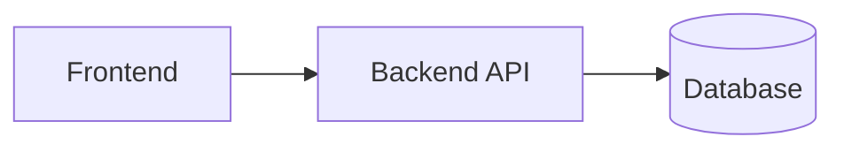

# DeepWiki Guidelines

This document describes the conventions used in this repository’s DeepWiki documentation under `docs/deepwiki/`.

## 1. Purpose

DeepWiki pages are intended to:

- Provide a clear, navigable overview of the system.
- Capture architecture decisions and rationale.
- Document domain concepts and workflows in a durable way.
- Serve as an onboarding map for new contributors.

## 2. Audience

Write primarily for:

- Engineers new to the codebase.
- Reviewers trying to understand impact/risk.
- Product/QA who need a stable description of behavior.

## 3. Writing principles

- **Be accurate and current**: update docs alongside code changes.
- **Prefer clarity over completeness**: link out to deeper details when needed.
- **Use consistent terms**: match names used in code (modules, services, tables).
- **Document decisions**: include tradeoffs and why an approach was chosen.
- **Avoid duplication**: reference source-of-truth docs instead of copying.

## 4. Structure and organization

- Keep DeepWiki files in `docs/deepwiki/`.
- Use numeric prefixes to impose a stable reading order.
- Keep each page focused; split large pages by concern.

Recommended baseline set:

- `00_guidelines.md` — this file
- `01_overview.md` — what the system does, at a high level
- `02_architecture.md` — components, data flow, boundaries
- `03_domain.md` — domain model, key entities, invariants
- `04_workflows.md` — core user/business flows
- `05_operations.md` — deployment, runtime, observability, runbooks
- `06_security.md` — authn/authz, data protection, threat model

## 5. Formatting conventions

### Headings

- Use `#` for the page title.
- Use `##` for main sections.
- Use `###` for subsections.

### Links

- Prefer relative links within the repository.
- When linking to code, link to directories or key files.

### Diagrams

- Prefer Mermaid where helpful.
- Keep diagrams small and focused.

Example:

### Lists and tables

- Use bullet lists for short enumerations.
- Use tables for comparisons or structured reference data.

## 6. Content guidelines

### System overview pages

Include:

- What the system is.
- Primary user roles.
- Primary capabilities.
- Key constraints and assumptions.

### Architecture pages

Include:

- Component responsibilities.
- Major integrations.
- Data storage overview.
- Error handling strategy.

### Domain pages

Include:

- Entity definitions.
- Relationships.
- Invariants and validation rules.
- Terminology glossary.

### Workflow pages

Include:

- Step-by-step description.
- Alternate paths and failures.
- Permissions/authorization requirements.

### Operations pages

Include:

- Environments.
- Deployment process.
- Monitoring/logging.
- Common incidents and mitigations.

### Security pages

Include:

- Auth flows.
- Role/permission model.
- Sensitive data handling.
- Audit logging expectations.

## 7. Maintenance

- Update docs in the same PR as the change whenever possible.
- Date or version time-sensitive pages.
- Remove obsolete content rather than letting it rot.

## 8. Review checklist

Before merging doc changes:

- [ ] Content matches current behavior.
- [ ] Terminology aligns with code.
- [ ] Links resolve.
- [ ] Diagrams render.
- [ ] Large claims are backed by references.
