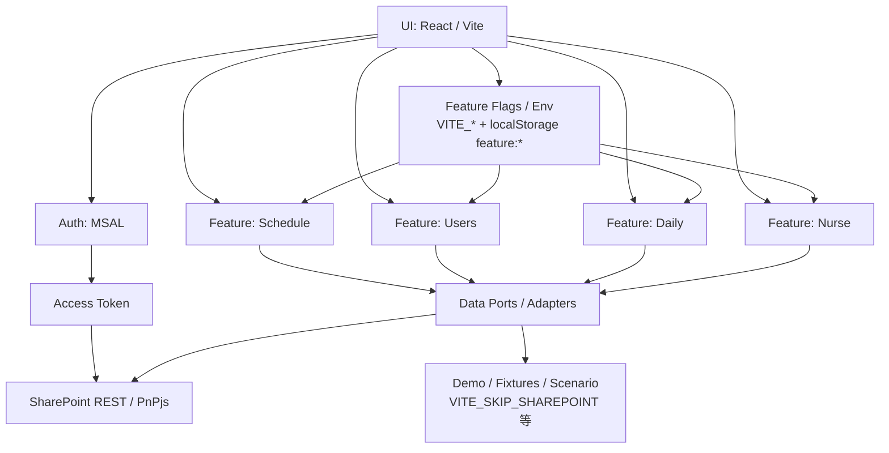
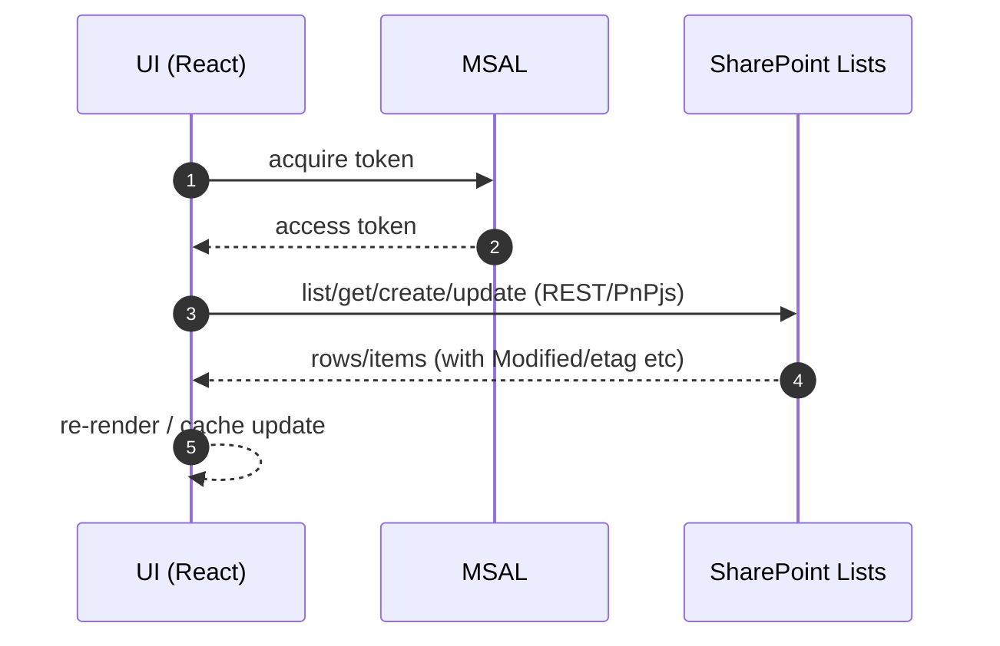
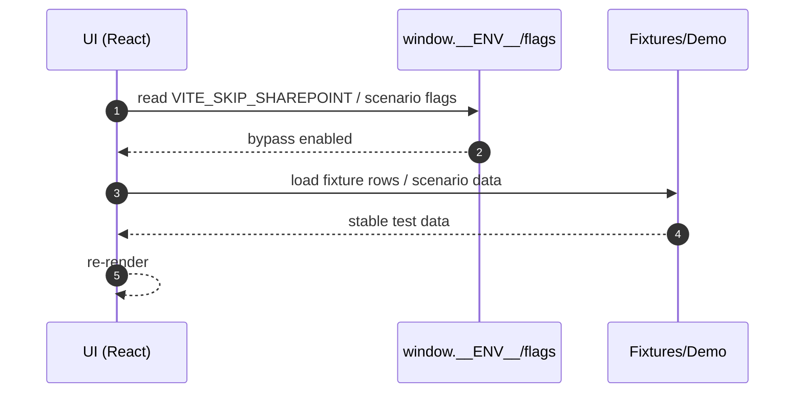

# アーキテクチャ（DeepWiki Architecture）

このページは、各機能（Schedule / Users / Daily / Nurse）を読む前に必要な **全体構造**をまとめます。  
特に、福祉現場の「事故防止」と「監査説明可能性」を支えるために、**データの出どころ（SharePoint / バイパス）**と **権限/フラグ**を中心に整理します。

---

## 1. 全体像（High-level）
本システムは概ね以下の層で構成されます。

- **UI（React）**：画面、入力、導線、誤操作防止（確認/警告/無効化）
- **状態管理/データ取得**：各 feature の hooks / store / query（機能ごとに実装差あり）
- **データポート（Adapter/Client）**：SharePoint / Demo / fixtures / Graph 等の切替点
- **データストア（SharePoint Lists）**：運用統制、権限、履歴、監査証跡

---

## 2. 主要モジュールと依存関係（Mermaid）
各 feature は独立して見えても、監査説明では相互整合が問われやすいです。

---

## 3. 認証と SharePoint アクセス（MSAL → SharePoint）
### 3.1 基本方針
- ブラウザで MSAL によりサインインし、SharePoint 用スコープでアクセストークンを取得
- SharePoint へのアクセスは「本線」だが、E2E/デモではバイパス経路が存在する

参考実装（例）：
- `src/lib/msal.ts`：トークン取得、E2Eモックアカウント等
- `src/auth/msalConfig.ts`：MSAL 設定（ClientId / TenantId / redirectUri）
- `docs/security/sharepoint-access.md`：権限設計と運用方針

### 3.2 E2E での認証・SP 接続の扱い（重要）
E2E では安定性のために、`window.__ENV__` 注入や `VITE_SKIP_LOGIN` / `VITE_E2E_MSAL_MOCK` が使われます。

- 例：`tests/e2e/utils/scheduleEnv.ts`（schedule E2E の共通起動）

Why（なぜ必要か）：
- 外部 IdP / SharePoint の状態に引きずられず、UI/ロジックを安定検証するため

---

## 4. データストア（SharePoint Lists）と“環境差分”吸収
### 4.1 SharePoint Lists を使う理由（監査・統制）
- 権限・履歴・組織統制が利かせやすい
- 監査で「誰がいつ更新したか」を辿りやすい

例：
- schedule 系の既定リスト名（例：`ScheduleEvents`）は env 上書き可能  
  - `VITE_SP_LIST_SCHEDULES` 等

### 4.2 環境差分（列欠落）への耐性
開発環境や検証環境では SharePoint のカラムが揃っていない場合があり、最小フィールドで取得するフォールバックが存在します。

参考：
- `src/sharepoint/fields.ts`：スケジュール取得の Select フィールドセットを環境で切替（最小構成）
- `src/features/schedule/scheduleFeatures.ts`：optional フィールド欠落時のフォールバック制御

Why（なぜ必要か）：
- SharePoint の「実環境ごとの差分」を吸収し、開発・E2E を止めないため
- ただし本番での監査説明に必要なカラムが欠落すると意味がないため、運用側のスキーマ統制が必須

---

## 5. Schedule の“二系統”に注意（`schedule` と `schedules`）
リポジトリ内には schedule に関する実装が少なくとも二系統あります（命名が紛らわしいため注意）。

- `src/features/schedule/**`
  - 月/週/日/リストなどのビュー群、競合検知、SharePoint list 確保など
- `src/features/schedules/**`
  - 予定作成ダイアログや SharePoint adapter（port）など、別レイヤの実装が存在

DeepWiki では、どの画面/処理がどちらに属するかを **ファイルパスで明示**し、読み手の混乱を避けます。

---

## 6. Feature Flags / Env のレイヤ（どこで効くか）
### 6.1 種類
- **build/runtime env**：`VITE_*`（例：SharePoint 接続、E2Eモード、機能ON/OFF）
- **runtime override**：`window.__ENV__`（E2Eやプレビューで注入）
- **localStorage flags**：`feature:*`（開発時の一時ONなど）

参考：
- `src/env.ts`：`window.__ENV__` と inline env のマージ、E2Eでの上書き制御
- `src/lib/env.ts`：`readBool` / `getAppConfig` 等の正規化

### 6.2 フラグ設計のWhy
- 事故防止：危険な操作を段階公開
- 監査説明：運用ルールが整うまで本番投入を防ぐ
- E2E安定：外部要因を排除し再現性を確保

---

## 7. データフロー（本番経路 vs バイパス経路）
### 7.1 本番経路（SharePoint）

### 7.2 バイパス経路（fixtures / demo / E2E）

運用上の注意：
- バイパス経路は「テスト安定化」のためであり、本番の監査説明に必要なカラム・整合性は **SharePoint 本線で担保**する

---

## 8. テスト戦略（Unit / E2E の分担）
### 8.1 Unit（ロジック・変換の契約）
- 型/スキーマ（zod等）で I/O を固定
- payload 変換で監査上重要なカラムが落ちないことを守る

例（schedule周辺の考え方）：
- `StatusReason` は自由記述（string）であるため、UI→payload→row の経路で欠落しないことが契約（詳細は schedule DeepWiki 参照）

### 8.2 E2E（誤操作防止・導線・フラグの契約）
- feature flag OFF でナビ非表示/リダイレクトなどの「アクセス制御」を守る
- 週/日/月/リストの主要導線が壊れていないこと
- fixtures モードでも UI が安定していること

参考：
- `docs/testing/schedule-e2e.md`
- `tests/e2e/*schedule*`

---

## 9. 今後の拡張ポイント（安全に伸ばすための原則）
- SharePoint スキーマは運用統制が必要（列追加/名称変更は監査影響が大きい）
- 自由記述フィールド（例：StatusReason）は UI/運用で品質を担保（テンプレ/必須条件/警告）
- Feature Flags は「段階導入」と「ロール/環境別の事故防止」に使い続ける
- E2E はバイパス経路を活用しつつ、重要機能は本線（SharePoint）でも検証可能にしていく
