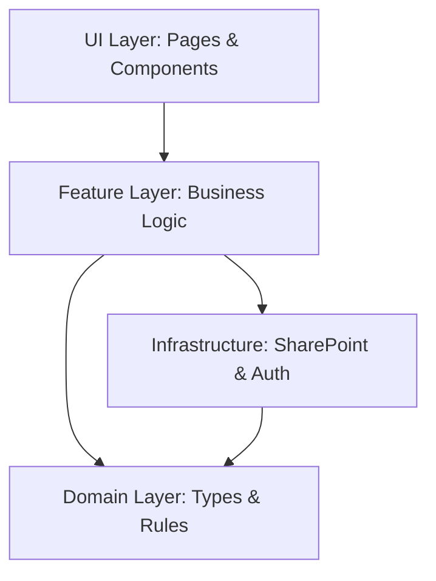
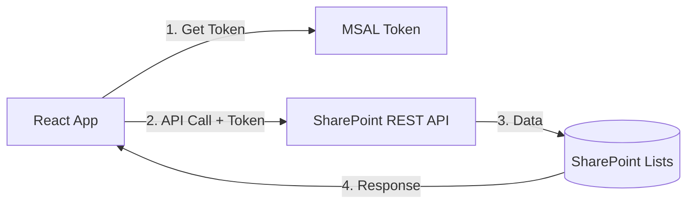
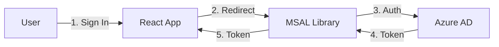
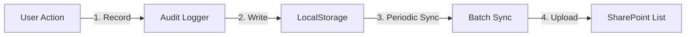
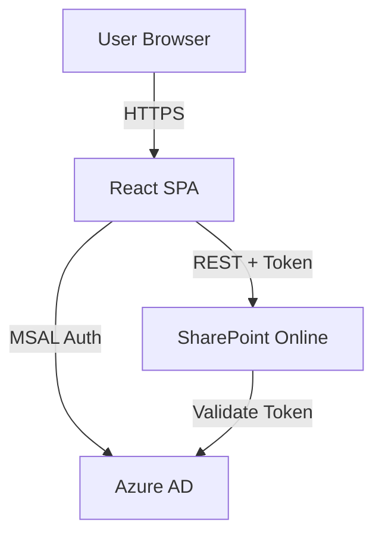
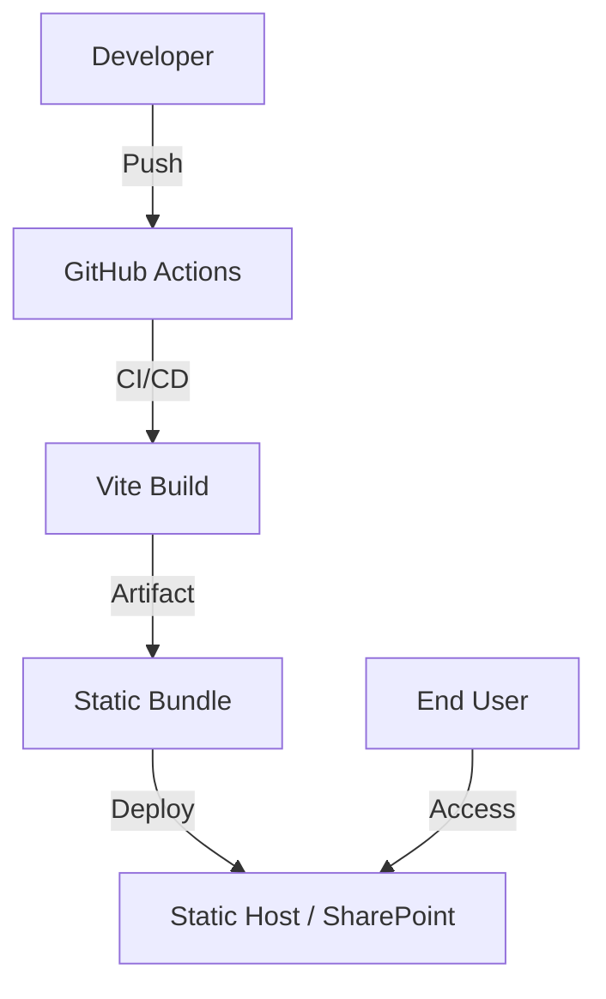

# Architecture

This document describes the system's component structure, data flow, and architectural boundaries.

## Component responsibilities

### Frontend layers

The application follows a feature-sliced architecture with clear separation of concerns:



#### 1. UI Layer (`src/pages`, `src/components`, `src/app`)
- **Pages** (`src/pages/*`): Top-level route components
  - `DashboardPage.tsx`: Role-based dashboard
  - `UsersPanel.tsx`: User master management
  - `SchedulePage.tsx`: Schedule management
  - `DailyRecordPage.tsx`: Daily support recording
  - etc.
- **App Shell** (`src/app/*`): Application frame
  - `router.tsx`: Route definitions and lazy loading
  - `AppShell.tsx`: Layout with navigation
  - `theme.ts`: MUI theme configuration
- **Shared Components** (`src/components/*`): Reusable UI elements
  - Generic, not feature-specific

#### 2. Feature Layer (`src/features/*`)
Each feature owns its domain logic, components, and API interactions:

- `users/`: User master CRUD, usage tracking
- `daily/`: Daily recording forms and lists
- `schedule/`: Schedule management and conflict detection
- `attendance/`: Attendance tracking logic
- `audit/`: Audit log management and CSV export
- `meeting/`: Meeting guide and facilitation
- `handoff/`: Shift handoff communication
- `dashboard/`: Dashboard aggregation and summaries
- `nurse/`: Nursing-specific recording
- `compliance-checklist/`: Compliance tracking

Each feature typically contains:
- UI components (e.g., `UsersPanel.tsx`)
- Custom hooks (e.g., `useUsers.ts`)
- API clients (e.g., `api.ts`)
- Types (e.g., `types.ts`)
- Business logic utilities

#### 3. Domain Layer (`src/domain/*`)
Pure domain logic with no UI dependencies:
- Type definitions
- Business rules and validation
- Constants and enums
- Domain-specific utilities

#### 4. Infrastructure Layer
- **SharePoint** (`src/sharepoint/*`):
  - `client.ts`: REST API client with token management
  - `fields.ts`: Schema field mappings (source of truth)
  - Repository patterns for data access
- **Auth** (`src/auth/*`):
  - MSAL configuration
  - Token acquisition hooks
  - Authentication state management
- **Lib** (`src/lib/*`):
  - `env.ts`: Environment configuration helpers
  - `auditLog.ts`: LocalStorage audit persistence
  - Shared utilities

### Cross-cutting concerns

#### State Management
- **Custom Stores**: `useSyncExternalStore`-based stores for demo mode
  - `src/stores/useUsers.ts`
  - `src/stores/useSchedules.ts`
  - etc.
- **TanStack Query**: Production mode with SharePoint integration
- **React Context**: Feature-specific state (e.g., `AccessibilityContext`)

#### Configuration
- **Environment**: `src/lib/env.ts` centralizes all environment variable access
- **Runtime Config**: `/env.runtime.json` for production overrides
- **Feature Flags**: `src/config/features.ts`

## Major integrations

### SharePoint Online



**Key Lists**:
- `Users_Master`: Service recipients
- `SupportRecord_Daily`: Daily support records
- `Schedules`: Schedule entries
- `Attendance`: Attendance tracking
- `HandoffNotes`: Shift handoff messages
- `MeetingSessions`: Meeting records

**Integration Points**:
- `src/sharepoint/client.ts`: Generic REST client with retry and error handling
- Feature-specific clients (e.g., `src/features/users/api.ts`)
- Schema mappings in `src/sharepoint/fields.ts`

**Data Flow**:
1. Component renders → triggers hook (e.g., `useUsers()`)
2. Hook calls API client with MSAL token
3. API client makes SharePoint REST call
4. Response parsed and typed
5. Hook updates local state
6. Component re-renders with data

### Azure AD (Entra ID)



**Authentication Flow**:
1. `src/auth/authConfig.ts`: MSAL configuration
2. `@azure/msal-react`: `MsalProvider` wraps app
3. `useMsal()` hook provides authentication methods
4. Token acquired silently or via redirect
5. Token passed to SharePoint API calls

**Authorization**:
- SharePoint permissions control data access
- No application-level RBAC (relies on SharePoint groups)
- Role detection via SharePoint group membership

### Local Storage (Audit Log)



**Purpose**: Offline-first audit trail
**Implementation**: `src/lib/auditLog.ts`
**Sync Strategy**: 
- Write immediately to LocalStorage
- Batch sync to SharePoint on interval or manual trigger
- CSV export for backup

## Data storage overview

### Primary Storage: SharePoint Lists

All persistent application data stored in SharePoint Lists:

| List Name | Purpose | Key Fields |
|-----------|---------|------------|
| `Users_Master` | Service recipients | UserID, FullName, BirthDate, ContactInfo |
| `SupportRecord_Daily` | Daily support records | RecordDate, UserID, Activity, Notes |
| `Schedules` | Schedule entries | StartTime, EndTime, UserID, StaffID, Status |
| `Attendance` | Attendance tracking | Date, UserID, Status, CheckInTime |
| `HandoffNotes` | Shift communications | Timestamp, Category, Message, Priority |
| `MeetingSessions` | Meeting records | Date, Type, Participants, Notes |

### Schema Management

**Source of Truth**: `provision/schema.json`

**Provisioning Process**:
1. Define schema in JSON (fields, types, choices)
2. GitHub Actions workflow: `provision-sharepoint.yml`
3. PowerShell script applies schema via PnP.PowerShell
4. WhatIf mode for dry-run validation

**Field Mapping**: `src/sharepoint/fields.ts`
- Centralizes internal field name mappings
- Prevents hardcoded `cr014_*` style names in application code
- Example: `FIELD_MAP.RECORD_DATE` → `'cr013_recorddate'`

### Temporary Storage: LocalStorage

Used for:
- Audit log queue (pending sync)
- User preferences
- Draft form data (schedule, records)
- Cache for offline operation

**Size Limit**: ~5-10MB (browser dependent)
**Persistence**: Tied to browser/device

## Error handling strategy

### Levels of error handling

#### 1. Network/API Errors
```typescript
// src/sharepoint/client.ts
try {
  const response = await fetch(url, options);
  if (!response.ok) {
    throw new SpError(response.status, await response.text());
  }
  return await response.json();
} catch (error) {
  // Retry logic with exponential backoff
  // Log to Sentry
  // Show user-friendly message
}
```

#### 2. Validation Errors
```typescript
// src/features/users/UserForm.tsx
const schema = z.object({
  userID: z.string().min(1, 'UserID is required'),
  fullName: z.string().min(1, 'Full name is required'),
  // ...
});

// React Hook Form validates on submit
// Display field-level error messages
```

#### 3. Authentication Errors
```typescript
// MSAL handles token refresh automatically
// Redirect to login if refresh fails
// Display clear message on permission errors
```

#### 4. Application Errors
```typescript
// React Error Boundaries catch render errors
// Sentry captures and reports errors
// User sees friendly error UI with recovery options
```

### Error recovery patterns

1. **Automatic Retry**: Network requests retry up to 3 times with exponential backoff
2. **Optimistic Updates**: UI updates immediately, rolls back on failure
3. **Graceful Degradation**: Fall back to cached data when offline
4. **User Notification**: Toast messages for transient errors, dialogs for critical errors
5. **Error Reporting**: Sentry integration for production monitoring

## Performance considerations

### Code splitting
- Route-based lazy loading via `React.lazy()`
- `src/utils/lazyWithPreload.ts` for preloading
- Budget tracking in `src/hydration/budgets.ts`

### Caching
- TanStack Query handles API response caching
- LocalStorage for offline data
- Browser cache for static assets

### Optimization techniques
- `useMemo` for expensive calculations
- `useCallback` for stable function references
- Virtual scrolling for large lists (if implemented)
- Debounced search inputs
- Pagination for large datasets

### Hydration budgets
Feature-level performance budgets tracked in `system-map.md`:
- Dashboard activity: 80ms
- Schedule load: 170ms
- Meeting load: 140ms
- etc.

## Security architecture

### Defense in depth

1. **Network Layer**: HTTPS only (TLS 1.2+)
2. **Authentication**: Azure AD (Entra ID) via MSAL
3. **Authorization**: SharePoint permissions
4. **Data Layer**: SharePoint tenant isolation
5. **Application Layer**: Input validation, XSS protection
6. **Audit Layer**: Comprehensive action logging

### Data flow security



All data transmission over HTTPS. Authentication tokens short-lived and auto-refreshed.

See [Security Model](06_security.md) for detailed security documentation.

## Development vs Production

### Development Mode
- `VITE_FORCE_DEMO=1`: In-memory store, no SharePoint
- `VITE_SKIP_LOGIN=1`: Skip MSAL authentication
- Hot module replacement (HMR)
- Source maps enabled
- Verbose logging

### Production Mode
- Minified bundle
- Source maps uploaded to Sentry only
- Runtime config via `/env.runtime.json`
- TanStack Query with real SharePoint
- Error tracking via Sentry

## Monitoring and observability

### Logging
- Console logging (dev only)
- Structured audit logs (LocalStorage + SharePoint)
- Sentry for error tracking

### Metrics
- Lighthouse CI for performance
- Coverage reports via Vitest
- Bundle size tracking

### Health checks
- SharePoint API connectivity test on load
- MSAL token acquisition validation
- Environment configuration validation

## Deployment architecture



**Build Process**:
1. GitHub Actions triggered on push
2. Install dependencies
3. Run linters and type checks
4. Run unit tests
5. Build production bundle
6. Assert bundle size limits
7. Deploy to hosting environment

**Hosting Options**:
- Static file server (nginx, Apache)
- SharePoint site (document library)
- Azure Static Web Apps
- Netlify / Vercel

See [Operations Guide](05_operations.md) for deployment procedures.

## Related documentation

- [System Overview](01_overview.md) — High-level description
- [Domain Model](03_domain.md) — Entity definitions
- [Workflows](04_workflows.md) — User flows
- [Operations Guide](05_operations.md) — Deployment details
- [Security Model](06_security.md) — Security implementation
