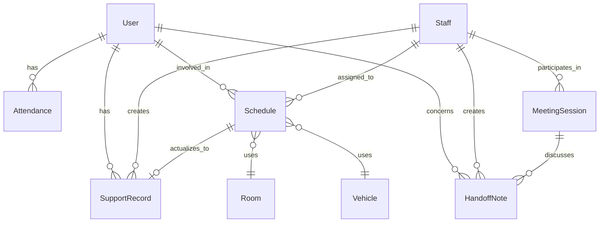

# Domain Model

This document describes the key entities, their relationships, invariants, and terminology used in the Audit Management System.

## Key entities

### User (Service Recipient)

Represents an individual receiving support services.

**Entity**: `User`  
**SharePoint List**: `Users_Master`  
**Source**: `src/features/users/types.ts`, `src/domain/users/types.ts`

**Key Fields**:
- `id`: Unique identifier (SharePoint item ID)
- `userID`: Business identifier (text, unique)
- `fullName`: Full name
- `birthDate`: Date of birth
- `contactInfo`: Contact information
- `emergencyContact`: Emergency contact details
- `supportLevel`: Level of support required
- `activeStatus`: Active/Inactive flag
- `entryDate`: Date entered system
- `exitDate`: Date left system (if applicable)

**Business Rules**:
- `userID` must be unique across all users
- `fullName` is required
- `activeStatus` determines visibility in active lists
- Users are soft-deleted (marked inactive) rather than hard-deleted

### SupportRecord (Daily Activity)

Records daily support activities for users.

**Entity**: `SupportRecord`  
**SharePoint List**: `SupportRecord_Daily`  
**Source**: `src/features/daily/types.ts`, `src/features/records/types.ts`

**Key Fields**:
- `id`: Unique identifier
- `recordDate`: Date of record (required)
- `userId`: Reference to User (required)
- `activityType`: Type of activity
- `startTime`: Activity start time
- `endTime`: Activity end time
- `staffId`: Staff member who recorded
- `notes`: Free-text notes
- `specialNote`: Important observations
- `createdAt`: Record creation timestamp
- `modifiedAt`: Last modification timestamp

**Business Rules**:
- `recordDate` and `userId` are required
- `endTime` must be after `startTime` if both provided
- Records are immutable after 24 hours (configurable)
- All changes are audit-logged

### Schedule

Represents planned activities and resource allocation.

**Entity**: `Schedule`  
**SharePoint List**: `Schedules`  
**Source**: `src/features/schedule/types.ts`, `docs/deepwiki/03_features/schedule.md`

**Key Fields**:
- `id`: Unique identifier
- `title`: Schedule title
- `startTime`: Planned start time (ISO 8601)
- `endTime`: Planned end time (ISO 8601)
- `userId`: User involved (optional)
- `staffId`: Staff assigned (optional)
- `roomId`: Room allocated (optional)
- `vehicleId`: Vehicle assigned (optional)
- `serviceType`: Type of service
- `status`: Schedule status
- `statusReason`: **Free-text** explanation for status (not an enum)
- `isAllDay`: All-day event flag
- `recurrence`: Recurrence pattern (if applicable)

**Business Rules**:
- `startTime` and `endTime` required
- `endTime` must be after `startTime`
- `statusReason` is free-text; must be provided when status is non-normal (On Hold, Cancelled)
- Resource conflicts detected and warned
- Editing blocked once actual (record) exists

**Important**: `statusReason` is a **free-text string**, not an enum. See [Schedule documentation](03_features/schedule.md) for full details.

### Attendance

Tracks user attendance and presence.

**Entity**: `Attendance`  
**SharePoint List**: `Attendance`  
**Source**: `src/features/attendance/types.ts`

**Key Fields**:
- `id`: Unique identifier
- `date`: Attendance date
- `userId`: User reference
- `status`: Present/Absent/Late/Early Leave
- `checkInTime`: Actual check-in time
- `checkOutTime`: Actual check-out time
- `plannedStart`: Expected start time (from schedule)
- `plannedEnd`: Expected end time (from schedule)
- `notes`: Attendance notes

**Business Rules**:
- One attendance record per user per day
- `status` derived from check-in/out times vs. planned times
- Late threshold: >15 minutes after planned start
- Early leave threshold: >15 minutes before planned end

### HandoffNote

Communication between shifts.

**Entity**: `HandoffNote`  
**SharePoint List**: `HandoffNotes`  
**Source**: `src/features/handoff/handoffTypes.ts`

**Key Fields**:
- `id`: Unique identifier
- `timestamp`: When note was created
- `category`: Classification (medical, behavioral, routine, urgent)
- `userId`: User the note concerns (optional)
- `message`: Handoff message content
- `priority`: Priority level (high, normal, low)
- `status`: Read/Unread/Acknowledged
- `createdBy`: Staff who created note
- `acknowledgedBy`: Staff who acknowledged (if applicable)

**Business Rules**:
- High priority notes require acknowledgment
- Notes auto-categorized based on keywords (AI-assisted)
- Notes visible to next shift only

### MeetingSession

Records of structured meetings.

**Entity**: `MeetingSession`  
**SharePoint List**: `MeetingSessions`  
**Source**: `src/features/meeting/meetingDataTypes.ts`

**Key Fields**:
- `id`: Unique identifier
- `date`: Meeting date
- `type`: Meeting type (morning, evening, weekly, etc.)
- `participants`: Staff members present
- `agenda`: Meeting agenda items
- `decisions`: Decisions made
- `followUps`: Follow-up actions
- `notes`: General meeting notes
- `duration`: Meeting duration (minutes)

**Business Rules**:
- Meeting type determines default agenda template
- Priority follow-up users highlighted
- Decisions and follow-ups tracked separately

### Staff

Represents staff members (support workers, nurses, administrators).

**Entity**: `Staff`  
**SharePoint List**: `Staff` or derived from Azure AD
**Source**: `src/features/staff/types.ts`, `src/types/staff.ts`

**Key Fields**:
- `id`: Unique identifier
- `staffId`: Business identifier
- `fullName`: Full name
- `role`: Role (staff, nurse, manager, admin)
- `qualifications`: Certifications and qualifications
- `activeStatus`: Active/Inactive
- `shiftPreference`: Preferred shift pattern

**Business Rules**:
- Staff roles determine access permissions (via SharePoint groups)
- Qualification expiry tracked for compliance
- Shift assignments respect work pattern rules

## Entity relationships



### Relationship details

#### User ↔ SupportRecord (1:N)
- One user has many support records
- Each record belongs to exactly one user
- Cascade policy: Soft delete (mark user inactive)

#### Schedule ↔ SupportRecord (1:0..1)
- One schedule may actualize to one support record
- A support record may reference a schedule (plan vs actual tracking)
- Once actualized, schedule becomes non-editable

#### Staff ↔ Schedule (N:M)
- Multiple staff can be assigned to a schedule
- One staff member can have multiple schedule assignments
- Conflict detection prevents overlapping assignments

#### User ↔ Attendance (1:N)
- One user has one attendance record per day
- Attendance may reference schedule for planned times

## Invariants and validation rules

### Cross-entity invariants

1. **Referential Integrity**
   - All user references must point to active users (unless historical)
   - All staff references must point to active staff
   - Room/vehicle references must exist in master data

2. **Temporal Consistency**
   - `endTime` > `startTime` for all time-bounded entities
   - `checkOutTime` > `checkInTime` for attendance
   - Record timestamps cannot be future dates (except schedules)

3. **Resource Allocation**
   - One room cannot be allocated to multiple schedules at overlapping times
   - One vehicle cannot be allocated to multiple schedules at overlapping times
   - Staff can have overlapping schedules only if marked as "flexible"

4. **Audit Trail**
   - All create/update/delete operations must be logged
   - Audit log must include: user, timestamp, action, entity, old/new values
   - Audit logs are append-only (no deletions)

### Field-level validation

#### Text fields
- `userID`: Max 50 chars, alphanumeric + hyphen/underscore
- `fullName`: Max 200 chars, required
- `notes`: Max 4000 chars (SharePoint Note field limit)
- `statusReason`: Max 1000 chars, free-text (not enum)

#### Date/Time fields
- ISO 8601 format: `YYYY-MM-DDTHH:mm:ss`
- Timezone: JST (Asia/Tokyo) by default, configurable
- Date range: 1900-2100 (SharePoint limit)

#### Choice fields
- `status`: Predefined enum values only
- `serviceType`: Configurable choice list (additive policy)
- Invalid values rejected at API layer

#### Numeric fields
- `duration`: Integer, 0-1440 minutes (0-24 hours)
- `supportLevel`: Integer, 1-5 scale

## Terminology glossary

### Domain-specific terms

**Active Status**  
Boolean flag indicating whether an entity (user, staff) is currently active in the system. Inactive entities are excluded from most queries but retained for historical reporting.

**Actual** (実績)  
The recorded reality of an activity after it occurs. Contrasted with "Plan."

**Attendance** (出席記録)  
Tracking of user presence, check-in/out times, and deviation from schedule.

**Audit Log** (監査ログ)  
Comprehensive trail of all system actions, stored locally and synchronized to SharePoint.

**Business Identifier**  
Human-readable unique identifier (e.g., `userID`, `staffId`) distinct from internal database ID.

**Compliance Checklist**  
Set of regulatory or organizational requirements tracked for each period (daily, monthly, etc.).

**Conflict Detection**  
Algorithmic check for resource allocation conflicts (time, space, staff).

**Handoff** (申し送り)  
Shift-to-shift communication of important information about users and activities.

**Meeting Guide**  
Structured template and checklist for conducting standardized meetings.

**Plan** (計画)  
Scheduled or intended activity before it occurs. Contrasted with "Actual."

**Plan vs Actual (PvsA)**  
Comparison of planned schedule against actual execution, highlighting variance.

**Priority Follow-Up User**  
User requiring special attention or follow-up in the current period, highlighted in meetings and dashboards.

**Service Recipient** (利用者)  
Individual receiving support services. Often referred to as "User" in the system.

**Service Type**  
Category of support activity (e.g., personal care, transportation, recreation).

**Soft Delete**  
Marking an entity as inactive rather than physically removing it from the database.

**Special Note** (特記事項)  
Important observation or deviation from normal routine that requires attention.

**Status**  
Current state of an entity (schedule, attendance, etc.). See entity-specific documentation for valid values.

**Status Reason** (理由)  
**Free-text explanation** for why an entity is in its current status. Not an enum. Must be provided for non-normal statuses.

**Support Level**  
Integer (1-5) indicating intensity of support required by a user.

**Support Record**  
Documented instance of support activity provided to a user.

### Technical terms

**Field Mapping**  
Centralized translation between application field names and SharePoint internal names (e.g., `FIELD_MAP.RECORD_DATE` → `'cr013_recorddate'`).

**Feature Flag**  
Boolean toggle to enable/disable features without code changes.

**Hydration Budget**  
Maximum time allowed for a feature to load and render, tracked for performance.

**In-Memory Store**  
Demo mode storage using `useSyncExternalStore`, no SharePoint required.

**MSAL**  
Microsoft Authentication Library for handling Azure AD authentication.

**Optimistic Update**  
UI pattern where changes are reflected immediately, then confirmed/rolled back based on API response.

**SharePoint List**  
SharePoint's equivalent of a database table, used as primary data store.

**WhatIf Mode**  
Dry-run execution that shows what changes would be made without actually applying them.

## Data lifecycle

### User lifecycle
1. **Creation**: Admin creates user record with required fields
2. **Active**: User participates in activities, generates records
3. **Inactive**: User marked inactive (exit, transfer, etc.)
4. **Archived**: Historical data retained indefinitely

### Record lifecycle
1. **Draft**: Created in LocalStorage (offline mode)
2. **Pending**: Queued for synchronization
3. **Synchronized**: Saved to SharePoint
4. **Locked**: Immutable after 24 hours (configurable)
5. **Archived**: Retained for compliance period (7+ years)

### Schedule lifecycle
1. **Planned**: Created with future dates
2. **Confirmed**: Reviewed and approved
3. **In-Progress**: Actual activity started
4. **Completed**: Activity finished, record created
5. **Cancelled**: Cancelled with reason (statusReason)

## Business rules

### Attendance rules
- **Late**: Check-in >15 minutes after planned start
- **Early Leave**: Check-out >15 minutes before planned end
- **Absent**: No check-in within 2 hours of planned start
- **Present**: Check-in within acceptable window

### Schedule conflict rules
- **Hard Conflict**: Same resource, overlapping time → blocked
- **Soft Conflict**: Close timing (< 30 min buffer) → warning
- **Flexible Staff**: Multiple assignments allowed if flagged

### Audit log rules
- **Retention**: 7 years minimum
- **Immutability**: Append-only, no deletions
- **Batch Sync**: Max 100 records per batch
- **Fallback**: CSV export if sync fails

### Data retention
- **Active Records**: Indefinite
- **Inactive Users**: 7 years after exit
- **Audit Logs**: 7 years
- **Support Records**: 7 years (compliance requirement)
- **Schedules**: 2 years

## Validation examples

### Creating a user
```typescript
const userSchema = z.object({
  userID: z.string().min(1).max(50).regex(/^[A-Za-z0-9_-]+$/),
  fullName: z.string().min(1).max(200),
  birthDate: z.coerce.date(),
  activeStatus: z.boolean().default(true),
  // ...
});
```

### Creating a schedule
```typescript
const scheduleSchema = z.object({
  title: z.string().min(1).max(200),
  startTime: z.string().datetime(),
  endTime: z.string().datetime(),
  status: z.enum(['Planned', 'Confirmed', 'Completed', 'Cancelled']),
  statusReason: z.string().max(1000).optional(), // FREE TEXT, not enum
  // ...
}).refine(
  (data) => new Date(data.endTime) > new Date(data.startTime),
  { message: 'End time must be after start time' }
);
```

### Creating a support record
```typescript
const recordSchema = z.object({
  recordDate: z.coerce.date(),
  userId: z.string().min(1),
  activityType: z.enum(['PersonalCare', 'Recreation', 'Medical', /*...*/]),
  startTime: z.string().datetime().optional(),
  endTime: z.string().datetime().optional(),
  notes: z.string().max(4000).optional(),
  // ...
}).refine(
  (data) => !data.startTime || !data.endTime || 
    new Date(data.endTime) > new Date(data.startTime),
  { message: 'End time must be after start time' }
);
```

## Domain events

While the system does not have a formal event sourcing architecture, the following domain events are logged to the audit trail:

- `USER_CREATED`, `USER_UPDATED`, `USER_DEACTIVATED`
- `RECORD_CREATED`, `RECORD_UPDATED`, `RECORD_SYNCHRONIZED`
- `SCHEDULE_CREATED`, `SCHEDULE_UPDATED`, `SCHEDULE_CANCELLED`
- `ATTENDANCE_CHECKED_IN`, `ATTENDANCE_CHECKED_OUT`
- `HANDOFF_NOTE_CREATED`, `HANDOFF_NOTE_ACKNOWLEDGED`
- `MEETING_STARTED`, `MEETING_COMPLETED`

These events enable:
- Audit trail reconstruction
- Activity timeline generation
- Compliance reporting
- Analytics and insights

## Related documentation

- [System Overview](01_overview.md) — High-level system description
- [Architecture](02_architecture.md) — Component structure
- [Workflows](04_workflows.md) — Common user flows
- [Schedule Feature](03_features/schedule.md) — Detailed schedule documentation
