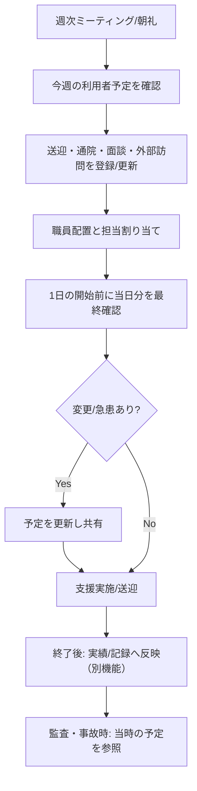
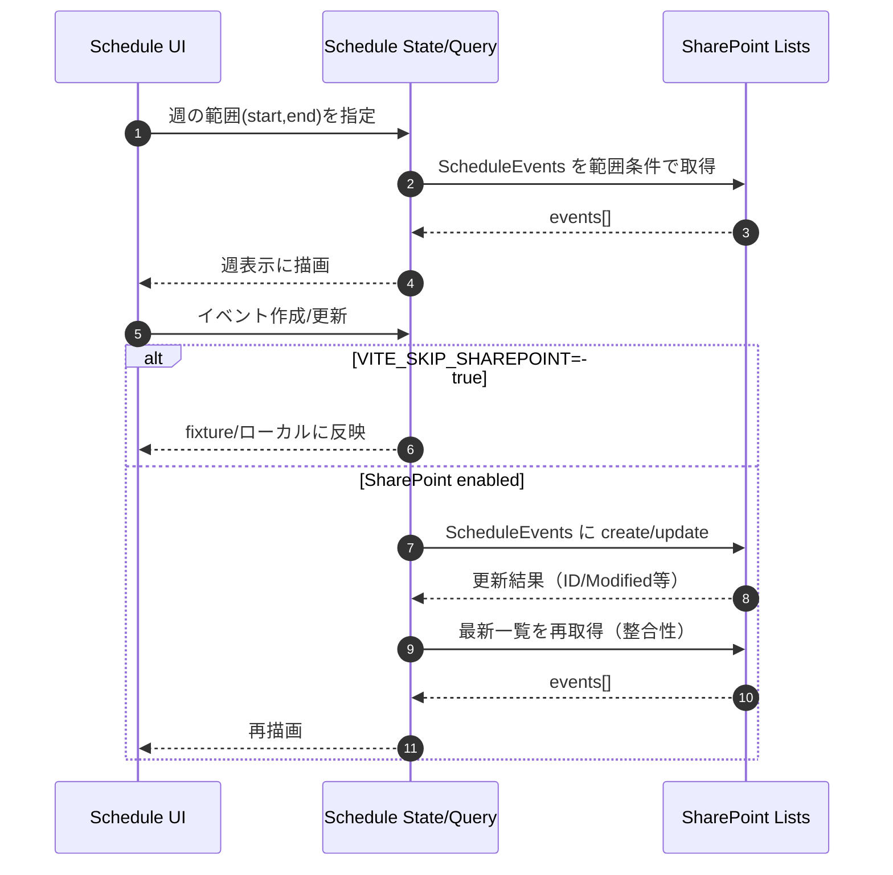

# Schedule（予定管理）機能

対象: `src/features/schedule`

このページは **DeepWiki** 用の機能ドキュメントです。記載の粒度・構成は `docs/deepwiki/00_guidelines.md` に準拠します（概要 → 業務背景 → データ/外部連携 → 画面/UX → 主要ロジック → フラグ/環境変数 → テスト → 運用上の注意）。

---

## 1. 概要（What / Why）

Schedule 機能は、福祉事業所（例: 就労支援、生活介護、グループホーム等）の **日々の運営に必要な予定情報** を「週次カレンダー」として集約し、

- 支援計画・面談・送迎・通院・個別支援・外部訪問
- 職員の配置計画（誰がどこに入るか）
- 利用者の予定と支援の準備

を **見落としなく共有** できる状態を作ることを目的とします。

本プロダクトは監査（audit）観点の品質担保が主軸であり、Schedule は「事故予防」「記録の整合性」「監査で問われる運用証跡」を支える基盤機能です。

---

## 2. 業務背景（Welfare Operations Background）

### 2.1 福祉運営で予定が重要な理由

福祉現場では、同じ日・同じ時間帯に複数のイベントが重なりやすく、かつ「人的リソースが制約」になりがちです。

- 送迎（出発/到着の遅延が連鎖しやすい）
- 通院/同行（時間が読めない、急な変更が発生）
- 面談/モニタリング（記録が監査対象になりやすい）
- 外部機関連携（計画書や個人情報の扱いを伴う）

Schedule の目的は「現場の段取り」を安定させ、事故・ヒヤリハットを減らすことにあります。

### 2.2 事故予防（Accident-prevention risks）と Schedule

事故予防に直結する代表的なリスクは次の通りです。

- **人的配置のミス**: 必要な資格/担当が不足し、支援が不適切になる
- **送迎の遅延・取り違え**: 乗車確認漏れ、時間変更の共有漏れ
- **服薬/健康管理の抜け**: 通院予定や服薬タイミングの共有漏れ
- **外部訪問の漏れ**: 訪問予定の失念により信頼低下・苦情化

Schedule は「予定の可視化」と「予定変更の追跡」を通じて、上記リスクの未然防止に寄与します。

### 2.3 監査（Audit）の観点での位置づけ

監査では、しばしば以下が問われます。

- 記録が **いつ・誰により** 作られ、適切に更新されているか
- 支援の実施・面談・モニタリングが **計画に沿って** 行われたか
- 苦情/事故が起きた際、当時の体制や予定が追えるか

Schedule そのものが監査書類ではない場合でも、

- 当日の予定
- 担当者
- 予定変更の経緯

の根拠として参照されやすく、監査対応の「説明可能性」を高めます。

---

## 3. データソース / SharePoint 連携

Schedule 機能は SharePoint Lists を主要なデータストアとして扱います。

### 3.1 使用する SharePoint Lists

> 実際のフィールド名/型は SharePoint 側の定義に依存します。アプリ側は「最低限必要な列」を前提にゆるく扱い、拡張列があっても破綻しない設計を目指します。

#### 3.1.1 `ScheduleEvents`

週次カレンダーに表示する **予定イベント** のリスト。

想定列（例）:

- `Title`（イベント名）
- `Start` / `End`（日時）
- `Category` or `EventType`（送迎/面談/通院/外出/会議…）
- `Location`（場所）
- `AssignedStaffIds`（担当職員: ID 配列または Lookup）
- `TargetUserId`（利用者: Lookup など）
- `Notes`（備考）
- `IsAllDay`（終日）
- `Status`（確定/仮/キャンセル）
- `UpdatedBy` / `Modified`（更新者/更新日時: 監査追跡に使用）

アプリ側では「週の範囲（Start〜End）」で取得し、表示・編集・追加時にこのリストへ反映します。

#### 3.1.2 `Users_Master`

アプリ利用者（ログインユーザー）や権限・所属の基礎情報。

- `UserPrincipalName` / `Email`
- `DisplayName`
- `Role`（例: admin / staff / viewer）
- `IsActive`

Schedule では以下で利用します。

- 画面アクセス制御（閲覧のみ / 編集可）
- 予定作成・更新時の「更新者」表示

#### 3.1.3 `Staff_Master`

支援に関わる職員マスター。

- `StaffId`（内部 ID）
- `Name`
- `Qualifications`（資格）
- `Team` / `Site`
- `IsAvailable` / `IsActive`

Schedule では担当者選択、表示ラベル、フィルタ等に使用します。

### 3.2 環境変数（SharePoint List 名 / 接続）

Schedule が参照する主な環境変数（例、実際のキーは `.env` / 実装を参照）:

- `VITE_SP_LIST_SCHEDULES`
  - `ScheduleEvents` 相当の SharePoint リスト名を上書き
- `VITE_SKIP_SHAREPOINT`
  - `true` の場合、SharePoint 通信をスキップしローカル/fixture データを使う（開発・テスト用）

> ほかの `VITE_SP_LIST_*` も同様に「環境差分（本番/検証/開発）」を吸収するために用意されます。

---

## 4. 画面 / UX（想定）

- **週表示（Weekly view）**
  - 1週間単位でイベントを俯瞰
  - 日付移動（前週/次週/今日）
  - フィルタ（担当職員、種別、利用者等）

- **イベント作成/編集（Dialog/Drawer）**
  - タイトル、開始/終了、種別、担当職員、対象利用者、メモ
  - 監査観点で「更新者」「更新日時」が表示される場合あり

- **読み取り専用モード**
  - 権限がないユーザーは閲覧のみ

> 実際の UI コンポーネント配置・route は `src/features/schedule` と `tests/e2e/*schedule*` を基準に読み替えてください。

---

## 5. 処理フロー（Mermaid）

### 5.1 週次の運用フロー（Weekly operation flow）

### 5.2 データ取得/更新フロー（Data fetch/update flow）

---

## 6. 機能フラグ / シナリオモード（Feature flags, fixtures）

Schedule は段階的リリースや環境依存に対応するため、以下のフラグ/モードを持ちます。

### 6.1 Feature Flags: `VITE_FEATURE_SCHEDULES*`

例:

- `VITE_FEATURE_SCHEDULES=true` で Schedule 機能を有効化
- `VITE_FEATURE_SCHEDULES_EDIT=true` で編集機能のみ段階的に解放
- `VITE_FEATURE_SCHEDULES_SHARE=true` で共有/公開設定(将来)を制御

> 実際に存在するキーはリポジトリ内の `.env*`、`src/config`、`src/features/schedule` を参照し、命名は「Schedule に紐づくスイッチ」をプレフィックスで揃える前提です。

### 6.2 Fixture / Scenario mode

開発・E2E で SharePoint に依存しないよう、fixture データで画面を再現するモードを提供します。

- `VITE_SKIP_SHAREPOINT=true`
- もしくは「scenario」指定（例: `VITE_SCENARIO=schedule-basic` のような形）

これにより、

- データ取得の安定化
- E2E の再現性
- SharePoint 構成変更の影響の局所化

が可能になります。

---

## 7. 実装上の要点（src/features/schedule）

> ここはガイドラインに沿って「後からコードを追いやすい見出し」を置きます。詳細は実コードに合わせて加筆してください。

- 週範囲計算
  - 「週の開始曜日」定義（例: 月曜開始）
  - タイムゾーン（JST）と SharePoint の DateTime 型差異に注意

- 取得クエリ
  - 週範囲（Start〜End）で ScheduleEvents を取得
  - フィルタリング（担当/種別）をクライアントで行うか、可能なら OData で絞る

- 追加/更新
  - 競合（Modified の差分）に注意
  -更新後は再取得して UI 表示と SharePoint の実データを合わせる

- 権限制御
  - `Users_Master` の Role 等を参照
  - 画面上の操作（編集/削除ボタン表示）と API 呼び出し双方でガード

---

## 8. data-testid（重要）と Playwright E2E 観点

E2E は「週表示で予定が見える」「追加/編集ができる」「SharePoint 依存を切っても動く」を中心に回ります。

### 8.1 重要 data-testid（例）

> 実際の `data-testid` は実装に合わせて確認・追記してください。DeepWiki では「E2E を壊さないための契約」として一覧化します。

- `schedule-page`
- `schedule-weekly-grid`
- `schedule-nav-prev-week`
- `schedule-nav-next-week`
- `schedule-nav-today`
- `schedule-filter-staff`
- `schedule-filter-category`
- `schedule-event-card`（イベント要素）
- `schedule-event-create`
- `schedule-event-edit`
- `schedule-event-dialog`
- `schedule-event-title-input`
- `schedule-event-start-input`
- `schedule-event-end-input`
- `schedule-event-staff-select`
- `schedule-event-user-select`
- `schedule-event-save`
- `schedule-event-cancel`

### 8.2 参照すべき既存 E2E

Playwright テストは以下のパスに存在する前提です。

- `tests/e2e/*schedule*`

代表的なシナリオ（テスト名/ファイルは実リポジトリに合わせる）:

1. **週表示の基本表示**
   - 画面遷移後に週グリッドが表示される
   - fixture イベントが所定日に表示される

2. **前週/次週への遷移**
   - ナビゲーション操作で週が切り替わり、表示が更新される

3. **イベント作成**（編集権限あり）
   - 作成ボタン → ダイアログ → 入力 → 保存
   - 作成後にカードが週表示へ反映される

4. **イベント編集**
   - 既存カードから編集 → 保存 → 変更が反映

5. **SharePoint スキップ動作**
   - `VITE_SKIP_SHAREPOINT=true` で通信せずに動作
   - scenario/fixture が安定していること

---

## 9. 運用・トラブル���ュート

- SharePoint 側の列追加/名称変更
  - まず `.env` の `VITE_SP_LIST_SCHEDULES` が正しいか確認
  - 取得できない場合は「列名相違」「DateTime フォーマット」「権限」を疑う

- タイムゾーンずれ
  - SharePoint の DateTime が UTC で返る/保存される可能性
  - UI の表示と保存の変換を統一する

- 権限不足
  - `Users_Master` 側のユーザーが無効化されていないか
  - SharePoint リストの権限が付与されているか

---

## 10. 関連

- ガイドライン: `docs/deepwiki/00_guidelines.md`
- 機能実装: `src/features/schedule`
- E2E: `tests/e2e/*schedule*`
