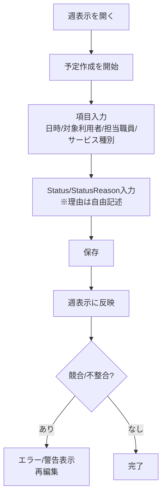
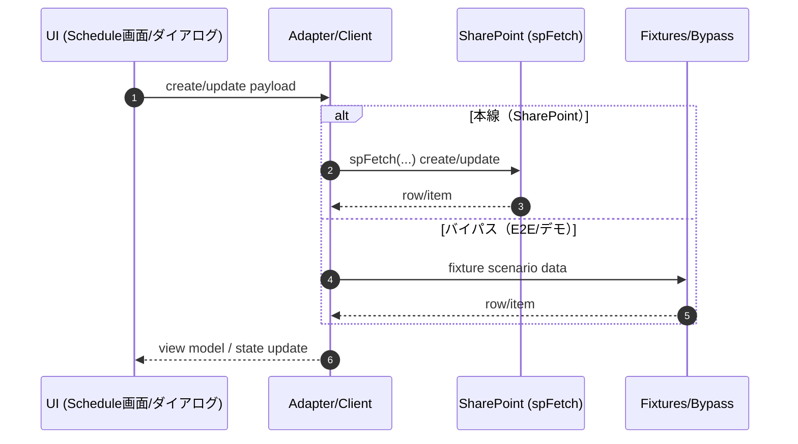

# Schedules

This page documents the Schedules feature.

## Overview

Schedules represent planned audit activities across sites/teams. They are created and managed through the Schedules UI.

## Data model

### Status / StatusReason

**StatusReason is a free-text string** that explains why a schedule is in its current status (e.g. *On Hold*, *Cancelled*, *Rescheduled*). It is **not an enum** and should be treated as user-provided text.

Code references (source of truth):

- `src/features/schedules/ScheduleCreateDialog.tsx` — UI provides a text input for **statusReason** and sends it on create.
- `src/features/schedules/data/spRowSchema.ts` — row/schema includes **statusReason** as a string field.
- `src/features/schedules/data/createAdapters.ts` — adapter maps **statusReason** through to the persistence request/row.

Minimal snippets (for orientation only):

- `src/features/schedules/data/spRowSchema.ts`

  ```ts
  // ...
  statusReason: z.string().optional(),
  ```

- `src/features/schedules/data/createAdapters.ts`

  ```ts
  // ...
  statusReason: form.statusReason,
  ```

### 契約（守ること）

- StatusReason は自由記述（string）として保持し、UI→payload→保存→再表示で欠落させない
- 未入力（null/空）を許容する場合は、監査上の運用ルール（いつ必須にするか）を明記する

## UI

### Create Schedule dialog

The create dialog captures Schedule details including **StatusReason** as a free-text reason.

Reference: `src/features/schedules/ScheduleCreateDialog.tsx`

## Accident Prevention / Audit Explanation

Operational rules and UI guards to prevent ambiguity/mis-auditing:

- **Free-text invariant**: `statusReason` must remain a **string** end-to-end (UI → adapters → persistence). Do not convert to enums or coded values.
- **Reason required when it matters** (UI guard): when a user selects a non-normal status (e.g. *On Hold*, *Cancelled*), the UI should require a non-empty `statusReason` to prevent unclear audit trails.
- **No silent drops**: adapters must always pass `statusReason` through; avoid defaulting to `undefined` when user entered a value.
- **Display what was entered**: list/detail views should render `statusReason` verbatim (with standard escaping) so auditors can see the exact rationale.
- **Safe text handling**: treat `statusReason` as untrusted input (escape in UI, avoid dangerouslySetInnerHTML).

These rules ensure operational intent is recorded consistently and reduce the risk of incorrect scheduling decisions or incomplete audit records.

### 監査優先カラム（Top3：まずここを説明できる状態にする）

- [ ] **Status / StatusReason**：状態と、判断理由（StatusReason は自由記述）
- [ ] **TargetUser / AssignedStaff**：誰の予定で、誰が担当か（取り違え防止・責任所在）
- [ ] **ServiceType / BillingFlags**：サービス種別と算定に影響するフラグ（監査整合）

> Why：監査では「誰に・いつ・何を・なぜ・誰が」の説明が求められ、上記が欠けると予定→実績の整合が崩れやすい。

### ユーザーフロー（週操作：作成→理由入力→保存→表示）



### データフロー（UI→Adapter→SharePoint/Fixtures）



## Testing Contract

Add/maintain tests (unit + E2E) ensuring **statusReason persists end-to-end**.

### Unit (schema + adapter)

- **Schema contract** (`src/features/schedules/data/spRowSchema.ts`):
  - Accepts `statusReason` as a `string` (optionally empty only if the UI allows it).
  - Rejects non-string values.
- **Adapter contract** (`src/features/schedules/data/createAdapters.ts`):
  - Given form input `{ statusReason: "Some reason" }`, the persisted payload/row contains the same string.
  - No trimming/normalization unless explicitly specified.

### E2E (UI → persistence)

Scenario:

1. Open create schedule dialog (`src/features/schedules/ScheduleCreateDialog.tsx`).
2. Choose a status that requires a reason (e.g. *On Hold*).
3. Enter `statusReason = "Vendor unavailable"`.
4. Submit.
5. Verify the created schedule shows the same `statusReason` in the UI and (if test harness can) via API/DB fixture.

Assertions:

- `statusReason` is stored and returned.
- `statusReason` is visible in the schedule detail/list without being replaced by an enum label.
- Editing/updating a schedule does not clear `statusReason` unless the user explicitly changes/clears it.

### E2E テスト契約（壊れやすいUI契約）

E2E は **安定した selector** を契約として利用する。変更する場合はテストも同時に更新する。

- `data-testid="schedule-create-dialog"`
- `data-testid="schedule-create-save"`（保存ボタン）
- `data-schedule-row`（一覧行。テスト側は `[data-schedule-row]` を使用）

#### statusReason 入力の扱い（現状）

現状、StatusReason の入力欄には `data-testid` が付いていないため、E2E は **label/role などのアクセシブルな属性**に依存する。  
安定性を上げたい場合は、将来的に `data-testid` 付与を検討する（※別PRで対応）。

### フラグ/バイパス経路（注意）

`VITE_SKIP_SHAREPOINT` や fixtures を使う場合、UI/導線の検証は安定する一方で、**SharePoint本線での監査整合（列/権限/履歴）**は別途検証が必要。