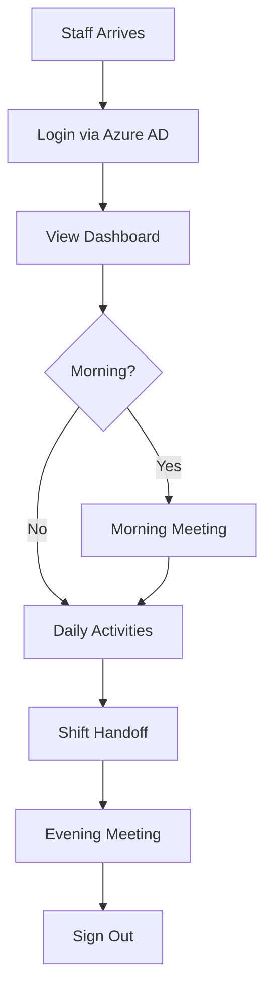

# Workflows

This document describes core user and business flows in the Audit Management System.

## User journey overview

The system supports several primary workflows organized by user role and time of day:

## Core workflows

### 1. User (Service Recipient) Management

#### 1.1 Create New User

**Actor**: Administrator, Manager  
**Frequency**: Occasional (new admissions)  
**Entry Point**: `/users` → "Create User" button

**Flow**:
1. Navigate to Users page (`/users`)
2. Click "Create User" button
3. Fill required fields:
   - UserID (unique business identifier)
   - Full Name
   - Birth Date
   - Contact Information
4. Fill optional fields:
   - Emergency Contact
   - Support Level
   - Entry Date
5. Submit form
6. System validates:
   - UserID uniqueness
   - Required fields present
   - Data format correctness
7. Record saved to SharePoint `Users_Master` list
8. Audit log entry created
9. User appears in active users list

**Success Path**: User created, visible in list, audit logged  
**Error Paths**:
- Duplicate UserID → Show error, allow correction
- SharePoint unavailable → Save draft to LocalStorage, queue for sync
- Validation failure → Highlight invalid fields

**Permissions**: Requires write access to `Users_Master` list

**Code References**:
- Form: `src/features/users/UserForm.tsx`
- API: `src/features/users/api.ts`
- Hook: `src/features/users/useUsers.ts`

---

#### 1.2 View User Details

**Actor**: All staff  
**Frequency**: Daily  
**Entry Point**: `/users` → Click user row

**Flow**:
1. Navigate to Users page
2. Click on user row in table
3. System loads user detail page (`/users/:userId`)
4. Display tabs:
   - **Profile**: Basic information, support level
   - **Records**: Recent support records
   - **Attendance**: Attendance history
   - **Schedule**: Upcoming scheduled activities
   - **Usage**: Monthly usage statistics
5. Navigate between tabs
6. Access quick actions:
   - Create record
   - View schedule
   - Edit profile (if authorized)

**Success Path**: User details displayed with all tabs accessible  
**Error Paths**:
- User not found → Show 404 message, return to list
- No permission → Show limited view (name only)

**Permissions**: Read access to `Users_Master`

**Code References**:
- Page: `src/pages/UserDetailPage.tsx`
- Sections: `src/features/users/UserDetailSections.tsx`

---

### 2. Daily Recording

#### 2.1 Step-based Support Record

**Actor**: Support Staff  
**Frequency**: Multiple times per day  
**Entry Point**: `/daily/support` or Dashboard quick action

**Flow**:
1. Navigate to Daily Support page
2. Select user from list or scan QR code
3. System displays 19-step procedure template
4. Staff records each step:
   - Mark complete/skip
   - Add time (if time-based mode)
   - Add notes (optional)
   - Flag special observations
5. Complete procedure:
   - Review summary
   - Add overall notes
   - Submit
6. System validates:
   - At least one step recorded
   - Time sequence logical
7. Record saved to SharePoint `SupportRecord_Daily`
8. Audit log entry created
9. Dashboard metrics updated

**Success Path**: Record saved, visible in user's history  
**Error Paths**:
- Network unavailable → Save to LocalStorage, show "Pending Sync" badge
- Invalid times → Highlight errors, allow correction
- User not found → Prompt to select valid user

**Permissions**: Write access to `SupportRecord_Daily`

**Code References**:
- Page: `src/pages/SupportRecordPage.tsx`
- Component: `src/features/daily/DailyRecordForm.tsx`
- Hook: `src/features/daily/hooks/useDailyRecords.ts`

---

#### 2.2 Bulk Daily Record Entry

**Actor**: Administrator, Manager  
**Frequency**: Daily (retrospective entry)  
**Entry Point**: `/daily` → "Bulk Entry" mode

**Flow**:
1. Navigate to Daily page
2. Enable "Bulk Entry" mode
3. System displays table with all users
4. For each user:
   - Select attendance status
   - Select activity type(s)
   - Add brief notes
5. Review entries in summary
6. Submit batch
7. System creates multiple records in one operation
8. Show progress indicator
9. Display success summary with created record count

**Success Path**: All records created, summary shown  
**Error Paths**:
- Partial failure → Show which records succeeded/failed
- Complete failure → All records queued for retry

**Permissions**: Write access to `SupportRecord_Daily`

**Code References**:
- Component: `src/features/daily/BulkDailyRecordForm.tsx`
- Hook: `src/features/audit/useAuditSyncBatch.ts`

---

### 3. Schedule Management

#### 3.1 Create Schedule

**Actor**: Manager, Scheduler  
**Frequency**: Daily/Weekly  
**Entry Point**: `/schedule` → "Create Schedule" or drag-on-calendar

**Flow**:
1. Navigate to Schedule page (Week/Month view)
2. Initiate creation:
   - Click "Create Schedule" button, OR
   - Drag on calendar to create time block
3. Fill schedule dialog:
   - Title
   - Start time / End time (or All Day)
   - User (optional)
   - Staff assignment(s)
   - Room allocation
   - Vehicle (if transportation)
   - Service type
4. System checks conflicts:
   - Room double-booking
   - Staff overlap
   - Vehicle availability
5. Show warnings if soft conflicts detected
6. Block submission if hard conflicts
7. Submit schedule
8. Record saved to SharePoint `Schedules` list
9. Calendar refreshes, new schedule visible

**Success Path**: Schedule created without conflicts  
**Alternate Paths**:
- **Soft conflict** → Show warning, allow override with reason
- **Hard conflict** → Block creation, suggest alternatives
- **Auto-suggest** → System proposes alternate staff/room

**Error Paths**:
- Validation failure → Highlight invalid fields
- Network unavailable → Save as draft to LocalStorage

**Permissions**: Write access to `Schedules` list

**Code References**:
- Page: `src/features/schedule/pages/WeekPage.tsx`
- Dialog: `src/features/schedule/ScheduleDialog.tsx`
- Conflict Detection: `src/features/schedule/conflictChecker.ts`
- Alternative Engine: `src/features/schedule/roomAlternativeEngine.ts`

---

#### 3.2 Modify Existing Schedule

**Actor**: Manager, Scheduler  
**Frequency**: Frequent (adjustments)  
**Entry Point**: Drag/drop on calendar or click to edit

**Flow**:
1. Locate schedule on calendar
2. Check if editable:
   - **No actual record** → Editable
   - **Actual record exists** → Read-only
3. If editable:
   - Drag to new time slot, OR
   - Click and edit in dialog
4. System validates changes:
   - No new conflicts introduced
   - Time still logical
5. If valid, update applied
6. System logs change to audit trail
7. Calendar reflects update

**Success Path**: Schedule updated, conflicts resolved  
**Blocked Path**: Schedule has actual record → Show message "Cannot edit: activity completed"

**Permissions**: Write access to `Schedules` list

**Code References**:
- Validation: `src/features/schedule/validation.ts`
- Move logic: `src/features/schedule/move.ts`
- Event allow: `src/features/resources/utils/eventValidation.ts`

---

### 4. Attendance Tracking

#### 4.1 Record Check-in

**Actor**: Reception Staff, Support Staff  
**Frequency**: Daily (per user arrival)  
**Entry Point**: `/daily/attendance` or Dashboard attendance widget

**Flow**:
1. Navigate to Attendance page
2. Select user from list
3. Click "Check In" button
4. System records:
   - Check-in time (current timestamp)
   - Attendance date
   - User ID
5. Compare to scheduled time:
   - **On time** → Green indicator
   - **Late (>15 min)** → Yellow indicator, prompt for reason
   - **No schedule** → Neutral indicator
6. Save to SharePoint `Attendance` list
7. Update dashboard attendance metrics

**Success Path**: Check-in recorded, status reflected  
**Error Paths**:
- Already checked in → Show warning, allow override
- Network issue → Queue in LocalStorage

**Permissions**: Write access to `Attendance` list

**Code References**:
- Page: `src/pages/AttendanceRecordPage.tsx`
- Logic: `src/features/attendance/attendance.logic.ts`

---

#### 4.2 Record Check-out

**Flow**: Similar to check-in, but:
- Button labeled "Check Out"
- Compares check-out time to planned end time
- Flags early departure if >15 min before planned end
- Calculates total duration (check-out - check-in)

---

### 5. Meeting & Handoff

#### 5.1 Conduct Morning Meeting

**Actor**: Meeting Facilitator (Manager/Lead Staff)  
**Frequency**: Daily (morning)  
**Entry Point**: `/meeting-guide` or Dashboard "Meeting" button

**Flow**:
1. Open Meeting Guide
2. System loads meeting template:
   - Attendance check
   - Previous day summary
   - Priority follow-up users
   - Today's schedule overview
   - Handoff notes from evening shift
   - Action items
3. Facilitator walks through checklist:
   - Check off each step as completed
   - Add notes inline
   - Flag issues for follow-up
4. Review priority users:
   - System highlights users needing attention
   - Based on: recent incidents, health flags, schedule gaps
5. Complete meeting:
   - Save meeting notes
   - Create follow-up tasks
   - Generate handoff summary for evening
6. System saves to SharePoint `MeetingSessions` list

**Success Path**: Meeting completed, notes saved, follow-ups created  
**Error Paths**:
- Network issue → Save draft, sync later
- Missing data → Show warnings, allow proceed

**Permissions**: Write access to `MeetingSessions` list

**Code References**:
- Page: `src/pages/MeetingGuidePage.tsx`
- Drawer: `src/features/meeting/MeetingGuideDrawer.tsx`
- Checklist: `src/features/meeting/MeetingStepsChecklist.tsx`
- Hook: `src/features/meeting/usePriorityFollowUsers.ts`

---

#### 5.2 Shift Handoff

**Actor**: Outgoing and Incoming Shift Staff  
**Frequency**: Multiple times per day (shift changes)  
**Entry Point**: `/handoff-timeline` or Dashboard handoff widget

**Flow**:
1. **Outgoing staff** creates handoff notes:
   - Navigate to Handoff Timeline
   - Click "Create Note"
   - Fill details:
     - Category (medical, behavioral, routine, urgent)
     - User concerned (if applicable)
     - Message content
     - Priority level
   - Submit note
2. **System** organizes notes:
   - By time band (morning, afternoon, evening, night)
   - By category
   - By priority
3. **Incoming staff** reviews notes:
   - Open Handoff Timeline
   - Filter by current shift
   - Review high-priority notes first
   - Acknowledge critical notes
4. **During shift**:
   - Notes displayed in meeting guide
   - Dashboard shows unacknowledged count
5. **End of shift**:
   - Status updated to "Completed"
   - Next shift receives updated timeline

**Success Path**: Notes created, reviewed, acknowledged  
**Error Paths**:
- Urgent note not acknowledged → Alert shown
- Network issue → LocalStorage queue

**Permissions**: Write access to `HandoffNotes` list

**Code References**:
- Page: `src/pages/HandoffTimelinePage.tsx`
- Timeline: `src/features/handoff/TodayHandoffTimelineList.tsx`
- Hook: `src/features/handoff/useHandoffTimeline.ts`
- Summary: `src/features/handoff/HandoffSummaryForMeeting.tsx`

---

### 6. Dashboard & Monitoring

#### 6.1 View Role-based Dashboard

**Actor**: All users (content varies by role)  
**Frequency**: Continuously (primary landing page)  
**Entry Point**: `/dashboard` (post-login redirect)

**Flow**:
1. User signs in via Azure AD
2. System redirects to Dashboard
3. Dashboard detects user role:
   - **Staff**: Today's schedule, assigned users, quick actions
   - **Manager**: Team overview, attendance summary, alerts, compliance
   - **Admin**: System metrics, audit log summary, configuration access
   - **Nurse**: Medication due list, health observations, alerts
4. Display role-appropriate widgets:
   - Activity summary cards
   - Recent records list
   - Alerts and warnings
   - Quick action FABs
   - Calendar preview
5. User interacts:
   - Click card → Navigate to detail
   - Click FAB → Quick create form
   - Refresh → Reload data

**Success Path**: Dashboard loads with role-appropriate content  
**Error Paths**:
- Role not detected → Show default (staff) view
- SharePoint unavailable → Show cached data with staleness indicator

**Permissions**: Read access to relevant lists based on role

**Code References**:
- Page: `src/pages/DashboardPage.tsx`
- Role hook: `src/features/dashboard/useDashboardRole.ts`
- Summary cards: `src/features/dashboard/ModuleSummaryCard.tsx`
- Config: `src/features/dashboard/dashboardRoleConfig.ts`

---

#### 6.2 Export Audit Log

**Actor**: Administrator, Auditor  
**Frequency**: Weekly/Monthly (compliance)  
**Entry Point**: `/audit` → "Export CSV" button

**Flow**:
1. Navigate to Audit page
2. Set filters (optional):
   - Date range
   - Action type
   - User/Staff
3. Click "Export CSV"
4. System retrieves logs:
   - From LocalStorage (recent)
   - From SharePoint (historical)
5. Generate CSV file:
   - Columns: Timestamp, User, Action, Entity, Details
   - Format: RFC 4180 compliant
6. Download initiated
7. System logs export action to audit trail (meta-audit)

**Success Path**: CSV downloaded with filtered data  
**Error Paths**:
- Too many records → Paginate or warn
- SharePoint timeout → Export partial, show warning

**Permissions**: Read access to audit logs

**Code References**:
- Page: `src/features/audit/AuditPanel.tsx`
- Export: `src/features/audit/exportCsv.ts`
- Sync: `src/features/audit/useAuditSync.ts`

---

## Alternate paths and failures

### Network unavailable
- All write operations queue to LocalStorage
- UI shows "Offline" indicator
- Badge on navigation shows pending sync count
- Automatic retry when connection restored
- Manual sync button available

### Authentication failure
- MSAL token expired → Silent refresh attempted
- Refresh failed → Redirect to login
- Login failed → Show error, contact admin message
- No permissions → Show access denied, limited read-only view

### Validation errors
- Inline field errors shown immediately
- Form submit blocked until corrected
- Help text displayed for complex fields
- Suggestion provided where possible (e.g., format examples)

### Concurrent modifications
- Optimistic UI updates applied immediately
- Server conflict detected on save
- Show conflict dialog:
  - "Your version" vs "Server version"
  - Allow: Take yours / Take server / Merge manually
- Audit log records conflict resolution

### Resource conflicts (Schedules)
- **Hard conflict** (same resource, overlap): Block creation, suggest alternatives
- **Soft conflict** (tight timing): Warn, allow override with reason
- **Alternative suggestions**: System proposes available staff/room/vehicle
- **Manual resolution**: Override with explicit reason (statusReason)

## Permissions/authorization requirements

### Role-based access
- **Staff**: Read users, create/edit own records, read schedules
- **Manager**: All staff permissions + create schedules, edit all records, view reports
- **Admin**: All manager permissions + user management, system configuration
- **Nurse**: Staff permissions + medication management, health observations

### Data-level security
- Enforced by SharePoint list permissions
- No application-level RBAC beyond role detection
- Sensitive fields (e.g., medical notes) restricted to nurse role

### Audit requirements
- All create/update/delete operations logged
- Logs immutable (append-only)
- 7-year retention for compliance
- Export capability for external auditing

## Performance considerations

### Typical operation times
- Page load: <2 seconds (first load), <500ms (navigations)
- Form submission: <1 second (optimistic), 1-3 seconds (confirmed)
- Dashboard refresh: <1 second
- Audit log export: <5 seconds for 1000 records
- Bulk record creation: <10 seconds for 50 users

### Optimization strategies
- **Lazy loading**: Route-based code splitting
- **Caching**: TanStack Query with stale-while-revalidate
- **Pagination**: Large lists (>100 items)
- **Debouncing**: Search inputs (300ms)
- **Optimistic updates**: Immediate UI feedback
- **Background sync**: Audit log batch upload

## Related documentation

- [System Overview](01_overview.md) — High-level system description
- [Architecture](02_architecture.md) — Component structure
- [Domain Model](03_domain.md) — Entity definitions and rules
- [Operations Guide](05_operations.md) — Deployment and maintenance
- [Security Model](06_security.md) — Authentication and authorization details
