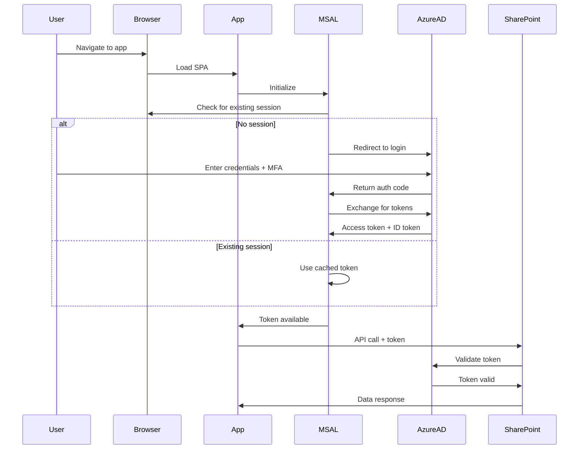

# Security Model

This document describes the authentication, authorization, data protection, and threat model for the Audit Management System.

## Security principles

### Defense in depth
Multiple layers of security controls protect the system:
1. **Network**: HTTPS/TLS encryption
2. **Authentication**: Azure AD (Entra ID) with MFA
3. **Authorization**: SharePoint permissions model
4. **Application**: Input validation, output encoding
5. **Data**: Encryption at rest (SharePoint), in transit (HTTPS)
6. **Audit**: Comprehensive logging of all actions

### Least privilege
- Users granted minimum permissions necessary for their role
- Application uses service principal with scoped permissions
- SharePoint groups define access boundaries
- No direct database access (all via SharePoint API)

### Security by default
- HTTPS required (no HTTP fallback)
- Authentication required (no anonymous access)
- Input validation on all user input
- Output encoding prevents XSS
- CSRF protection via SameSite cookies (MSAL tokens)

## Authentication (AuthN)

### Azure AD (Entra ID) integration

The application uses **Azure AD** (now Entra ID) as the sole identity provider via **MSAL (Microsoft Authentication Library)**.



### MSAL configuration

**File**: `src/auth/authConfig.ts`

**Key settings**:
- `clientId`: Azure AD app registration client ID
- `authority`: `https://login.microsoftonline.com/{tenantId}`
- `redirectUri`: Application URL (e.g., `https://domain.com`)
- `scopes`: SharePoint API scopes (e.g., `https://tenant.sharepoint.com/AllSites.Read`)

**Token types**:
- **ID Token**: Contains user identity claims (name, email, roles)
- **Access Token**: Used for SharePoint API calls, short-lived (~1 hour)
- **Refresh Token**: Used to obtain new access tokens, longer-lived

**Token lifecycle**:
1. Initial login: User redirected to Azure AD, returns tokens
2. Silent refresh: MSAL automatically refreshes tokens before expiry
3. Interactive refresh: If silent fails, user prompted to re-authenticate
4. Logout: Tokens cleared from cache, user redirected to Azure AD logout

### Multi-Factor Authentication (MFA)

**Enforcement**: Configured at Azure AD tenant level (Conditional Access policies)

**Recommended policy**:
- MFA required for all users accessing the application
- Trusted locations: On-premise network (optional exemption)
- Device compliance: Optional (require managed devices)

**User experience**:
- First login: User completes MFA setup (authenticator app, SMS, etc.)
- Subsequent logins: MFA prompt if not recently authenticated
- Remember device: Optional (reduces MFA prompts for 90 days)

### Authentication flows

#### Standard login flow
1. User navigates to application
2. MSAL detects no valid token
3. User redirected to Azure AD login page
4. User enters credentials
5. MFA challenge (if required)
6. Azure AD returns tokens
7. User redirected back to application
8. Application initializes with authenticated state

#### Silent authentication flow (cached session)
1. User navigates to application
2. MSAL finds valid cached token
3. Application loads immediately (no redirect)
4. Token silently refreshed in background if near expiry

#### Logout flow
1. User clicks "Sign Out"
2. Application calls `msalInstance.logoutRedirect()`
3. Tokens cleared from browser cache
4. User redirected to Azure AD logout endpoint
5. Azure AD clears session
6. User redirected back to application (logged out state)

### Authentication error handling

| Error | Cause | User Experience | Resolution |
|-------|-------|-----------------|------------|
| `interaction_required` | Token expired, cannot refresh silently | Redirect to login | User re-authenticates |
| `consent_required` | New permissions added | Consent screen shown | User grants consent |
| `login_required` | No session exists | Redirect to login | User logs in |
| `popup_window_error` | Popup blocked | Error message, suggest allow popups | User allows popups or use redirect flow |
| `network_error` | No internet connection | "Offline" indicator, cached data shown | User waits for connectivity |

## Authorization (AuthZ)

### Permission model

The application **does not implement custom RBAC**. Authorization is delegated to **SharePoint permissions**.

**Access levels** (SharePoint groups):
- **Read**: View data, export audit logs
- **Contribute**: Read + create/edit own records
- **Edit**: Contribute + edit all records
- **Full Control**: All permissions + manage settings

**Typical group mapping**:
- Staff → Contribute (to `SupportRecord_Daily`, `Attendance`, `HandoffNotes`)
- Managers → Edit (to all lists except configuration)
- Administrators → Full Control (all lists)
- Nurses → Contribute (to `SupportRecord_Daily`, `MedicationRecords`, `HealthObservations`)

### Role detection

The application detects user role for **UI customization only** (not security enforcement):

**Method 1: SharePoint group membership** (recommended)
```typescript
// Check if user is in "Administrators" SharePoint group
const groups = await fetch(`${siteUrl}/_api/web/currentuser/groups`);
const isAdmin = groups.value.some(g => g.Title === 'Administrators');
```

**Method 2: Azure AD app roles** (alternative)
```typescript
// Define roles in Azure AD app registration manifest
// Assign users to roles in Enterprise Applications
// Read from ID token claims
const idToken = await msalInstance.acquireTokenSilent(...);
const roles = idToken.idTokenClaims.roles || [];
const isAdmin = roles.includes('Administrator');
```

**UI customization based on role**:
- **Staff**: Dashboard shows assigned users, today's schedule
- **Manager**: Dashboard shows team overview, all schedules
- **Admin**: Dashboard shows system metrics, configuration links

**Important**: Role-based UI hiding is **not a security control**. Actual permission enforcement happens at SharePoint API level.

### Data-level security

**SharePoint enforces**:
- List-level permissions (entire list readable/writable)
- Item-level permissions (specific records readable/writable by specific users)
- Field-level security (sensitive fields hidden from certain groups)

**Example**: Medical notes field restricted to Nurses group
- Configured in SharePoint list settings
- Non-nurses attempting to read that field get `null` or `undefined`
- Application gracefully handles missing data

### API authorization

Every SharePoint API call includes:
1. **Authorization header**: `Bearer {access_token}`
2. **Token validation**: SharePoint validates with Azure AD
3. **Permission check**: SharePoint checks user's permissions for requested resource
4. **Response**: 200 (success), 403 (forbidden), or 401 (unauthorized)

**Application response to 403**:
- Show "Access Denied" message
- Suggest contacting administrator
- Log error to Sentry (not user's fault)

**Application response to 401**:
- Token likely expired
- Attempt silent token refresh
- If refresh fails, redirect to login

## Data protection

### Encryption in transit

**HTTPS required**:
- All communication over TLS 1.2+ (TLS 1.3 preferred)
- Certificate managed by hosting platform (Azure, SharePoint, etc.)
- HSTS (HTTP Strict Transport Security) recommended

**Local development exception**:
- `http://localhost:5173` allowed for dev
- Production builds fail if accessed over HTTP

### Encryption at rest

**SharePoint**:
- Data encrypted at rest by Microsoft (AES-256)
- BitLocker on physical servers
- Tenant isolation ensures data not shared across tenants

**LocalStorage (audit logs)**:
- Not encrypted by browser
- Sensitive data (passwords, tokens) never stored in LocalStorage
- Audit log content is operational metadata (action types, timestamps, user IDs)
- Device protection (lock screen, disk encryption) is end-user responsibility

### Data residency

**SharePoint Online**:
- Data stored in Microsoft datacenter (region selected at tenant creation)
- Japan tenants: Data stored in Japan datacenters
- Compliance certifications: ISO 27001, SOC 2, GDPR, etc.

**Application**:
- Static assets (JS, CSS) served from CDN or SharePoint
- No application-managed database

### Sensitive data handling

**Personally Identifiable Information (PII)**:
- User full name, birth date, contact info stored in SharePoint
- Transmitted only over HTTPS
- Access restricted by SharePoint permissions
- Exported to CSV only when authorized (admin/auditor)

**Health information**:
- Medical notes, medication records stored in SharePoint
- Field-level security applied (nurses only)
- Logged in audit trail (who accessed, when)
- HIPAA/PHI considerations: Customer responsible for SharePoint PHI compliance

**Credentials**:
- User passwords: Managed by Azure AD (never in application)
- Application secrets: Stored in Azure Key Vault or GitHub Secrets
- Client secrets: Rotated every 12 months (recommended)

### Data sanitization

**Input validation**:
- All user input validated on client (React Hook Form + Zod)
- Type checking enforced (strings, numbers, dates)
- Maximum length limits (prevent DoS)
- Special characters allowed but encoded on output

**Output encoding**:
- React automatically escapes JSX content (prevents XSS)
- `dangerouslySetInnerHTML` never used with user input
- URLs validated before rendering in links
- Markdown rendering (if any) uses safe renderer (e.g., `react-markdown` with sanitization)

**Example validation**:
```typescript
const userSchema = z.object({
  fullName: z.string().min(1).max(200),
  notes: z.string().max(4000),
  email: z.string().email().optional(),
});
```

## Threat model

### STRIDE analysis

#### Spoofing
- **Threat**: Attacker impersonates legitimate user
- **Mitigation**: Azure AD authentication + MFA
- **Residual risk**: Low (Azure AD handles identity, MFA prevents credential theft)

#### Tampering
- **Threat**: Attacker modifies data in transit or at rest
- **Mitigation**: HTTPS (TLS), SharePoint data integrity, audit logging
- **Residual risk**: Low (TLS prevents MITM, SharePoint audit trail detects tampering)

#### Repudiation
- **Threat**: User denies performing an action
- **Mitigation**: Comprehensive audit logging (all actions logged with user, timestamp, details)
- **Residual risk**: Very Low (audit logs immutable, exported to separate storage)

#### Information Disclosure
- **Threat**: Unauthorized access to sensitive data
- **Mitigation**: SharePoint permissions, field-level security, HTTPS, no logging of sensitive data
- **Residual risk**: Medium (SharePoint permissions misconfiguration risk)

#### Denial of Service
- **Threat**: Attacker makes application unavailable
- **Mitigation**: SharePoint throttling, rate limiting (Azure AD), Cloudflare/CDN (if used)
- **Residual risk**: Medium (DDoS at Azure AD or SharePoint level; application cannot fully prevent)

#### Elevation of Privilege
- **Threat**: User gains higher privileges than authorized
- **Mitigation**: Permissions enforced server-side (SharePoint), no client-side security logic
- **Residual risk**: Low (SharePoint permission model robust, regular audits recommended)

### Attack vectors and mitigations

#### 1. Cross-Site Scripting (XSS)

**Attack**: Attacker injects malicious script into user-generated content

**Example**:
```html
<!-- Attacker enters in notes field -->
<script>alert('XSS')</script>
```

**Mitigations**:
- ✅ React auto-escapes JSX content
- ✅ No use of `dangerouslySetInnerHTML` with user input
- ✅ Content Security Policy (CSP) header prevents inline scripts
- ✅ Input validation rejects suspicious patterns

**Risk**: Very Low (multiple layers of defense)

---

#### 2. Cross-Site Request Forgery (CSRF)

**Attack**: Attacker tricks user into performing unintended action

**Example**: Malicious site submits form to application while user is authenticated

**Mitigations**:
- ✅ SameSite cookies (MSAL tokens)
- ✅ MSAL tokens include nonce and PKCE (proof of possession)
- ✅ SharePoint validates origin and referrer
- ✅ SPAs less vulnerable (token not in cookie, stored in memory/local)

**Risk**: Very Low (MSAL design prevents CSRF)

---

#### 3. Session Hijacking

**Attack**: Attacker steals user's session token

**Example**: Token exposed in URL, local storage, or intercepted over HTTP

**Mitigations**:
- ✅ HTTPS only (prevents interception)
- ✅ Tokens stored in memory (not persistent cookies)
- ✅ Short token lifetime (~1 hour)
- ✅ Token refresh requires proof of possession
- ✅ Logout clears tokens from cache

**Risk**: Low (HTTPS + short-lived tokens)

---

#### 4. SQL Injection

**Attack**: Attacker injects SQL commands into input

**Mitigation**:
- ✅ No direct database access (SharePoint API only)
- ✅ SharePoint uses parameterized queries internally
- ✅ Application validates input types (strings, numbers, dates)

**Risk**: Not Applicable (no SQL exposure)

---

#### 5. Insecure Direct Object Reference (IDOR)

**Attack**: Attacker accesses resource by guessing ID

**Example**: Changing `/users/123` to `/users/124` to access another user's data

**Mitigations**:
- ✅ SharePoint enforces permissions on every API call
- ✅ Item-level permissions can restrict access
- ⚠️ Application does not add additional authorization layer

**Risk**: Low (SharePoint permissions effective if configured correctly)

---

#### 6. Broken Authentication

**Attack**: Weak password, no MFA, session doesn't expire

**Mitigations**:
- ✅ Azure AD handles authentication (enterprise-grade)
- ✅ MFA enforced via Conditional Access
- ✅ Password complexity policies enforced by Azure AD
- ✅ Account lockout after failed attempts
- ✅ Session timeout configurable in Azure AD

**Risk**: Very Low (delegated to Azure AD)

---

#### 7. Sensitive Data Exposure

**Attack**: Sensitive data leaked in logs, errors, or URLs

**Mitigations**:
- ✅ No sensitive data in console.log (dev only)
- ✅ Sentry scrubs PII before sending errors
- ✅ No tokens in URLs (always in headers)
- ✅ Audit logs do not contain passwords or tokens

**Risk**: Low (careful logging practices)

---

#### 8. Insufficient Logging & Monitoring

**Attack**: Attacker operates undetected

**Mitigations**:
- ✅ All create/update/delete actions logged
- ✅ Failed login attempts logged by Azure AD
- ✅ Sentry monitors application errors
- ✅ SharePoint audit log tracks API calls
- ✅ Weekly audit log reviews recommended

**Risk**: Low (comprehensive logging in place)

---

## Compliance considerations

### Audit trail requirements

**Regulations**: GDPR, local data protection laws, organizational policies

**Audit log must include**:
- **Who**: User ID and name
- **What**: Action performed (create, update, delete, view)
- **When**: Timestamp (UTC, converted to local for display)
- **Where**: Entity and ID (e.g., "User 123", "Schedule 456")
- **Details**: Old value → New value (for updates)

**Retention**: 7 years minimum (adjust per compliance requirements)

**Format**: CSV export, immutable, timestamped

**Access**: Administrators and auditors only (read-only)

### GDPR compliance

**Right to access**: Users can request their data via administrator
- Export user's records from SharePoint
- Provide audit log excerpt for their actions

**Right to erasure ("right to be forgotten")**:
- Soft delete: Mark user as inactive, data retained for compliance period
- Hard delete: After compliance period, manually delete from SharePoint (or automate with retention policy)

**Data minimization**: Collect only necessary fields (user full name, birth date, etc.)

**Purpose limitation**: Data used only for support service management

**Consent**: Not applicable (employment/service delivery basis, not consent)

### PHI/HIPAA (if applicable)

**Note**: SharePoint Online can be HIPAA-compliant, but requires Business Associate Agreement (BAA) with Microsoft and proper configuration.

**If handling PHI**:
- ✅ Ensure Microsoft 365 BAA in place
- ✅ Enable audit logging
- ✅ Encrypt data in transit and at rest (default in SharePoint)
- ✅ Restrict access (field-level security for medical notes)
- ✅ Log all access to PHI
- ⚠️ Regularly review access logs

**Responsibility**: Customer (organization deploying this application) is responsible for HIPAA compliance. Application provides tools (audit logs, permission enforcement), but configuration is customer's duty.

## Security best practices

### For Developers

1. **Never commit secrets**: Use environment variables, not hardcoded keys
2. **Validate all input**: Even if UI restricts, backend/API must validate
3. **Escape all output**: Trust React's auto-escaping, avoid `dangerouslySetInnerHTML`
4. **Use HTTPS**: Never allow HTTP in production
5. **Keep dependencies updated**: `npm audit` regularly, update vulnerable packages
6. **Code review**: All PRs reviewed for security issues
7. **Use TypeScript strict mode**: Catch type errors early

### For Administrators

1. **Enable MFA**: Enforce for all users via Conditional Access
2. **Principle of least privilege**: Grant minimum necessary permissions
3. **Regular audits**: Review SharePoint permissions quarterly
4. **Monitor audit logs**: Weekly spot-checks, automated alerts for anomalies
5. **Rotate secrets**: Client secrets rotated annually
6. **Backup regularly**: Daily SharePoint exports, test restores
7. **Update users**: Offboard users immediately upon termination

### For End Users

1. **Use strong passwords**: Azure AD enforces complexity
2. **Enable MFA**: Follow organization policy
3. **Lock devices**: Protect tablets/PCs with lock screen
4. **Report suspicious activity**: Contact IT immediately
5. **No shared accounts**: Each user has unique login
6. **Secure local data**: Audit logs in LocalStorage cleared on logout (optional)

## Incident response plan

### Suspected account compromise

1. **Immediate**: Disable user account in Azure AD
2. **Investigate**: Review Azure AD sign-in logs for suspicious activity
3. **Audit**: Check audit logs for actions performed by compromised account
4. **Remediate**: Reset password, re-enable MFA, re-enable account
5. **Communicate**: Inform user and stakeholders
6. **Learn**: Update security training based on root cause

### Data breach (unauthorized access)

1. **Immediate**: Identify scope (what data, which users)
2. **Contain**: Revoke access, disable accounts if needed
3. **Audit**: Review access logs, determine how breach occurred
4. **Notify**: Legal/compliance team, affected users (GDPR requirement)
5. **Remediate**: Fix vulnerability, update permissions
6. **Document**: Incident report for compliance

### Application vulnerability discovered

1. **Assess**: Severity (CVSS score), exploitability, impact
2. **Immediate fix**: If critical, deploy hotfix within 24 hours
3. **Communicate**: Notify users if action required (e.g., re-login)
4. **Test**: Verify fix doesn't break functionality
5. **Deploy**: Standard CI/CD or expedited if critical
6. **Post-mortem**: Document root cause, prevent recurrence

## Security testing

### Pre-deployment

- ✅ Static analysis: ESLint with security rules
- ✅ Dependency scanning: `npm audit` in CI/CD
- ✅ Type checking: TypeScript strict mode
- ✅ Code review: All PRs reviewed for security issues

### Post-deployment

- ✅ Penetration testing: Annually or after major changes (recommended)
- ✅ Vulnerability scanning: Sentry monitors for known CVEs
- ✅ Access control audit: Quarterly review of SharePoint permissions
- ✅ Audit log review: Weekly spot-checks by administrator

## Related documentation

- [System Overview](01_overview.md) — High-level description
- [Architecture](02_architecture.md) — Component structure, integrations
- [Operations Guide](05_operations.md) — Deployment, monitoring, runbooks
- [Azure AD App Registration Setup](../deployment/aad-setup.md) — (if exists)
- [SharePoint Permissions Guide](../deployment/sharepoint-permissions.md) — (if exists)
